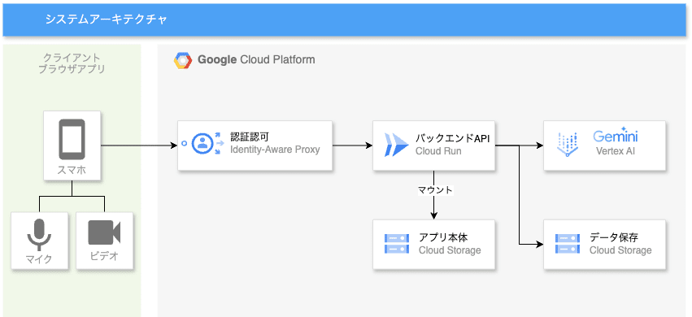
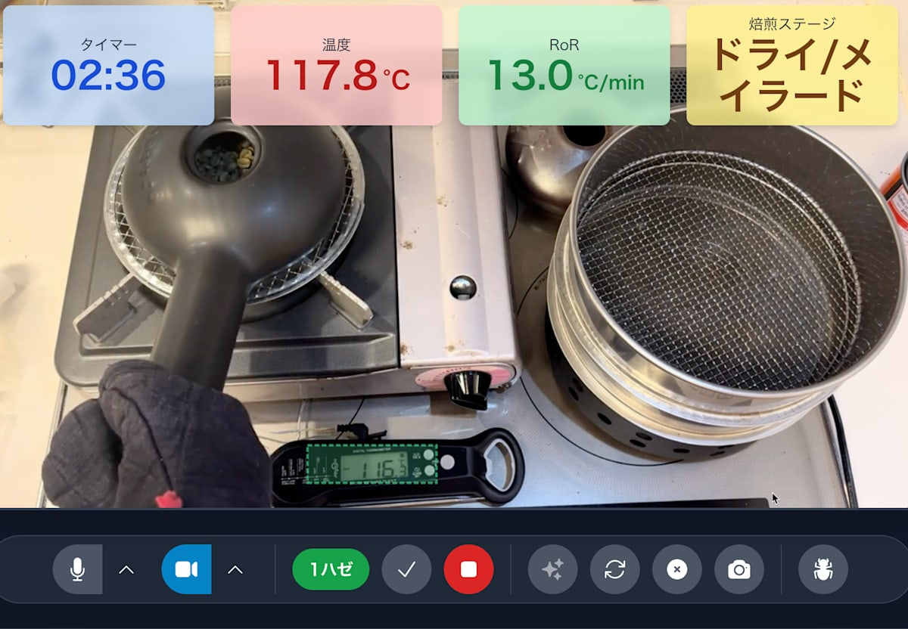
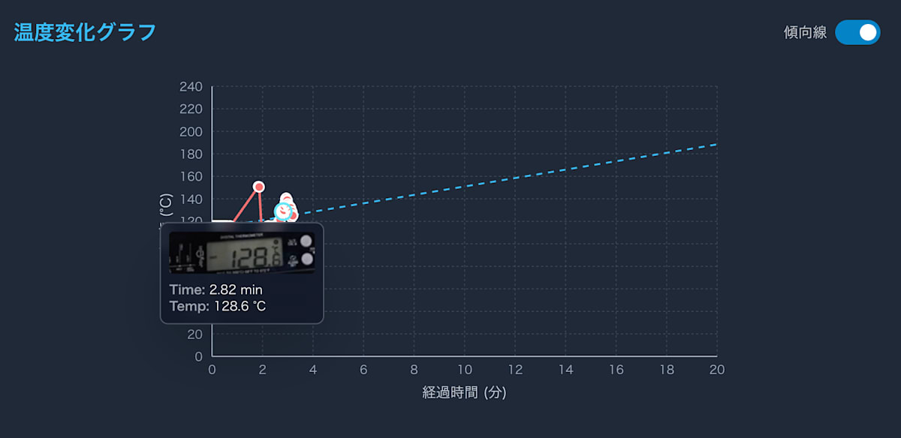
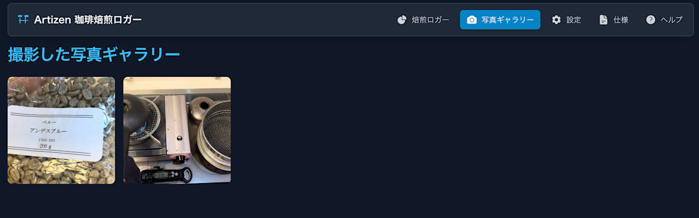
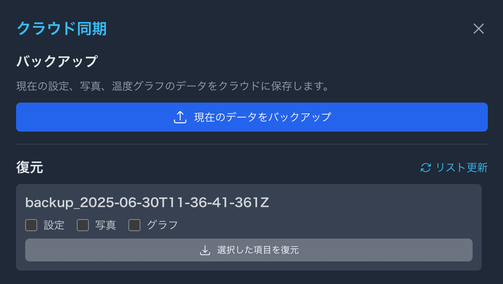

本記事はZennが主催する[第2回 AI Agent Hackathon with Google Cloud](https://zenn.dev/hackathons/google-cloud-japan-ai-hackathon-vol2)にエントリーするプロダクトについての紹介記事です。

#  珈琲焙煎ロガー「Artizen」：自宅での珈琲焙煎をリアルタイムにモニタリング

##  はじめに

近年、自宅で珈琲焙煎を楽しむ方が増えています。手軽に本格的なコーヒー焙煎ができるホームロースターも登場していますが、手動の珈琲焙煎器具でじっくりと珈琲豆と向き合いながら焙煎するのも、機械にはない面白さがあります。

しかし、手動焙煎には「焙煎時の重要な温度管理」や「焙煎履歴を残す手間」といった課題がつきまといます。これらの課題が、時に理想の味わいへの探求を妨げることがあります。

「珈琲焙煎ロガー：Artizen」は、焙煎時の温度推移をリアルタイムにグラフ表示することで、焙煎コントロールを容易にし、再現性のある珈琲焙煎をサポートします。

##  対象ユーザーと解決したい課題

###  対象ユーザー

「珈琲焙煎ロガー：Artizen」は、以下のような方をターゲットとしています。

  * 珈琲の手動焙煎をする方
  * 汎用的な温度計で焙煎プロファイルを簡単に管理したい方
  * 焙煎時の写真データを管理したい方

###  課題

手動での珈琲焙煎における主な課題は以下の通りです。

  * **温度管理の難しさ**  
焙煎中の豆の温度は、火力調整や投入量、環境によって刻々と変化します。これをリアルタイムかつ正確に把握し、適切な温度推移を維持することは、熟練を要する作業です。汎用の温度計では、記録やグラフ化が手軽にできないため、過去の焙煎との比較が困難です。

  * **豆の状態把握の属人化**  
焙煎の進行度合いを示す「1ハゼ」「2ハゼ」といった音や、豆の色、テイスティングしたときの香りや味わいの情報を記録するのが面倒です。

  * **再現性の低さ**  
上記の課題により、同じ豆を使っても、焙煎ごとに仕上がりの味や香りにばらつきが生じやすくなります。成功した焙煎の条件を詳細に記録し、再現するためのツールは、業務用焙煎機や専用のホームロースターなど、一般的に高価であり気軽に始められません。

  * **写真データ管理**  
焙煎前、焙煎中、焙煎後に写真を撮り、焙煎記録を残して重さの変化や色合い、欠点豆の量を振り返りますが、焙煎回数が多くなってくると写真の整理が面倒になってきます。

###  課題へのソリューションと特徴

「珈琲焙煎ロガー：Artizen」は、これらの課題に対し、以下のソリューションと特徴を提供します。

  * **リアルタイム温度モニタリングと記録**

    * **温度計OCR読み取り機能** : 汎用的なデジタル温度計をGeminiで読み取り、温度の計測ログを取得します。
    * **自動データロギング** : 温度データを時間軸に沿って自動で記録し、焙煎プロファイルを生成します。これにより、手動での記録の手間を省き、正確なデータ収集を可能にします。
  * **焙煎イベントの記録と可視化**

    * **イベントマーカー機能** : ユーザーが「焙煎開始」「1ハゼ」「2ハゼ」「焙煎終了」といった重要な焙煎イベントを、ボタン一つでタイムスタンプと共に記録できます。
    * **グラフ表示** : 記録された温度データとイベントマーカーは、直感的なグラフとして表示されます。これにより、焙煎の進行状況と温度推移の関係性を一目で把握できます。
  * **焙煎プロファイルの保存と分析**

    * **プロファイル保存** : 完了した焙煎のプロファイル（温度曲線、イベント、時間、メモなど）はアプリ内に保存され、クラウド上にバックアップ、保存、復元ができます。

##  システムアーキテクチャ

UIのフロントエンドとバックエンド連携部分はGoogle AI Studio Buildを使い、自然言語によるバイブコーディングで開発しました。  
オフラインでも基本機能は操作可能なように、データ管理はWebブラウザ標準のIndexedDBを使いローカル上に保管・管理し、クラウド上にデータを保管する場合はGCSと連携したバックエンドAPI経由でデータ管理を行います。  
また、焙煎中にスマホ操作が難しい場合を想定し、簡易的な音声コマンドを実装しています。音声認識はブラウザの機能であるWeb Speech APIを使用しました。

Google AI Studio BuildでそのままデプロイしたCloud Runアプリケーションは誰でもアクセスが可能になってしまうため、アクセス制御としてIAPで認証・認可処理を行うことが望ましいですが、開発時にはIAPなしでもアクセス可能なように独自のAPIキー管理でアクセス可能にしています。

###  主要コンポーネント

####  フロントエンド

フロントエンドは、バックエンドAPI連携を含め、すべてGoogle AI Studio Buildによるバイブコーディングで開発しました。あらかじめ画面イメージのHTMLモックをGeminiのCanvas機能を使って生成し、その画像を読み込ませることで、再現度高く自然言語の指示のみで実現できました。

また、フロントエンド画面の実装において、Reactでの画面の状態管理、グラフ機能、音声コマンド、ビデオ機能、ビデオ画面上の範囲指定UI、IndexedDBを使ったデータ管理なども、すべてGoogle AI Studio Buildのバイブコーディングにより実装できました。試行錯誤はありましたが、これだけの機能をゼロから実装するのは非常に大変です。Google AI Studio Buildのおかげで、迅速にUIの動作イメージを実装することができました。

指示通りにいかない場合もありましたが、GeminiのCanvas機能で画面イメージをHTMLで作成し、それを画像やHTMLとしてそのまま与えることで、イメージに近い仕上がりを実現しました。  
また、技術設計も指示のみでソースコードから自動生成し、実装内容を後から確認できるようにしています。画面のヘルプ機能もソースコードから自動生成し、アプリに組み込みました。

  * **技術スタック** : React.js, Tailwind CSS, Web Speech API, IndexedDB
  * **デプロイ** : 
    * Google AI Studio Buildにより、指定したGoogle Cloudプロジェクトへワンタッチでデプロイします。
    * 現段階のGoogle AI Studio Buildでの実装としては、Node.js前提のアプリケーションのデプロイとなります。Node.jsのJavaScriptは自動的にコンパイルされ、GCSバケットにバージョンごとにディレクトリ分けされた領域に配置されます。
    * デプロイされたCloud Runは、Googleから提供されているGoogle AI Studio専用のコンテナイメージ上にGCSバケットをマウントする形で、コンパイルされ集約されたHTMLファイルとして配信されます。GCSマウントオプションでGCSバケットのバージョンディレクトリを指定することで、バージョン切り替えを実現しています。
    * アプリケーション部分をCloud Runにデプロイするイメージに含めないようにすることで、アプリケーションデプロイの高速化を実現しており、開発体験は非常に良好でした。

####  バックエンド（API）

  * **技術スタック** : Cloud Run, Node.js
  * **役割** : 
    * 汎用的なGCSサービスへのプロキシ
    * 保存、ダウンロード、ファイル一覧の操作API
    * IAP認証やAPIキー認証によるアクセス制御と保存データ分離

####  ストレージ

コストや運用管理を考慮し、**Google Cloud Storage (GCS)** のみで実装しました。  
異なるユーザーでのアクセス制御は、GCS上にユーザーID単位のフォルダで管理し、バックアップ管理を行います。

####  認証・認可

**Identity-Aware Proxy (IAP)** を使って、Cloud Runにデプロイされたエンドポイントへのアクセスを適切なアクセス権限で管理します。これにより、指定されたGoogleアカウントを持つユーザーのみがアクセス可能です。  
デバッグ用として、IAPを経由せず独自のAPIキーでアクセスを許可する仕組みも、バックエンドAPIのクラウドバックアップ機能で実装しています。

####  運用容易性

技術要素は最小限にし、マネージドサービスを多用することで、インフラの管理・運用にかかる手間を最小限に抑えています。

##  画面イメージ

###  メイン画面

ビデオをONにすると、画像内の温度計をGeminiへのリクエストで位置を特定し、温度モニタリング対象を特定します。位置認識した温度計の範囲がずれる場合もあるため手動でも変更できるようにし、また焙煎中に温度計の位置がずれた場合でも再読み込みさせることで位置を補正する機能を実装しています。

焙煎を開始するとタイマーが開始し、一定の間隔で温度計の温度をGeminiにより識別させて温度推移をモニタリングします。パフォーマンスの観点から、Geminiへ送信する画像データは範囲指定した領域のみを送ることで、データ量を少なくしコストと速度を考慮した実装としています。

また、焙煎時には1分間あたりの温度上昇速度（RoR）が重要で、この値も画面上に表示するようにしています。ただし、手動での温度計のブレ幅や誤認識もあるため、範囲の手動変更もビデオ画面上で行えるように工夫しています。

###  焙煎温度推移グラフ画面

モニタリングした温度を経過時間でグラフにプロットしています。温度を認識したときの温度計画像も、カーソルをあてることで確認できるようにしています。また、温度上昇速度を表す傾きも表示し、焙煎時の火力コントロールをしやすくしています。

###  写真アルバム機能

焙煎前、焙煎中、焙煎後など任意のタイミングで写真を撮ることができ、ギャラリーで画像を確認できます。  
生豆のラベル情報をもとに産地や銘柄、重さなどの情報を識別し、データ管理できるようにしています。

###  クラウドバックアップ機能

焙煎時の設定や写真、グラフはクラウドへバックアップし、以前の焙煎データを復元することが可能です。

##  デモ動画

<https://youtu.be/aRgnrd8U0qc>

##  今後の展望

「珈琲焙煎ロガー：Artizen」は、自宅焙煎の体験をより豊かにするための第一歩です。今後は、以下のような機能拡張を検討しています。

  * **AIによる焙煎アドバイス機能** : 過去の成功プロファイルや、ユーザーの目標とする味わい（例：フルーティ、ビターなど）に基づき、リアルタイムで火力調整や排豆タイミングのアドバイスを行う機能。
  * **コミュニティ機能** : ユーザー間で焙煎プロファイルを共有し、意見交換ができるプラットフォームの提供。
  * **カッピングノートの充実化** : 焙煎後のカッピング結果を詳細に記録し、プロファイルと紐付けて分析できる機能。

Artizenは、すべての珈琲焙煎愛好家が、自分だけの「究極の一杯」を追求できる世界を目指します。
