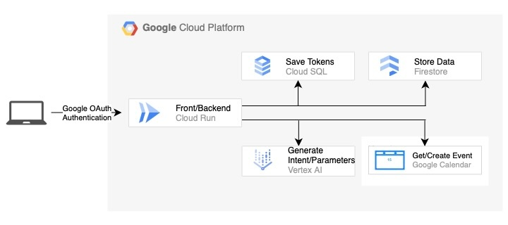

本記事は [第2回 AI Agent Hackathon with Google Cloud](https://zenn.dev/hackathons/google-cloud-japan-ai-hackathon-vol2) に向けて開発したAIエージェントアプリ`Zenith`の紹介です。

#  予定検索・登録AIエージェント「Zenith」

Zenithは、Googleカレンダーと連携し、自然言語チャットで空き時間検索・予定登録を行うWebアプリケーションです。会議調整の煩雑な作業を、AIとAPI連携でスムーズに解決します。

###  ターゲットユーザー

  * 社内で頻繁に会議を設定するリーダーやマネージャー
  * スケジュール調整に時間を割かれたくないビジネスパーソン
  * Googleカレンダーを業務で日常的に利用しているチーム

###  解決する課題

  * 会議出席者の空き時間を逐一チェックするのが面倒
  * 予定登録時に日付、時間、メールアドレスを複数回入力するのが手間
  * カレンダー操作に不慣れなメンバーが予定調整で困る

###  ソリューション：AIエージェントによる自然なスケジューリング体験

Zenithは、次のような特徴を持つシステムでこれらの課題を解決します。

  * チャット形式で自然言語による指示が可能：「◯◯さんと明日の14時から19時で会議できる時間ある？」と入力するだけ
  * Geimini in Vertex AIと連携：意図と必要情報を抽出し、予定の空き確認・登録への自動ルーティング
  * Firestoreでユーザー・メタ情報管理、Cloud SQLでユーザーのトークン情報を管理
  * GCP Cloud Runでフロント・バックエンドをサーバーレスデプロイし、スケーラビリティ確保

#  機能紹介

<https://youtu.be/nehUodz-iEs>

###  主要機能

主要機能の概要は以下の通りです。

機能 | 概要  
---|---  
Googleログイン | OAuth連携によりユーザー認証  
チャットによる予定検索 | GoogleカレンダーAPIで予定を取得してから空き時間を抽出  
チャットによる予定登録 | GoogleカレンダーAPIで作成した予定にそって登録  
Firestore連携でユーザー情報記憶 | 登録済み参加者を@メンション可能(#所属メンションも可能)  
Geimini in Vertex AI | ユーザーの入力から自然言語処理で必要な情報を抽出しjson形式で返却  
  
  * チャット欄に予定の空き時間や登録をお願いする旨のことを入力して送信します。基本的にはこの流れですが、実際Zenithの挙動は以下の３つに分けられます。 
    * 空き時間の検索：知りたい人のメールアドレスと日時を指定することで空き時間を出力します。この時、「@ニックネーム」でアドレスが候補で表示され、また、アドレスの代わりに「#部署」とメンションすればその部署全員の共通の空き時間を検索できます。登録も同様に一括でできます。
    * 登録：参加者のメールアドレスまたは部署をメンションして日時を指定し「登録しておいて」と入力すると登録してくれます。
    * 予定の詳細を設定：登録をする際に「詳細は設定したい」と、入力に含めると入力情報が自動的に左の詳細設定画面に補完され、手動で予定の詳細を設定できます。リストで表示されているメールアドレスをタップすることで参加者に加わります。スクロールして探すの面倒な場合は上部の入力欄から検索できます。
  * チャット欄の左側の本のアイコンではアドレスとそれを呼び出すためのニックネーム、また部署を登録することができます。これはFirestoreを利用して、リアルタイムで情報が反映されるようにしています。

###  アーキテクチャ

全体のフロー

  1. Googleログイン+トークン保存

  * ユーザーがGoogleログインすると、OAuth 2.0のフローによりアクセストークン・リフレッシュトークンが発行
  * これらのトークンは、メールアドレスと紐付けてCloud SQL (PostgreSQL)に保存され、後のカレンダーAPI連携に使用される

  2. 自然言語入力の処理

  * チャット欄に自然文を入力すると、その文が Gemini API in Vertex AI へのプロンプトに含めれる
  * プロンプトにはJSON形式の出力フォーマットを指定し、意図(`intent`)や対処日時(`date`, `start_time`...), メールアドレス(`emails`)などが構造化データとして抽出

  3. 条件分岐による処理実行

  * `intent`の内容によって処理を切り替えます 
    * 空き時間検索(`free_slot_request`) 
      * 指定された複数ユーザーのアクセストークンをDBから取得
      * 各ユーザーのGoogleカレンダーから予定情報を取得し、共通の空き時間を計算
      * 結果をフロントに返却し、チャット欄に表示
    * 予定登録(`schedule_register`/`schedule_register_direct`) 
      * 同様にDBからアクセストークンを取得し、GoogleカレンダーAPIを通じて予定を登録
      * `schedule_register`はユーザー確認後、`schedule_register_direct`は即登録
    * トークンの更新 
      * アクセストークンが期限切れの場合は、リフレッシュトークンを用いて新しいトークンを再取得し、DBを更新

###  採用技術

領域 | 技術  
---|---  
AIエンジン | Gemini API in Vertex AI  
インフラ | Cloud Run, Cloud Build, IAM  
フロントエンド | React + Typescript  
バックエンド | Go + Gin  
認証 | Google OAuth  
DB | Firestore、Cloud SQL (PostgreSQL)  
Nginx + Docker | バックエンドとフロントエンドを一つのコンテナ内に同梱し、Nginxによってルーティングと静的ファイル提供を両立  
  
#  苦労した点・工夫した点

  1. 自然言語処理×スキーマ駆動の構造化出力

  * 自然言語処理で正確にどのエンドポイントの処理を行うかAIでルーティングしたかったため、GeminiへのプロンプトにはJSON形式を明示し、意図(intent)や日付、時間、参加者などを決まった構造で出力できるように工夫しています。
  * 「来週の午後」などの曖昧な表現にも対応するため、プロンプト内に現在の日時を動的に埋め込むようにしました。

  2. Nginxによる単一コンテナホスティング

  * ReactフロントエンドとGoバックエンドを１つのDockerコンテナに同梱しました。
  * Nginxをリバースプロキシ兼静的ファイルサーバーとして活用し、`/api`リクエストはGoに、その他はReactの`index.html`に転送するよう設定しています。
  * フロントとAPIを分けたデプロイよりもCloud Run向けに簡潔かつデプロイが容易な構成にしております。

  3. アクセストークン管理をCookieからCloud SQLへ移行

  * 当初は、Googleログイン後に取得したアクセストークンをユーザーのCookieに保存し、それをリクエストごとに利用する方式を採用していました。しかしこの方法では以下のような課題が生じました。 
    * トークンの有効期限切れ時に、リフレッシュ処理が煩雑
    * フロントエンドでトークンを扱うためのセキュリティ面で注意が必要
    * セッションの識別・管理が煩雑
  * そこで、アクセストークンとリフレッシュトークンをユーザーのメールアドレスに紐づけてCloud SQL (PostgreSQL)で一元管理する方式へ変更しました。
  * バックエンドでは常に正しいトークン状態を把握、管理できるようになり、リフレッシュ処理も完全にサーバー側で完結できる構成にしています。

#  現時点での課題と今後の展望

  * 全ユーザーが同一DBスキーマで共有されるという構造的な問題 
    * 現在のアーキテクチャでは、Googleログインしたユーザーのアクセストークンやリフレッシュトークンはメールアドレスを主キーとして一つのusersテーブルに保存されます。そのため、このアプリにアクセスした全ユーザーの情報が全く同じDB空間に格納されてしまい、グループ単位の分離がまったくできていないという構造上の大きな制限があります。
    * 実際に運用するには「会社ごと」「プロジェクトごと」「ワークスペースごと」といったスコープの分離が必要であり、認可（authorization）やアクセス制御のレイヤーも必須です。
  * 今後の改善方針 
    * DBをユーザーの所属情報を明示的に登録・管理できる構造に変更
    * ログインとサインアップを設けて、ログイン時には、ユーザーの所属に応じたデータだけを取得・表示
    * 「誰が誰に予定を共有できるか」という認可の仕組みを整備

!

現段階では 全ユーザーが共通のDBを利用する構成になっています。本来はユーザー/企業ごとにデータを分離する設計が望ましいですが、今回はハッカソン応募用に 動作デモと価値の提示 に焦点を当てた構成です。

#  まとめ

審査用にGCPでテストユーザーとして登録したアカウント情報をお送りする形にしようと思います。今後一般公開したい時にはDBの再構築やサインアップ、ログインの機構などを加えたいと思います。

<https://github.com/k-kanke/zenith-assistant>
