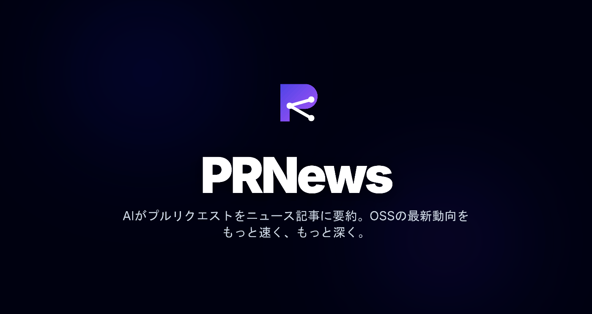
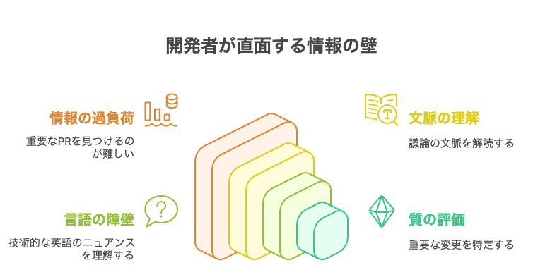
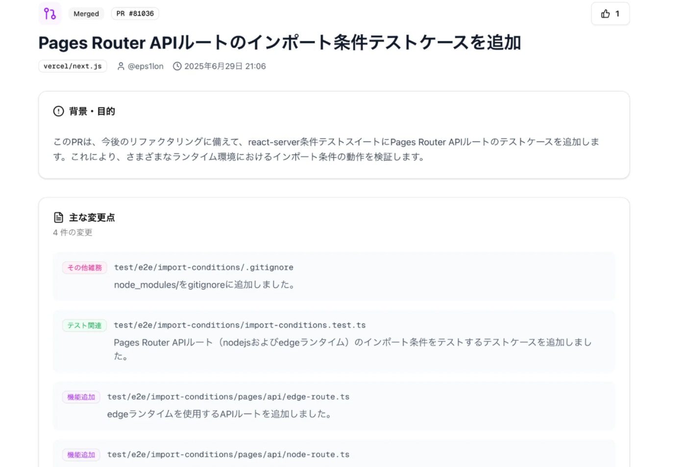
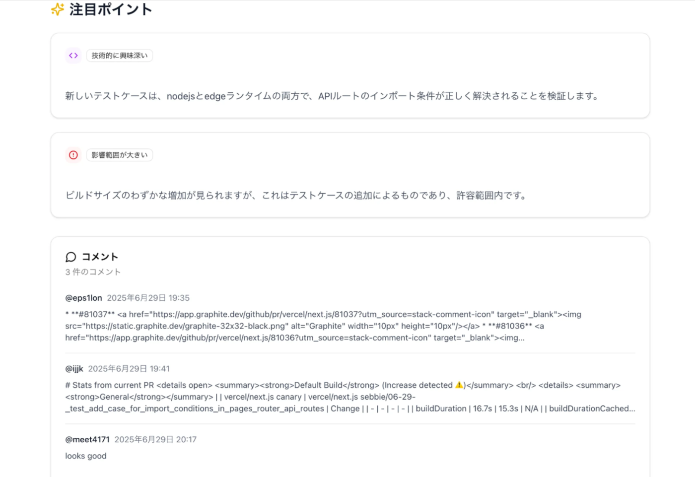
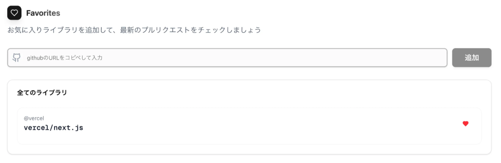
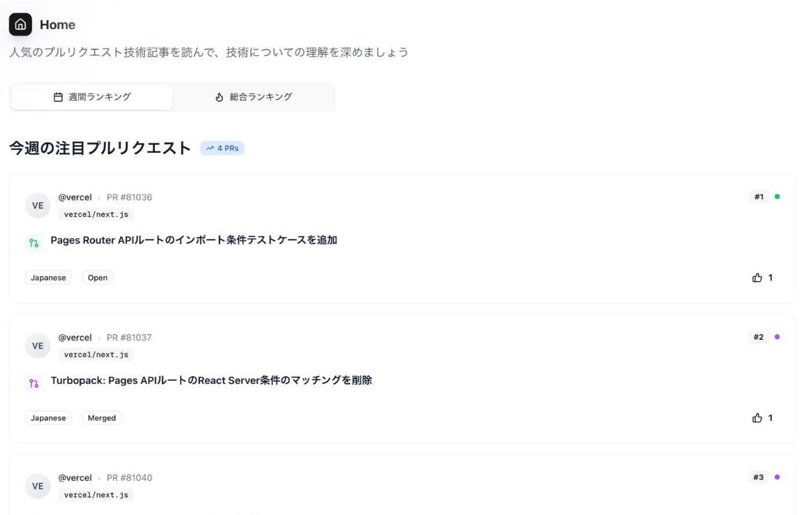

#  誰の、どんな課題を解決するのか？  
\- PRNewsが生まれた背景 -

現代のソフトウェア開発において、オープンソースソフトウェア（OSS）は、もはや電気や水道のようなインフラと言っても過言ではありません。私たちが日々利用するフレームワーク、ライブラリ、ツールの多くは、世界中の開発者たちの協力によって進化し続けています。この進化の最前線に触れることは、技術者としての成長に不可欠ですが、皆さんはこんな悩みを抱えていませんか？

「ReactやNext.jsの最新動向を追いたいけど、毎日何十と作られるPull Request（PR）を全部読むなんて不可能だ…」  
「チームで使っているライブラリに重要な変更があったらしいけど、膨大な英語の議論を読み解く時間がない…」  
「このバグ修正、どういう経緯でこの実装になったんだろう？PRのコメントを全部遡るのは骨が折れる…」

そう、OSSの進化の中心であるGitHubのPull Requestは、まさに**情報の宝庫** です。しかし、その一方で、あまりにも膨大で、複雑な情報が飛び交う**情報の洪水** でもあります。この「宝の山」から、自分にとって本当に価値のある情報を効率的に見つけ出すことは、非常に困難な作業となっています。

私たち「PRNews」は、この根深い課題を解決するために生まれました。本記事では、まず私たちがどのようなユーザーを想定し、彼らが直面している具体的な課題をどのように捉えたのかをご紹介します。

##  対象とするユーザー像

PRNewsは、技術への探求心を持ち、日々の開発業務やスキルアップのためにOSSと向き合う、すべてのエンジニアを対象としています。具体的には、以下のような方々を想定しています。

  1. **常にアンテナを張る、向上心旺盛開発者**  
普段から利用しているフレームワーク（例: Next.js, Hono）やライブラリが、どのような議論を経て、どんなコードによって改善されていくのかを深く知りたいと考えている方々です。彼らにとって、著名なリポジトリのPRは、生きた教材そのものです。しかし、多忙な業務の合間を縫って、質の高い情報を効率的にインプットする手段を求めています。
  2. **チームを率いる、多忙なテックリードやエンジニアリングマネージャー**  
技術選定やアーキテクチャ設計に責任を持つ彼らは、チームが依存するライブラリの破壊的変更や、セキュリティに関わる重要なアップデートを誰よりも早く、そして正確に把握する必要があります。しかし、全てのPRを詳細にレビューする時間はなく、「結局、この変更の要点は何なのか？」「チームにどんな影響があるのか？」という結論を、迅速に知りたいという切実なニーズを持っています。
  3. **OSSの世界に貢献したい、未来のコントリビューター**  
OSSへの貢献に興味はあるものの、「どこから手をつけていいかわからない」「議論の輪に入っていくのが難しい」と感じている方々です。他の開発者がどのようなPRを出し、どういった議論をしているのかを参考にすることで、コントリビューションへの第一歩を踏み出すきっかけを探しています。

##  開発者が直面する「PR情報の壁」という課題

では、これらのユーザーは具体的にどのような壁に直面しているのでしょうか。私たちは、その課題を大きく4つの「情報の壁」として整理しました。

##  1\. 量の壁：情報の洪水に溺れる

人気のあるOSSリポジトリでは、1日に数十、数百のPRが作成されることも珍しくありません。すべてのPRに目を通すことは物理的に不可能です。さらに、一つのPRには、本体の説明文だけでなく、多数のレビューコメント、修正コミット、関連Issueへのリンクなどが複雑に絡み合っています。この情報の洪水の中から、本当に重要な「宝石」のようなPRを見つけ出すのは、至難の業です。

##  2\. 時間の壁：文脈の宝探しに疲弊する

PRのタイトルやコードの差分（diff）だけを見ても、その変更の真の意図を理解することは困難です。  
「なぜこの実装が選ばれたのか？」  
「他にどんな代替案が検討されたのか？」  
「この変更が将来のどんな機能の布石になるのか？」  
こうした背景や議論の文脈は、往々にして数十、数百に及ぶコメントのスレッドの中に埋もれています。これを最初から最後まで読み解き、文脈を理解する作業は、まるで広大な砂漠での宝探しのように、多大な時間と集中力を要します。

##  3\. 言語の壁：英語のニュアンスが掴みきれない

OSSの世界では、その多くが英語で議論されています。日常的な読み書きはできても、技術的な議論における微妙なニュアンスや、専門用語、時にはスラングまでを正確に、かつスピーディに理解するのは、多くの日本人エンジニアにとって依然として高いハードルです。翻訳ツールを使っても、技術的な文脈が失われてしまい、かえって混乱を招くことも少なくありません。

##  4\. 質の壁：ノイズに埋もれる本質的な変更

すべてのPRが等しく重要というわけではありません。ドキュメントのタイポ修正や、CIの設定変更といった軽微なPRの中に、アーキテクチャを根底から変えるような重要な変更や、誰も思いつかなかったような独創的なバグ修正が埋もれてしまうことがあります。これらの「今日のイチオシコミット」とも言うべき本質的な変更点を、ノイズの中から効率的に見つけ出すための仕組みが存在しませんでした。

私たちは、これらの「4つの壁」こそが、開発者がOSSから得られる学びや気づきの機会を阻害している根本的な課題だと考えました。

PRNewsは、AIの力を活用することで、この高くそびえる壁を取り払い、誰もがもっと気軽に、そして深くOSSの進化を享受できる世界を目指します。

#  課題へのソリューション

##  1\. 量の壁を超える：読むべきPRがすぐわかる

PRNewsは、すべてのPull Requestに対してAIが自動で要約を行い、変更内容・意図・影響範囲を短く分かりやすく提示します。

さらに、変更の影響度・技術的独創性・議論の活発さなどに基づいた優先度スコアを提示することで、注目すべきPRをすぐに把握できます。大量のPRの中から「見るべきもの」だけを効率よく選び出すことが可能になります。

##  2\. 時間の壁を超える：「文脈・意図」が一目で見える

PRのタイトルやコードの差分だけを見ても、「なぜこの変更が必要だったのか」「どんな選択肢が議論されたのか」などの深い理解にはつながりません。

PRNewsでは、PRに紐づく**コメント・レビュー・関連Issue・READMEの記述** などから、AIが変更の意図や文脈を抽出し、要約します。

これにより、数十件のコメントや議論を読み込まずとも、「設計の背景」や「判断の根拠」を把握できます。開発の思考プロセスを追体験することで、実務に応用できる深い学びにつながります。

##  3\. 言語の壁を超える：英語の議論も“学べる日本語”に変換

PRの要約や議論の抜粋を、**技術文脈を保った自然な日本語** で提示します。単なる直訳ではなく、「なぜこの実装が選ばれたのか」「どんな設計思想が背後にあるのか」といった意図をくみ取り、**日本の開発者にも伝わりやすい形で再構成** しています。

これにより、英語に不安がある開発者でも、PRに込められた背景や思考をスムーズに理解でき、OSSを通じて着実に技術力を高めることができます

##  4\. 質の壁を超える：お気に入り登録とAIによる技術的価値の抽出

ユーザーは気になるOSSプロジェクトをお気に入りに登録することで、そのリポジトリに新しく作成されたPRを自動的に追跡できるようになります。さらに、AIがそのPRの内容を解析し、以下のような本質的な情報だけを抽出・整理して提示します。

#  PRNewsの特徴 ― 学びを支える機能群

こうしたソリューションを支えるために、PRNewsは以下のような特徴的な機能を備えています。

* * *

##  AIによるPR要約：学びの“導線”を提示

PRごとに、AIが情報を整理し、要約します：

  * **PRの概要** ：どのような変更が行われたのか、要点を簡潔に要約。コードの詳細を追わなくても、全体像がつかめます。
  * **Conversationの抜粋** ：レビューや議論の中から「なぜその実装が選ばれたのか」「他の案との比較はあったのか」といった本質的な議論を抽出。
  * **主な技術的変更点** ：アルゴリズムの改善、バグ修正のアプローチ、パフォーマンスチューニングなど、学びにつながる箇所をピックアップ。

この要約は、**コード差分（Files changed）、コメントスレッド（Conversation）、READMEなど** 複数のソースをAIが横断的に分析することで生成されています。

##  お気に入りリポジトリの自動追跡：学びの習慣化

PRNewsでは、気になるOSSリポジトリを「お気に入り」として登録できます。登録したリポジトリで新しいPRが作成されると、**自動でAI要約が生成され** 、ユーザーに表示します**。**

この機能により、自分が注目している分野やプロジェクトの最新動向を**受け身で効率よく追跡できる** ようになります。まるで技術メンターが日々のOSSから「これは読むべきだよ」と教えてくれるような体験が得られます。

##  自然な日本語と技術文脈を保った翻訳

PRNewsでは、英語のままだと理解しづらい技術議論を、**日本語として自然で、かつ技術的背景が伝わる文章** に翻訳します。翻訳は単なる機械的な置き換えではなく、**議論の意図・技術選定の理由** をくみ取ったうえで、開発者視点で最適な言葉に変換されます。

##  技術スタイルや知識のトレンドも把握できる

PRNewsは、PRの要約を一覧で読んでいくことで、特定のOSSに限らず、**今どのような設計・実装が主流なのか、どんな議論が多いのか** といった開発トレンドも把握できます。

たとえば、「パフォーマンス改善のためのRust移行が進んでいる」「型安全性を考慮したAPI設計が増えている」といった大きな傾向も、PRを通じて自然にキャッチアップできます。

また、PRNewsでは週間、総合ランキングを提供しており、今注目されている技術的トピックを一覧で確認することができます。

これにより、自分で大量のリポジトリを巡回することなく、開発者コミュニティ全体の関心や知見が集まっている技術トピックを効率的よくキャッチアップすることができます。

#  システム アーキテクチャ

###  システムアーキテクチャの説明

###  1\. CI/CD

  * `git push`コマンドで**GitHubリポジトリ** に送信。
  * プッシュをトリガーとして、**GitHub Actions** がCI/CDパイプラインを自動的に開始。 
    * **Biome** によるフォーマットとリントチェック。
    * Jestを使用した単体テストが実行され、コードの正当性を検証。
  * **ビルドとデプロイ**
    * **Next.js** のフロントエンドと**Hono** のバックエンドをコンテナイメージとしてビルド。
    * 最終的に**Cloud Run** にデプロイされる。

###  2\. ユーザー認証

  * **認証フロー**
    * ユーザーはフロントエンドで**Firebase Authentication** を介してGitHubでログインします。
    * 取得したトークンをバックエンドに渡し、ユーザー情報と暗号化されたGitHubアクセストークンが**Cloud Firestore** に保存されます。
    * バックエンドはセッション用Cookieを発行し、以降の通信でユーザーを認証します。

###  3\. 記事の要約・閲覧

  * **記事生成のトリガー** : ユーザーがPR一覧画面で、特定のPRの「記事を生成する」ボタンをクリックします。
  * **PR情報の取り込み (Ingest)** : 
    * フロントエンドはバックエンドの`/ingest`エンドポイントにリクエストを送信します。
    * バックエンドは、**Cloud Firestore** からユーザーのGitHubアクセストークンを取得・復号します。
    * そのトークンを使い、**GitHub API** にアクセスしてPRの詳細（差分、コメント履歴など）を取得します。
    * 取得した生のPRデータを一旦**Cloud Firestore** に保存します。
  * **AIによる要約** : 
    * 取り込みが成功すると、フロントエンドは続けて記事生成のエンドポイントを呼び出します。
    * バックエンドは、先ほど保存したPRデータを**Gemini API** に送信します。プロンプトには、タイトル、背景、変更点、注目ポイントなどを特定のJSON形式で出力するように指示が含まれています。
  * **記事の完成と保存** : 
    * Gemini APIから返却されたJSON形式の要約結果を、**Cloud Firestore** に保存されている該当PRのドキュメントに追記・更新します。
  * **記事の表示** : 
    * バックエンドは完成した記事データをフロントエンドに返却します。
    * ユーザーは自動的に記事詳細ページに遷移し、生成された解説記事を読むことができます。

#  プロジェクトのデモ動画

<https://youtu.be/60k8qD81SRU>
