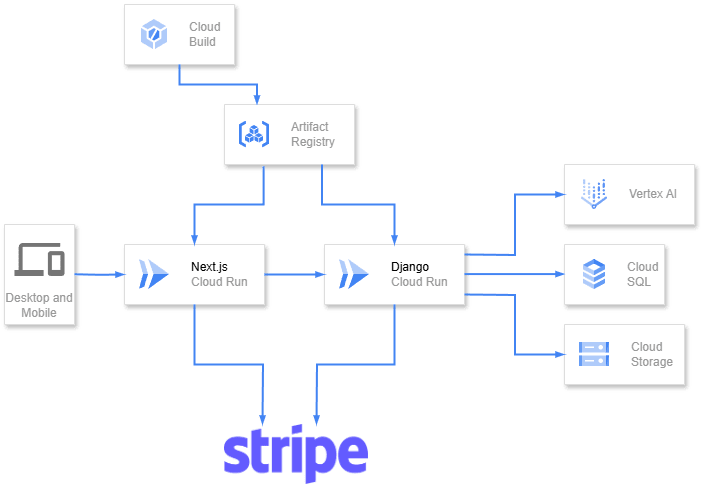

##  📝 概要

本プロジェクト「**everstudy** 」は，**学習の継続を支援するためのWebアプリケーション** です．

ユーザーは以下の2つを設定します：

  * ✅ **目標とする学習時間**
  * 💸 **達成できなかった場合の罰金額**

そして，**実際に学習しているかどうか** は，**AIがカメラ画像をもとに自動で判定** します．  
これにより，ユーザーは**自ら決めたルールのもとで，適度なプレッシャーを感じながら学習を継続** することができます．

##  🎥 デモ動画

##  🎯 プロジェクトが対象とするユーザー像と課題

###  🎯 対象ユーザー

本プロジェクト「everstudy」が想定する主なユーザー像は以下の通りです：

  * **何かを継続して学習したいと思っている大人**
    * 例：英語や資格の勉強，プログラミング，業務スキルの向上など
    * 自分の成長のために学びたいという意思はあるが，日常の忙しさやモチベーションの低下により，学習が続かないと感じている人

###  🧩 解決したい課題

  * **継続して学習した方が良いと分かっているのに，継続できない**

everstudyは，このような“意志の力だけでは継続が難しい”という課題に対して，罰金やAIによる判定といった仕組みで外部からの動機付けを与えることで，自然な学習継続をサポートします．

###  📚 学習することはよいことである

現代は，AIやテクノロジーの進化によって，変化のスピードが非常に速い時代となっています．  
新しい技術や価値観が次々に生まれる中で，私たちが変化に柔軟に対応するためには，**常に学び続ける姿勢** が求められています．

実際，**リスキリング** や**アップスキリング** といった言葉が注目されているように，単なる知識の習得だけでなく，  
「**学び続けられる人材** 」こそが今の社会で価値を持つとされています．

学習することは，**自分自身を時代に適応させる手段** であり，  
同時に**自身の市場価値や視野を広げる行為** でもあります．  
知識や技術を身につけることで，**新たな機会や人とのつながり** が生まれ，  
自分の可能性を広げていくことができます．

###  🔁 継続することが必要

しかし，いかに「**学ぶこと** 」が重要であるとしても，それを**一度だけで終わらせてしまっては意味がありません** ．  
実現のために，**継続的な努力が必要不可欠な目標** も多く存在します．

価値のある成果はたいてい，**短期間で得られるものではありません** ．  
多くの時間と労力を要し，途中でモチベーションが下がったり，誘惑に負けてしまう場面もあると思います．

だからこそ，**学習を継続するための工夫や支援が必要** であると考えました．

###  😓 継続できない人が多い

実際には，**継続できずに挫折する人が多く存在します** ．  
私自身も，新しい資格の勉強を始めたものの，**いつの間にか手を付けなくなっていた** という経験があります．

化学系の学科に所属していた友人は，少しの単位不足で留年し，  
「この時間を使って公認会計士を目指す！」と意気込んでいましたが，  
実際には**ポケモンカードに夢中** になっていたようです．

こうした現実からもわかるように，**「やる気」は時間とともに消えていってしまうもの** です．  
「今日からブログを始めます！」という**最初の投稿だけが存在するブログ** を見かけたことがある人も多いと思います．

**継続したいと願う人は，日本に限らず世界中にいると考えられます．**  
そして，**継続できずに悩む人もまた，世界中に存在すると考えられます** ．

###  🤔 なぜ継続できないのか

継続できない理由の一つに，動機が薄れていく「**動機の希薄化** 」があると考えています．

たとえば，小学生の宿題や大学の課題，社会人の仕事などは，多くの人が**期限内に完了させています** ．

この理由としては

  * **先生に怒られたくない**
  * **単位がほしい**
  * **生活のためにお金が必要である**

などの**明確で強制力のある動機** が存在しているからだと考えています．

一方我々が対象としている**継続できない学習** においては，学習対象が  
「**やったほうがいいこと** 」ではあるが「**やらなくても困らない** 」という属性を持っていると考えます．

例として**大人の学習の対象になりやすい英語の学習** を考えます．  
英語を学習すると

  * **より多くの情報に簡単にアクセスできるようになる**
  * **仕事の幅が広がる**

などのような明確なメリットがありますが

  * **大半の人にとっては英語ができなくても生活に困らない**

という属性を持っています．

これにより

  1. **英語を学習しよう！と意気込んで学習を始める**
  2. **時間が経つにつれて最初のやる気が薄れていく**
  3. **英語を学習しなくても生活に困らないので，学習しなくなる**

というような流れが生まれると考えました．

つまり，**「やらないと困る」状況では人は動き，「やらなくても困らない」ことは続かないのではないか** ，ということです．

裏を返せば，**継続せざるを得ない環境をうまく作り出すことができれば** ，  
人は継続して学習する可能性があるということがわかります．

本プロジェクトでは，**動機を作り出すこと** を行っています．

##  🛠️ 課題へのソリューションと特徴をまとめた説明文

###  💡 動機を作り出す

本プロジェクトには**目標時間分学習できなかった際に，自身で設定した罰金額が自動で支払われる** という仕組みがあります．  
これが学習者に対して「**学習する動機** 」を作りだします．

具体的には，**学習タスクの作成時に，目標学習時間と罰金額をユーザー自身が設定** します．  
その上で，**Stripeの決済機能を活用** し，**設定された罰金額分の利用枠を事前に差し押さえる** ことを行います．（オーソリ）  
そして，目標達成時にはその利用枠を解放し，**目標未達成時には差し押さえた金額が支払われる** （キャプチャ）という仕組みです．

学習をやめたくなっても「**お金を失いたくない** 」という非常に現実的な動機が生まれ，学習の継続を促します．

**最初に罰金額を設定するやる気** だけあれば，その後の継続の動機は**罰金額が生み出してくれます** ．

* * *

###  🤖 虚偽申告を行いにくくする

本プロジェクトでは**学習しているかどうかの判断をAIが行う仕組み** を取り入れています．  
これにより，

  1. **学習の目標を立てた！お金を失いたくないから学習しなくちゃいけない**
  2. **時間の経過とともに当初のやる気が薄れてくる**
  3. **お金を失いたくないから学習してないけど○○時間学習したことにしよう**

というような，**最初はやる気があったのに，抜け道をみつけてしまい途中でやらなくなるという可能性を減らすこと** ができます．

具体的には，**3分から6分に一度，カメラから取得した画像をGoogleの大規模言語モデル「Gemini」に送信** し，  
**ユーザーが実際に学習しているかどうかをAIに判断してもらいます** ．  
AIが「**学習している** 」と判定した場合にのみ，**学習時間として加算** されます．

このように，

  1. **罰金を設定することで強制的に動機を生み出し，**
  2. **AI判定によって虚偽申告を防ぐことで，**
  3. **最初のやる気に依存しすぎない継続支援を可能にする**

という構造になっています．

##  🧭 システム アーキテクチャ図の画像

本プロジェクトは以下のような**システムアーキテクチャ** で構成されています．

##  🛠️ 技術スタック

本プロジェクトでは以下の技術を選定しました．

  * **フロントエンド** : Next.js
  * **バックエンド** : Django
  * **データベース** : Cloud SQL
  * **AI判断** : VertexAI (Gemini)
  * **定期実行** : Cloud Scheduler
  * **支払い** : Stripe
  * **デプロイ** : Cloud Run

##  🌱 今後の展望

現在は**学習しているかどうかの判断のみ** を行えるようになっていますが，  
**AIに判断してもらうもののジャンルを増やす** ことで，様々なことの継続を支援できるようになると考えています．

また，現在は**一人で使用することを想定** していますが，  
**チームなどで一つの目標に向かって取り組めるような機能** など，  
**他の人との関わりを含む機能** を作ることができれば，  
**学習する動機をさらに作り出すことができる** とも考えています．

##  👥 メンバーと関連リンク

本プロジェクトは以下の2名によって開発されました．

  * **発案・バックエンド開発担当**

学習の継続を支援するというアイデアの立案および，Djangoを用いたAPIの設計・実装を担当しました．

  * **デザイン・フロントエンド開発担当**

ユーザー体験を意識したUIデザインと，Next.jsによるフロントエンドの実装を担当しました．

* * *

###  💻 GitHub リポジトリ

  * **フロントエンド（Next.js）**  
[project12-client](https://github.com/katsushika-projects/project12-client)

  * **バックエンド（Django）**  
[project12-server](https://github.com/katsushika-projects/project12-server)

##  ✅ まとめ

今回は，日々の学習を「**継続** 」するためのWebアプリケーション「**everstudy** 」を開発しました．  
現代は情報があふれ，誘惑も多い中で，**自分の意思だけで継続するのは難しい場面も多くあります** ．  
そこで，私たちは**継続する動機を生み出せるプロジェクト** を作成することを目指しました．

本プロジェクトでは，**罰金機能** と，**AIによる学習しているかどうかの判断機能** を取り入れています．

**他ユーザーとのゆるやかなつながり** や，**学習履歴をもとにしたAIフィードバック** などの機能追加をおこなうことで，  
「**続けやすい** 」環境を目指して**改善を重ねていくこともできる** と考えています．

「**everstudy** 」を使って**自分自身が継続して学習できるのかどうか** が今後の問題となります．

📖 最後までお読みいただき，ありがとうございました．
