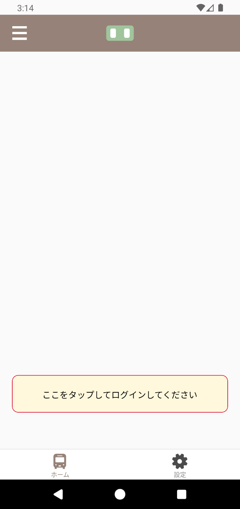
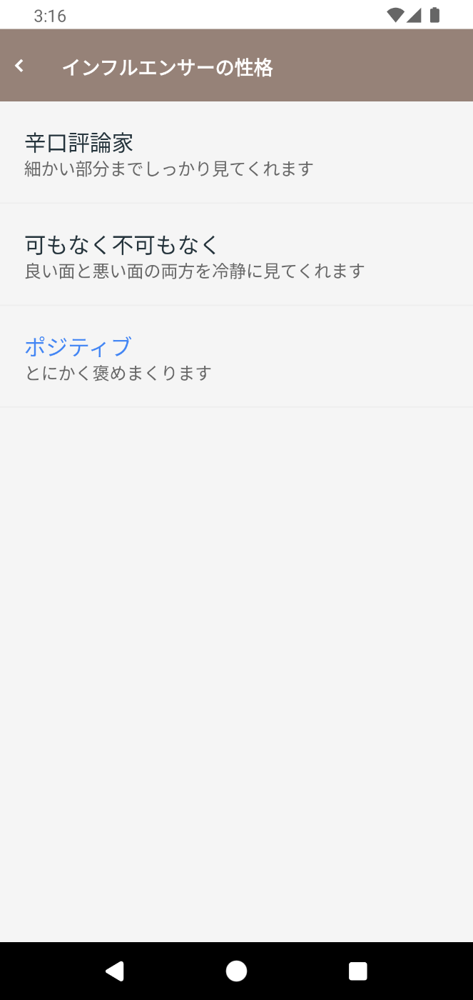
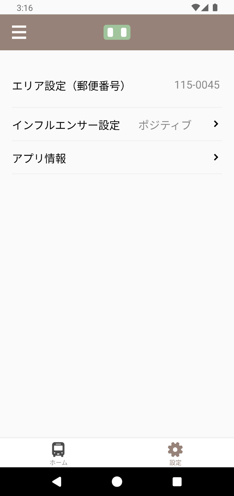
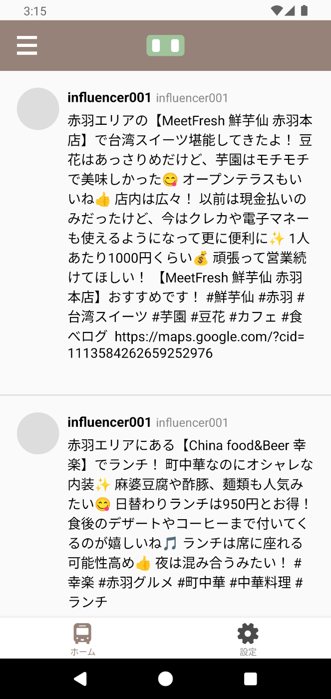
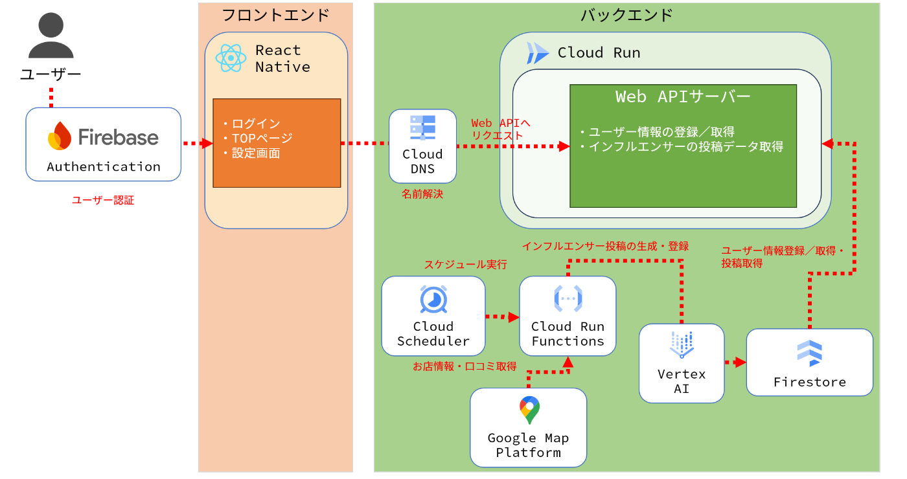

#  「あなたのインフルエンサー」とは？

  * 「あなたのインフルエンサー」は、あなた専用のインフルエンサーをAIで形作るアプリです。
  * 「あなたのインフルエンサー」は[第2回 AI Agent Hackathon with Google Cloud](https://zenn.dev/hackathons/google-cloud-japan-ai-hackathon-vol2)への応募作品です。

#  使い方 (Android端末向け)

  1. APKファイルをこちらのURLからダウンロードします。

  2. ダウンロードしたAPKファイルをAndroid端末上で読み込んてアプリをインストールします。

     * セキュリティ対策のためAPKファイルは通常そのままではインストールできないため、Android設定から「不明なアプリのインストール」を許可するように設定してください。
     * 参考ページ: [提供元不明のアプリをインストールする](https://www.au.com/online-manual/sov37/sov37_01/m_08_33.html)
  3. アプリを起動します。

  4. 初回起動時はログインを促すメッセージが表示されるので、Googleアカウントを利用してログインしてください。  
  

  5. 画面下部の「設定」タブをタップしてインフルエンサーの設定をしてください。

     * 設定項目 
       * 郵便番号 
         * 設定された郵便番号のエリアにあるお店をインフルエンサーがおすすめします。
       * インフルエンサー設定 
         * 「辛口評論家」「可もなく不可もなく」「ポジティブ」の3タイプから選びます。 
           * 「辛口評論家」はお店に対して感じたネガティブな印象についても言及します。
           * 「可もなく不可もなく」はお店に対するポジティブな印象やネガティブな印象を織り交ぜてニュートラルな回答をします。
           * 「ポジティブ」はお店の良い部分をべた褒めしながらおすすめしてきます。  
  

  6. あなただけのインフルエンサーがお店をおすすめしてくれます！  

#  プロジェクトが対象とするユーザー像・課題

##  ユーザー像

  * このサービスの主な対象ユーザーは下記のとおりです。 
    * **忘年会などの幹事を執り行うサラリーマン**
      * 忘年会など参加者の多い飲み会を幹事として執り行う場合は、会社エリア内のお店情報を調べる必要がありますが、インターネットの口コミを見て回るのは骨の折れる作業です。
      * 繁華街エリアの場合はお店が星の数ほどあり、そもそも候補を絞り込むこと自体が大変、という場合もあります。
    * **地元のお店を開拓したい人**
      * 自分が住んでいる場所を地図アプリで見ると、意外と近くに雰囲気良さそうなお店があったりします。ただ、地元のお店をおすすめするインフルエンサーはどの地域にもいるとは限らないため、なかなか行きたいお店を決められない場合もあります。

##  従来の口コミサービスの課題

  * 口コミサービスに投稿されている口コミはポジティブな意見もありますがネガティブな意見もあり、すべての意見をくみ取るのはなかなか大変な作業です。
  * また、口コミはそれぞれのお店ごとに登録されているため、エリアごとにおすすめのお店を調べる場合は少し面倒です。

#  課題へのソリューションと特徴

  * 「あなたのインフルエンサー」には大きく4つ特徴があります。 
    1. エリアを指定するだけでおすすめしてくれる
    2. Googleマップの口コミから文章を生成してくれる
    3. SNSのタイムライン画面風に流し読みできる
  * **特徴1. エリアを指定するだけでおすすめしてくれる**
    * 郵便番号でエリアを指定するだけでお店を勝手におすすめしてくれます。
  * **特徴2. Googleマップの口コミから文章を生成してくれる**
    * Googleマップの口コミ情報をもとにインフルエンサーの文章が生成されるため、ポジティブな意見／ネガティブな意見様々な口コミを総合した投稿を確認することができます。
  * **特徴3. SNSのタイムライン画面風に流し読みできる**
    * SNSのタイムライン画面のように見ることができるので、疲れている時もなんとなく流し読みするだけでお店の情報を知ることができます。

#  システムアーキテクチャ

##  1\. 構成図

##  2\. モバイルアプリ

  * ユーザーが触れるフロント部分はReact Nativeを使いモバイルアプリとして開発しました。 
    * React Nativeを使うことでiOS／Androidの区別なくTypeScriptで開発を行うことができます。
    * SwiftやJava/Kotlinの知識がなくてもモバイルアプリの開発ができるので採用しました。

##  3\. Web APIサーバー

  * ExpressとTypeScriptを使いWeb APIサーバーを開発しました。
  * 開発したWeb APIサーバーはCloud Runへデプロイしています。 
    * Cloud Runはコンテナを利用したマネージドサービスのため、ハードウェアやOS・ミドルウェアの管理をあまり意識せずコーディングに集中することができます。
    * また、オートスケーリングに対応しているため高負荷アクセス時もパフォーマンスを落とすことなく利用できます。

##  4\. Cloud Run Functions

  * インフルエンサーの投稿はCloud Run Functionsを使い生成しています。 
    * Cloud Schedulerと組み合わせることで定期的にTypeScriptの処理を実行することができます。
  * Google Map Platformからお店の情報や口コミを取得し、Vertex AIを使って口コミ情報をもとにインフルエンサー風の投稿文を生成します。

##  5\. データベース

  * ユーザー情報やブックマーク情報を格納するデータベースはNoSQLであるFirestoreを利用しています。 
    * 今回は大規模なデータのやり取りやトランザクションは必要ないため、処理速度が速くスキーマを意識せず使えるFirestoreを選びました。
    * また、Firestoreは無料枠を利用できるためコストも低く抑えられます。 
      * <https://cloud.google.com/free/docs/free-cloud-features?hl=ja#firestore>

##  6\. 生成AI基盤

  * 生成AI基盤はVertex AIを採用しました。 
    * Next.jsはNode.js環境で動作しているため、Node.js用のSDKを利用してVertex AIの機能を利用できます。 
      * <https://cloud.google.com/vertex-ai/generative-ai/docs/reference/nodejs/latest>
    * モデルは「gemini-2.0-flash-lite」を選択しました。 
      * Gemini Flash-Lite2.0は軽量モデルのため低コストかつレスポンスが早いことが特徴です。
      * 軽量モデルながら過去のGemini Flashモデルを上回る性能を持つため、今回採用しました。

##  7\. その他

  * 認証基盤は[Firebase Authentication](https://firebase.google.com/docs/auth?hl=ja)を利用しました。 
    * 数行のコードで簡単に認証処理を実装することができ、様々なログイン手段（ID/パスワード、Google認証、SNS認証、etc..）に対応しているため採用しました。
    * 今回は手軽に利用開始できるようにするためGoogle認証を利用しました。 
      * ID/パスワードの新規登録を無くすことで初回利用時の精神的ハードルを下げることを目的としています。
  * Web APIサーバーには独自ドメインを利用しているため、名前解決にCloud DNSを利用しています。

#  デモ動画

<https://www.youtube.com/watch?v=WDhfoQRCeAs>

#  今後の展望

  * **位置情報検索機能の追加**
    * 位置情報から検索するお店情報を変えることができれば、リアルタイムに自分がいる場所近くのおすすめ情報を知ることができます。
  * **インフルエンサー設定の拡充**
    * 現在は飲食店を中心とした情報が投稿されますが、設定で切り替えることで様々なテーマ（ファッション、テーマパーク等）でインフルエンサーに投稿させることができます。

#  まとめ

  * 今回はAIプラットフォームを使ってインフルエンサーそのものをAIで作る、ということに挑戦してみました。SNS風の投稿をどのようにしてくれるか気になりましたが、（内容の正確さはともかく）かなり自然な文章を出力してくれたので驚きました。 
    * それっぽく絵文字も使って表現していますね 笑
  * プロンプトでインフルエンサーの性格や特徴を細かく制御できるとより「自分だけの」インフルエンサーを生み出すことができるのではないかと思いますね！

