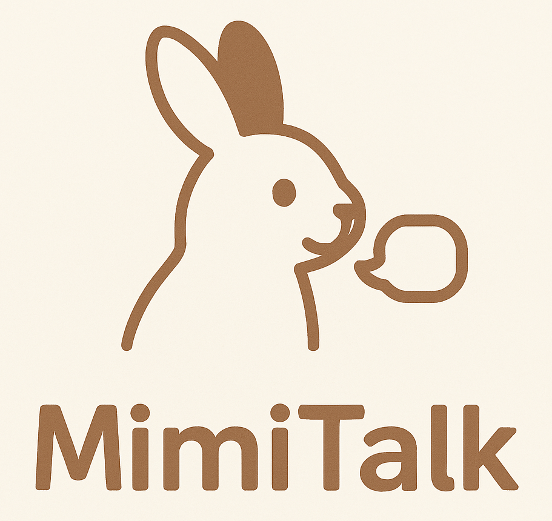
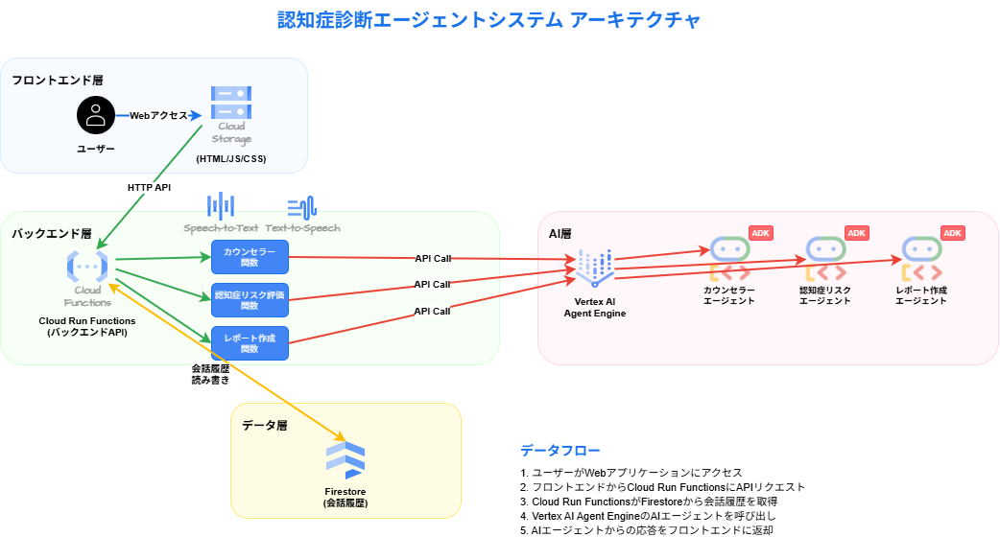

#  プロジェクト背景

このプロジェクトは、オフィスでの雑談で出た「離れて暮らしてる親の認知症がちょっと心配」という何気ない一言から始まりました。  
実際、日本の 65 歳以上人口は 3,600 万人を突破し、**近い将来、認知症高齢者が約 700 万人（高齢者の 5 人に 1 人）へ達する** と推計したデータもあり、認知症は身近な話題になりつつあります。  
<https://www.carefit.org/liber_carefit/dementia/dementia01.php>

ケア人材の不足や家族の介護負担も深刻化しており、症状の軽い早期のうちに予兆を発見することが重要な認知症ですが、以下のような課題があります。

  * 認知症の予兆から診断までに1年以上掛かっている <https://news.yahoo.co.jp/articles/1390e097fbae893a729784a0bc5446b4340c09f9>
  * 本人が症状に気付きにくく、家族も変化を観察しづらい
  * 既存の診断アプリは心理的ハードルがある構えてしまうし、認知症判定されるのが怖くて取り組みづらい

さらに、65歳以上の一人暮らし世帯が増え、社会的孤立 が認知機能低下・事故・孤独死のリスクを押し上げていることも複数の調査で指摘されています。

早期発見・介入が必要なのに「気づけない／言い出せない」――このギャップを埋めるサービスが求められています。  
そこで考案されたのが **MimiTalk（ミミトーク）** です。  
「日常の雑談 → 音声・言語指標 → 医療機関連携」というフローをワンクリックで繋ぎ、**家族・本人・医療従事者がストレスなく早期介入できる世界** を目指します。

#  プロジェクトが対象とするユーザー像と課題

  1. 遠隔地に住む家族 
     * 両親の物忘れが心配でも、頻繁に帰省できない
     * 電話では「大丈夫」と言われるが、本音が掴めない
  2. ひとり暮らしの高齢者 
     * 健康アプリは操作が複雑で続かない
     * 「診断アプリ」と聞くだけで身構えてしまう

共通の課題は、**「変化の兆しを捉えづらい」「重たい診断は避けたい」の 2 点** です。

#  ソリューション：MimiTalk（ミミトーク）

MimiTalk は、**“雑談アプリ” の顔をした音声AIコンシェルジュが、日常会話から認知症リスクをスクリーニングし、必要に応じて家族・医療関係者へ連携する マルチエージェント型 アプリ** です。

  * 雑談を入り口に、ストレスフリーで続けられる 
    * 日常会話や簡単な脳トレを通じて利用者が“診断アプリ”と意識せずに参加。
    * 操作は話しかけるだけ。スマホやスマートスピーカーがあれば、誰でもすぐ始められます。
  * 使えば使うほどエビデンスが蓄積し、治療・介入に活用できる 
    * 会話内容・発話速度・利用頻度などのログが自動で保存・解析され、認知機能の変化を時系列で可視化。
    * 家族や医療従事者は蓄積データを元に、タイムリーかつ客観的なフォローアップが可能になります。
  * 会話担当エージェントと診断担当エージェントを分離し、タスクを確実に実行 
    * 会話エージェント：利用者と自然な対話を行い、飽きずに続けられる体験を提供。
    * 診断エージェント：収集した音声・言語・行動ログを解析し、リスクスコアを算出。
    * 役割分担により、雑談の質と医学的評価の精度を両立します。

##  サービスデモ

動画デモをご覧ください。認知症スコアリングの過程がわかりやすいように、右側にリアルタイム分析を表示していますが、実際のアプリではただの雑談・脳トレアプリとして振る舞います。

<https://youtu.be/TCb9ZkHg6L0>

##  体験フロー

  1. カジュアルトーク：「こんにちは。今朝は目が覚めてからどんな風に過ごしましたか？」など ─ 雑談・脳トレ・生活リマインドを自然に開始
  2. 脳トレ：カジュアルな会話が終わったら、簡単な脳トレのようなものを実施（会話ログからリアルタイムで認知症をスコアリング）
  3. 認知症診断：会話はいつでも辞めることができる（その時点の認知症スコアを会話ログとともに記録）
  4. アラート／レポート（開発中）：認知症リスクのある傾向が一定期間続いたら、家族や医療機関に会話ログと認知症スコアの推移を通知

**表向きは楽しい雑談アプリ、裏側で医学的スクリーニングを継続実施。“話すだけ” で抵抗感なくエビデンスを蓄積し、早期介入を実現します。**

##  アーキテクチャ

  * Vertex AI Agent Builder：3つのエージェントを ADKを用いてVertex AI Agent Engineに登録し、それらをAPIにてCloud Run関数から呼び出す
  * Cloud Speech-to-Text：ストリーミング認識＋話者分離で高齢者のゆっくりした発話も正確に転写
  * Cloud Text-to-Speech：AI Agentが作成した返答（自然言語）を音声化し、ユーザとの会話を実現する
  * Cloud Run Functions：バックエンドとして、Vertex AI Agent EngineとFirestore上の会話履歴を利用してそれぞれのアウトプットをフロントエンドに返却する

##  技術ハイライト

  * LLM Gemini 2.5 Flash + pro で診断に利用する会話内容の検討と実現、またそれを利用した認知症リスク、信頼度のスコアリングと診断レポートの作成を実現
  * 音声 Speech-to-Text v2 高齢者特有の抑揚を Custom Class で適応学習
  * 評価 BigQuery ML + Vertex AI Tabular（開発中） 言語指標 × 音声指標 × 行動ログでリスクモデルを自動再学習
  * UX Flutter Web + PWA（開発中） “電話のように” 起動、オフライン時はキャッシュ応答

##  テストユーザーの声（利用後インタビューの要約）

身近な人にテストユーザとしてアプリを利用していただき、コメントをいただきました。  
このようなリアルなニーズ・リクエストを踏まえた改善提案にも取り組む見込みです。

  * 72歳・女性（同僚のご家族） 
    * 利用シーン： 
      * 朝食後にPCの前で毎日5分ほど数日間にわたり雑談。
    * 良かった点： 
      * 難しい設定もなく、話すだけで相手をしてくれるのが嬉しい。ちょっとした会話も“もっと聞かせて”と返ってくるので、脳が活性化している感じがした。
    * 改善アイディア： 
      * 脳トレが唐突に始まるなど、まだ少し戸惑うときがある。もっと自然な会話をたくさん楽しみたい。
  * 67歳・男性（同僚のご家族） 
    * 利用シーン： 
      * 就寝前にクイズやしりとり形式の脳トレ会話を10分ほど。
    * 良かった点： 
      * ゲーム感覚で続けられる点は良い。
    * 改善アイディア： 
      * デモ版だからだと思うが、右側に認知症リスクが出るので、プレッシャーを感じる面もあった。但し、ゲームだと思えば意外に集中力の源にもなっていたかも。
      * 同じ脳トレが続くと飽きる。季節ネタや週替わりコンテンツの自動ローテーションがあると良さそう。

#  今後の展望

  * 専門家共創によるスコアリング精度の強化 
    * 神経内科医・臨床心理士・言語聴覚士 との共同研究プロトコルを策定し、音声・言語バイオマーカーの重み付けを再設計。
    * MMSE・MoCA など 標準検査スコアと 1,000 ケース規模でクロス集計し、ROC-AUC 0.85 以上を目標にモデル再学習。
  * マルチモーダル評価エンジン 
    * 表情解析（Vision Transformer）＋ ジェスチャー検出 を組み込み、音声＋映像の 2 系列でリスク推定。
    * 睡眠・歩行など ウェアラブルデータ も取り込み、マルチモーダル Attention による総合スコアリングへ発展。
  * 臨床・介護現場での実証フェーズ 
    * 高齢者施設 3 か所・在宅介護利用者 50 世帯で 6 か月パイロットを実施。
    * “要フォローアップ” 判定後の 医師診断との一致率・誤警報率 を KPI 化し、モデル閾値をチューニング。
  * レギュラトリー／倫理対応 
    * 医療機器プログラム（Software as a Medical Device） の届出を視野に、ガイドライン準拠のドキュメントとリリース手順を整備。
    * 音声・映像の 匿名化パイプライン を強化し、GDPR／APPI（個人情報保護法）への国際対応を実施。
  * 自治体・企業向けヘルスケアサービスへの水平展開 
    * 自治体の 介護予防事業 に API 提供し、高リスク住民への早期介入をサポート。
    * 企業の 福利厚生パッケージ として「家族の認知機能チェック」を組み込み、介護離職リスクを低減。

#  まとめ

MimiTalk は、「ただ話すだけ」 という最小ストレスで 認知機能の変化を可視化 し、  
家族と医療をつなげる Google Cloud をフル活用した AI エージェント です。

  * 家族 には “安心の可視化”
  * 本人 には “診断アプリよりカジュアル”
  * 医療機関 には “客観データの遠隔共有”  
——三方良しのエコシステムを構築し、超高齢社会の QOL 向上に貢献します。  
**「遠く離れた家族を、耳でつなぐ。」**  
MimiTalk が “聴く力” であなたの大切な人をそっと見守ります。

#  メンバー

En-Dolphine（エン・ドルフィン）です。とあるイベントでAIコントをやったコンビがまさかのハッカソンで復活と相成りました。絵はコントで使った「俺たちのイメージ図」です。うしろにキモいクリーチャーが映りこんでいる生成AI版心霊写真になっているのが特徴です。  

* * *

第2回 AI Agent Hackathon with Google Cloud 提出作品  
En-Dolphin / Masataka Nakazawa & Keisuke Fukunaga
