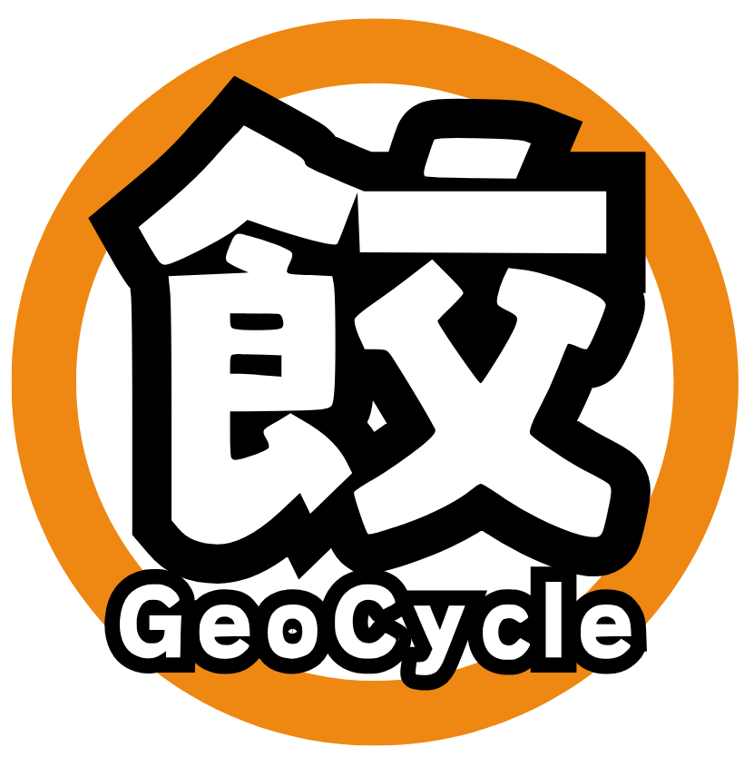
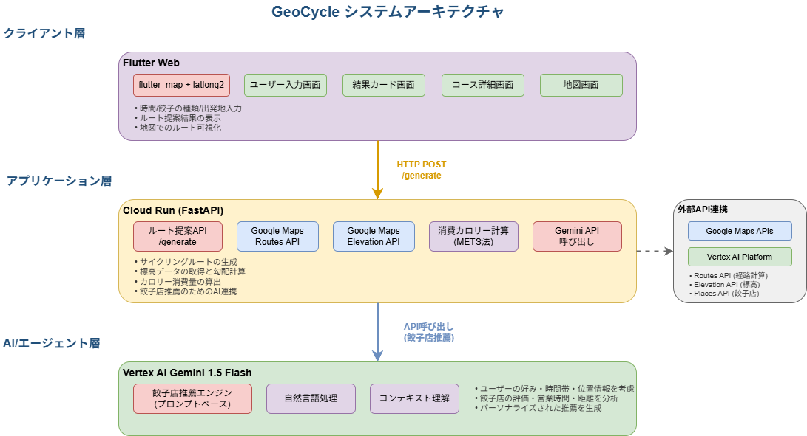

#  アイディア概要

宇都宮出身のAIエンジニア（サイクリング好き）が、宇都宮の未来のために本気で使いたいAIサービスを考えました！まずはアイディアの概要をスライドでご覧ください。

#  プロジェクト背景

宇都宮は 「餃子＝消費量全国１位」 というブランドで長年愛されてきました。  
しかし 2024 年度は総務省家計調査で 全国３位 に後退し、地元でも “アイデンティティの揺らぎ” が囁かれています。  
一方で、宇都宮市は 「自転車のまち」推進計画を掲げ、LRTでのサイクルトレインの取組や一級河川沿いのサイクリングロード整備など、モビリティと観光を融合した スマートシティ化 を推進中です。

我々は、**“餃子” と “自転車” という２大資産が、まだ一本の体験として結び付いていないことが課題** だと考えました。

そこで、「餃子を食べても太らないサイクリング体験」をキーコンセプトに、観光 × 健康 × データドリブンな街づくり を同時に前進させ、宇都宮の “次のアイデンティティ” を創出することを目指しました。

#  プロジェクトが対象とするユーザー像と課題

このプロジェクトは、以下２つのペルソナをユーザーとして想定しています。

  1. グルメ目的の観光客 ――“餃子トリガ”で宇都宮に来る人 
     * せっかくなら餃子を食べ尽くしたいが、高カロリーの罪悪感がつきまとう
     * 餃子店・観光名所・LRT をどう組み合わせればいいか、行程づくりが面倒
  2. 宇都宮で走りたいサイクリスト ――“自転車トリガ”で訪れる人 
     * 目的地の設定や休憩所の確保などルート検討の手間が苦痛
     * 「ご褒美餃子」を楽しみたいが、摂取カロリーと消費カロリーのバランスを取りづらい

上記のペルソナに同時に訴求するソリューションを提供することで、以下のように双方の行動と消費を好循環させる狙いがあります。

  * 餃子好きの観光客が「カロリーを相殺できるなら」とサイクリングに挑戦し、行動範囲が拡大して滞在時間が延び、沿線・郊外の観光消費が増える。
  * サイクリストが「ご褒美ルートなら」と餃子店を巡り、飲食支出と口コミ発信が増えて、地元飲食店の売上と認知度が向上する。

こうして “餃子がきっかけで自転車に乗る人” と “自転車がきっかけで餃子を食べる人” を同時に創出し、相互送客による経済波及効果と、健康的で持続可能な観光スタイルを両立させる――  
それが本プロジェクトのゴールです。

#  ソリューション：餃輪 (GeoCycle)

餃輪 (GeoCycle) は、  
**「カロリー収支まで最適化された、餃子を楽しむサイクリングコースを提案する」**  
生成AIエージェントです。

"餃子×サイクリング"を 観光・健康・まちづくり に同時接続する点が最大の強みです。具体的には、以下のようなことが実現できます。

  * カロリー収支ルーティング：Google Maps Routes API と METS 法を活用し、摂取カロリーと消費カロリーのバランスの良いコースを自動提案。
  * ワンクリック Google Maps ナビ：生成ルートをそのまま Google Maps に渡せるため、簡単な操作でシームレスにサイクリングをスタート。

これらの機能を通じ、観光客には罪悪感ゼロの「餃子xサイクリング体験」を、自治体（宇都宮市）にはスマートシティ実証データを、店舗には新規顧客と口コミ洞察を届けます。

##  サービスデモ

まずは動画デモをご覧ください。サイクリング時の利用を想定しているため、スマホで利用することを想定しています。

<https://www.youtube.com/watch?v=SyB9qTP-8yc>

##  体験フロー

デモで示したユーザー体験を簡単にフローで整理すると、以下の通りです。

  1. サイクリング方針（1日or半日／餃子の種類／スタート地点／観光名所有無）を選択
  2. 「コース検索」で候補ルートの一覧を表示
  3. 行き先やカロリー消費率等を元に気になるコースがあれば「コースの詳細」をクリック
  4. コースが気に入ったら「Googleマップでルート案内を開く」をクリック
  5. あとはGoogleマップのガイドに従い"餃子×サイクリング"を楽しむ！

**“Make Fun（楽しく） & Make Fan（ファンを増やす）” を合言葉に、Smart City, Smart Body を目指します。**

##  アーキテクチャ

  * クライアント層：Flutter Web（flutter_map + latlong2） 
    * ユーザー入力（距離/標高/時間/餃子タイプ）
    * 結果カード表示 → 地図画面遷移
  * アプリケーション層：Cloud Run（FastAPI） 
    * ルート提案API `/generate`
    * Google Maps Routes API / Elevation API連携
    * Gemini API呼び出し（餃子店推薦）
    * 消費カロリー計算（METS法）
  * AI/エージェント層：Vertex AI Gemini 1.5 Flash 
    * 餃子店の推薦（プロンプトベース）

#  今後の展望

まずは “より賢く・より個人化されたルート体験” を磨き込み、次に テンプレート化 & 多都市展開 でスケール。将来的には ヘルスケア／福利厚生 領域へ横展開し、「食」「運動」「地域経済」をつなぐプラットフォームへと進化させます。  
具体的には以下のようなロードマップを想定しています。

  1. コア機能のブラッシュアップ 
     * リアルタイム気象・交通連動ルーティング：風向き・降水確率・交通量を 5 分間隔で取得し、ルート候補を動的にリランキング。
     * パーソナライズド栄養プラン：事前に身長・体重・活動レベルを登録すると、METS 法の係数を個人最適化し “今日の推奨摂取餃子数” を提示。
     * SNS シェア＆協働編集：生成したコースをワンクリックで共有・再編集できる “コースリミックス” 機能を追加し、ユーザー生成ルートを資産化。
  2. 他都市展開テンプレート（SaaS モデル） 
     * サービステンプレート：管理者が「ご当地グルメDB」「推奨運動種目」「地元の観光資源」等を入力すると街おこしアプリを生成できる。 
       * 初期ラインアップの想定例 
         * 鰹 × ランニング （高知）
         * ウニ × トレッキング （北海道・積丹）
         * ソーキそば × シーカヤック （沖縄）
     * 多言語 UI とメートル法/ヤード法切替：インバウンド比率が高いエリアに合わせ、日・英・中・韓を標準サポート。（最近は外国人サイクリストも多いため）
  3. ヘルスケア領域へのエクステンション 
     * 企業・自治体の福利厚生パッケージ：走行距離とカロリー収支を “ウェルネスポイント” に換算し、健康増進手当や休暇インセンティブと連動。
     * 行政サービス連携：健康増進法に基づく自治体の介護予防事業と API 連携し、中高年向けに “ご当地グルメ × 軽運動” コースを自動生成。
     * 保険会社との共同 PoC：取得データを活用し、アクティブライフスタイル加入者向けの保険料ディスカウント実証を検討。

#  まとめ

餃輪 (GeoCycle) は、餃子を“ご褒美”にサイクリングへ誘い、サイクリングを“言い訳”に餃子を楽しむ。そんな “罪悪感ゼロ” の観光・健康体験をワンクリックで叶える Google Cloud ネイティブ AI エージェント です。  
観光客 には「カロリーを気にせず餃子三昧」という解放感を。  
サイクリスト には「計画ストレスゼロのご褒美ライド」という高揚感を。  
地域 には走行・購買データを活用した スマートシティ施策の根拠 を。  
これらを同時に実現し、**“餃子のまち × 自転車のまち” をデータと体験でつなぎ直すことを目指します** 。

#  開発メンバー所感：Flutter Web を使ってみて

今回 Flutter Web を採用したのは、**スマホアプリのように使えるUIをWeb上で提供したい** という要件があったためです。さらに、普段とは異なる技術スタックに挑戦し、短期間で高機能なプロトタイプをどこまで作り込めるか試してみたいという思いもありました。

  * 実装スピードは想定以上 
    * 企画・デザインを除く実装フェーズは、実質2〜3日で完了。Gemini × Vibe Coding の組み合わせにより、画面遷移や State 管理などの boilerplate を効率よく生成でき、Flutter の宣言的 UI と LLM は非常に相性が良いと実感しました。
  * 機能の共通化がしやすい構造 
    * Widget ベースの設計により、UI部品や処理の共通化・再利用がしやすく、複数画面での機能展開にも柔軟に対応できました。コードの可読性・保守性も高く、規模拡大時の安心感があります。
  * レイアウト調整にやや時間がかかった 
    * Flutter Web では一部の開発ツール（DevToolsなど）が使えず、ブラウザの標準デバッガとも連携しづらいため、細かなレイアウトのズレを確認・修正するのにビルドを都度確認する必要があり、調整に時間を要しました。

* * *

第2回 AI Agent Hackathon with Google Cloud 提出作品  
Team Land Lady / Narumi Komaba & Keisuke Fukunaga
