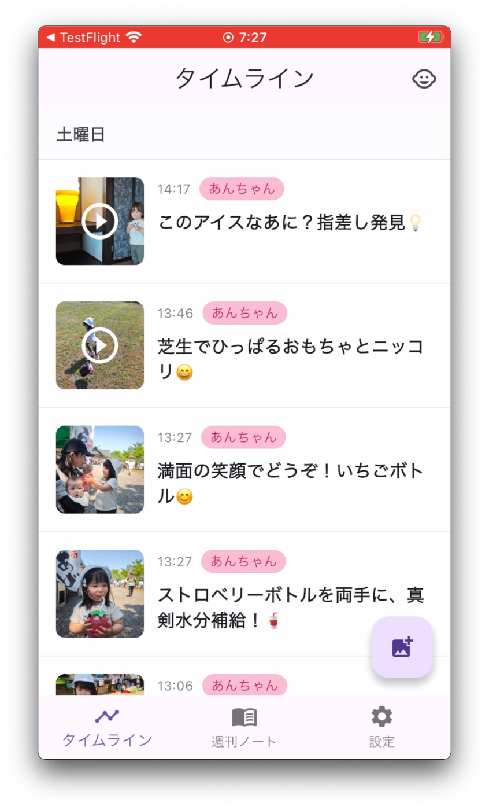
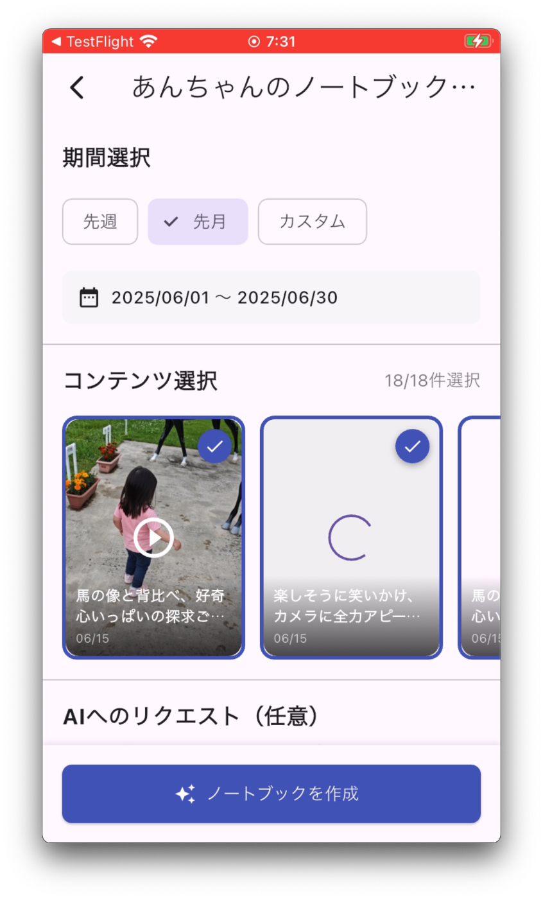
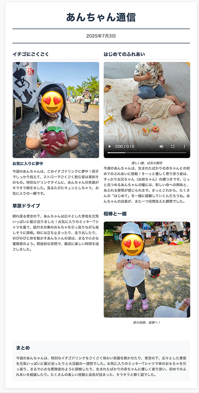

##  はじめに

本記事は、Google Cloud主催の「第2回 AI Agent Hackathon」への提出作品です。

子育て中の誰もが経験する「スマホに溜まり続ける大量の写真や動画」。それらをただのデータとして眠らせるのではなく、家族の絆を深める「物語」へと昇華させたい。そんな思いから、**AIが子供の成長記録を自動で編集し、家族に届ける成長記録プラットフォーム「おまかせダイアリー」** を開発しました。

この記事では、Google Cloud PlatformのAIサービスとサーバーレスアーキテクチャを活用し、どのように技術的課題を解決したかを詳しく解説します。

##  課題：撮りっぱなしの写真が、家族の宝物に変わらない

###  こんな経験ありませんか？

  * スマホの写真フォルダに**数千枚の子どもの写真** が眠っている
  * 祖父母に孫の様子を共有したいけど、**どの写真を選べばいいか分からない**
  * 成長の記録を残したいけど、**忙しくて整理する時間がない**
  * 写真に添える**エピソードを書く余裕がない**

##  解決策：AIが家族の物語を紡ぐ「おまかせダイアリー」

###  たった3ステップで、写真が物語になる

####  1️⃣ スマホで写真を撮影・アップロード

写真をアップロードするだけで自動で解析され、このようなエピソードタイムラインが自動で作成されます。

####  2️⃣ AIが自動で分析・物語を生成

  
解析された写真や動画からノートブックを作成できます。また、対象とする写真や動画を選択することができるので、コンテキストを調整できます。基本的に自動で作成されますが、ユーザーが意図的に作成されたアウトプットの調整をしたい。

####  3️⃣ 新聞風の成長記録が完成！家族と共有

毎週、その週のハイライトが**新聞風のレイアウト** で自動生成。URLを送るだけで、祖父母も簡単に閲覧できます。

###  実際のデモ動画をご覧ください

<https://youtu.be/TafdbSHw6rs>

##  Ⅰ. 解決したい課題と技術的アプローチ

###  対象ユーザーと課題

  * **ユーザー像:** 0歳〜6歳くらいの子供を持つ、子育てに忙しい親
  * **共有先の相手:** 祖父母や、遠方に住む家族・親戚
  * **解決すべき3つの課題:**

####  1\. 大量のメディアから意味のある瞬間を抽出する課題

**問題:** 毎日撮影される膨大な写真・動画から、本当に大切な瞬間を見つけ出すことは人力では困難

**技術的解決策:**

  * **Gemini 2.5 Flash** によるマルチモーダル分析で写真・動画の内容を理解
  * **年齢適応型AIエージェント** が子どもの発達段階に応じた観察視点を自動選択
  * **並列処理アーキテクチャ** で複数の視点（発達・感情・記憶）から同時分析

    
    
    # 年齢に応じた動的な分析視点の例
    perspectives = {
        "0-6ヶ月": ["感覚発達", "基本的運動", "親子の愛着"],
        "6-12ヶ月": ["運動発達", "物体認識", "初期言語"],
        "12-24ヶ月": ["歩行", "言語発達", "社会性"],
        "24ヶ月+": ["複雑な遊び", "感情理解", "仲間関係"]
    }
    

####  2\. 関連する思い出を自動で結びつける課題

**問題:** 過去の似た場面や成長の軌跡を手動で探すのは非現実的

**技術的解決策:**

  * **Vertex AI Vector Search** で768次元のセマンティック検索を実現
  * **text-embedding-004** モデルで各エピソードをベクトル化
  * 意味的に関連する過去のエピソードを自動で発見・関連付け

####  3\. 心温まる物語として伝える課題

**問題:** AIが生成する文章は事実誤認や不自然な表現を含みがち

**技術的解決策:**

  * **2段階のAIエージェントアーキテクチャ** で品質を担保
  * 第1段階：客観的事実のみを抽出する「分析官」エージェント
  * 第2段階：事実を基に物語を紡ぐ「作家」エージェント

##  Ⅱ. システムアーキテクチャと技術スタック

###  全体アーキテクチャ

###  採用した主要技術

  * **AI/ML** : Gemini 2.5 Flash、Vertex AI Vector Search、text-embedding-004
  * **エージェント開発** : Google Agent Development Kit (ADK)
  * **サーバーレス基盤** : Cloud Functions、Firebase (Auth/Firestore/Storage/Hosting)
  * **フロントエンド** : Flutter（モバイル）、Firebase Hosting（Web閲覧用）

##  Ⅲ. 技術的な実装のハイライト

###  1\. マルチモーダルAI分析の実装

Media Processing Agentは、写真・動画から以下の情報を自動抽出します：
    
    
    {
      "emotional_title": "初めて一人で立った瞬間",
      "episodes": [
        {
          "type": "developmental",
          "title": "運動発達の大きな一歩",
          "summary": "つかまらずに3秒間立つことができた",
          "content": "リビングで一人で立ち上がり...",
          "tags": ["立つ", "運動発達", "18ヶ月"],
          "metadata": {
            "confidence": 0.95,
            "emotion_score": 0.8
          }
        }
      ]
    }
    

###  2\. AIエージェントの責務分離

開発当初、単一のプロンプトで全てを処理しようとしましたが、出力が不安定でした。そこで、エージェントの責務を明確に分離：

**分析官エージェント（客観性重視）:**
    
    
    あなたは、子供の行動を観察し、その中で最も記憶に残る「ハイライトシーン」を
    見つけ出すプロのドキュメンタリー映像編集者です。
    
    【厳守事項】
    - あなたの感想や解釈は含めず、観察された事実のみを記述
    - 年齢や月齢の推測は行わない
    - 映像に映っていない情報を創作しない
    

**作家エージェント（物語性重視）:**

  * 分析官が抽出した客観的事実を基に物語を構築
  * 子どもの実年齢や家族構成などのコンテキストを加味
  * 親目線での温かい文章を生成

###  3\. セマンティック検索による関連付け

Vertex AI Vector Searchを活用し、以下を実現：
    
    
    # エピソードのベクトル化と検索
    embedding = generate_embedding(episode_text)  # 768次元
    similar_episodes = vector_search.find_neighbors(
        embedding, 
        k=5,  # 上位5件の類似エピソード
        filter=f"child_id={child_id}"
    )
    

これにより、「初めて立った」エピソードに対して「初めて歩いた」「つかまり立ちした」などの関連エピソードを自動で発見できます。

###  4\. イベント駆動型アーキテクチャ

Cloud Functionsのトリガーを活用した非同期処理：

###  5\. 新聞風レイアウトの実装

Dairy Publisherコンポーネントではレスポンシブな新聞風レイアウトを実現：

  * トピック1: メインストーリー（大きな写真付き）
  * トピック2-5: サブストーリー（異なるレイアウトパターン）
  * Firebase Hostingでの静的配信により高速表示

##  まとめ

本プロジェクトでは、Google Cloud PlatformのAIサービスとサーバーレスアーキテクチャを最大限活用し、以下を実現しました：

  1. **Gemini 2.5 Flash** による高精度なマルチモーダル分析
  2. **Agent Development Kit** を活用した役割特化型AIエージェント設計
  3. **Vertex AI Vector Search** による意味的な思い出の関連付け
  4. **Cloud Functions** によるスケーラブルなイベント駆動処理
  5. **Firebase** エコシステムによる迅速な開発とセキュアな運用

技術的な挑戦を通じて、AIを単なるツールとしてではなく、明確な役割を持つ「エージェント」として設計することの重要性を学びました。今後も、家族の絆を深める新しいコミュニケーションの形を技術で支えていきたいと思います。

私自身は今回テストと資料作成を行い、hara takuさんが実装全般を行いました。  
ありがとうございます！！！  
メインエンジニア：<https://zenn.dev/hara_taku>

##  今後の課題：AIが「その子らしさ」を理解するために

###  現状の限界と向き合う

本プロジェクトを通じて、技術的には多くのことを実現できましたが、同時に大きな課題も見えてきました。それは、**AIが生成する文章が、まだ「ありきたり」で「当たり障りのない」内容になりがち** という点です。

###  真の課題：過去の記憶を持たないAI

現在のシステムでは、各写真・動画を独立して分析しているため、以下のような親の視点での気づきを再現できていません：

  * **「初めて」の瞬間を見逃す**

    * 親なら「あ、初めて一人で立てた！」と気づく瞬間も、AIには「立っている子ども」としか認識されない
    * 過去に立てなかったという記憶がないため、成長の瞬間として捉えられない
  * **成長の軌跡が見えない**

    * 「ハイハイが上手になってきた」「言葉が増えてきた」といった、時系列での変化に気づけない
    * 各瞬間は捉えられても、その連続性や進歩が理解できない
  * **その子らしさが表現できない**

    * 「いつも車のおもちゃで遊ぶのが好き」「人見知りだけど、慣れると笑顔が多い」といった個性
    * 好きなもの、苦手なもの、性格的な特徴などが蓄積されない

###  技術的なアプローチの方向性

この課題を解決するためには、以下のような技術的進化が必要と考えています：

####  1\. 子どもの「成長プロファイル」の構築
    
    
    {
      "motor_skills": {
        "current": ["歩く", "走る"],
        "history": [
          {"date": "2024-01", "milestone": "つかまり立ち"},
          {"date": "2024-03", "milestone": "一人で立つ"},
          {"date": "2024-05", "milestone": "初めての一歩"}
        ]
      },
      "language": {
        "vocabulary": ["ママ", "パパ", "わんわん"],
        "last_new_word": "2024-06-15"
      },
      "personality": {
        "interests": ["車", "動物", "音楽"],
        "temperament": "慎重だが好奇心旺盛"
      }
    }
    

####  2\. コンテキスト aware な分析

  * 新しい写真・動画を分析する際に、過去の成長記録を参照
  * 「できなかったことができるようになった」瞬間を自動検出
  * その子の興味・関心に基づいた視点での分析

####  3\. 写真・動画以外の情報統合

  * 日常的な親の観察メモ
  * 身長・体重などの定量的データ
  * 保育園や幼稚園からのフィードバック

###  目指す未来

単なる写真・動画の解析を超えて、**AIが本当の意味で「その子を知っている」状態** を作り出すこと。親が持つ「うちの子はこういう子」という深い理解を、AIも共有できるようになれば、生成される物語はもっと心に響くものになるはずです。

技術的にはチャレンジングですが、これこそが「おまかせダイアリー」が目指す次のステージだと考えています。

#aiagentzenn #googlecloud #aiagenthackathon
