本記事は「[第2回 AI Agent Hackathon with Google Cloud](https://zenn.dev/hackathons/google-cloud-japan-ai-hackathon-vol2)」提出用記事です。

<https://youtu.be/fIhA_TsOpI0>

##  はじめに

現代の営業現場では、会議準備や情報収集に多大な時間やリソースが投入されがちです。その結果、本質的な営業活動や顧客との対話に十分な時間を確保することが難しいという課題が広く存在しています。  
近年、企業のDX（デジタルトランスフォーメーション）が急速に求められる中、アポイントメント準備作業の自動化は、次世代の営業現場改革の鍵になると考えられます。  
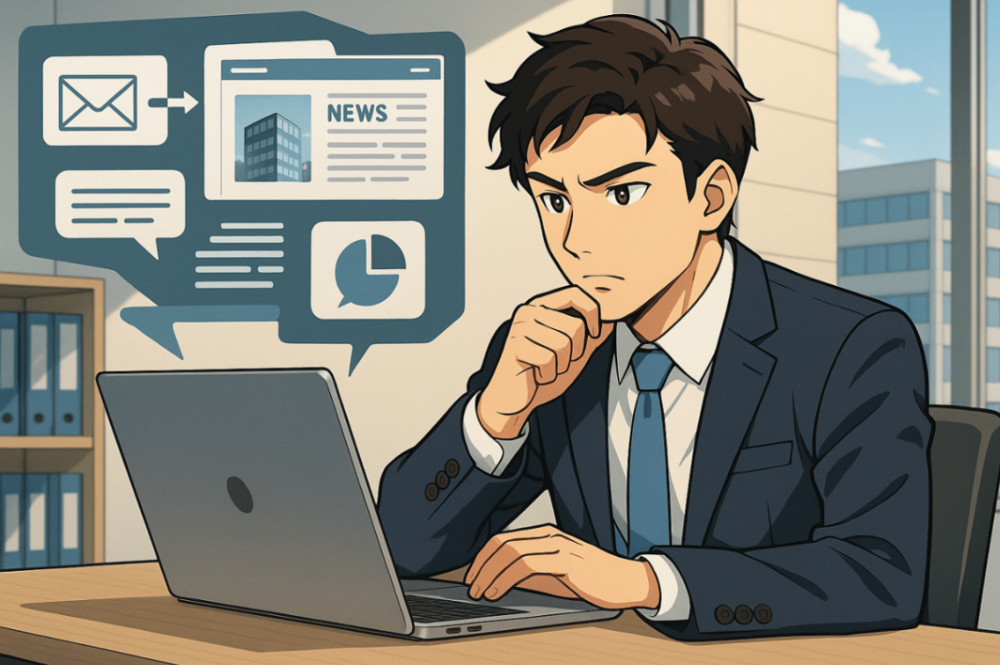

本記事では、営業・ビジネスパーソン向け革新的自動会議準備サービス「AppointmentAI」について、プロジェクト全体の概要や狙い、システムアーキテクチャ、コア技術の詳細、そして実際にどのような価値を現場にもたらすかを詳しく解説いたします。

##  Ⅰ プロジェクトが対象とするユーザー像と課題、課題へのソリューションと特徴

###  対象ユーザー像と現場課題

AppointmentAIが主に想定しているユーザーは、法人営業やBtoBビジネスで日々顧客対応を行う営業担当者、インサイドセールス、カスタマーサクセス担当などのビジネスパーソン層です。営業現場においては次のような悩みが多く聞かれます。

  * 会議や商談のたびに、相手企業の情報（業界動向や最新ニュース、課題など）を調べたり、アジェンダや提案資料、事前メールを準備するのに膨大な時間を要する
  * メール／カレンダー／自社CMS／外部サイトなど情報源が散在しているため、並行して情報収集する必要があり、顧客提案や本来業務への集中が阻害される
  * 準備工程が属人的で、標準化・効率化しづらく、業務データとしても残りにくい
  * 手作業による抜け漏れ・記載ミス、提案の成果にバラつきが発生しやすい

こうした課題に直面して、営業現場では **「作業負荷の大きい会議準備」** に頭を悩ませているのが実態です。  
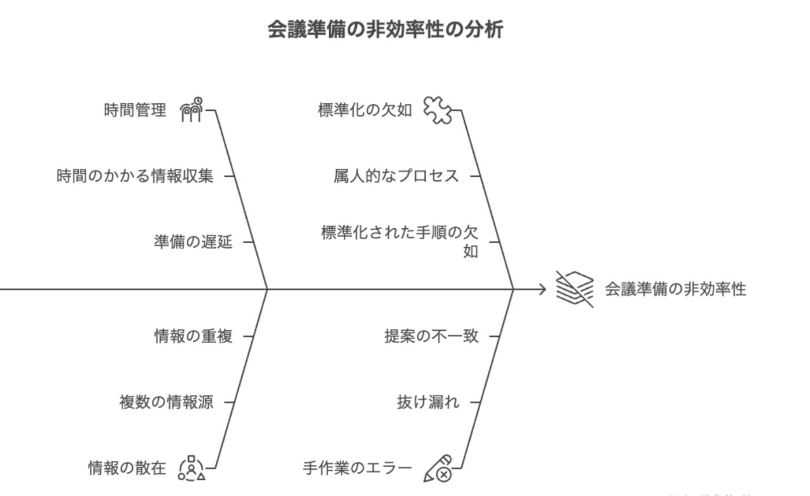

###  AppointmentAIによる解決アプローチ

AppointmentAIは、最先端AIによる「営業支援」の文脈で、以下のような一連プロセスの自動化・標準化を実現します。

  1. Gmail連携による案件/会議/顧客情報の自動抽出  
AIがメール内容から会議予定日、参加企業、キーパーソン、打ち合わせアジェンダなどを自動で抽出します。
  2. アポイント先企業の最新Webニュース自動収集  
調整アポイントごとにAIが関連企業や業界の最新情報をWebから自動取得します。
  3. 重要課題や業界トピックの自動要約  
得られたニュース等をAIが分析し、関連する業界動向・重要課題を要約抽出します。
  4. RAG（Retrieval-Augmented Generation）技術による自動提案生成  
外部情報と自社の製品サービス情報を組み合わせ、顧客ごとに最適な提案内容を自動生成します。
  5. 提案内容の自動送付  
生成した提案内容を、会議の開始前に営業担当へ自動送信します。  

###  特徴まとめ

**会議検出から提案内容の生成・送付まで全自動化**  
営業担当者は、調査・資料作成のルーチンワークから解放され、本来注力すべき「顧客との対話」「提案内容のブラッシュアップ」に集中できます。属人的な準備フローを標準化することで、誰が担当しても一定水準以上の準備が確保され、抜け漏れリスクを最小化できます。  

**自社/外部情報のRAG型連携により、最新の情報に基づいた顧客ごとにパーソナライズされた提案が可能**  
営業担当者は自ら膨大なニュースを読んで整理する必要がなくなり、常に最新かつ個別最適化された提案を届けることが可能になります。結果として、提案の質の均質化と、より顧客に刺さる提案の実現が期待できます。  
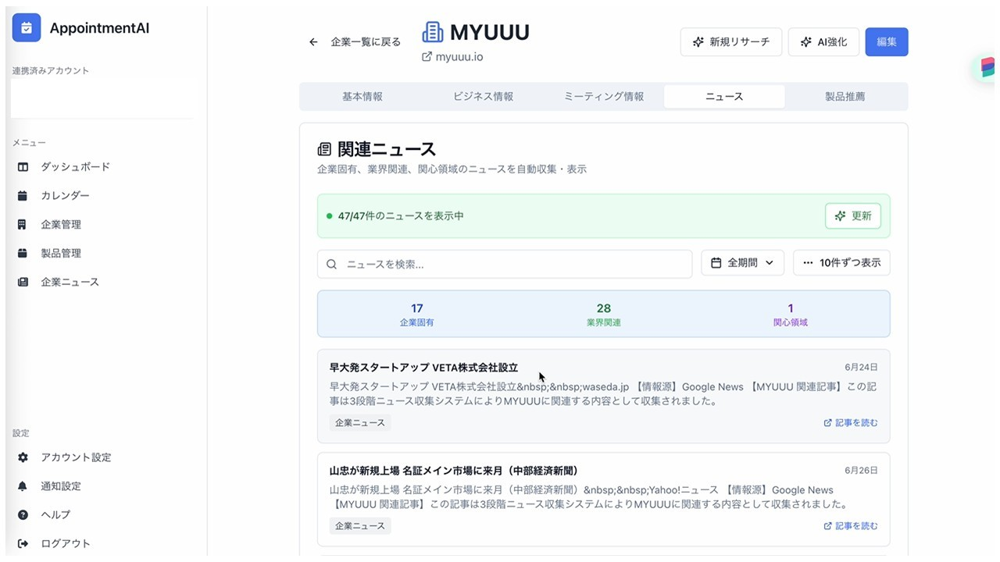

**GmailやGoogleカレンダーとシームレスに統合、既存ワークフローに馴染む設計**  
新しいアプリにログインしたり、手動で情報を移したりする必要がなく、いつものツールで自動的に必要な情報が整理されて届くため、現場の抵抗感を最小化できます。これによりツール活用の定着率が高くなり、DXの現場浸透が進みます。  
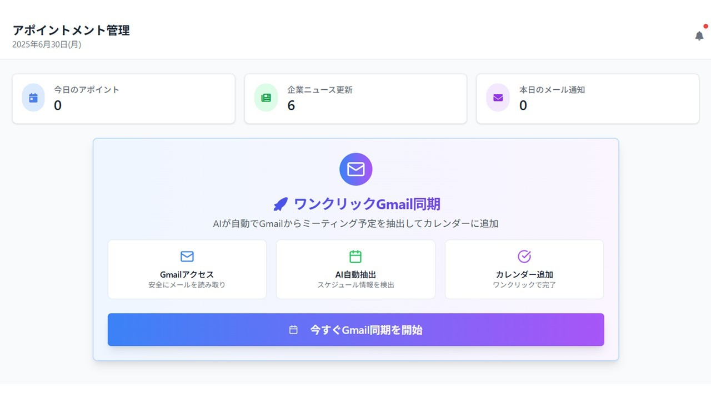

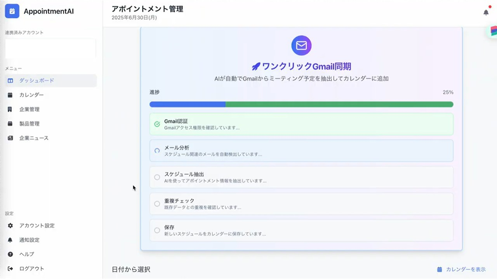

**ユーザーの準備時間短縮＆提案品質の均質化**  
準備時間を大幅に短縮することで、営業担当者は商談前に戦略を練ったり、顧客との対話により多くの時間を使えます。また、属人化しがちな提案内容をAIが一定のクオリティで自動生成するため、担当者のスキル差による成果のバラつきを抑えられます。  
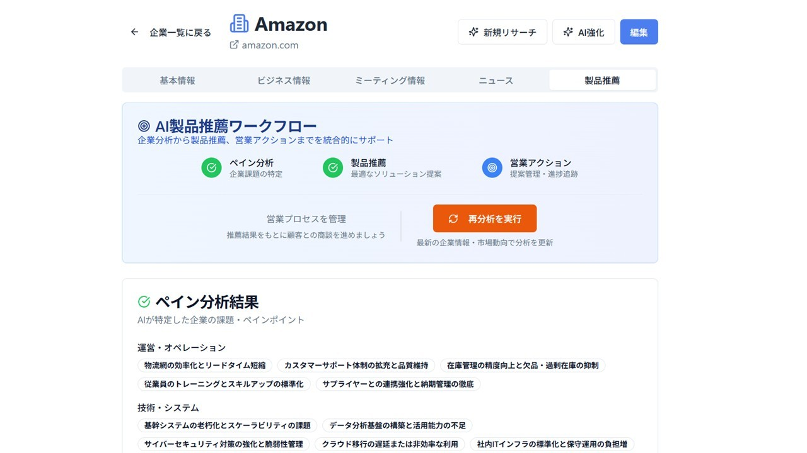

結果として、組織全体の提案力が底上げされ、再現性の高い成果を生みやすくなります。

##  Ⅱ システムアーキテクチャ図

以下に、AppointmentAIプロジェクトの構成全体像を示すシステムアーキテクチャ図を掲載します。  
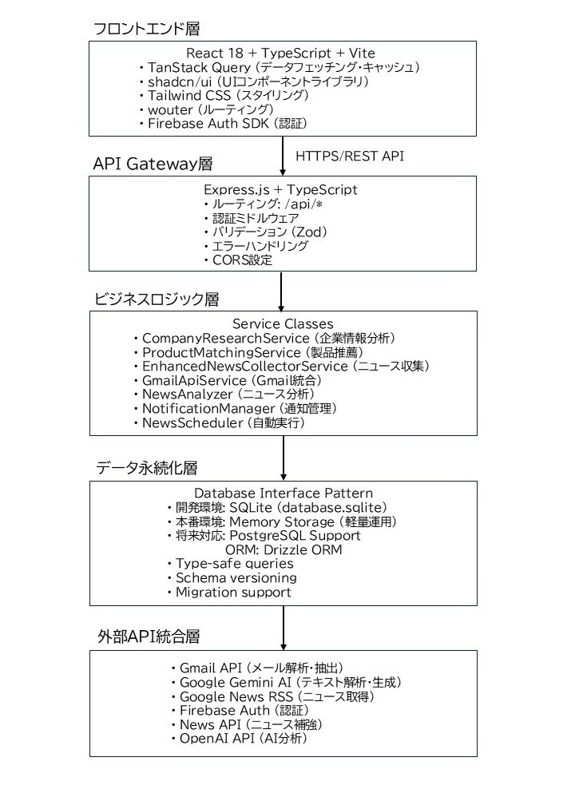

##  Ⅲ 開発背景・DXインパクト・導入メリット

###  開発の背景

営業DXの重要性が高まる中、営業担当者が本来注力すべき顧客対応に十分な時間を確保できていない深刻な現状があります。以下の統計データがこの課題の深刻さを明確に示しています。

  1. 営業活動時間の制約  
HubSpot Japan「日本の営業に関する意識・実態調査2024」によると、営業担当者が「顧客との商談、電話、メールなどコミュニケーション」や「顧客との商談の準備または終了後のフォローアップ」など、コア業務である顧客とのやりとりに使っている時間は平均して業務時間の54％程度にとどまっています。さらに、営業担当者は平均で「1日にあと25分」顧客とのやりとりに使う時間を増やしたいと考えています。
  2. 営業準備にかかる時間負荷  
商談準備に関する調査（株式会社UKABU）では、1商談当たりの営業準備にかかる時間について「30分以上1時間未満」が41.8％と最も多く、回答者の平均準備時間は約43分となっています。1日に商談が2件あれば1.5時間、3件あれば2時間の準備時間が必要になり、営業担当者の67％が「毎回は準備ができていない」状況にあります。
  3. 無駄な業務への時間配分  
同じくHubSpot Japanの調査では、営業担当者が働く時間のうち無駄だと感じる時間の割合は22.37％に上り、これは金額換算すると年間約9,802億円にものぼります。無駄と感じる業務として、社内会議（54.5％）、社内報告業務（38.4％）、日々の商談の移動時間（25.7％）が挙げられています。
  4. 会議・準備業務の効率化需要  
会議に関わる時間は約5時間（業務の10％）に及び、会議の準備にかかる時間や工数の削減が重要な課題となっています。さらに、営業準備の何らかの作業を代替させたいという回答は全体で83.3％に達しており、自動化への強いニーズが存在します。

こうした現場の実態を踏まえ、AppointmentAIでは以下を企画・開発方針の中核に据えました。  
**\- 準備/提案プロセスの標準化・自動化**  
**\- 情報の鮮度・正確性の担保**  
**\- 営業ノウハウの全社的な共有・再現**  
**\- 顧客志向の徹底と提案精度の向上**  
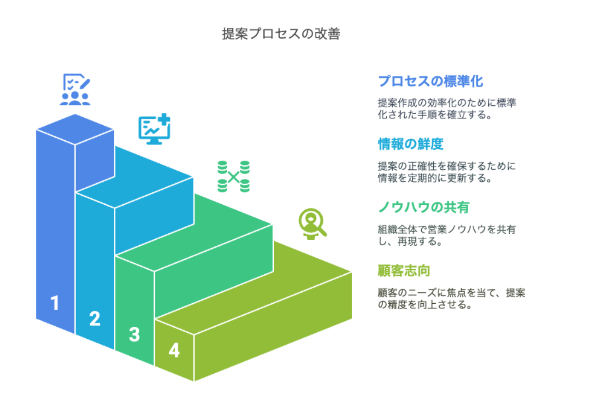

###  DX導入による具体メリット

**時間効率と生産性の劇的向上**  
従来平均「約43分」かかっていた1商談当たりの会議準備作業を大幅に短縮し、余剰時間を新規案件や戦略策定などの「コア業務」にシフトできます。

**情報鮮度＆提案クオリティの向上**  
業界ニュースや企業の変化をリアルタイム取得することで、テンプレート提案ではなく、顧客ごとに現状最適な提案を自動生成できるようになります。

**業務プロセスの均一化と再現性**  
属人化しやすい会議準備から初期提案プロセスを標準化し、誰でも高品質な準備が可能となります。

**エンドユーザーにもたらす変化**

  * 営業担当者の単調作業負担解消により、顧客対応に集中でき、提案力が向上
  * 組織としてナレッジ蓄積・ペーパーレス推進・人材育成にも寄与
  * 顧客企業には最新トピックや固有課題に即した価値ある提案を届けることが可能

###  技術詳細：RAG技術の実装ポイント

AppointmentAIでは、外部・内部の各種データソースを統合活用し、自動提案生成を実現しています。主なプロセスは以下の通りです。

  1. 入力情報の自動収集  
Gmail連携を通じて「会議予定日・参加企業・担当名・議題」等の情報を自動抽出。
  2. 関連ニュース・外部情報の自動取得  
抽出した企業名や業界データからWebの最新ニュース/動向を自動収集。
  3. AIによる課題・トピック自動要約  
複数情報ソースをAIが統合分析し、商談相手の重要課題や注目トピックを要約・抽出することで抜け漏れを防止。
  4. 自社サービス・ソリューション動的マッチング  
自社ナレッジ／製品FAQなどの内部情報と外部情報（顧客課題・業界状況等）をRAG技術で組み合わせ、自動で最適な提案内容・アジェンダ案を生成。
  5. 提案・リマインドの自動化  
生成内容を各会議の案件ごとにカスタマイズし、Gmailなどと連携して自動送信や通知を実施。  
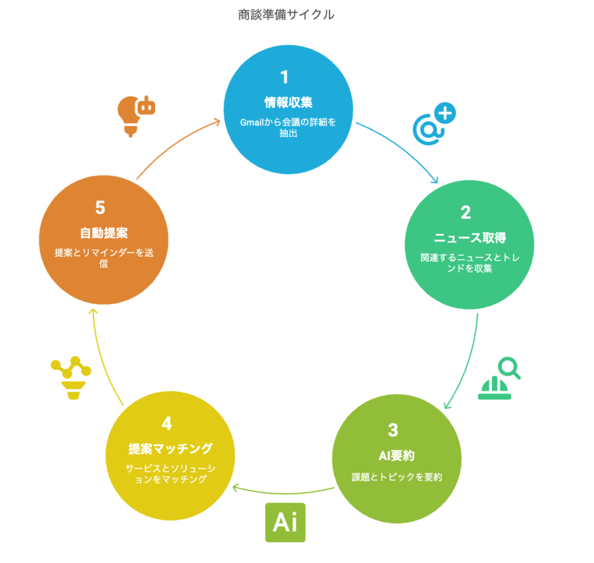

###  競合比較・AppointmentAIの差別化ポイント

近年、営業支援ツールは多くの企業に導入されており、顧客データ管理やメールテンプレート送信などといった営業プロセスの一部自動化はすでに一般化しています。しかし多くの既存ツールは、あくまで担当者自身が情報収集や提案内容の作成を行う前提など、AIを使っても汎用的な自動文章生成に留まり、顧客固有の最新動向まではカバーしきれないという限界があります。

そのため、顧客ごとに異なる業界ニュースの収集、社内ナレッジとの組み合わせによる個別最適化、会議準備から資料化・送付までの一気通貫の自動化などを実現できるソリューションは、依然として不足しているのが実情です。

「会議検出〜情報取得〜提案生成〜送付」までをシームレスに自動化し、かつRAGとGoogle Workspace（Gmail/カレンダー等）に深く統合している点がAppointmentAIの大きな差別化ポイントとなっています。  
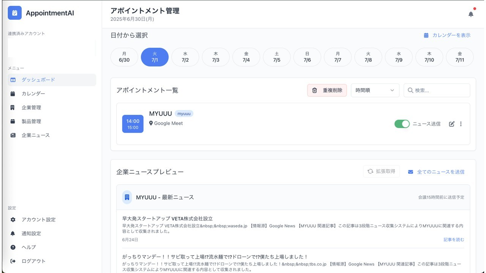

####  AppointmentAI活用の利点

  1. 会議検出〜提案送付までのフルオートメーション
  2. RAG技術によるパーソナライズ性
  3. Google Workspaceとのネイティブ統合

全プロセス自動化＋現場運用データと社内ナレッジの連携により、高度なカスタマイズ性・拡張性・業界特化度を実現します。  
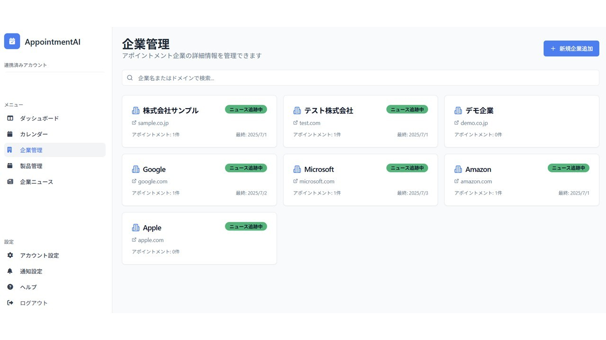

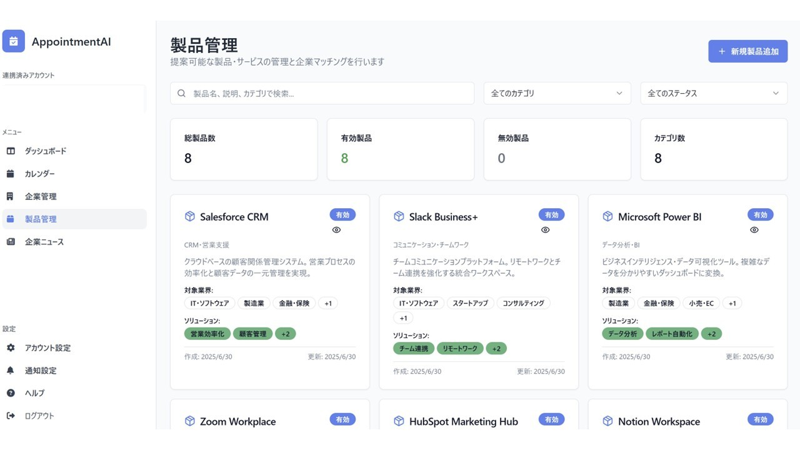

##  まとめ

AppointmentAIは、営業現場のDXを一段引き上げる画期的サービスです。  
煩雑なアポイント準備や分散した情報収集から担当者を解放し、顧客ごとに最新かつ最適な提案を自動生成。営業担当者が「商談の本質」に専念できる環境を創出します。  

**\- 計4〜5時間かかっていた準備が1時間未満に短縮**  
**\- 情報の鮮度・提案精度が大幅に向上**  
**\- 属人化解消や標準化による組織活性化・ナレッジ蓄積が実現**  
**\- Gmail/Googleカレンダー等への高い親和性・現場フィットなUX**  
**\- チーム／組織全体での営業力底上げ・DX促進に直結**

営業DXやコア業務集中を目指す企業・営業組織の皆様に、AppointmentAIがもたらす変革をぜひご体感ください。
