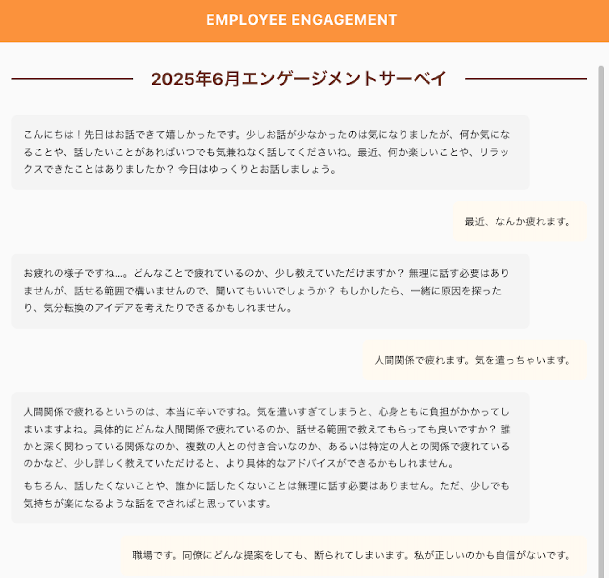
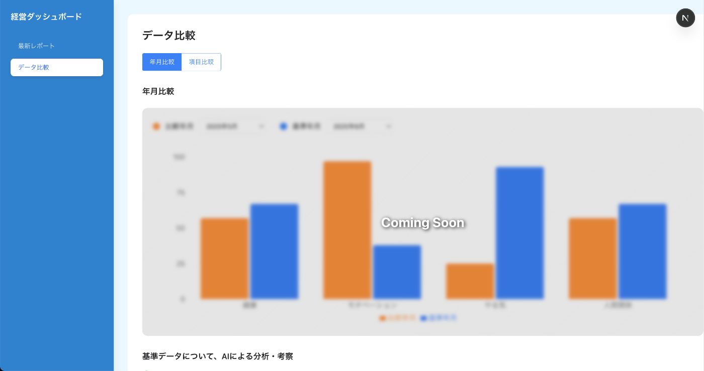
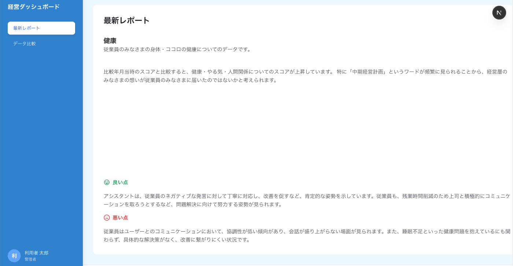
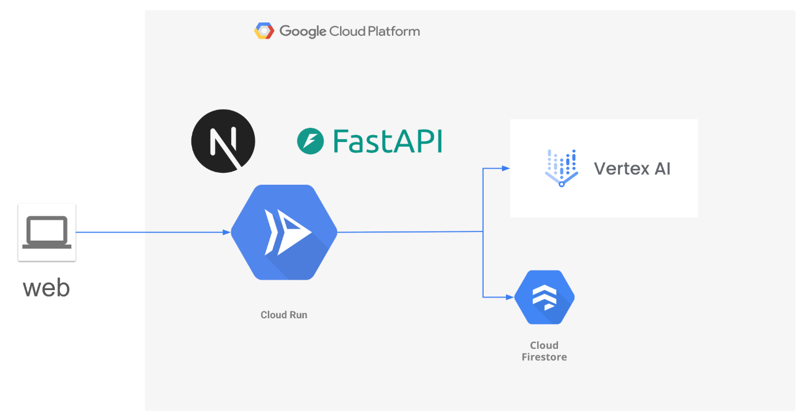
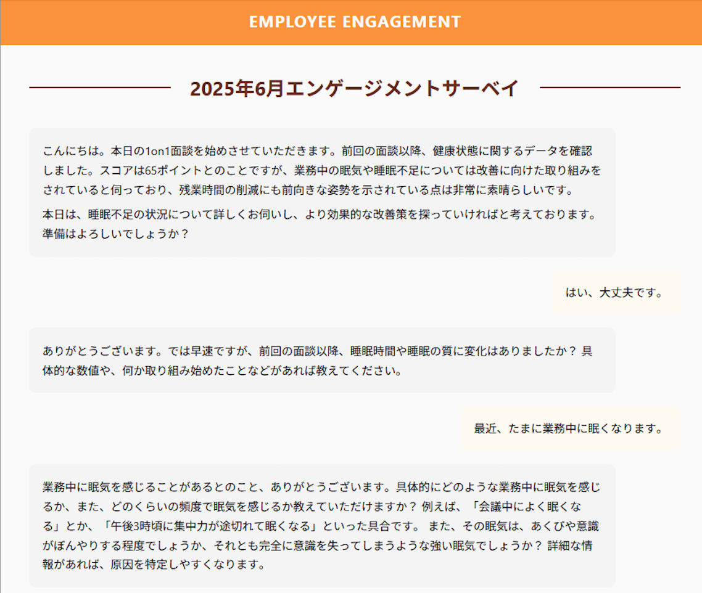

##  １.はじめに

####  その「本音」、言えていますか？

「この業務、もっとこうすれば効率的なのに・・・」「最近、チームの雰囲気が少し悪い気がするな・・・」  
日々の仕事でふと頭をよぎる、小さな気づきや懸念。しかし、「波風を立てたくない」「どうせ聞いてもらえない」という諦めから、その**声にならない声は、誰にも届くことなく消えていきます** 。 私たちは、大企業から数名のスタートアップまで、複数の経営層へのインタビューを通じて、この問題が、**従業員の仕事への熱量を静かに奪い、会社への貢献意欲が徐々に失われていく「負のサイクル」を生んでいる** ことを確信しました。従業員は本音を語れず、経営層は本音が見えない。その結果、従業員個人と会社の信頼関係が少しずつ失われていくのです。 **この根深く、しかし極めて人間的な課題を解決したい** 。その想いから、AIエージェント「ECHO」は生まれました。

##  ２.プロダクトデモ

ECHOがどのような体験を提供するのか、まずはこちらのデモをご覧ください。  
<https://www.youtube.com/watch?v=XJeaoAqpfNM>

##  ３.「ECHO」が解決する課題とソリューション

###  ユーザー像と課題

「ECHO」が対象とするのは、組織の中に存在する、**すれ違いながらも「会社をより良くしたい」という同じ想いを共有する、従業員と経営層** です。  
従業員は、かつて上司や人事部などを通じて、会社の課題や自身の懸念を真摯に伝えてきました。しかし、その声が実を結び、働く環境が目に見えて変わる経験をすることなく、いつしか**伝えても意味がないという諦めや無力感** が、本音を語る上での心理的な壁となっています。 一方で経営層もまた、**サーベイ結果や離職率といったデータから組織の課題を認識し、危機感を募らせています** 。しかし、その数字の裏にある**従業員の「本音」や、問題の根本原因までを掴みきれていないため、打ち出す施策が空回りし、有効な解決策を見いだせない** でいます。 この状況が生み出す課題は、以下の二点に集約されます。

  * 従業員は、自分の声が「働きやすい職場づくり」に繋がっている実感を得られず、日々の仕事へのやりがいや、会社への貢献意欲を失っていきます。
  * 経営層は、従業員の「本音」という深層的な課題を把握できず、どうすれば社員がもっと活き活きと働けるのか、的確な舵取りができない状態に陥っています。

###  ソリューションと特徴

私たちは、この両者の間に存在する、組織を蝕む構造的な課題を解決するため、AIエージェント「ECHO」を開発しました。  
「ECHO」は、従業員が安心して本音を語れるAIとの対話を通じて、**何が従業員のやる気を削ぎ、何が働きがいを高めるのかを因果関係レベルで分析** 。経営層には従業員の本音から浮かび上がる気付きを可視化し、戦略的意思決定を支援するダッシュボードを提供し、組織内に信頼の好循環を生み出すエコシステムです。 最大の特徴は、アンケートやサーベイが「点」のデータであるのに対し、「ECHO」は**AIとの「対話」を通じて、感情や文脈を含んだ「線」と「面」のデータを収集・分析** する点にあります。これにより、これまで見えなかった課題の本質に光を当てます。

##  ４.「ECHO」の主な機能

「ECHO」は、以下の３つの主要な機能で、従業員と会社の「信頼のサイクル」を回します。

####  1\. 心理的安全性の高い「対話」機能

従業員は、完全に匿名性が保証された環境で、「健康、自己成長実感、待遇、人間関係、承認と尊重、組織風土・文化、公平性・透明性、労働環境、権限移譲・自律性」等のテーマから選択してAI「ECHO」とのチャット形式による対話を行います。  
AIは**評価や判断を挟むことなく、ユーザーの発言に共感的に応答** します。これにより、従業員は他者の目を気にすることなく、日々の業務で感じている課題や改善提案、個人的なキャリアへの想いなどを安心して言語化できます。  

####  2\. 課題の本質を捉える「分析・可視化」機能

収集した対話データは、AIによって分析されます。単なるキーワード抽出に留まらず、Vertex AI (Gemini) の能力を活かして**課題の根本原因を推定** します。  
これらの洞察は、経営層向けのダッシュボードにグラフ等で可視化され、**組織の健康状態を直感的に把握** できます。  

####  3\. 次のアクションに繋げる「示唆・提案」機能

ECHOは、分析結果を提示するだけでは終わりません。特定された課題に対し、経営層には組織全体の制度や文化に関する**改善アクションの具体的なヒントを提供** します。これにより、**分析から具体的な行動への橋渡し** を行います。  

##  ５.アーキテクチャ ＆ 技術スタック

###  アーキテクチャと技術選定

ECHOは、Google Cloudの最新AIサービスと、迅速な開発基盤を組み合わせ、スケーラビリティと高いUXを両立するアーキテクチャを目指しました。  

###  技術スタックと採用理由

  * **Cloud Run** ： 迅速なデプロイと、トラフィックに応じたスケーラビリティを両立できるため、サーバレスな実行環境として採用しました。
  * **Cloud Firestore** ： 対話データや分析結果を柔軟なスキーマでリアルタイムに扱えるNoSQLデータベースとして、開発速度と拡張性を両立するために選択しました。
  * **Vertex AI (Gemini API)** ： プロンプトエンジニアリングによる高度な対話生成と、対話内容の要約・分析という、本プロダクトの心臓部を担うために不可欠と判断しました。
  * **Next.js** ： コンポーネントライブラリの豊富さと、モダンな開発体験を提供してくれることから、UIフレームワークとして採用しました。

##  ６.技術的な挑戦と工夫した点

本ハッカソンでは、限られた時間の中で**最小のコストで最大の価値を生み出す** ことを常に意識しました。音声入力などの魅力的な機能は敢えてスコープから外し、課題の核心である**本音を引き出す対話と、その分析に技術的な挑戦を集中** させました。

####  1\. AIに「心」を宿すプロンプトエンジニアリング

開発初期、単純な命令では、AIは事務的な応答しか返さず、従業員の本音を引き出す「壁打ち相手」には到底なりえませんでした。  
  
この課題を解決するため、私たちはプロンプトエンジニアリングに多くの時間を費やしました。具体的には、Geminiへのプロンプトに以下の要素を組み込みました。

  * **ペルソナ設定** : 「あなたは、相手の話を決して否定せず、深く共感する姿勢を持つ、経験豊富な産業カウンセラーです。」といった詳細な役割を与える。
  * **Few-shotプロンプティング** : 「もしユーザーが『仕事に飽きた』と言ったら、『そう感じていらっしゃるのですね。具体的にどのような点にそう感じますか？』と応答してください」のように、共感的な応答の具体例を複数提示する。
  * **思考の連鎖 (Chain of Thought)** : ユーザーの発言の裏にある感情や意図を段階的に推論させ、より人間味のある応答を生成させる。

さらに、これらのプロンプト設計をLangChainを用いて構造化し、ユーザーの発言の文脈に応じて最適なプロンプトを動的に選択する対話チェーンを構築することで、ECHOは**無機質なAIから、信頼できるパートナーへと進化** しました。  

####  2\. FirestoreとCloud Functionsによるリアルタイム分析基盤

対話データをリアルタイムで分析し、ダッシュボードに反映させる仕組みも工夫の一つです。Firestoreの onWrite トリガーを持つCloud Functionsを実装しました。これにより、従業員が対話を終えると同時に、そのデータが匿名化・分析され、最新の組織状態を把握することが可能になります。

##  ７.今後の展望

このハッカソンは始まりに過ぎません。今後は以下の機能開発を通じて、ECHOをさらに進化させていきます。

  * **分析基盤の構築と深化** ： 現在のFirestoreベースの分析に加え、BigQueryを導入し、より大規模で複雑な時系列分析や相関分析を可能にします。これにより、経営層はさらに精度の高い意思決定ができるようになります。
  * **より多角的な感情分析機能の実装** ： Natural Language APIを組み合わせ、喜び、悲しみ、怒りといった基本的な感情に加え、期待、不安といった複雑な感情も分析し、インサイトの質を高めます。
  * **ハンズフリーの対話体験** ： Text-to-SpeechとSpeech-to-Textを実装し、チャット形式だけでなく音声対話にも対応することで、ユーザーが思考を止めずに、より自然に本音を語れる体験を提供します。
  * **顔の見える対話AI** ： FlutterとRiveを活用し、AIに表情や仕草を実装します。言葉だけでなく非言語的な表現でもユーザーに寄り添い、さらなる心理的安全性を醸成します。

##  ８.まとめ・謝辞

今回のハッカソンを通じて、私たちはAIが単なる効率化ツールではなく、人と人、人と組織の間に「信頼」という最も重要なものを再構築するための触媒になり得ることを強く感じました。ECHOのコンセプトが、同じような課題を抱える企業の皆様にとって、何か一つでも希望の光となれば幸いです。 このような素晴らしい創造の機会を与えてくださったGoogle Cloud様、Zenn様に心より感謝申し上げます。

最後までお読みいただき、ありがとうございました。
