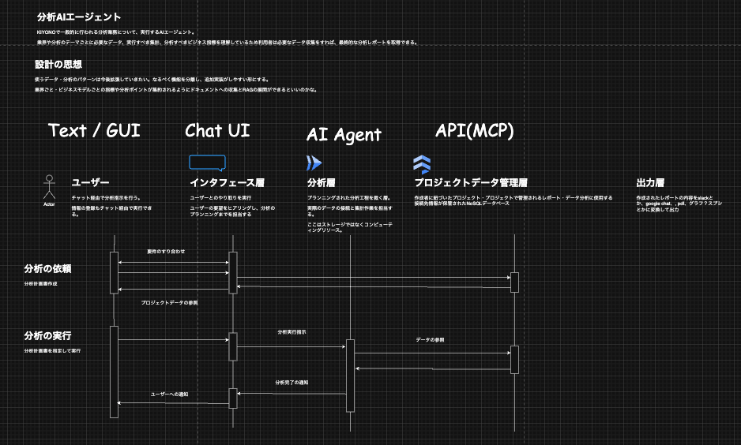
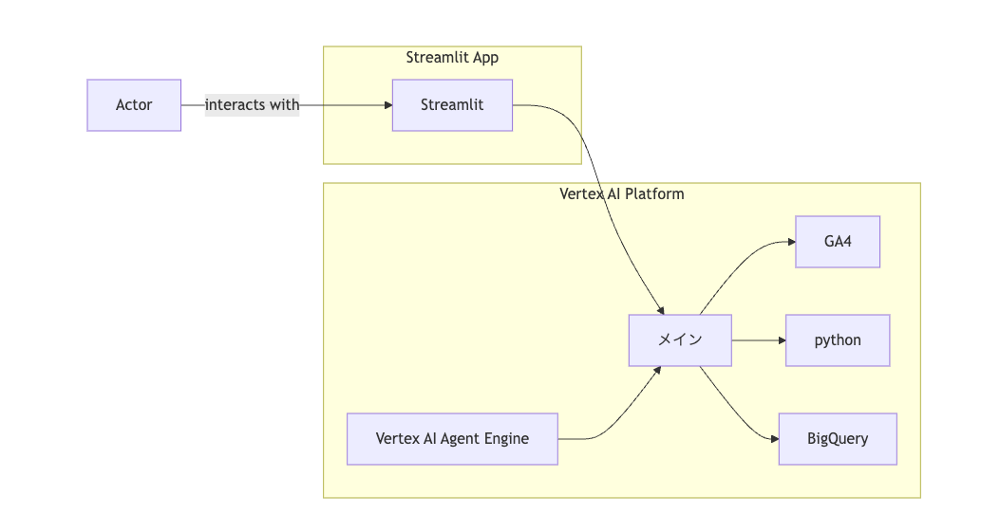

#  1\. はじめに（導入）

データ活用がビジネス競争力の源泉となる現代において、現場のデータ分析業務はかつてないほど重要性を増しています。しかし現実には、「**分析は一部の“できる人”しか扱えない** 」「**分析レポートの作成に毎回多くの時間がかかる** 」といった課題が各所で顕在化しています。  
こうした状況は、属人化や工数過多という構造的な問題に起因しています。

本プロジェクトでは、これらの問題に対して「AIエージェントによる分析支援」という新たなアプローチで挑戦しました。データ分析の民主化と業務効率化を同時に実現する仕組みとして、我々が開発したのが「**AI-Based Data Analyst** 」です。

#  2\. 解決したい課題とユーザー像

**このプロダクトが支援するのは、次のようなユーザーです。**

  * 日々データと向き合いながらも、分析ノウハウが属人化しているアナリスト
  * 分析のたびにデータチームへ依頼を繰り返し、タイムロスが生じている企画職やマネジメント層

現場では、分析設計・データ加工・集計・示唆出しといった工程の多くが手作業・人力に依存しており、結果として以下のような課題が発生しています。

  * 担当者によって分析の質や視点にばらつきが出る（属人化）
  * レポート作成のたびに同じ集計を繰り返す（再利用性の欠如）
  * 分析者が足りず、分析結果が意思決定に間に合わない（リードタイム過多）

これらの課題は、単なる業務フローの効率化では解決しきれず、より構造的なアプローチが求められています。

#  3\. 提案するソリューションとその特徴

我々の提案する「AI-Based Data Analyst」は、AIエージェントが一貫してデータ分析プロセスを支援・代行するシステムです。

コアコンセプトは以下の通りです。

  * 標準化と均質化：属人化しがちな分析フローを、AIが統一的かつ再現可能な手順で実行
  * 工数削減とスピード化：データ取得・集計・示唆出しを自動処理し、意思決定を加速
  * 拡張性と柔軟性：新しいデータソースや出力形式にも対応できるプラグイン型構造

AIエージェントが単なるツールでなく、分析パートナーとして機能することを目指しています。

#  4\. システム構成とアーキテクチャ図

本システムは、以下の4層構造で設計されています。

**データ保管層** ：  
各種データソースやDBからの情報を管理・取得する層。GA4やBigQueryなど外部ソースとの連携もここに集約されます。

**メタデータ層** ：  
分析対象のプロジェクトや指標定義、集計ロジックなどを構造化して保持。人による属人的な定義を明示的に記述・共有可能にします。

**分析層（AIエージェント）** ：  
受け取った指示をもとに分析計画を立て、SQLやPythonコードを生成・実行し、分析結果をまとめます。

**出力層** ：  
生成された分析レポートや結果データを、チャット上の応答、PDF、スライド、APIなどの形式で出力します。

中心技術には、Google Cloud の Vertex AI Agent Engine や google-adk ライブラリを活用しています。これにより、自然言語による指示から分析プランの策定、実行、レポート生成までを一貫して処理できます。

ユーザーインターフェースはチャット形式を採用しており、直感的な会話ベースで指示を出せるUXを実現。また、GUI上で接続されたデータソースの選択・追加・編集も可能にすることで、非エンジニア層の利用も想定した設計としています。

#  5\. 実装の工夫と技術的チャレンジ

本プロジェクトでは、AIによる分析支援というコンセプトを実現するために、以下のような設計上・技術上の工夫を取り入れました。

**プロジェクト／レポート／集計モデルの抽象設計**  
業務で使われる分析は一度きりの単発的なものではなく、特定の定義・粒度・ロジックに基づいて繰り返し実行されるものです。そこで我々は、次のような構造でオブジェクトを抽象化しています：

  * プロジェクト：業務ごとの集計ロジック・KPI定義を集約する単位（例：○○事業部の月次レポート）
  * レポート：プロジェクトに基づいて生成されるアウトプット。複数のセクション・集計から構成
  * 集計：SQLまたはPythonによる実集計処理とその結果をペアで保持

この設計により、同じ構造の分析を何度でも再利用可能にし、属人性の排除と再現性の担保を実現しています。

**チャット型インターフェースとAIエージェントの連携**  
ユーザーが自然言語で「売上の月次推移を見たい」「今月のトレンドを教えて」などと入力すれば、AIがその意図を解釈し、

  1. 適切なプロジェクトを特定し
  2. 集計・分析計画を立案し
  3. 分析実行とレポート作成まで自動で実施

という一連の流れが対話的に実行されます。  
エージェントは会話履歴やプロジェクト情報をもとに、文脈に即した回答・提案を行えるように設計されています。

**SQL/Pythonコードの生成と再利用性**  
各集計処理は、AIエージェントがユーザーの要求を元に自動でSQLまたはPythonコードを生成して実行します。このコードはプロジェクト内に保存され、

  * 他メンバーによる確認・再利用
  * 類似分析への転用
  * 一部変更による横展開

が容易に行える構造となっています。これにより、属人化しやすい「なんとなく作った集計」のブラックボックス化を防ぎ、組織内の知見共有も促進されます。

#  6\. デモ動画のご紹介

<https://youtu.be/_5JgtSAB5hM>

**見どころ**

  * チャットUIで自然言語による分析依頼が可能：非エンジニアでも簡単に操作できます
  * 分析計画書の自動生成機能：構造化されたプロセスにより、分析の意図や背景も明確に可視化
  * 即時性のあるレスポンス：分析結果が対話中に得られ、意思決定までのリードタイムを短縮

#  7\. ユースケースと導入効果

本システムは、業界を問わず「分析の属人化」「KPI定義の不統一」「レポート作成の負荷」といった共通の課題に対応できるよう設計されています。

**分析定義が現場・部門ごとに異なるケース**

  * 小売業：売上や客数の定義がキャンペーン除外対象や返品処理の扱いによって異なる
  * 金融業：アクティブユーザーの基準が取引頻度や口座残高などで複雑に定義される
  * SaaS業界：LTVや解約率の計算方法がチームごとに異なる、など

AIエージェントが分析プロセスと定義を構造化することで、こうした“定義の揺らぎ”を吸収し、共通基盤として管理・再利用することが可能になります。

**属人性の排除による業務継続性の確保**  
特定の分析が一部の担当者に依存している場合、引き継ぎや離職時に大きなリスクが生じます。本システムでは、分析計画やロジックがすべてプロジェクト単位で保存され、他者が再利用・検証できるようになっているため、組織としての継続性が保たれます。

**分析リードタイム・コミュニケーション工数の削減**  
これまで人力でやりとりしていた「分析依頼→要件すり合わせ→実行→レポート提出」という一連の流れを、AIエージェントがチャット形式で一気通貫に対応することで、数日〜1週間かかっていた作業が実質数分〜数時間で完了するケースも想定されています。

#  8\. 今後の展望と広がる可能性

本プロジェクトは、現在実装している機能群に加え、さらなる発展性を視野に入れています。AIエージェントによる分析支援の価値を最大化するために、以下の機能強化や適用範囲の拡大を計画しています。

**未実装機能の開発予定**

  * ユーザー管理機能：複数ユーザーでプロジェクトを共有・共同編集するためのアクセス制御
  * レポート出力管理機能：レポートの出力形式や送信先（メール、Slackなど）をカスタマイズ
  * プロジェクトへのユーザー招待機能：分析チームや関係者をプロジェクトに招待し、タスク共有を促進
  * 権限管理：ユーザーごとに閲覧・編集・実行の可否を設定し、セキュリティと統制を両立

**データソース連携の強化**  
今後は、社内外に存在する多様なデータソース（CRM、MA、ERPなど）との連携を強化し、より広範な分析ニーズに応えられる体制を整えていきます。これにより、各現場で利用される業務データをフレキシブルに分析対象とすることが可能になります。

**適用領域の拡大**

  * 経営企画部門：中長期計画や月次レポートの自動生成により、戦略立案を支援
  * 営業部門：見込み顧客のセグメント分析やパフォーマンス比較などの自動分析により、行動改善を促進
  * マーケティング部門：キャンペーン結果の分析やユーザー行動の可視化を迅速に実施

これらの展望を通じて、「AI-Based Data Analyst」は単なるツールではなく、企業の意思決定そのものを支える“インテリジェントな分析基盤”へと進化していくことを目指します。

#  9\. おわりに（まとめ）

本プロジェクト「agent-based-data-analyst」は、Hackathonを通じて“AIエージェントがビジネス現場の即戦力になる未来”を具体的なプロダクトとして形にすることを目指しました。

属人化・工数過多・分析結果のばらつきといった課題は、企業規模や業界を問わず多くの組織が直面している問題です。我々のソリューションは、それらを構造的に解消するための土台となる設計と仕組みを持っています。

開発を進める中で、我々自身もAIエージェント活用の可能性を体感し、チームとして多くの学びと成長を得ました。また、今後の実装拡張や運用展開に向けて、多くの改善ポイントとポテンシャルも見えています。

この記事が、同様の課題に向き合う読者や、AIを業務に取り入れたいと考えている方々のヒントになれば幸いです。そして審査員の皆さまには、本取り組みの可能性と真剣度をご評価いただければ嬉しく思います。

最後までお読みいただき、ありがとうございました。
