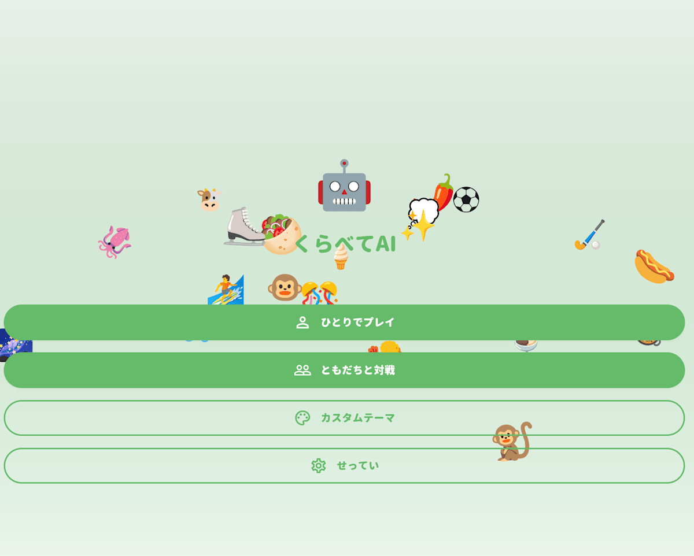
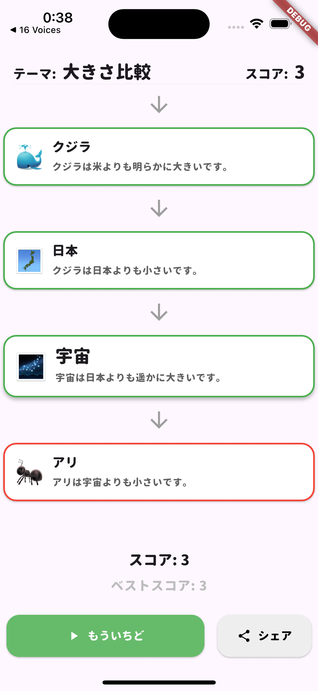

#  はじめに

!

本記事は「[`第2回 AI Agent Hackathon with Google Cloud`](https://zenn.dev/hackathons/google-cloud-japan-ai-hackathon-vol2?tab=overview)」の提出記事になります！

「より大きいものは何？」「より重いものは何？」そんなシンプルな比較ゲームに、AI による判定機能を組み合わせてみました。

そして今回開発した「`くらべてAI`」は、ユーザーがさまざまなテーマ（大きさ、重さ、歴史、かわいさなど）で連想ゲームを楽しみ、AI（Firebase AI + Gemini）が判定を行う新感覚のゲームアプリです。

なおこのゲームの着想として「なにがじゃんけんのグーに勝てるか？」というゲームの[What Beats Rock](https://apps.apple.com/us/app/what-beats-rock/id6740056293) を参考にしました。  
シンプルなひかくだけでなく、新しい角度でのテーマやカスタムテーマ、オンライン対戦、新しいテーマなどが設定できます。

#  紹介動画

<https://www.youtube.com/watch?v=SQamg7_eBPY>

web 版デモ URL: <https://ai-comparison-challenge.web.app/>  
（従来はアプリ想定のためレイアウトが一部見にくい部分があります。デモ版のため公開停止する可能性があります）

##  ターゲットユーザーと解決する課題

###  対象ユーザー像

**メインターゲット**

  * スマートフォンでちょっとした空き時間を楽しみたい人たち
  * こどもの知識欲を刺激したい親
  * 知識系・クイズ系ゲームが好きな人

###  解決する課題

  * 正解が存在するゲームの限界  
従来のクイズゲームは正解が決まっており、覚えてしまうと楽しさが減少してしまいます。

  * 主観的判定の難しさ  
「かわいさ」や「おもしろさ」といった主観的なテーマでは、公平な判定が困難でした。

###  ソリューションと特徴

  * AI 判定システム
  * 多様なテーマ設定
  * シンプルな操作性
  * リアルタイム対戦機能

#  システムアーキテクチャ

##  各コンポーネントの役割

###  Firebase Services

**🔏Firebase Auth (匿名認証)**

  * **ユーザー識別** : 匿名ログインによる手軽なユーザー管理
  * **セキュリティ** : Firestore ルールとの連携でデータアクセス制御
  * **ユーザー体験** : アカウント作成不要でゲームをすぐに開始可能

**🗄️ Cloud Firestore (リアルタイムデータベース)**

  * **ゲームデータ** : 対戦ルーム、マッチング要求、カスタムテーマの保存
  * **リアルタイム同期** : 対戦相手の回答や状態変更をリアルタイムで反映

**⚡ Cloud Functions (サーバーサイドロジック)**

  * **マッチング処理** : プレイヤー同士の自動マッチングとルーム作成
  * **オンライン対戦時のゲーム進行管理** : 対戦開始・終了の制御とスコア計算
  * **データ整合性の担保** : Firestore トリガーによる自動的なデータクリーンアップ

**🌐 Firebase Hosting (Web ホスティング)**

  * **Web ページ配信** : 基本的には App 想定なのでデモ配信用に使っています

**🤖 Firebase AI Logic (Vertex AI)**

  * **回答判定** : Gemini 2.0 Flash を用いてユーザーの回答に対する文脈を理解した柔軟な判定をします

#  技術的概要

##  判定ロジック

様々なテーマに対応できるように以下のように変数としてシステムプロンプトを受け取れるようにしています。

**● システムプロンプト**
    
    
    ## 役割
    - ユーザーが入力した答えが、前の答えより指定されたテーマで「上位」かどうかを判定
    - 判定結果とその理由を分かりやすく説明
    
    ## ルール
    - プレイヤーが入力した「回答」が、「Previous guess」に対して「${theme.judgeLogic}」かどうかを判定します。
    - ${theme.specificRules ?? ''}
    
    ## 判定例
    あなたの判定の一貫性を保つため、以下の例を参考にしてください。
    $examples
    
    ## 出力必須形式
    {"result": "OK" | "NG", "reason": "判定理由", "emoji": "結果絵文字"}
    

**● プロンプト**
    
    
      final prompt = [
          Content.text(
            'A: $newGuess は B: $compareTarget よりも ${gameTheme.judgeLogic} ですか？',
          ),
          Content.text('A: $newGuess に合う絵文字を一つ返してください。'),
        ]
    

##  Response Schema による判定の安定化

本プロジェクトでは、Firebase AI の [Response Schema](https://firebase.google.com/docs/ai-logic/control-content-gen?hl=ja) 機能を活用して、LLM の生成を制御することで一貫したレスポンスを保証しています。

###  実装されているスキーマ定義

`judgement_schema.dart`:
    
    
    import 'package:firebase_ai/firebase_ai.dart';
    
    final responseSchema = Schema.object(
      properties: {
        'result': Schema.enumString(
          enumValues: ['OK', 'NG'],
          description: '比較の結果。OKまたはNG。',
        ),
        'reason': Schema.string(description: '比較結果の理由。'),
        'emoji': Schema.string(description: '回答を表現する絵文字一つ。'),
      },
    );
    

###  AI 設定での適用

`judgement_repository.dart` での実際の使用例：
    
    
    final model = _aiService.getGenerativeModel(
      modelName: 'gemini-2.0-flash',
      systemInstruction: _buildSystemInstruction(gameTheme),
      generationConfig: GenerationConfig(
        temperature: 0.5,
        maxOutputTokens: 150,
        responseMimeType: 'application/json',
        responseSchema: responseSchema, // スキーマによる構造化応答の強制
      ),
    );
    

このように Schema を用いることでフロントエンドの安全な型変換が保証されたり、一貫した判定結果を得られることができます。  
プロンプトインジェクション等の予期しない入力による攻撃に対しても一定のガードレールを引くことできます。

##  オンライン対戦での AI 判定フロー

オンライン対戦では、Firestore によるリアルタイム同期と Firebase AI 判定を組み合わせたやりとりをしています。  
厳密なリアルタイム性は必要ないため簡易的に Firestore を用いてデータをやり取りしています。  
プレイヤーはそれぞれゲームのデータに関するドキュメントをリッスンしていてデータに更新があったときに変更を感知して UI が動的に更新されます。

  * ユーザーが回答を送信すると即座に UI を更新
  * AI 判定完了を待たずに「判定中...🤔」状態を表示
  * 相手プレイヤーにも即座に判定中状態を通知

##  Firebase Functions によるマッチングアルゴリズム

フレンド対戦機能では、Firebase Cloud Functions + Firestore を活用したマッチングシステムを実装しています。  
なおフレンド対戦は 1 対 1 の対戦で交互に回答をしていくルールです。

###  マッチングアルゴリズムのシーケンス

最初にルームを作成してホスト側になるユーザーと、コードを入力して参加者として参加する側のプレイヤーがいます。  
ホストプレイヤーが MatchRequest のドキュメントを作り、子プレイヤーはコードを入力して対象のドキュメントを検索し、対象のドキュメントがあった場合にマッチ成功となります。

* * *

このようにシンプルなゲームですが GCP を活用して実現することができました。

最後まで読んでいただき、ありがとうございました！質問やフィードバックがあれば、ぜひコメント欄でお聞かせください。
