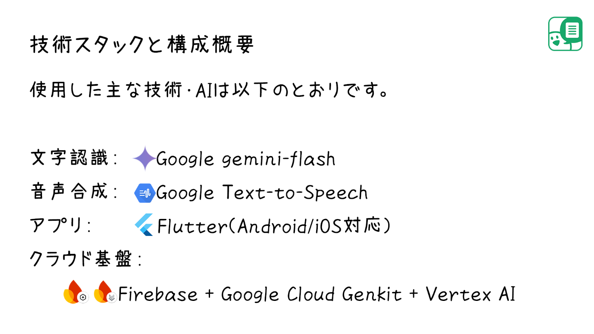
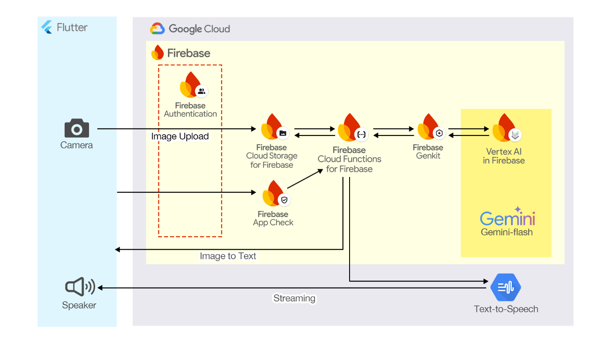

この記事は[「第2回 AI Agent Hackathon with Google Cloud」](https://zenn.dev/hackathons/google-cloud-japan-ai-hackathon-vol2) に参加しています。

##  きっかけ

  
「会議資料の文字が小さくて読みづらい...」  
ある日家族がこぼした一言が、今回のアプリ開発のきっかけでした。  
仕事で日々多くの紙資料をチェックすることは想像以上に目の負担になるのだと気づかされました。

この困りごと、AIでどうにかできるかもしれない。  
そんな想いで、AIを使った読み上げアプリの開発プロジェクトを始めました。

本記事では、その開発過程や技術スタック、特にGoogle CloudのGenkitとエージェントAIを使った体験について紹介します。

##  作ったもの「よみあげくん」

<https://youtu.be/acCGR-BFkYg>  
開発したアプリがこちらです。  
紙の文字を聞くアプリ「よみあげくん」は、写真を撮ると、文字を自動で読み上げてくれるスマホアプリです。  
スマホで完結するシンプルな操作性につとめました。  
Flutterで開発し、Android , iOSに対応しています。

デモではこちらの書類(PCの購入を希望する稟議書)を読み上げています。  

##  実際に使ってもらった感想

  
開発したアプリを家族に使用してもらいました。  
スマホで資料を撮ってもらうと、自動的に音声が再生され、  
「これ、目が疲れなくていいね。助かる。ありがとう☺️」と笑顔をみせてくれました。

嬉しかったのは、説明をしなくても手渡してすぐに使用されたことです。  
"困りごと" を "直感的に解消" できるプロダクトの強みを感じました。

##  本プロジェクトが対象とするユーザー像と課題、ソリューションと特徴

開発のきっかけは家族のためでしたが、  
ビジネス現場でまだまだ“紙”が必要とされるシーンは多く、目が疲れる、読みにくいといった悩みを抱えている人が多く存在します。

👤 対象とするユーザー像

  * オフィスで稟議書や会議資料などの紙資料を日常的に扱うビジネスパーソン
  * 小さな文字を読むのがつらい中高年層や、目の疲れを感じやすい人

😣 解決したい課題

  * 「文字が小さくて読みづらい」「読むのに集中力がいる」「目が疲れる」
  * 仕事をしたいのに目の不調で仕事できない人の苦しみを AIの力を借りて解決したい

💡課題へのソリューション

  * アプリを立ち上げるとすぐに写真を撮る画面が開いて、あとは写真を撮るだけで AIが文字を読み上げてくれる
  * 目を使う時間を減らす

🟢よみあげくんの特徴

  * とてもシンプルでバリアフリーな簡単操作
  * スマホだけで完結する
  * Text-to-Speech の自然な読み上げ

##  使用シーンの広がり

稟議書や報告書など仕事上の書類に限らず、次のようなシーンでの困りごとも解消できます。

  * 📋 **薬の説明書** ：中高年、高齢者の服薬支援
  * 🌭 **商品裏面の調理法** ：レンジで何wで何分温めればよいか
  * 🏪 **商品ラベル** ：アレルギーや添加物など、成分確認
  * 🗺️ **案内表示** ：外出先での情報取得
  * 📚 **書籍** ：教育現場や図書館で、子どもや学習者が難しい言葉を耳で理解するサポートに

ユーザーのスマホだけで使用できる点から、ハードルの低い支援ツールとしても展開できると考えています。

##  技術スタックと構成概要

  
使用した主な技術・AIは以下のとおりです。

  * 文字認識： Google gemini-flash
  * 音声合成： Google Text-to-Speech
  * アプリ： Flutter（Android/iOS対応）
  * クラウド基盤： Firebase + Google Cloud Genkit + Vertex AI

##  アーキテクチャ構成

  1. Flutterアプリで写真を撮る

  2. Firebase Authでユーザー認証

  3. Firebase Storageへ写真をアップロード

  4. Firebase Functions上の Genkit 経由で Vertex AIを起動

     * 文字認識 Google gemini-flash
     * テキストを音声で読み上げ Google Text-to-Speech AI
  5. 出力音声をFlutterアプリでストリーミング再生

##  プロンプト

Gemini-flash に渡している実際のプロンプトです。シンプルなプロンプトで画像からテキストが生成できています。すごいですね。
    
    
    画像内のテキストを正確に読み取って、そのまま出力してください。
    新聞記事のような段組の場合、読む順序を論理的に判断して下さい。読みたいと思って撮った記事以外のテキストは含まないで下さい。
    読み取ったテキストのみを出力し、説明や注釈は一切加えないで下さい。
    

##  使用した技術リスト

  * Google gemini-flash
  * Google Text-to-Speech
  * Flutter
  * Firebase Auth
  * Firebase App Check
  * Firebase Storage
  * Firebase Genkit
  * Firebase Vertex AI

##  技術選定の理由

  * Flutter： 短期間でクロスプラットフォームに対応するため。UIも直感的に作れる。
  * Genkit + Vertex AI： 通常なら手間のかかるAIパイプライン構築が、Genkitのおかげで非常に簡潔になった。APIレスの自然な関数定義が可能で、将来的な機能拡張にも対応可能。
  * gemini-flash： 日本語OCRの精度が高く、小さな文字やレイアウトの乱れにも比較的強い。
  * Google TTS： 安定した日本語のイントネーションと自然な読み上げが特長。
  * Firebase Auth：Firebase利用時に最も簡単かつ確実に行えるセキュアな認証方法。

##  GenkitとAIエージェント開発体験

Genkitの導入は初めてでしたが、とても印象が良かったです。

  * 関数ベースでAIフローが書けるため、ロジックとAI処理が分離しやすい
  * エージェントの会話状態などを保持する必要がなく、読み上げ処理のような一方通行型の処理に適している
  * Firebaseとの親和性が高く、実装もクラウドも1日で済む

個人開発でも十分に使える手軽さがあり、「AI連携＝大がかり」という先入観を壊してくれました。

##  AI開発のハードルが下がった実感

開発を通して、私が最も驚いたことは「AI連携アプリがこんなに手軽に作れるんだ」という体験でした。

これまでAIというと、専用のインフラや高度な機械学習モデルの理解が必要だというイメージがありましたが、Genkitを使うことで、普段の開発とほとんど変わらない感覚でAIを活用できました。

とくに感動したのは、「誰かの困りごとにすぐ手を伸ばせる距離にAIがある」という実感です。

今回のアプリは、1枚の写真をきっかけに、スマホで写真を撮る → ユーザー認証 → サーバーへ画像を up → 画像から文字を認識してテキスト化 → テキストを音声化 → スマホのスピーカーでストリーミング再生 という一連の流れを Firebaseサーバーの助けを借りて実現しています。サーバーとの複雑な処理が続いているのにも関わらず、Genkitを使ってローカルの関数を呼びだすように簡単に実現できました。

**これからは、「AI技術が難しいからできない」と思っていたことが、「1日でやってみよう」と思えるようになる。そんな未来がすでに始まっていると感じました。**

##  開発プロセスと工夫

「よみあげくん」の開発は、思いついてから完成までを文字通り1日で終えることができました。

その理由の一つは、最初から「完璧を目指さない」設計をしたことです。  
読み上げに特化し、カスタマイズ機能は後回しに。まずは「写真を撮ると文字を読んでくれる」人の代わりを AIで、最短距離で実現することに集中しました。

また、FlutterとFirebaseの連携の容易さによって、UI/UXとバックエンドの構築をシームレスに行えました。Firebase Storageの使いやすさや、FunctionsでGenkitを呼び出せる柔軟性も、開発速度に大きく貢献しています。

特にGenkitでは、AIの各ステップ（OCR、音声合成）を関数として構築できるため、状態管理や非同期処理に悩むことなく開発できました。  
「思いついたら書ける」「つなげたら動く」――この感覚が、AIエージェントアプリ開発の面白さだと感じています。

##  他分野への応用可能性

「よみあげくん」は、会議資料のような業務文書の読み上げを想定していますが、応用範囲はさらに広がると考えています。

たとえば、病院や介護施設において、薬の説明書や同意書を読み上げる支援。  
あるいは、旅行中に見かけた掲示や案内表示を、その場で撮って聞ける観光サポートツールとしての活用も可能です。

さらに、読み上げ機能を多言語対応させれば、外国人向けの公共サービス案内や、インバウンド観光支援にもつながります。

「文字の情報を音声で届ける」というアイデアは、ユニバーサルデザインの観点からも大きな可能性を持っています。

##  柔軟な拡張

要約・翻訳・解読などの機能は、新しいAgentを追加するだけで、柔軟に拡張することが可能です。
    
    
    現在のアプリ：
    📷 → 文字認識 → 音声読み上げ
    
    将来の拡張：
    📷 → 文字認識 → 翻訳 → 要約 → 音声読み上げ
             ↓
          画像説明（物体認識）
    

##  社会的インパクトと今後の可能性

今回、私自身が1日で実用的なAIアプリを開発できたことに、正直驚いています。以前なら「チームが必要」「予算がない」「専門知識が足りない」と諦めていたようなアイデアを、実際に形にすることができました。この体験を通じて、AI技術が本当に身近なものになってきていることを実感しました。

特に印象的だったのは、Genkitのようなエージェントフレームワークの使いやすさです。AIとクラウドサービスをここまでシンプルにつなげられるとは思っていませんでした。今回の経験を活かして、これからも個人プロジェクトや仕事の中で、積極的に活用していきたいと思っています。

誰かの困りごとにすばやく対応できる、そんな柔軟で俊敏な開発スタイルを通じて、もっと多くの人が「自分にもできる」と感じられる未来を感じた体験を共有したいと思い、本記事を作成しました。

##  まとめ

  
AIとアプリの連携が「日常の不便を解決する手段」として現実的になったと実感しました。

“困っている誰か”を見つけた翌日に、“解決する何か”を届けることができる。

もしあなたの周りに困っている人がいたら、ぜひAIエージェント連携を使った開発を活用してみてください。  
**AI機能を組み合わせるだけで、今まで出来なかった種類の様々な問題を解決できるはずです。**  
最後までお読みくださりありがとうございました！
