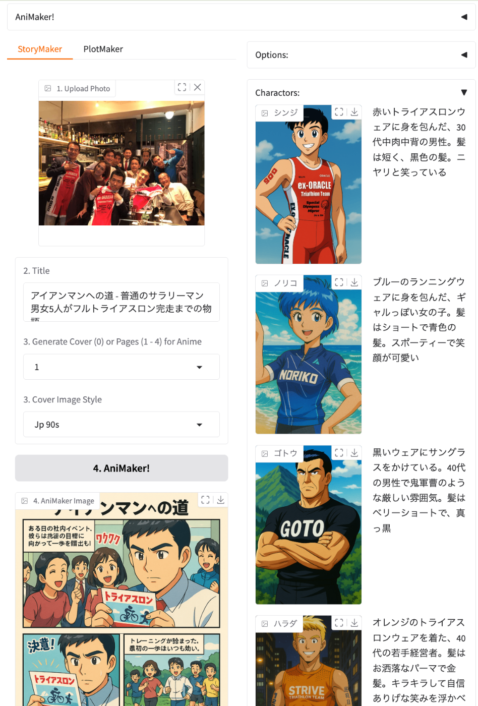
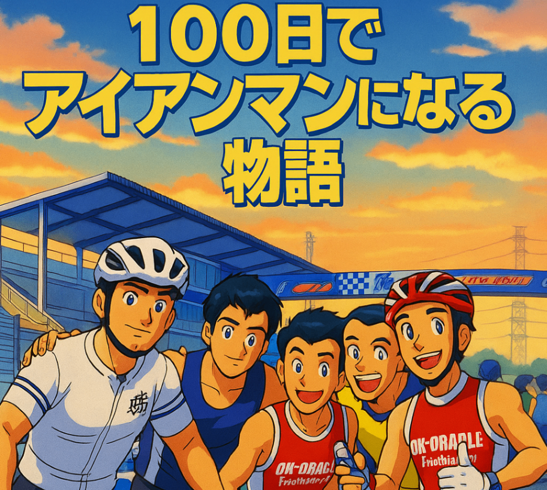
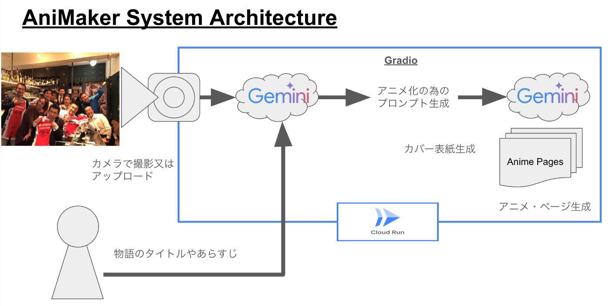
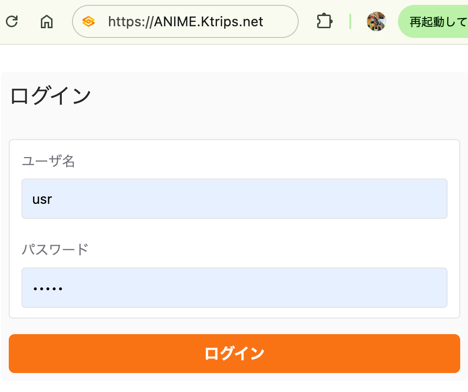
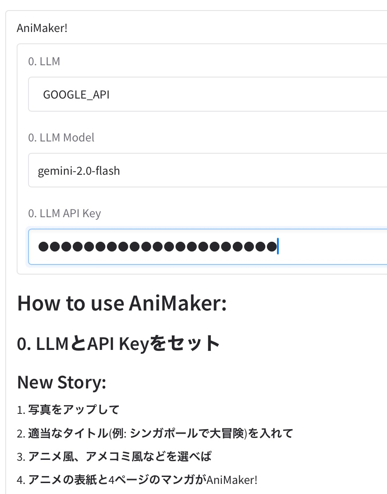
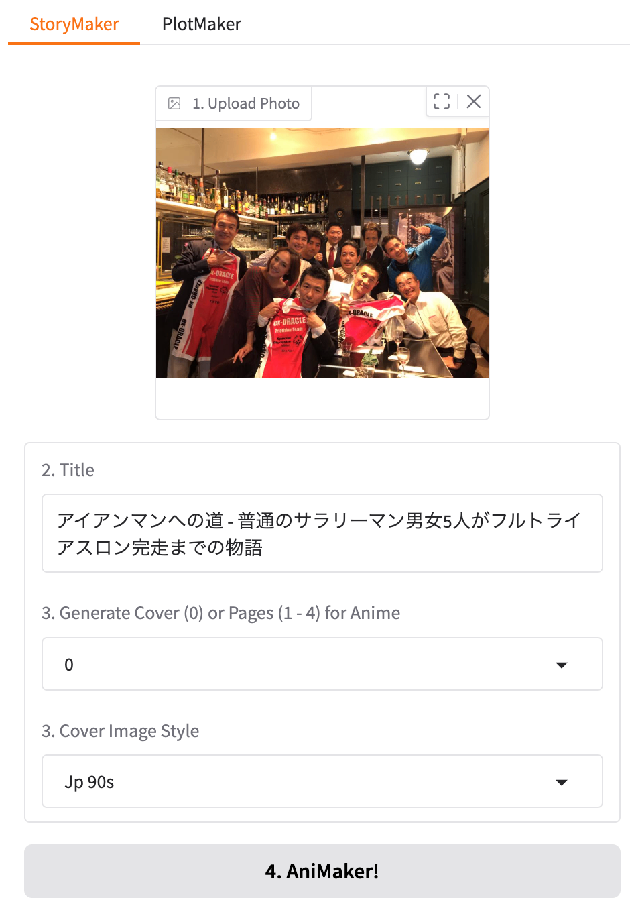
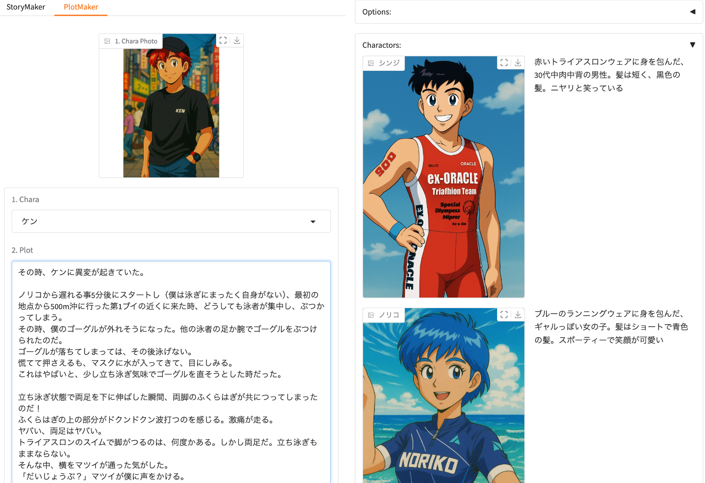
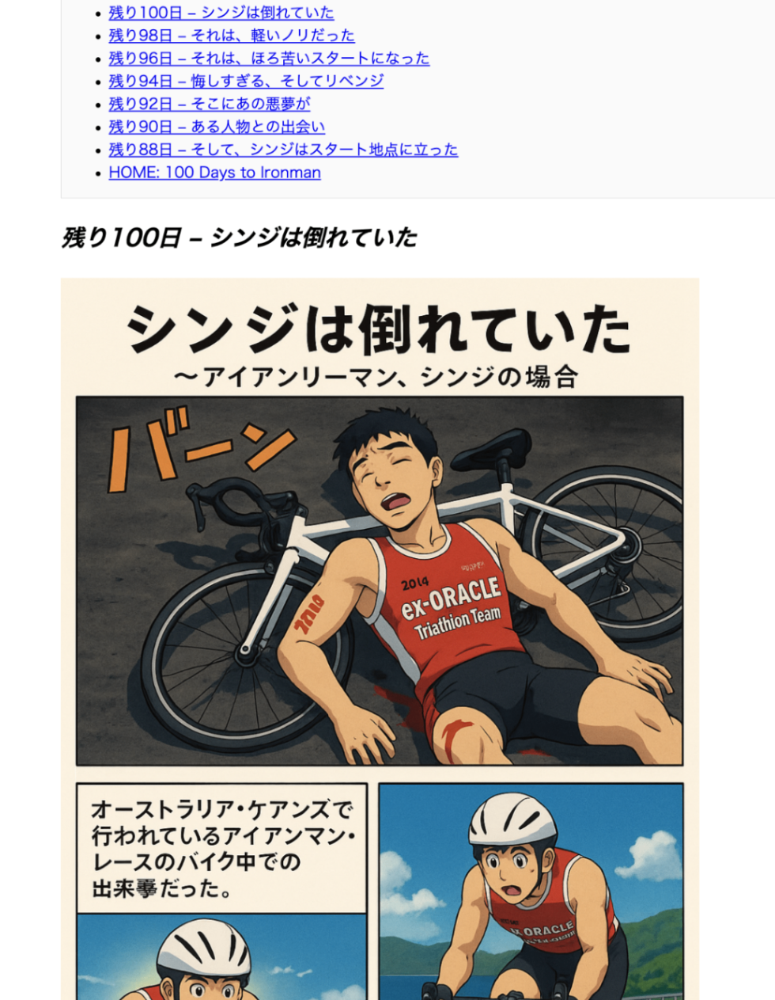
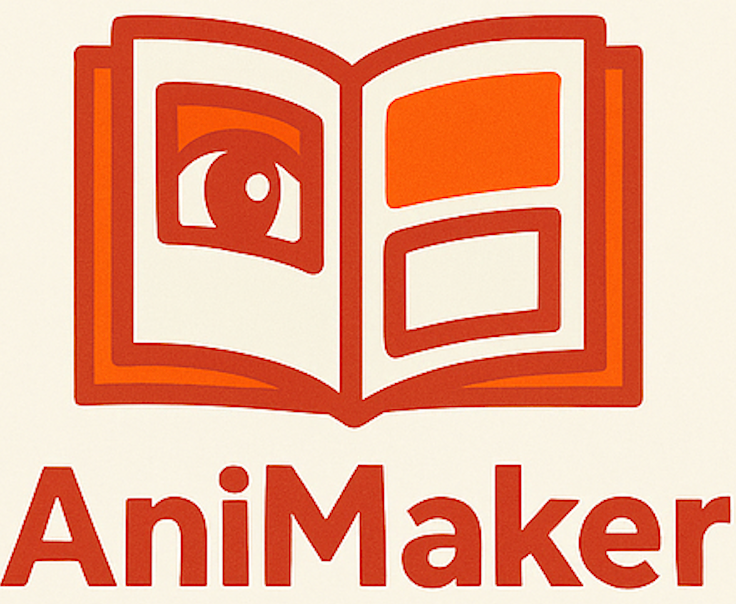

#  AniMakerとは

###  AniMaker(アニメイカー)とは、アニメを自動で作れるAIアプリ！

  * AniMaker（アニメイカー）は、写真と描きたい物語の題名を入れると、自動でアニメの表紙と5コマのマンガを生成してくれるWebアプリです
  * 登場人物を登録すると、そのキャラをマンガ内に配置してアニメを作ってくれます
  * 一行の題名だけから起承転結のあるストーリーを作ってくれたり、自分のあらすじからアニメを描くプロンプトを生成して、それを手直しする事により、詳細なアニメ描画を実現します

#  i. AniMaker Detail:

##  AniMakerが対象とするユーザー像

  * アニメを作りたい人
  * 4コマ漫画を作りたい人
  * シナリオを作りたい人
  * その他絵コンテやラフ画を作成したい人

##  AniMakerが解決する課題、ソリューション、特徴

###  解決すべき課題

私自身、描きたいマンガやアニメがあるが、画力が無く、制作できずにいました。またAIアニメで、主人公の絵が一定せず、一貫したストーリーが描けませんでした。

##  課題へのソリューション

AniMakerアプリにより解決できる事:

  * 登場キャラクターを登録し、シーンにより呼び出す事ができる
  * そのキャラクターを一貫してアニメに登場させる事ができる
  * キャラクターを指定し、そこにプロット、あらすじを入れるだけで、アニメ制作のプロンプトを生成
  * そのプロンプトから、4、5コマの漫画画像を生成
  * 1コマ毎に、コマ割り、ナレーション、オノマトペ、描画などを自動で作成
  * 作った画像をSNSにアップロードする機能
  * スマホでできる手軽さ
  * クラウドにデータを残し、どこからでもアクセス、チェック、更新できる

##  アプリの特徴と機能

###  AniMaker Functionality:

  * Cloud Run上にデプロイされたウェブ・アプリ（ANIME.Ktrips.net）
  * ログイン、セキュリティ機能
  * キャラクター登録、キャラのアニメ化機能
  * 複数のLLMモデル（Gemini、ChatGPT、Claude）を選択可能
  * 結果が“ANIME History”に残って、いつでもチェック可能

<https://youtube.com/shorts/z_StWzolY9k?feature=share>

###  AniMaker Options:

  * LLMとそのモデルを選択可能、自分のAPI Keyを利用
  * アニメスタイル: 90年代日本のアニメやアメコミ風、レトロスタイルなど
  * 描画サイズ、コマ割り数（１〜５）、描画クオリティなど

#  ii. AniMaker System Architecture システム アーキテクチャ

##  アプリの使い方

AniMakerアプリの使用ステップ | AniMakerアプリ・スクリーン  
---|---  
**0\. スマホかウェブから、AniMaker.Ktrips.net にアクセス  
  
ログイン画面で、ユーザーは usr、パスワードはpswd1  
  
0\. LLMを選択し、Modelを確認、apikeyを入力** |    
  
**== 写真とタイトルから自動生成 ==  
  
1\. StoryMaker画面が出たら、写真をアップロード又は撮影  
  
2\. タイトル、又はあらすじを入力  
  
3\. カバー画像を作るには0(Cover)を1〜4ページを作りたい場合はそのページをセット  
  
4\. 描画したいスタイルを選んで、  
  
AniMakerボタンを押す！** |   
**== あらすじからプロンプト調整 ==  
  
1\. PlotMaker画面では、事前に登録したキャラを選んで、  
  
2\. 描画したいシーンのプロット（あらすじ）を入れる  
  
3\. Generate Promptボタンを押すと、アニメ描画の為のプロンプトが生成される  
  
4\. 生成されたプロンプトを手直しした後に、AniMakerボタンを押す！** |   
**アニメの表紙や5コマの漫画が生成される！  
  
ANIME Historyからこれまで生成されたアニメが見れる** |   
  
#  iii. Project Video 動画

<https://youtu.be/yKn5G4eoe5Y?si=jBH5XbJpHLboE6l0>  
[AniMaker Movie]

#  Products with Google Platform and APIs

  * Google Cloud Run
  * Gemini API in Vertex AI
  * (OSS) Gradio

##  Github and App

  * **Github** \- <https://github.com/ktrips/animaker>
  * **Tech Blog** \- <http://blog.ktrips.net/animaker>
  * **App** \- AniMaker.Ktrips.net

#  Background

  * 実際に「100日でアイアンマンになる物語」を毎日一コマづつ続けて制作しています
  * <https://ktrips.net/100-days-to-ironman/>  

###  AniMaker - AI Anime made by Gemini

