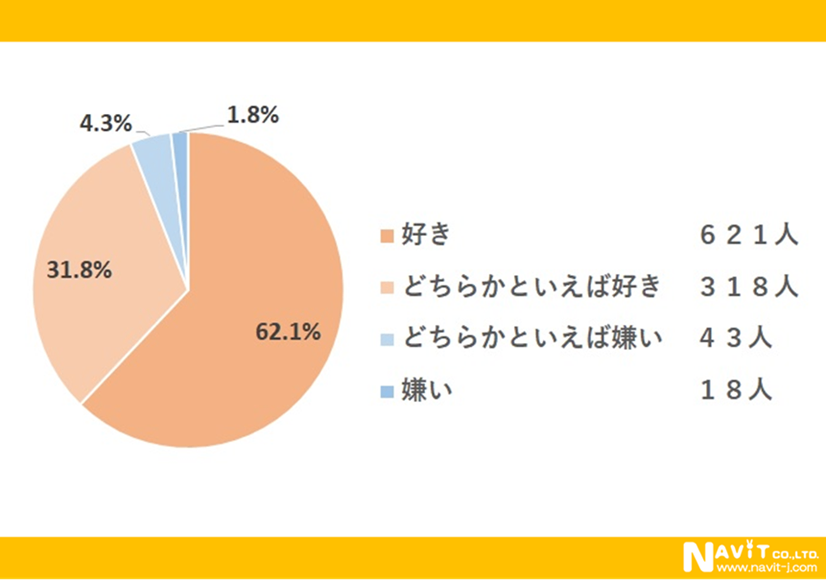
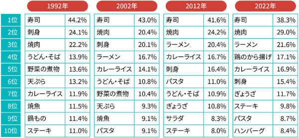
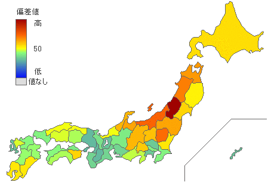
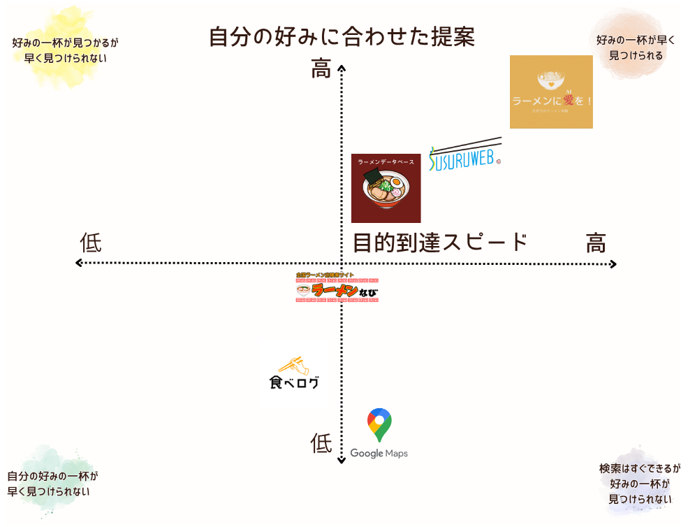
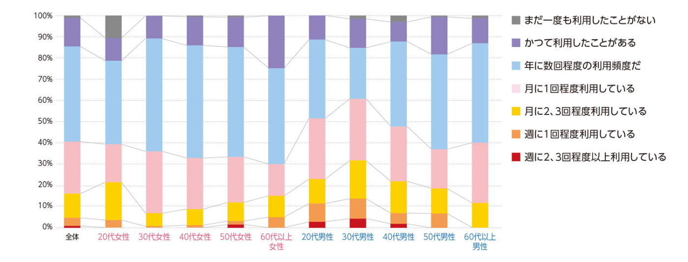
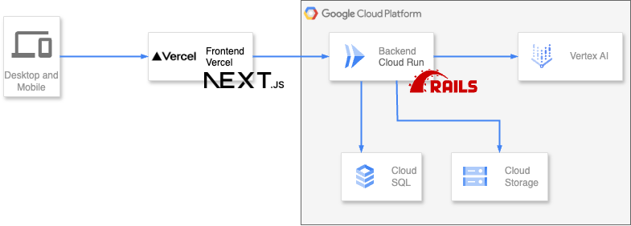

皆さんはラーメンに愛(AI)はありますか？日本人にとってラーメンはなくてはならない存在ですよね？  
今回はそんなラーメン愛とAIを活用した「ラーメンに愛(AI)を！」というサービスを、チーム「歴史に名を刻め」の[Kuuuuu (@wanwanwan_nyo)](https://x.com/wanwanwan_nyo)と[END (@aiandrox)](https://x.com/aiandrox)で開発しました。  

#  対象ユーザー像と課題

<https://www.youtube.com/watch?v=QbdjLjZIYnQ>

##  ラーメンは国民食か？否か？

皆さんはラーメンは好きですか？と聞かれたら、なんと答えますか？

「好き！」

そうですよね。ラーメンが好きな人が多いのではないかと思います。

実際に同じ質問を1000人に行ったデータを見ると、62%を超える人がラーメンを好きと答えています。

[日本独自の食文化として定着したラーメンについて大調査！【1000人アンケート】](https://www.navit-j.com/media/?p=103690)

次に好きな料理トップ10のデータを見ても、ラーメンはランキング上位に食い込んできています。  

[データで見る「好きな料理」30年史 ラーメンが“食った”料理は？](https://xtrend.nikkei.com/atcl/contents/18/00401/00036/)

このことから、ラーメンは日本の国民食と言っても過言ではないのではないでしょうか？

###  ラーメンを食べる頻度は？

皆さんは普段どのくらいラーメンを食べてますか？意外とかなりの頻度で食べている人が多いのではないでしょうか。  
LINEリサーチによると、週に1日以上ラーメンを食べている人は全体で35%もいます。全く食べない人を除くと脅威の97%の人がラーメンを食べているのです。

  
[【LINEリサーチ】週に1日以上ラーメンを食べる人は全体で35％、男性30代以上でやや高い傾向 好きなラーメンの種類は「醤油ラーメン」「味噌ラーメン」が上位](https://prtimes.jp/main/html/rd/p/000004267.000001594.html)

###  しかしラーメンの店舗数は…

日本にあるラーメン店の数ってどれくらいだと思いますか？実は24,257軒も存在するみたいです！東京都にあるラーメン店は2437軒もあります。また、人口10万人に対するラーメン店の数の全国平均は19.22軒になります。ラーメンを選ぶのは大変...。

[都道府県別ラーメン店舗数 - とどラン](https://todo-ran.com/t/kiji/11806)

###  現状のラーメン界隈のサービス比較

他のサービスと比較したポジショニングマップが以下になります。  
  
他のサービスでは、ラーメン店舗の検索やランキング機能があります。しかし自分の好みに合わせて提案をしてくれるという機能はなく、あくまでユーザーが検索条件を絞っていくことで、食べたいラーメンを見つける必要があります。

このことから以下の課題があると考えました。

###  課題

  * ラーメンが好きだけど、行きたいラーメン屋を探すのが大変
  * いつも同じラーメン屋ばっかり行ってしまう
  * みんなのおすすめが知りたいけど、口コミ見るのが面倒
  * 今の自分の気分にあったラーメンの店がなかなか見つからない

###  ユーザー像

ユーザー像は以下の年代別のデータから以下のように定義しました。

  * 20代~40代の 
    * ラーメンが好きなあなた
    * 最近自分の知っているラーメン屋は行き尽くしたあなた
    * 人のおすすめのラーメン屋に行ってみたいあなた

  
[ラーメン店（2023年版） | 市場調査データ | J-Net21[中小企業ビジネス支援サイト]](https://j-net21.smrj.go.jp/startup/research/restaurant/cons-ramen2.html)

##  課題へのソリューション

そこで以下のことができるサービスを開発することにしました。

  1. 自分の好みを直感的にスワイプして選択できるようにする  
a. マッチングアプリに慣れた年齢層とラーメン好きな年齢層が重なっているためこのようなUI/UXに
  2. 選んだ好みのラーメンのスープ・ジャンル・麺の種類から推測して、AIがおすすめの提案をする
  3. 提案の際にスープ>ジャンル>麺の種類の優先度で提案する

###  サービス機能

**スワイプ機能**

データベースの中にあるラーメンの中からランダムに10個のラーメンを選択し、スワイプする。

**提案機能**

  1. スワイプで選んだ好みのラーメンのデータと好みではないラーメンのデータをAIに渡す
  2. 渡したデータからおすすめのスープ・ジャンル・麺の種類をAIに提案させる
  3. AIから提案されたスープ・ジャンル・麺のデータを元に、DBの中にあるデータの中でスープ>ジャンル>麺の種類の優先度でマッチするものを提案する

###  使用技術

**リポジトリ**  
<https://github.com/kuuwannya/ramen-ni-ai-wo>  
<https://github.com/ramen-ai-team/ramen-ai-backend>  
<https://github.com/aiandrox/ramen-ai-admin>

**Frontend**

言語/フレームワーク | TypeScript, Next.js  
---|---  
パッケージマネージャー | npm  
CSSツール | [Tailwind CSS](https://tailwindcss.com/)  
UIライブラリ | [shadcn/ui](https://ui.shadcn.com/)  
静的解析ツール | ESlint  
デプロイ | Vercel  
  
**Backend**

言語/フレームワーク | Ruby, Ruby on Rails  
---|---  
DB | Cloud SQL  
ストレージ | Cloud Storage  
AI モデル | Gemini 2.5 Flash-Lite  
静的解析ツール | Rubocop  
デプロイ | Cloud Run  
  
**システムアーキテクチャ図**  

###  開発工夫ポイント

###  データ

Xで呼びかけ、[Googleフォーム](https://docs.google.com/forms/d/e/1FAIpQLSfrcneFHEaNdDI1Kfz38iq46ZjpuRdkekaCWdP9Cuaj5TsVhQ/viewform?usp=sharing&ouid=117756289663647989079)にラーメンのデータを募集しました。  
おかげ様で117杯ものデータを提供いただきました。ご協力本当にありがとうございます！

現在も募集中ですので、是非清き一杯をお待ちしております。

入れていただけると順次サービスで表示されるかも！？？！

<https://x.com/wanwanwan_nyo/status/1936294141874622900>

###  Frontend

Next.jsを採用して作成しました。  
最初はReact Nativeで作成していたのですが、Vercelでwebでのデプロイをすると、TailwindCSSが当たらない問題が起き、Next.jsで再度開発し直しました。  
モバイルアプリも開発したいと思っているので、後日開発頑張りたいです。

###  Backend

使い慣れたRailsを選びました。  
ジャンルなどマスターデータの作成はseedで行うようにし、店舗やラーメンデータのインポートはOneshotスクリプトを実行しています。Cloud Run jobsを使っています。

<https://zenn.dev/team_zenn/articles/we-use-cloud-run-jobs>

###  AIプロンプト

以下のようなプロンプトを渡しています。マスターデータを扱っているのみなので、プロンプトインジェクション対策は行っていません。
    
    
    以下はある人が選択したラーメンの嗜好です。これを踏まえて、最もおすすめのラーメンを教えて下さい
    ## 選択されたラーメン
    - 名前：塩豚骨ラーメン ジャンル：ラーメン、麺：中太麺、味：豚骨
    ## 選択されなかったラーメン
    - 名前：チャーシューメン ジャンル：ラーメン、麺：細麺、味：醤油
    

`reason`におすすめする理由を返すようにしていたが、「選択されなかったラーメンのリストから、つけ麺、太麺、魚介という組み合わせが最も多く、かつ選択されなかったものの中でも評価が高い傾向にあると判断しました。」など選択に関する内容が入っており、具体的すぎる印象を与えていました。  
そのため、「ただし、根拠として選択に関する情報を含めないでください。」という文言を追加しました。

###  管理者ページ

ReactでClaude Codeに作ってもらいました。  
スピード重視でシンプルな技術スタックにしようと思い、React × TypeScriptで作成してもらい、Vercelでデプロイしています。

###  今後開発予定の機能

今後開発予定の機能は以下になります。⭐️を記載している機能が今後リリース優先度が高いものです。実際に使ってみて、こんな機能が欲しいなどありましたら、XのDMにてご意見いただけると幸いです！

  * ラーメン検索⭐️ 
    * ワード検索
    * 種別検索
    * マップ検索
  * ラーメン投稿 
    * 行った後の評価を入れる⭐️
    * コメント
  * ラーメンランキング
  * 杯数ランキング
  * ラーメン店の混雑度を測る
  * 店舗の中で一番美味しいメニューの表示⭐️
  * プロフィール 
    * ラーメンの趣味嗜好を入れる⭐️ 
      * 麺の硬さ
      * スープの濃さ
      * 接客態度
    * お気に入り店舗登録

