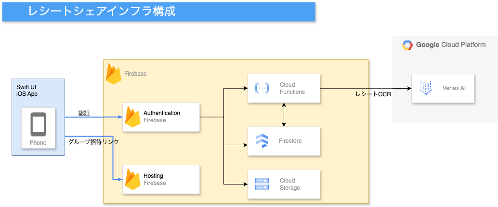
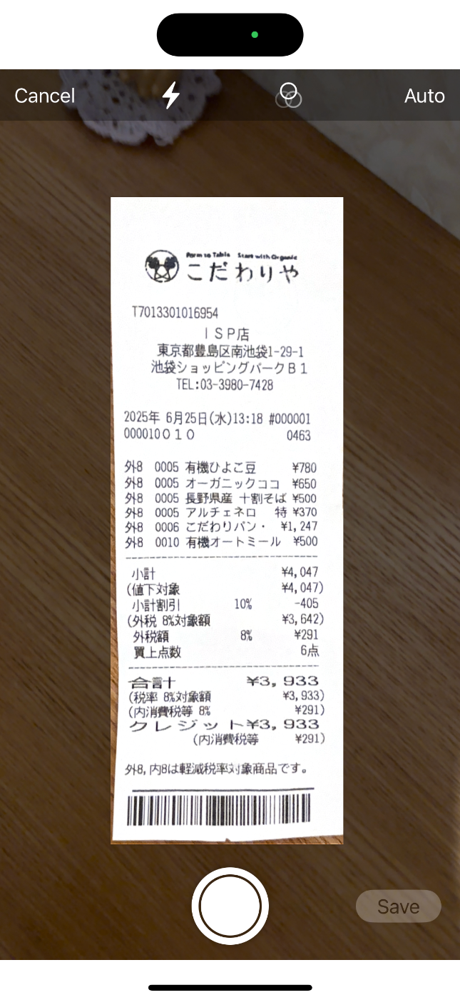
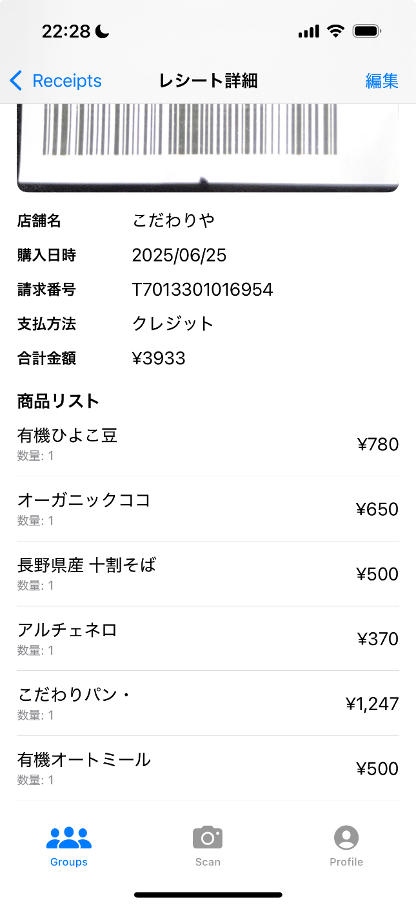
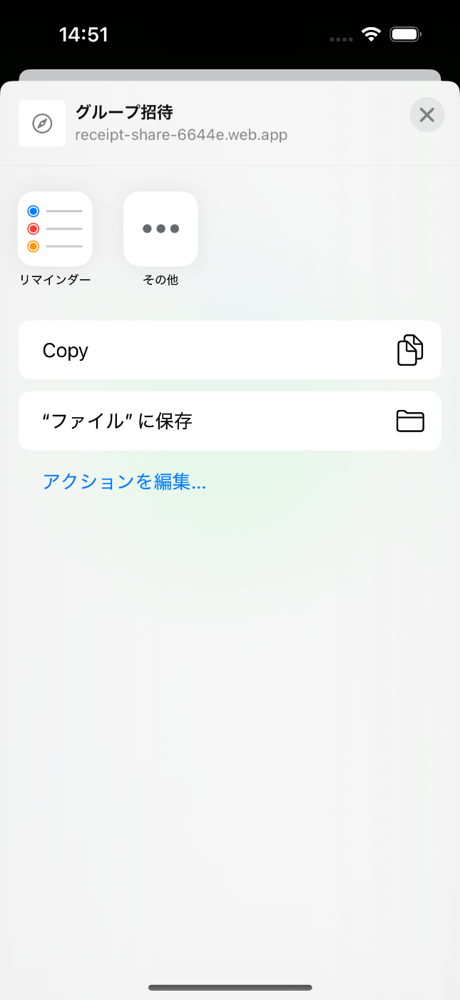
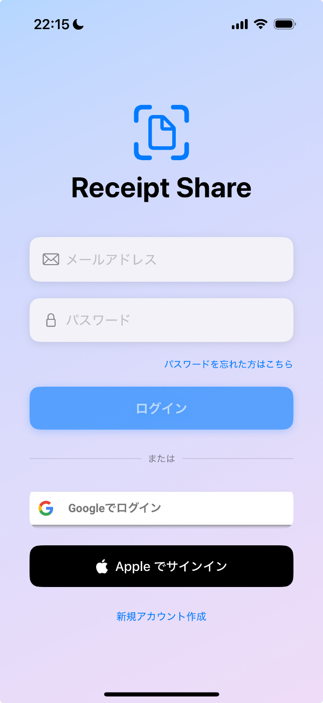

#  はじめに

旅行や飲み会、イベントの買い出し。  
楽しい時間の後には必ず訪れる、あの面倒な作業。

> 誰がいくら払った？レシートどこいった？

こんな体験、ありませんか？

この課題を解決するべく開発したのが、レシートシェアアプリです。

[https://apps.apple.com/jp/app/レシートシェア/id6747824433](https://apps.apple.com/jp/app/%E3%83%AC%E3%82%B7%E3%83%BC%E3%83%88%E3%82%B7%E3%82%A7%E3%82%A2/id6747824433)

この記事では、アプリ開発の動機から設計、技術スタック、今後の展望までを詳しく紹介します。

#  本アプリの開発の動機

（以下は個人的な話なので読み飛ばしていただいても構いません）

このアプリの開発は、**研究室での昼食事情** がきっかけでした。

私たちの研究室では、忙しいお昼の時間を効率的にするために、週に1〜2回ほど、複数人で食材を買い溜めして簡単に自炊する習慣があります。

  * 誰かがスーパーに寄ってごはん・麺・惣菜を購入
  * 別の人が調味料や冷凍食品を買ってきたり
  * 週末にまとめ買いした人がいたり

と、**買い物担当が毎回バラバラ** で、しかもレシートも紙のまま渡されなかったり、LINEで送られてくるだけだったり…。

一応、「○○円だったから、◯人で割ろう」と話すのですが、以下のような問題が起きがちでした。

  * 誰が何を買ってきたか記録に残ってない
  * 金額の端数が合わない
  * レシートが複数あると計算が混乱する
  * 結局、数十円〜数百円の支出が曖昧なまま放置される

> 「まぁ、いいか」で終わるけど、積み重なると結構な金額になる…

こうした状況が頻繁に起きていたため、「レシートを撮るだけで、全員に共有され、しかも金額も自動で整理される仕組みがあればいいのに」と思ったのが最初の動機です。

しかもこれは、学生だけでなく、家族や職場、イベントなどでも広く起きている「日常的な課題」だと気づきました。

「だったら作ってしまおう」と思い立ち、開発を始めたのがこの**レシートシェアアプリ** です。

#  解決したい課題

買い出しをグループでした時に、メンバーはそれぞれ記録を残すためにレシートをもらっておいて、それを元に、後で集計して割り勘するというシーンが多いかと思います。これは集計する人にとっては、かなり手間だと思いますし、集計の透明性がなくなります。  
このような問題が起きる本質的な原因は次のポイントにあると考えます

!

**“誰がいつ、いくら、何のために支払ったか”という情報を、ストレスなく記録・共有する手段が存在しない**

私は**レシートシェア** の開発により、この本質的な課題を解決したいと考えました

#  このアプリで提案するソリューション

  * iPhone純正の高精度なドキュメントスキャン技術によるストレスフリーなレシート撮影
  * GeminiなどのマルチモーダルAIの活用による、レシート情報の抽出
  * Firebaseを活用したグループ共有の自動化

#  実際のアプリの利用イメージ

早速アプリの実際の使用動画をご覧ください  
動画の内容としては以下のとおりです

  1. レシートを自動スキャン
  2. グループのチャートにレシートデータが反映される
  3. スキャンしたレシートの分析結果が表示される

<https://youtube.com/shorts/qe_L0UxQXPs?feature=share>

#  システムアーキテクチャ

このアプリケーションは主に以下の技術を用いて開発されています

<https://developer.apple.com/jp/swiftui/>

[https://firebase.google.com/?gad_source=1&gad_campaignid=20100025566&gbraid=0AAAAADpUDOjtc7EXtXvN7VWzYT1uyZQxw&gclid=Cj0KCQjwyIPDBhDBARIsAHJyyVgUHFAZOqmwsFbb4GUr51i4fMe6TwaLoJA5soTbHpGEaCutOrjn4WsaApyhEALw_wcB&gclsrc=aw.ds&hl=ja](https://firebase.google.com/?gad_source=1&gad_campaignid=20100025566&gbraid=0AAAAADpUDOjtc7EXtXvN7VWzYT1uyZQxw&gclid=Cj0KCQjwyIPDBhDBARIsAHJyyVgUHFAZOqmwsFbb4GUr51i4fMe6TwaLoJA5soTbHpGEaCutOrjn4WsaApyhEALw_wcB&gclsrc=aw.ds&hl=ja)

<https://cloud.google.com/vertex-ai?hl=ja>

アーキテクチャ図の概略は以下のとおりです。

#  このアプリの主な機能

このアプリの主要な機能と使用技術詳細について解説します

###  レシートOCR機能

  
本アプリにおける目玉の機能です。以下の手順で処理されます。

  1. ユーザーがレシートをスキャンして保存（ここではSwift UIの[Vision Kit](https://developer.apple.com/documentation/visionkit)を利用している）
  2. レシートデータは直接`Firebase Storage`に保存され、`FireStore`にレシートドキュメントが未処理として書き込まれる
  3. `Cloud Function`で`Firestore`のレシートドキュメントの追加を検知して、追加されたレシートドキュメントに対してOCR処理を実行する
  4. レシート画像が`Vertex AI`の`gemini-2.0-falsh`に送られて、レシートデータの分析を行う
  5. レシート分析が完了すると`Firestore`のレシートドキュメントを更新する
  6. ユーザーのアプリで`Firestore`のListner機能によってレシートデータが更新され分析結果が表示される。  
  
以下の項目が検出される

!

  * 取引店舗名
  * 購入日時
  * 登録番号（インボイス番号）
  * 支払い方法
  * 合計金額
  * 品目一覧

###  グループ招待機能

  
本アプリにおける重要な機能です、招待リンクの発行によりグループメンバーの追加を行えます

  1. グループメンバーが招待リンクを発行する
  2. `Cloud Function`で`Firebase Hosting`でホストされている招待リンクを生成してユーザーに返す
  3. 招待リンクを踏んだユーザーは、`Firebase Hosting`のページに飛び、[Universal Link](https://developer.apple.com/documentation/xcode/allowing-apps-and-websites-to-link-to-your-content/)によって、アプリにリダイレクトされる
  4. アプリ側でurlを受け取り、そのurlを`Cloud Function`で検証する
  5. 招待リンクが有効であれば、リンクを開いたユーザーをグループに追加する

###  認証機能

パスワードリセット機能や退会機能まで実装済みです  
以下のプロバイダーで認証を受け付けます

  * Apple
  * Google
  * Password  

#  技術選定の理由

以下に、レシートシェアで採用した技術の選定理由を述べます

###  SwiftUI を選んだ理由

  * iOS開発のネイティブ言語であり、iPhone固有のAPIを活用できる（今回であれば自動スキャン機能）
  * 宣言的UIで状態管理がシンプル（リアルタイムでのレシートデータ管理がしやすい）
  * 少人数開発でもスピーディーに開発可能
  * Appleによる今後の長期的なサポートに期待

###  Gemini を選んだ理由

  * Vertex AI経由でGCPに統合しやすい
  * マルチモーダルタスクに強く合計金額・品目などの抽出精度が高い
  * 処理速度が非常に速く、Firebaseと好相性

###  Firebase を選んだ理由

  * Firestore のリアルタイム同期（今回はグループ共有なのでリアルタイム性が非常に重視されるポイントになっていたため）
  * Firebase Authentication による簡易な多プロバイダー認証
  * Cloud Functions によるAI連携処理
  * Hosting による招待リンクとUniversal Linkの統合

#  このアプリがもたらす価値

  * iPhoneの高精度なスキャン機能により、レシートの撮影におけるストレスを解消
  * マルチモーダルに優れたGeminiの活用により既存のレシートを超える読み取り精度を実現
  * グループでの支出管理を簡単にする
  * インボイス番号の検出により、インボイスへの活用を期待できる

#  今後の展望

このような支出管理分野においては[walica](https://walica.jp/)や[money forward](https://moneyforward.com/)などの非常に優秀なアプリが現状は存在していますので、それらのアプリの機能をこのレシートシェアに統合していけたらと考えています。

  * 品目ごとに割り勘設定ができるようにして、より柔軟な割り勘を実現する
  * レシートの品目を自動で分類する機能を追加して家計管理への活用を狙う

