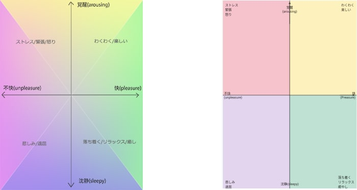
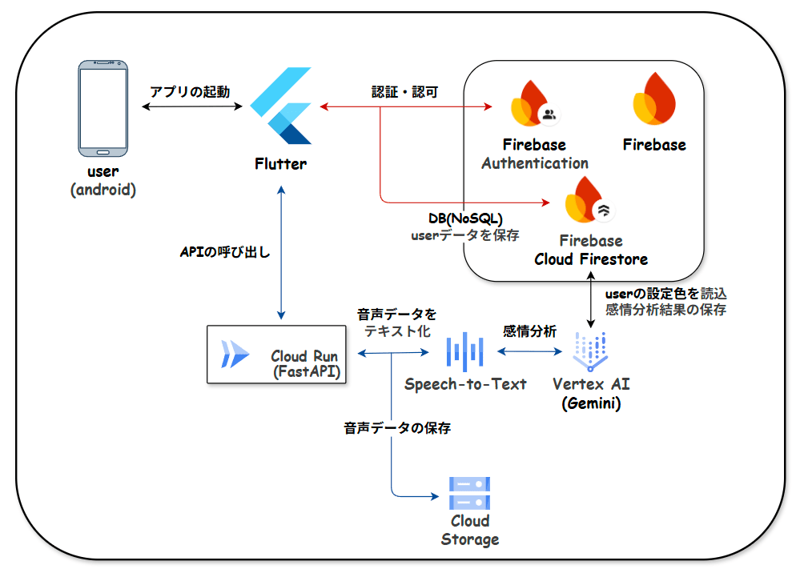
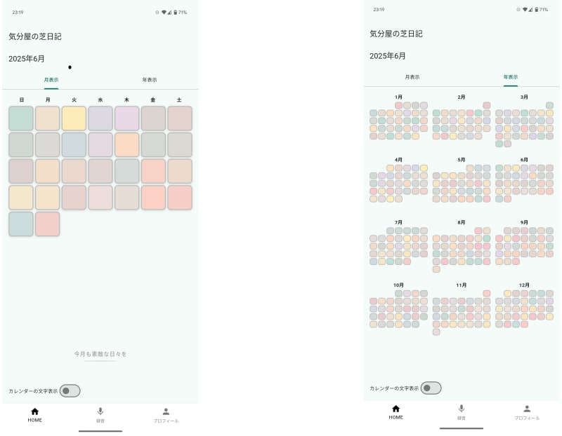
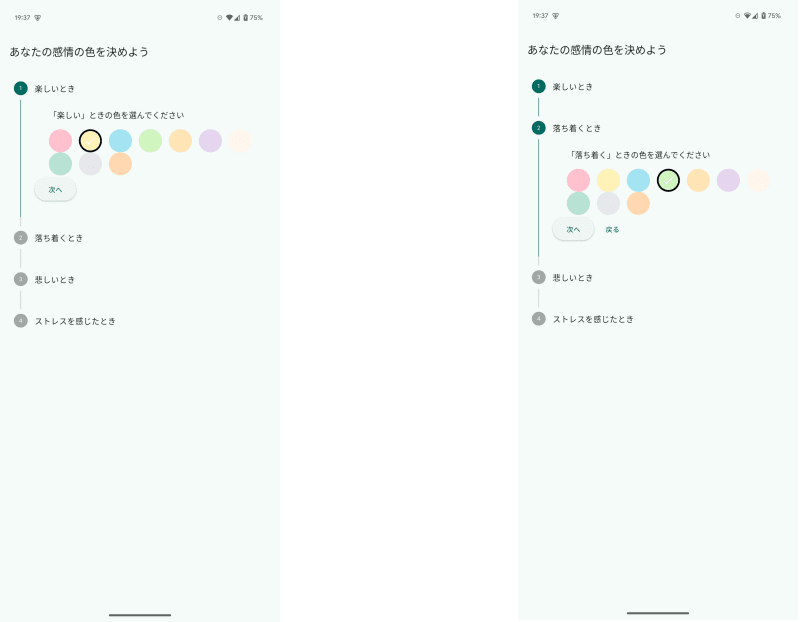

#  はじめに

「忙しくて日記が続かない…」「タイピングや手帳に書くのが面倒くさい…」  
「自分の出来事を文字ではなく、一目見てわかる形で客観視したい」  
「仕事でもプライベートでも文字情報過多で疲れた…」  
そんな悩みを解決するために、**音声入力 → AI 感情分析 → カラーパレット** を生成する日記アプリを開発しました。

このアプリを作る際に参考にしたのは、github contributionのheatmapです。  
GitHubで日々草を生やしているうちに、Heatmapを振り返ることで仕事が忙しくて草が生やせなかった時期や個人開発や勉強に集中していた時期が一目でわかることに気付きました。  
言葉で記録をしているわけではないのにまるで日記のように過去の記録を見返すことを楽しんでいると感じました。  
この体験から、誰でも色だけで構成されたカレンダーを眺めることで、自分の過去を思い出し、楽しめるようなアプリを作りたいと思ったのが開発のきっかけです。  
記録方法は音声入力のみとし、出来るだけ文字や言葉の情報過多な現実から離れて毎日の記録を眺めることができるように意識しています。

アプリ名は、google geminiに名付けてもらい、"感情"・"gihubの草を生やす"・"日記"からイメージ？された「気分屋の芝日記」となりました。

#  対象とするユーザー層

  * 忙しい社会人・学生 — まとまった入力時間を確保しにくい
  * ライティングが苦手／スマホ入力が遅い人 — 音声入力なら心理的ハードルが低い
  * 子育て・介護中のユーザー — 両手がふさがっていても記録できる
  * カウンセリングやコーチングを受けているクライアント — 日々の感情を手軽に記録し、セルフケアに役立てたい。客観的な感情の変化を共有したい

##  ユーザーが抱える具体的課題

  * 入力のハードルが高い — キーボード入力、フリック入力や手書きはまとまった時間や場所を要し、継続が難しい
  * 継続モチベーションの低下 — 成果が視覚化されないと達成感が得にくく、習慣化しづらい
  * 感情の一目把握が困難 — 長文が蓄積するだけでは気分の傾向が見えない
  * 主観に偏った振り返り — 自己評価のみでは感情を過小・過大評価しがち

##  課題へのソリューションと特徴

  * 音声入力で録音ボタンを押すだけで記録開始。忙しいシーンでも即座にメモができます。
  * Gemini による感情分析 & 1日ごとのカラーパレットを採用
  * ラッセルの円環モデル（快／不快 × 覚醒／沈静）に沿って (x, y) 座標を算出し、ユーザーが設定したパレットで色を用いて、AIが感情に合わせて混色  
GitHub風のヒートマップUIに反映し、月・年単位で一目で気分の波を把握できます。
  * ヒートマップの空白（未登録日）がひと目で分かるため、自然と「今日も記録しよう」という気持ちが湧き、継続率を向上。
  * カスタムパレットで各象限の色を自由に設定可能。好みの色味や見やすいコントラストを選んで自分らしいダイアリーにできます。また、特定の見えにくい色があるユーザーでも楽しめるように意識しています。

#  主要な機能

  * ログイン機能
  * 1月毎、1年(1月～12月)毎のカレンダー表示
  * 音声入力で日記を記録
  * 各ユーザー毎に感情に合う色の設定
  * 記録した音声をAIが感情分析し、設定した色に合わせて混色・記録
  * 感情分析において、ラッセルの円環モデルに基づいて、X軸を快(+)・不快(-)、Y軸を覚醒(+)・沈静(-)とし、  
第一象限：わくわく、楽しい  
第二象限：ストレス、緊張、怒り  
第三象限：悲しみ、退屈  
第四象限：落ち着く、リラックス、癒し と設定  
本当は左図のようにグラデーションに各象限の色が混ざり合うイメージでしたが、Flutterでの表現が難しかったため、右の形で実装しています。  

#  システムアーキテクチャ

レイヤ | サービス / ライブラリ  
---|---  
Backend | **FastAPI**  
LLM | **Vertex AI Gemini 1.5‑flash‑002**  
音声認識 | **Cloud Speech‑to‑Text**  
Storage | **Cloud Storage**  
DB | **Cloud Firestore**  
Mobile | **Flutter**  
状態管理 | **Riverpod**  
Router | **GoRouter**  
Auth | **Firebase Authentificate**  
Observability | **Cloud Logging / Error Reporting**  
  

#  全体フロー

  1. **ユーザー認証（Firebase Authentication）**
     * ユーザーはアプリでログインまたは新規登録
     * Firebase Authenticationが認証情報（メール/パスワード、Googleアカウントなど）を検証し、認証トークンとユーザーIDをクライアントに返す
  2. **ユーザーの感情色登録**
     * 新規登録後、ユーザーは「楽しい」「落ち着く」「悲しい」「ストレス」などの色を選択
     * 選択した4色は、Firestore の users/{uid} ドキュメントに保存される
  3. **音声の録音と送信**
     * 音声録音を開始／停止
     * 録音が完了したら、クライアントは POST /diary/audio に対して、以下を含む multipart/form-data を送信： 
       * Firebase IDトークン（認証ヘッダー）
       * uid（ユーザーID）、date（記録日）、audio（音声ファイル）
  4. **FastAPI サーバー（Cloud Run）処理**
     * 認証トークンを検証
     * uid, date, audio を受け取り処理を開始
  5. **Cloud Storage へのアップロード**
     * 音声ファイルを GCS（Google Cloud Storage）へ .flac 形式でアップロード
     * URI: gs://{BUCKET}/audio/{uid}/{date}/{uuid}.flac
  6. **音声の文字起こし（Speech-to-Text）**
     * GCS URI を Speech-to-Text に渡して同期的に文字起こしを実行
     * 結果としてテキスト（transcript）を取得
  7. **感情解析と配色生成（Vertex AI Gemini）**
     * transcript を Gemini に渡してプロンプト生成・解析を実行
     * 応答から (x, y) 座標と color（カラーコード）を抽出
  8. **Firestore 書き込み**
     * BackgroundTasks を使って、Firestore に下記情報を保存 
       * コレクション: users/{uid}/diary
       * ドキュメントID: {uid}_{date}
       * 保存内容: x, y, color, transcript, date
  9. **API → クライアント**
     * 解析結果 { x, y, color, transcript } を JSON 形式でクライアントへ返す
  10. **クライアント表示**

  * 受け取ったカラーを UI に反映、ユーザーが結果を確認

###  マーメイド図

###  Gemini プロンプト要点

  * 色のブレンドは、Geminiを利用(線形補完等は行わない)
  * `|x| : |y|` 比で2色ブレンドし、色を連続空間に落とし込む

#  デモ画面

###  HOME画面(今月のカレンダー・今年のカレンダー)

###  色設定画面

#  デモ動画

<https://youtu.be/MhkEvwR5JIQ>

#  ランニングコスト概算

サービス | 単価 | 月間利用 (例) | 金額  
---|---|---|---  
Cloud Run | 0.000012 $/vCPU‑s | 50 k req × 0.3 s | **0.18 $**  
Speech‑to‑Text | 0.006 $/min | 1 k 分 | **6.00 $**  
Gemini Flash | 0.000125 $/1k tokens | 50 k req × 0.5k T | **3.13 $**  
Storage | 0.026 $/GB | 5 GB | **0.13 $**  
Firestore | 無料枠内 | – | 0 $  
**合計** | — | — | **≈9.4 $/月**  
  
5000requestで約1500円 と想定しています。

#  アプリの今後の改善予定

  * デザインやUI/UXの改善
  * ランニングコストの削減
  * 現在Androidのみ利用可能のため、iphoneでも利用に可能する
  * 混色のアルゴリズム、Geminiへのプロンプトの改善 等

#  まとめ

文字情報に溢れた現代の癒しとなるよう、出来る限り文字情報を減らして、GitHubのヒートマップのようにカラフルな色を雰囲気で楽しむ日記アプリを目標に開発しました。  
最近はLLMを使用するときも徐々に音声入力が一般的になっており、音声入力への敷居が下がっているように感じています。  
このアプリによって、簡単に日々の記録を残し、その残した記録を言語情報・文字情報のまま見返すのではなく、カラーパレットという形で情報を減らしつつ簡単に過去を振り返るきっかけになればと思います。

また、今回のハッカソンをきっかけに今まで触れてこなかったFlutter・firestoreや動画作成（Davinci Resolve）、VOICEBOX（ずんだもん）に挑戦することができ、なんとか一人ですべての作業を終え、無事提出できるところまで出来て本当に良かったです。

終わったばかりですが、今回の反省や改善点を活かして、次のハッカソンがあればまた参加したいと考えています。  
最後まで読んでいただき、ありがとうございました。
