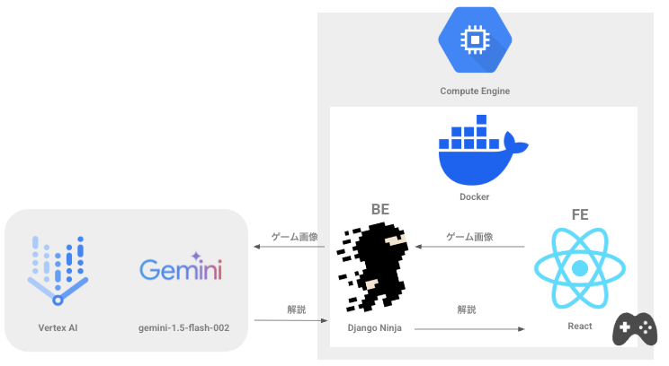

##  AIによるリアルタイム実況(テキスト)付きブロック崩しゲーム

###  1\. プロジェクトが対象とするユーザー像と課題、課題へのソリューションと特徴

####  ユーザー像と課題

  * 本サービスのユーザーは主に40代以降のゲーム愛好者です。
  * 長年ゲームを趣味として楽しんでいる一方で、家族や仕事の事情などにより、一人でゲームをプレイする機会が多い方もいらっしゃると思います。
  * 特にこの年代は、若い頃に友人と一緒にゲームを楽しんでいた経験があるため、一人でのプレイが続くと、楽しさを感じながらもどこか孤独感や物足りなさを覚えることがあると考えます。
  * また、新しいゲームを試す際にも、共感や感動を共有できる仲間がおらず、十分にゲームを楽しめないこともあると思います。

####  課題へのソリューションと特徴

  * 生成AI技術でゲームプレイを解析し、その状況に最適な応援コメントを生成する機能を提供しました。
  * これにより、まるで友人がそばでゲームを見守り、励ましたり称賛したりしてくれているような気持ちになれることでしょう。
  * 本ソリューションにより、ユーザーは孤独感を軽減し、まるで仲間と共にいるかのような温かく満足度の高いゲーム体験を実現できると考えます。

###  2\. システムアーキテクチャ図

  * フロントエンド: React + TypeScript + Vite ブロック崩しゲーム
  * バックエンド: Python + Django + Django Ninja
  * 生成AI: Google Cloud Vertex AI Gemini 1.5 Flash
  * デプロイ環境: GCP Compute Engine (Dockerコンテナ)
  * コンテナオーケストレーション: Docker Compose

###  3\. プロジェクトの 3 分以内のデモYouTube動画

<https://www.youtube.com/watch?v=LE5p4xGLBaQ>

  * 動画ではAI実況コメント生成による、ゲーム状況に応じた応援メッセージをデモンストレーションしています
  * [BGM 魔王魂 村03b](https://maou.audio/game_village03b/)

###  技術的な取り組み

  * フロントエンド部分は、仕事で触ったことがないものの興味のあった React を導入しました。
  * そこまでデザインにこだわる予定はなかったこともあり、class名を考えなくて済む TailWindCSS を導入しました。
  * GCP の環境構築には、gcloud CLI を用いました。 
    * 参考 
      * [gcloud コンピューティングインスタンスの作成 by CLI](https://cloud.google.com/sdk/gcloud/reference/compute/instances/create)
      * [公開イメージからインスタンスを作成する](https://cloud.google.com/compute/docs/instances/create-vm-from-public-image?hl=ja)
      * [使用可能なリージョンとゾーン](https://cloud.google.com/compute/docs/regions-zones?hl=ja)
      * [OS名](https://cloud.google.com/compute/docs/images/os-details?hl=ja)
      * [Image Family](https://cloud.google.com/compute/docs/images/image-families-best-practices?hl=ja)
      * [compute instances にタグをつける](https://cloud.google.com/sdk/gcloud/reference/compute/instances/add-tags)
      * [SSH アクセスするためのファイアーウォール設定](https://cloud.google.com/iap/docs/using-tcp-forwarding?hl=ja#preparing_your_project_for_tcp_forwarding)
      * [VMへのSSH接続](https://cloud.google.com/compute/docs/gcloud-compute/common-commands?hl=ja#connecting)
  * デプロイ環境の選定 
    * 当初は CloudRun によるデプロイを想定しておりました。
    * Docker との相性を考慮し、Computer Engine へ切り替えました。
  * Computer Engine 上で Docker Compose 利用 
    * Computer Engine はデフォルトでは Docker Compose に対応しておりませんでしたが、下記のサイトを参考に、Docker Compose をインストールしました。 
      * [Docker Compose Install the plugin manually](https://docs.docker.com/compose/install/linux/)
  * ローカルの開発環境 / 本番環境 それぞれにおける GCPへの認証 
    * ローカルの開発環境では、[サービス アカウント キー](https://cloud.google.com/iam/docs/keys-create-delete?hl=ja#creating)を利用
    * 本番環境では、認証に必要な情報を環境変数として登録しました。
  * 開発にあたり、下記のAIサービスを利用しました。 
    * [pr-agent](https://github.com/qodo-ai/pr-agent)、[Bugbot](https://docs.cursor.com/bugbot)
      * 個人参加だったため、作成したPRに対しAIによるレビューをおこない、品質の向上に努めました。
    * [Devin](https://devin.ai/)
      * 技術調査結果を Issue にまとめさせたり、苦手なFEの実装のPRの作成させるなどの活用を行いました。

###  今後の展望

  * 今回の開発は、ブロック崩しゲーム + テキストによる応援メッセージにとどまりましたが、今後は、汎用的なゲームへの応用や音声での実況対応に取り組みたいと思います。

以上になります、最後までお読みいただきありがとうございました。

<https://zenn.dev/hackathons/google-cloud-japan-ai-hackathon-vol2>
