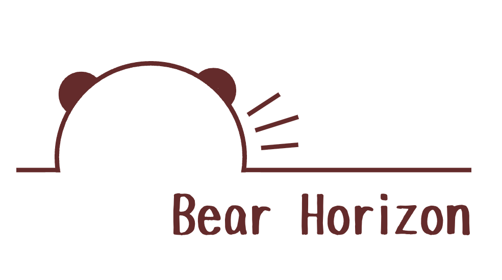
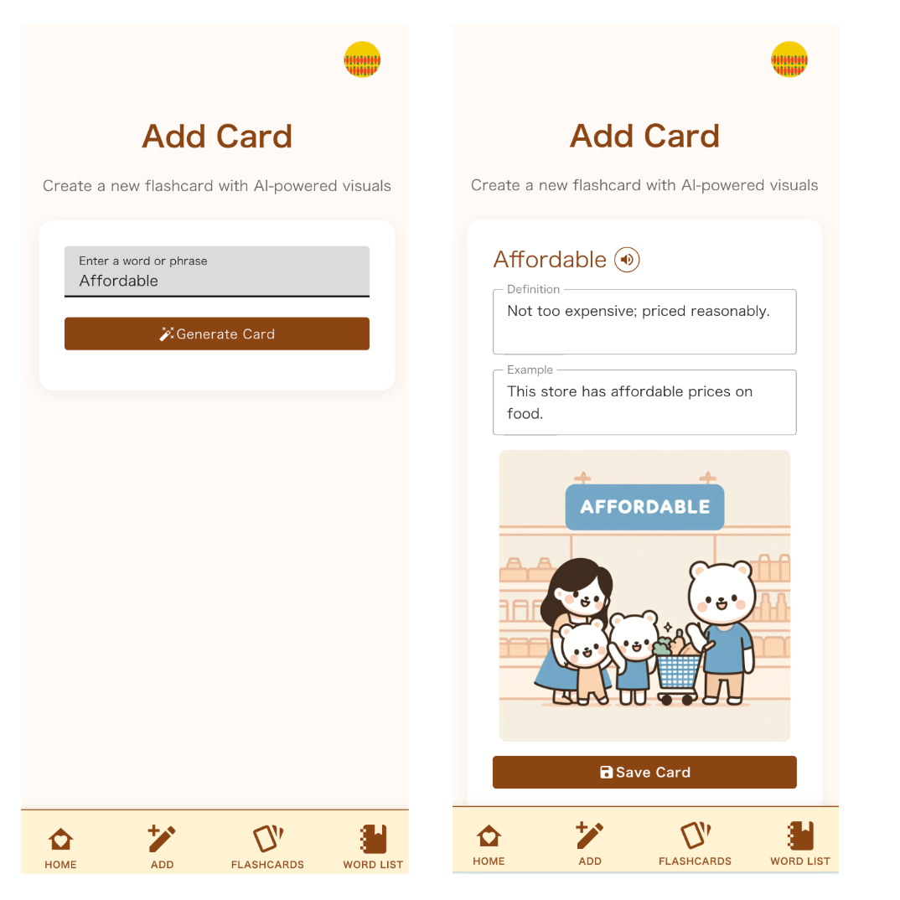
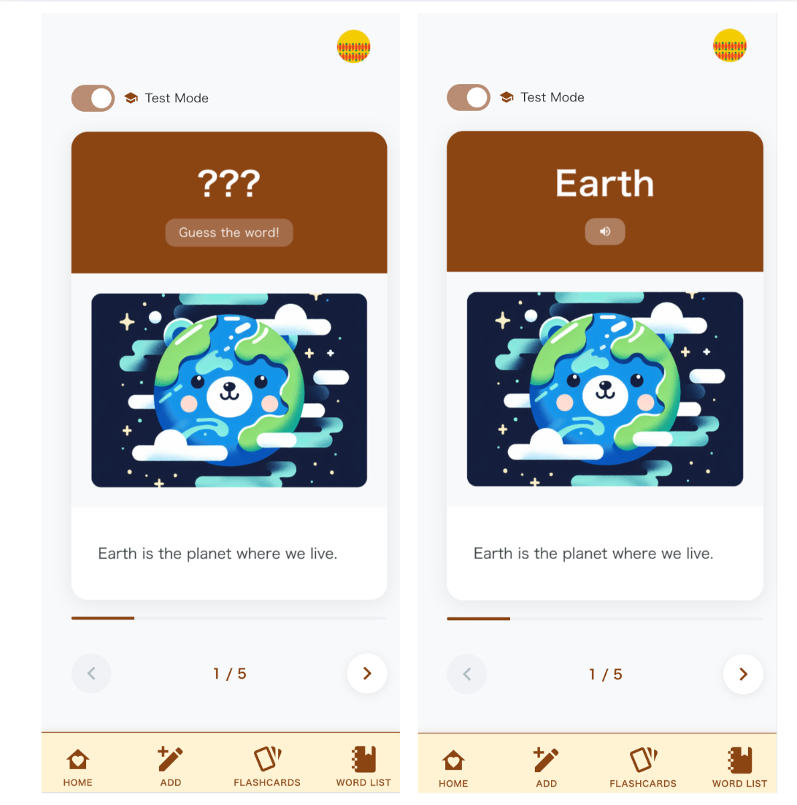
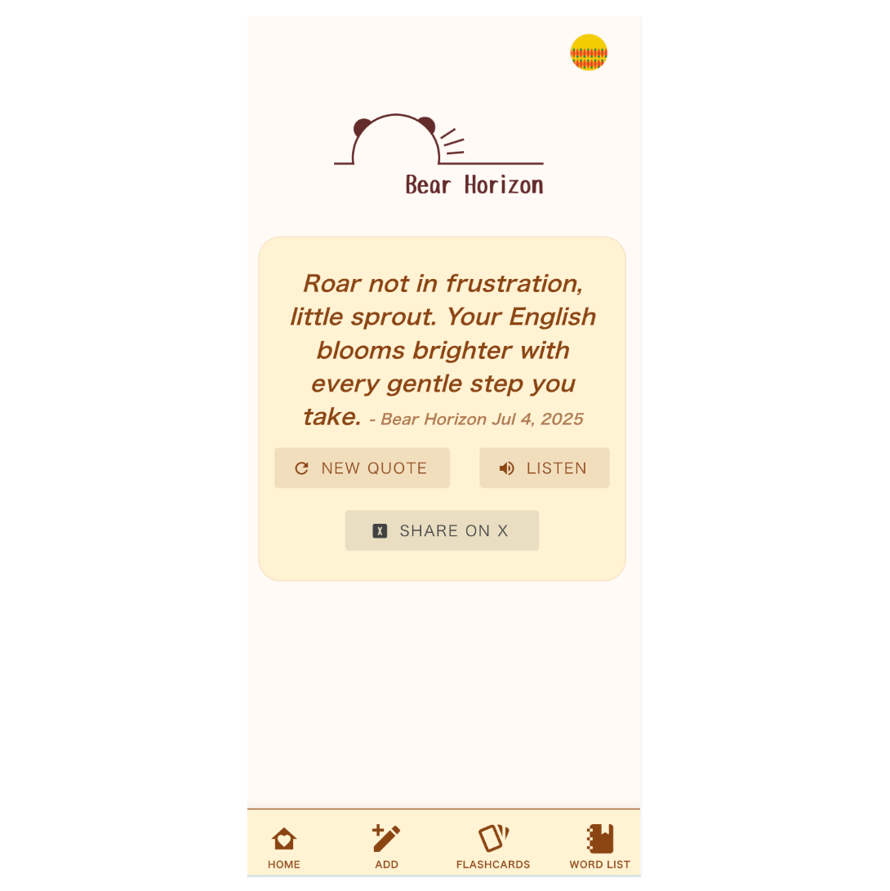
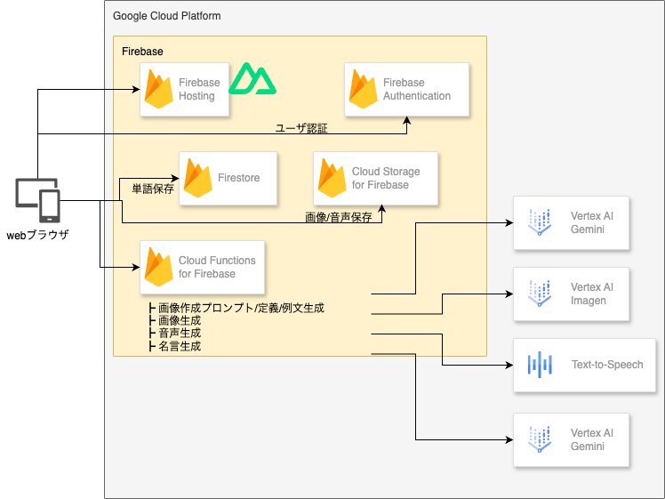

!

この記事は、[第2回 AI Agent Hackathon with Google Cloud](https://zenn.dev/hackathons/google-cloud-japan-ai-hackathon-vol2)提出用の記事です。

#  プロジェクトが対象とするユーザー像と課題

##  対象

  * 英語学習者(年齢問わず)
  * 特に英単語を覚える場面での利用

##  課題

英語学習者が英単語を覚えるときに、つまずきやすいポイントを3つに整理しました。  
いずれも、学習のモチベーションを下げてしまう大きな要因です。

###  課題1. 覚えられない

英単語を覚えようとすると、多くの学習者は「英単語＋日本語訳」をひたすら覚えるという方法に頼りがちです。たとえば、apple = りんご、book = 本 のように、単語と意味をセットで暗記していくスタイルです。  
しかしこの方法では、一時的に「覚えたつもり」になれても、数日後には思い出せないということがよくあります。  
その理由のひとつは、単語にイメージや文脈が伴っておらず、記憶がただの「文字情報」になってしまうからです。また、単語を“点”としてバラバラに覚えてしまうため、頭の中でつながらず、記憶として定着しにくいという側面もあります。

###  課題2. 使えない

たとえ意味を覚えていたとしても、それが実際の会話や文章の中で「使える」状態になっているとは限りません。「知っている」のに「出てこない」、あるいは「出せない」という経験をしたことがある人も多いのではないでしょうか。  
これは、単語を日本語訳とのセットでしか覚えていないことが原因です。使用シーンや言い回し、語感といった情報が欠けているため、アウトプットにつながる実用的な知識として機能しないのです。

###  課題3. 楽しくない

英単語学習は、単調な暗記作業になりがちです。とくに単語帳やアプリでの学習は、毎日似たような画面・同じようなやり取りが続き、達成感も得づらいです。結果として、**「やらなきゃいけない」けれど「やりたくない」**という気持ちになり、継続が難しくなります。  
楽しくない学習は続かず、続かない学習は身につかないのです。

#  課題へのソリューションと特徴

<https://aihackathon2-463515.web.app/>

##  コンセプト

くまの気持ちで、ことばを覚える。  
英語学習というと、つい「がんばるもの」「詰め込むもの」と思いがちです。  
でも、もし学ぶことがもっと自然で、もっとやさしいものだったら？

くまのように、のんびり、直感的に、言葉と出会えたら――。

このアプリは、そんな思いから生まれました。

###  くまの気持ちで覚えるとは？

  * 単語を「覚える」のではなく、「感じる」。
  * 絵やイメージ、状況と一緒にことばを受け取る。
  * 間違えても気にしない。焦らない。くまのペースで、ゆっくり進む
  * 覚えることより、「ことばに触れること」を楽しむ

###  Bear Horizon が大切にしていること

  * くまのひとことが、やさしくあなたを励ましてくれる
  * 単語の意味を、絵とストーリーで自然に理解できる
  * 頭ではなく、こころで覚える英語学習体験
  * 学ぶことが「日課」じゃなく、「ひとときの癒し」になること

英語は、がんばるものじゃなくて、  
好きになるもの。くまといっしょに、ことばの世界を旅しましょう。

##  カード作成

この機能では、新しい単語カードを自分で作成できます。  
英単語を入力すると、簡単な英語を用いた意味と簡単な例文を生成します。  
さらに、AIが自動で視覚イメージ（イラスト）を生成してくれます。

  * 日本語に頼らず、簡単な英語と文脈で理解する
  * 視覚イメージと一緒に覚えるから、記憶に残りやすい
  * 単語の雰囲気・感情・使い方まで、感覚的にインプットできる

##  フラッシュカード

この機能では、イメージイラストを手がかりに、英単語を思い出す練習を行います。  
「単語 → 日本語訳」という一方向の暗記ではなく、  
イメージ → 英語という逆方向のアウトプットを通じて、語彙の定着を深めます。

  * 日本語を介さず、英語のままイメージで思い出すことで、記憶の定着率が高まります
  * 視覚・文脈・感情と結びつけた記憶になるため、実践的な語彙力に変わります
  * AIが自動生成したイラストによって、ことばの印象が深まり、記憶のフックになります

##  Inspiration

この機能では、「くま」の視点から優しく励ます短い英語の名言をAIが自動生成し、音声で聞くことができます。英語学習者が前向きな気持ちで続けられるよう、心温まるやさしいメッセージが届きます。

  * AIがくま視点の優しい励ましの英語メッセージを生成
  * 短くて覚えやすい20語以内の名言スタイル
  * 音声再生でリスニング練習にも最適
  * 毎回違うメッセージで飽きずに学習を続けられる

##  デモ

<https://www.youtube.com/watch?v=tm6oHoGdCjk>

#  システム アーキテクチャ

#  システムアーキテクチャ解説

##  Frontend

  * **Firebase Hosting**  
NuxtJSで開発しました。静的ファイルをホスティングします。

  * **Firebase Authentication**  
Googleログインで、ユーザー認証をします。

  * **Firestore**  
単語データの保存に利用しました。

  * **Cloud Storage for Firebase**  
イメージイラストの画像ファイルと音声ファイルを保存します。

##  Backend

  * **Cloud Functions for Firebase**  
アプリの裏側で動作するサーバーレスAPIとして、各種AI生成処理(意味・例文作成/イメージ作成/音声作成/名言作成)を担います。

##  生成AI

  * **Vertex AI**

    * 単語をもとにした意味・例文作成と画像生成用プロンプトを生成
    * 各種データを扱いやすいようにjson形式で返すよう指示
          
          You are an assistant that generates illustration prompts for English vocabulary learning.
          // 役割を設定します。
          Given a single English word, return a JSON object with three fields:
          // JSON形式で返すようにします。
          1. "simple_definition": A short definition in simple English. Use no more than 10 words.
          // 意味を「簡単な英語」で、10語以内で定義すること。
          2. "image_prompt": A specific and concrete description of a visual scene that illustrates the word’s meaning.
          // 単語の意味を視覚的にわかるように描写するシーンを、具体的かつ詳細に記述する。
          3. "example_sentence": A simple sentence using the word in context.
          // 単語の自然な使い方がわかるような簡単な例文を加える。
          If the input is not a valid English dictionary word, or if it is a non-English word, a made-up word, return an error.
          {"error": "Invalid input. Please enter a single valid English word."}
          Only return the JSON object without any explanation or formatting.
          // 不正な入力だった場合はエラーを返す
          

  * **Vertex AI Imagen**

    * 生成したプロンプトを元に画像生成
    * くまを登場させ、やさしいイラストを生成するよう指示
          
          Create a simple flat-style vector illustration.
          //　シンプルなフラットスタイルのベクターイラストを生成します。
          
          If the prompt includes human characters, replace humans with a bear character.
          // プロンプトに人間が含まれている場合は、人間の代わりにくまキャラクターに置き換えます。
          
          The illustration should be child-friendly, minimalist. Use a pastel or beige background.
          // 子どもにもやさしい印象のミニマルな構図で、背景はパステルまたはベージュ系に統一。
          
          Do not include any text or writing anywhere in the image.
          // 画像内に文字や英単語は一切含めません。
          

  * **Text-to-Speech**

    * 名言や単語の発音を音声合成

##  ソースコード

<https://github.com/michan74/english_bear>

#  今後

このアプリは、より自然で楽しい英語学習体験を目指して、今後以下のアップデートができればと考えています。

###  1\. イラスト生成の精度向上

難しい単語や抽象的な概念にも対応できるよう、生成AIのイラスト精度を強化します。  
より直感的に意味を理解できる視覚教材として、学習効果の向上を図ります。

###  2\. 写真から学べる英語認識機能

ユーザーが撮影・アップロードした写真から、「もの」や「動作」をAIが認識し、対応する英単語・フレーズを提案。日常の中で英語に触れ、実感を伴って覚える学習体験を提供します。

###  3\. フラッシュカードを使った会話レッスン

ユーザーが登録したフラッシュカードをもとにした、AIとの英会話レッスン機能。単語の理解にとどまらず、実際の会話での使い方まで練習できるようになります。
