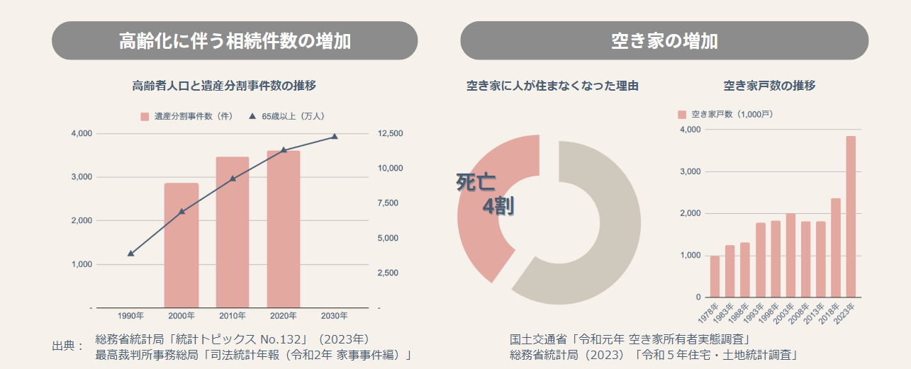
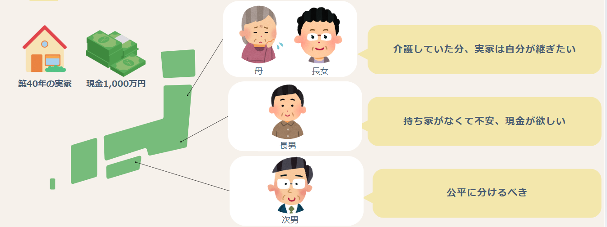
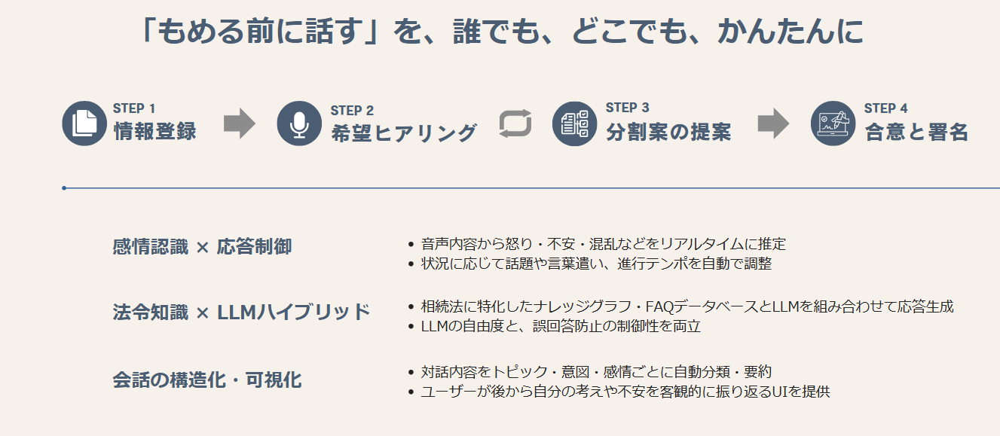
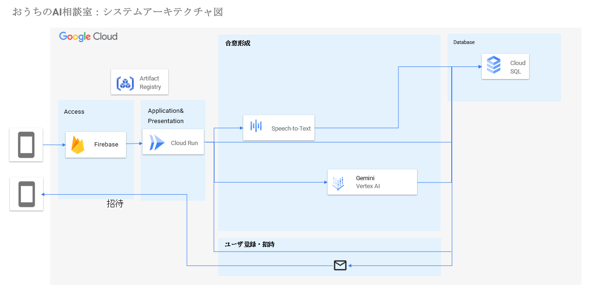
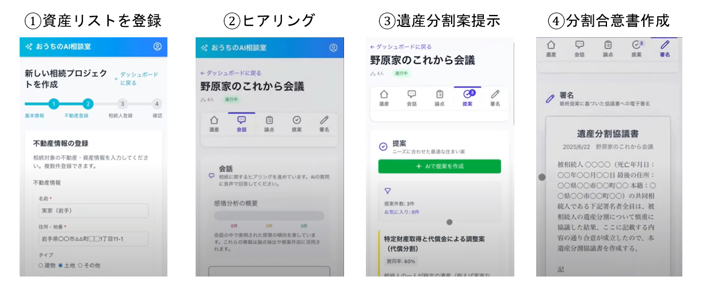

##  デモ動画

<https://www.youtube.com/watch?v=ScN9-Gc0LQk>

##  1\. はじめに

「親が亡くなってから、実家のことを話し合えばいい」──そう思っていた家族が、気づけば相続放棄の期限に追われ、感情のこじれと手続きの煩雑さに立ち尽くす。  
相続や空き家の問題は、多くの日本人にとって「いつか話し合わなければならない」と分かっているのに、「今ではない」と先送りされがちです。法的な手続き、感情的な衝突、時間や距離の壁が重なり、気がつけば社会問題へと発展しています。  
私たちはこの課題に対して、「おうちのAI相談室」という解決策を提案します。これは、家族・行政・専門家の間に立ち、“人間のために気まずい話を先に整理してくれる”新しい形のAIエージェントシステムです。

##  2\. 社会の現実と課題構造

社会の高齢化に伴い65歳以上の人口は右肩上がりに上昇し、それに伴い家庭裁判所での遺産分割事件数も上昇しています。つまり、話し合いがまとまらないケースが確実に増えています。このように実家の処分が決まらず放置されると空き家になります。実際に死亡が原因による空き家は全体の40%になります。  
空き家の数は、急激に増加しており、総務省によると、全国の空き家の数は2023年10月の時点で全住宅の13.8%に当たる約900万戸に上ります。つまり、7軒に1軒が空き家であり、あなたのお隣が空き家でも不思議ではないのです。  
  
さらに2024年4月からは「不動産の相続登記義務化」がスタートし、死亡から3年以内に登記しないと10万円以下の過料が発生する可能性があります。  
しかし、現実には以下のような課題が複合的に存在します：

  * 家族が「何が遺産として残っているかすら分からない」状態から始めるケースが多い
  * 忙しさ、距離、知識のなさが話し合いを妨げ、空き家は数年単位で放置されがち
  * 修繕費や固定資産税が重くのしかかり、行政も負担が増す
  * 相続人の半数以上が60歳以上で、「老老相続」や「数次相続(相続人自身が死亡することでさらに次なる相続が発生する状況)」のリスクが高い
  * 資産価値が低い空き家は相続放棄や管理費、修繕費の滞納に陥りやすい  
これらの問題は、単なる私的問題ではなく、治安や景観、地価、行政コストにも直結する「社会課題」として無視できない状況にあります。

##  3\. ペルソナとリアルなシナリオ

**【野原さん（45歳・東北在住）とその家族】**  
野原さん一家。東北に住む母と野原さん(長女)、東京に住む長男、四国に住む次男。残されたのは、築40年の実家と現金1000万円です。  
  
野原さんは45歳、会社員で中学生の子どもを育てる母親です。最近、同居している母親（74歳）の体調が思わしくなく、会社員の野原さんだけでは、ケアが行き届かないことから介護施設への入居を検討していますが、実家を売却しないと入居費用が賄えない状況です。実家は築40年を超える一軒家です。地方中核都市のJR駅に近く、一時期は空洞化の問題がありましたが、最近では行政がすすめるコンパクトシティにより資産価値もそれほど下落していません。父親は先日他界しましたが、父親名義であった家の相続やその他遺産の話がまだ整理されていません。  
野原さんには2人のきょうだいがいます：

  * 長男（42歳・東京在住）：実家から遠方に住んでいる為、実家に戻ることはなく、東京で持ち家を持ちたいと考えています。今回の遺産相続で現金をもらい持ち家の頭金にできないかと考えているが、家族に遠慮してはっきり言えていない状況です。
  * 次男（39歳・四国在住）：遠方に住んでいる為、今後も母親の介護などは任せたいと考えています。相続は公平に分けるべきだと思っています。
  * 母（74歳・実家に長女の家族と同居）：終の棲家を手放すことに心理的抵抗を抱えています。父親や母親の介護をしてくれている長女に実家を譲りたいと考えています。

野原さん家族は、決して経済的に裕福な家庭ではありませんでしたが、子供のころから家族5人で週末はドライブに出かけたり、クリスマスのイベントなども欠かさず家族で過ごすなど仲良い家庭でした。きょうだい間も仲良く、子供のころはよく一緒に過ごしましたが、高校卒業と同時に各自が都会に出ていき、またそれぞれが家庭を持ち、それぞれの生活に忙しくなる中で、両親を介した会話が主になり、お互いに少しよそよそしい雰囲気が流れています。  
この3人（野原さん、長男、次男）＋母の4人が本件の話し合いに関わっています。  
LINEグループでは、野原さんが実家を継ぎたいという事も遠慮してはっきり言わず、長男、次男は、実家への愛着は薄く、母親も本音を話しづらく、話は平行線のまま。介護のタイミングと不動産の整理が重なり、「誰がどこまで責任を持つのか」「そもそも何を持っているのか」すら曖昧なまま、月日だけが過ぎていきます。  
相続放棄期限や登記義務のリミットが近づく中で、野原さんはどこから着手していいのか見えずにいます。何から手をつければいいのか分かりません。母親も、介護施設入居に費用がかかることは理解しつつも、昭和50年に嫁入りした際も持参した箪笥や子供たちが練習をしたピアノなど、亡き夫子供たちの思い出が詰まった家を失うことは大きな不安となっています。  
家族LINEでは話題が出るたびに話が逸れ、3か月が過ぎたころには「相続放棄期限」が迫っていました。法的な焦燥感と感情のこじれが、家族の関係に見えないひびを入れていきます。

あなたは、親と相続の話をしたことはありますか？  
もし“実家をどうするか”を話し合うのが気まずいと感じていたら、それはあなただけではありません。

##  4\. 提案するソリューション：おうちのAI相談室

この課題に対し、「おうちのAI相談室」は次のようなAI機能を備えたスマートフォンアプリベースの対話型支援システムです。家族の感情、資産情報、手続きをすべて一貫して支援します。  
  
**< 主な機能>**  
**1.情報登録機能**  
相続人の一人がプロジェクトのオーナーとなり、相続案件を一つのプロジェクトとして登録します。  
不動産や金融資産などの遺産情報、相続人情報を入力し、相続人のメールアドレスを登録し、他の相続人をアプリに招待します。

**2.希望ヒアリング機能**  
AI相談員が相続人毎ヒアリングを行い、各相続人の希望や譲れないポイント、妥協ポイントなどを確認します。  
相続人は音声入力により、AI相談員に要望を伝えます。  
AI相談員は、音声内容から怒り・不安・混乱などを推定するとともに、ヒアリング内容をベースに論点を抽出します。

**3.分割案の提案機能**  
相続法に特化したナレッジグラフ・FAQデータベースとLLMを組み合わせたAIによる法的観点に基づいた情報を参考に家族の発言・主張・希望を感情分析します。  
対話内容をトピック・意図・感情ごとに自動分類・要約を行い、会話の構造化・可視化を行うことにより、ユーザが後から自分の考えや不安を客観的に振り返ることができます。  
各相続人のヒアリング内容を元にAI相談員が遺産分割案を作成し、それぞれのメリット、デメリット、労力・手間、コストなどを中立的な立場で表示し、それぞれの案の賛同率を表示し、最適な遺産分割案を選択します。  
相続人の合意が取れない場合は、再度、ヒアリングのステップに戻り、ヒアリングを行います。合意形成が取れる案になるまでこのステップを繰り返します。  
相続人の合意がとれる案になると協議書作成ステップに移動します。

**4.合意と署名機能**  
合意した内容をベースに遺産分割協議書をAIが自動作成します。  
遺産分割協議書内容を確認し、修正がある部分は文言の修正行い最終化します。全ての相続人がアプリ上で電子署名を行います。  
相続人の全ての署名が完了し、印刷すると遺産分割協議書が完成します。

これらの機能は、スマートフォンのアプリを通じて家族全員と対話しながら進行します。

##  5\. システム構成とアーキテクチャ

本システムは、以下のような技術構成で実現されます：

  * LLMによる自然言語処理と感情分析：Vertex AI
  * 資産情報は発話内容などのインプット情報を蓄積する：Cloud SQL
  * Docker管理：Artifact Registry
  * ユーザ認証：Firebase
  * サーバレス環境：Cloud Run  
※以下に図解を掲載（「おうちのAI相談室 アーキテクチャ図」）  

##  6\. デモ動画：家族ポータルの動作例

3分以内のYouTube動画では、以下のような操作が確認できます：

  * 資産リストを登録（①）
  * 家族がメールの招待リンクでポータルに参加
  * AI相談員が各自に希 望ヒアリングを実施し論点整理を行う②）
  * 遺産分割案を提示し、各相続人のリアクションを見ながら調整を行う（③）
  * 遺産分割合意書を作成する（④）  
  
YouTubeリンク：  
<https://www.youtube.com/watch?v=ScN9-Gc0LQk>

##  7\. このプロジェクトが目指す未来

おうちのAI相談室は、単なる“相続専用のITツール”ではありません。人が言い出しにくい、でも本当は話さなければいけない──そんな“家族の難しい会話”を、AIがそっと橋渡しするインフラを目指しています。  
私たちはこのプロジェクトを、相続の枠を超えた“家族AI相談”のプラットフォームへと進化させていきます。

####  今後は：

**介護・看取り・相続・墓守など、ライフステージ全体の悩み**  
**離婚や親子関係、遠距離介護などの心理的負担が大きい対話**  
**発達障害やひきこもり、老老介護など福祉に関する家族の意思決定**  
こうしたテーマにも対応できる、“家族対話の伴走（エージェント）AI”として拡張していきます。

####  さらに：

地方自治体との連携による「家族AI相談窓口」の設置  
海外居住者や多言語対応による国境を越えた家族支援  
プライバシーと同意管理の強化による「相談できるAI」の信頼性確保  
を進めながら「どんな家族の話題も安心して話せる社会」を実現したいと考えています。  
家族のあいだに“問い”が生まれたとき、その横にそっと居るAIでありたい──それが、私たちの目指す未来です。

##  8\. おわりに

「いつか話せればいい」──そう思っているうちに、家族の時間は少しずつ過ぎていきます。でも本当は、誰かが“きっかけ”をくれたなら、話し始められる人たちがたくさんいるのではないでしょうか。  
おうちのAI相談室は、そんな“最初の一言”を一緒に探すための存在です。  
相続だけでなく、介護や暮らし、家族にまつわるすべての対話を、AIがそっと支える社会へ。  
あなたの家族にも、話せていないことはありますか？  
このページを閉じたあと、ふと誰かにリンクを送りたくなる。  
そんな未来を、私たちはAIと一緒に育てていきます。

※この記事はGoogle Cloud AI Hackathon Vol.2にて発表予定のプロトタイプに基づいて作成しています。
