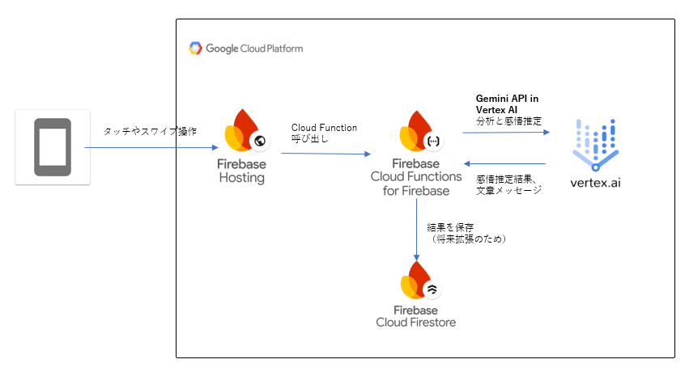

#  ベビタ: タッチで遊ぶ、赤ちゃん向けフィードバックアプリの開発記録

赤ちゃんが画面を触るだけで、色や音が反応する──そんなやさしくて直感的なアプリを目指して開発したのが「**ベビタ** 」です。  
本記事では、プロジェクトの背景から設計・実装の詳細、またユーザー体験の工夫まで、Zenn読者向けに丁寧に解説していきます。

* * *

##  ０\. 背景

子供が生まれて半年ほどたったころ、子供がスマートフォンに興味を持ち始めました。私たち両親が常にスマホを触っているのを見て、自分もやりたくなったようでした。画面をバンバン叩いたり、カメラアプリを起動して使わせてみると自分が写ってるのを見てキャッキャッと笑う姿を見て私も楽しんでいました。  
少し経った頃、ふと簡単なアプリを作って遊ばせてみたくなりました。そこで、タッチすると色と文字がランダムで変わるだけの、本当に簡単なアプリを作ってみたところ、キャッキャと遊んでくれたので、とてもうれしく思いました。  
それからしばらくの間は遊んでくれていたのですが、しだいに飽きたのかどんどん遊ばなくなりました。  
赤ちゃんの成長は本当に早く、次々と新しいことを覚えてしまうので、赤ちゃんの発達に合わせてアプリを改善していくのはとっても難しそうだなと思いました。

そんなとき、第2回 AI Agent Hackathon with Google Cloudの開催を知り、

  * AIを用いてある程度アプリが自動的に進化するようなものが作れるのではないか
  * このイベントをモチベーションにアプリの質を高めていけるのではないか

と考え、この記事を書くに至りました。

##  Ⅰ. ユーザー像と課題、ベビタのソリューション

###  想定するユーザー像

  * 生後6ヶ月〜2歳程度の乳幼児とその両親
  * タブレットやスマートフォンに初めて触れる子どもたち
  * 親子で遊びながら感覚発達や反応を楽しみたい家庭

###  抱えていた課題

  * 市販の赤ちゃん向けアプリは "パターン化された映像" の再生が多く、インタラクション性が少ない
  * 子どもが無意識に触った操作をどう意味づけてよいのか分からない
  * 保護者が「子どもの遊び方の変化」や「興味の方向性」を知る術が少ない

###  ベビタのソリューションと特徴

  * **操作に即反応する色と音** ：タップ・スワイプ・長押しに対して色と音階で反応
  * **Cloud Functions + AI による意味づけ** ：一定回数の操作ごとにFirebase経由でAI解析し、現在の傾向に基づいた感情の推定と赤ちゃんへのメッセージを表示
  * **ローカルデバイスにおけるニックネーム・性別・誕生月の登録** ：個人情報をクラウド保存せず、プライバシーに配慮しながら個別体験を提供

ベビタは、「**赤ちゃんの好奇心や感情の動きを、優しく受け止めてフィードバックする** 」ことを意識した設計となっています。

* * *

##  Ⅱ. システムアーキテクチャ

本プロジェクトは、Firebaseを基盤としたSPA（Single Page Application）として実装されており、主に以下の構成から成り立っています。

###  使用技術の概要

技術 | 用途  
---|---  
React (TypeScript) | UI 実装・状態管理  
Audio API (Web Audio) | 効果音や和音の再生  
Firebase Hosting | PWAのホスティング先  
Firebase Functions | ユーザ操作をトリガーにAI解析とログ保存を実行  
Gemini in Vertex AI | AI解析  
Firebase Realtime DB (optional) | ログ保存や今後の学習データ用途を想定  
  
###  主なデータフロー

  1. ユーザーのタッチ操作を Reactアプリで検知
  2. 操作情報はアプリ内に蓄積され、即時的な色・音で応答
  3. 操作が一定件数溜まると、Cloud Functions に履歴を送信し、AIが emotion + message を返す
  4. 画面上にメッセージ（例："探検が好きみたいだね！"）を表示し、次の色・音の応答にも影響を与える

この設計によって、インタラクション→意味づけ→次の体験へのフィードバックループを実現しています。

* * *

##  Ⅲ. 実装の工夫とUIデザインのポイント

###  視覚的・聴覚的な安心感

赤ちゃんが予期しない触り方をしても「不快な音や色」が出ないように設計しています。どの操作でも柔らかく明るいトーンの色彩と音を返し、探索意欲を促進します。

###  AudioPlayer による優しい音

`sine`波を使ったAudio API制御で、刺激が強すぎない音を再現。和音（コード）演奏機能を組み込んで、タッチの重なりにも対応しています。

###  メッセージの履歴表示

Cloud Functionから返されたメッセージは、画面右上に一定時間表示されるとともに、後から履歴として確認できるようにしました。メッセージを直接赤ちゃんは理解できませんが、両親等の大人が見て楽しめる工夫として対応しています。

###  Geminiの能力に頼って感情推定とフィードバック実装を省力化

<https://github.com/mikkikimasutaro/babytouch/blob/main/functions/src/index.ts#L51-L64>

感情推定とフィードバックのロジックはほぼプロンプトのみで実現しています。  
これは、アプリとして、感情推定の精度を高めることではなく、推定した結果をAIが言葉にしてくれることによって、親子のコミュニケーションの橋渡しになることを目指しているため、汎用的なAIによって代替可能かつ実装難易度の高い部分を省力化しました。

* * *

##  Ⅳ. デモ動画：実際の動きは？

実際の操作感は、以下の動画でご覧いただけます。

<https://www.youtube.com/watch?v=StbSd_r5gno>

タップ、スワイプ、長押しによって変化する色と音の反応。操作を重ねることでAIメッセージが表示される流れもぜひ確認してみてください。

* * *

##  Ⅴ. 今後の展望

自分の体験から発生したベビタのアプリですが、ハッカソンへの提出をモチベーションに品質を高めることができました。このアプリが自分たち親子以外にも使ってもらえるものであるなら、社会に対して貢献するより本格的なものとして進化させていきたいです。

###  Firestore上に蓄積した履歴を集計し、集計結果を別ページで公開する。ユーザ間でのコミュニケーションを促進し、親の孤独感解消に貢献する。

「育児期の親の孤立」が大きな社会課題として注目されています。厚生労働省の調査（2021年）によれば、育児中の母親のうち約4割が「育児について相談できる人が少ない・ほとんどいない」と回答しており、特に核家族化・地域社会の希薄化が進んだ都市部では深刻です。

また、国立成育医療研究センターの調査（2022年）では、コロナ禍以降に育児ストレスを強く感じる親が増え、「子どもと2人きりで過ごすことが多く、不安や孤独を感じやすくなった」という声が多数寄せられました。

こうした状況に対して、「自分の子どもの遊び方の傾向を他の家庭と比べてみたい」「他の親の体験を知りたい」といった自然な好奇心をきっかけに、親同士がゆるくつながる機会を生み出すことを目指したいです。操作履歴の集計や傾向表示を共有することで、他者との比較や発見が生まれ、「ひとりじゃない」と感じられる環境づくりに貢献できると考えています。

###  AIによる分析を高度化、成長度合いを科学的に分析する機能を実装し、子供の成長実感や親の不安解消に貢献する。

近年はスマホやタブレットのタッチ行動に関する研究が多く存在し、インタラクションログを通じて発達段階や感情反応を推定するアプローチも注目されているようです。

Y. Nakano et al., "Inferring Infant Curiosity via Touch Patterns on Tablet Interfaces," ACM IDC 2022

S. Tamura et al., "Detecting Engagement in Toddlers using Multimodal Interaction Logs," IEEE RO-MAN 2021

これらの知見を踏まえ、「触り方」や「継続性」「部位」などのログを設計修正し、AIの意味づけを科学的根拠に基づいたものにすれば、子供の成長実感や親の不安解消に貢献できるのではないかと考えています。

* * *

##  おわりに

ベビタは、「赤ちゃんの興味に寄り添う、親子のコミュニケーション」アプリとして構想されました。

今後も改善・検証を重ね、親子のふれあいをサポートするやさしいデジタル体験を追求していきます。

(Link)

  * アプリURL： <https://babytouch-63ad3.web.app/>
  * アプリ紹介Youtube : <https://www.youtube.com/watch?v=StbSd_r5gno>
  * zenn 記事 : <https://zenn.dev/articles/aae52e44fb2d12/>
  * Github : <https://github.com/mikkikimasutaro/babytouch/>

