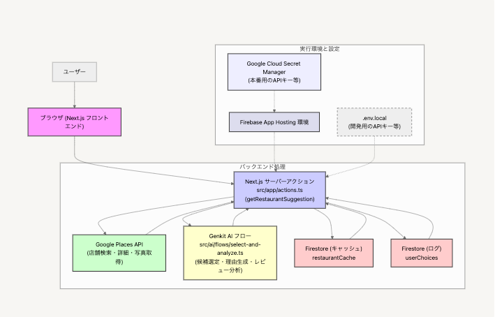
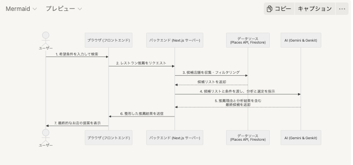
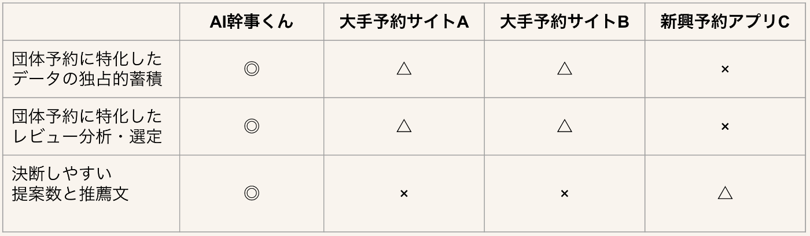
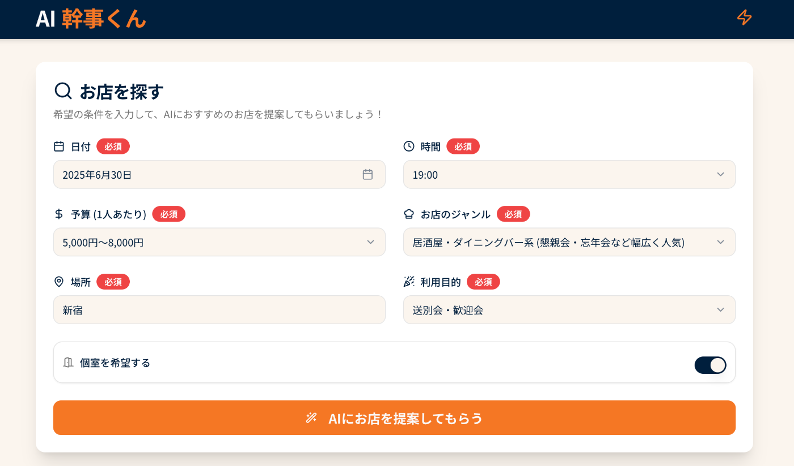
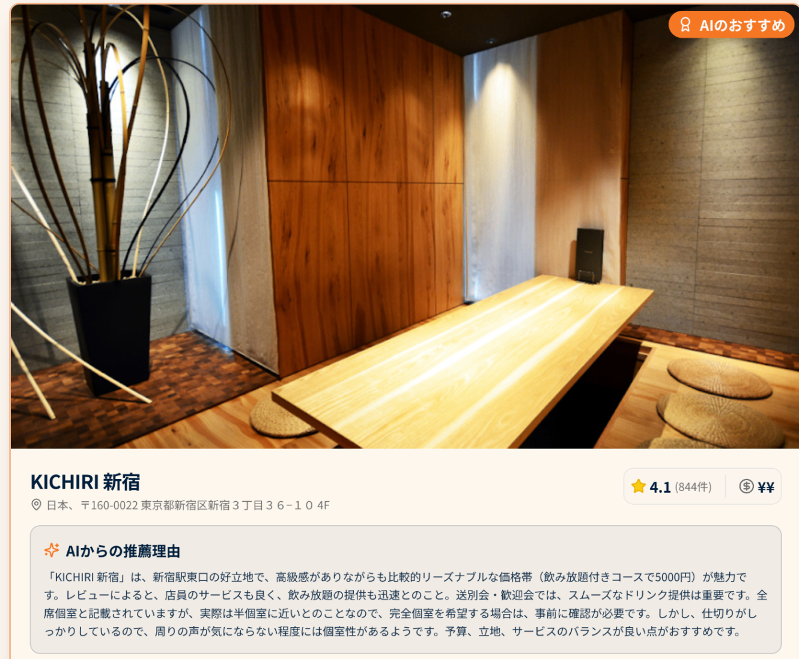
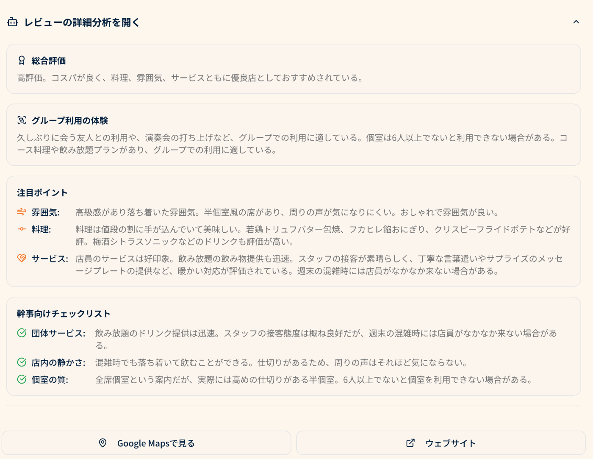

<https://youtu.be/f4bW53gbMEE>

##  1\. 背景：団体予約という「見えない労働」の実態

「今度の歓送迎会、○○さんが幹事よろしく！」

この一言で始まる団体予約の苦労を、経験したことがある方は多いのではないでしょうか。  
20代・30代の若手社員にとって、幹事業務は避けて通れない道です。しかし、その裏側では想像以上の時間と労力が費やされています。

###  数字で見る幹事業務の実態

カシキル社が実施した会社飲み会の幹事経験者300名を対象とした調査（2018年）によると、

**幹事業務により63.7%が残業** を経験し、**その準備時間は約4割の人が3時間以上** も費やしています。  
更に70.0%が就業時間外でも店舗検索を行っており、**幹事に抵抗を示す人も増えています。**

###  なぜこんなに時間がかかるのか？

**1\. 情報の非構造化問題**

団体予約に必要な情報は、Webサイト上に散在しており、統一されたフォーマットで提供されていません。「個室あり」や「団体OK」といった表記や情報が異なります。

**2\. 口コミの信頼性問題**  
グルメサイトの情報では団体利用に適した店舗かの判断が困難で、大人数での利用に必要な評価、レビュー情報の収集に時間がかかります。

**3\. 幹事側の責任の重圧**

店選びの失敗を避けたい心理と、多様な参加者の要望への対応の難しさが、決断を遅らせる要因となっています。

##  2\. 現状の課題：既存サービスの限界と構造的問題

###  既存飲食店予約サービスの分析

現在の主要な飲食店予約サービスは、それぞれ以下のような特徴と限界を持っています。

**大手予約サイトA**

  * 強み：圧倒的な掲載店舗数（全国85万店舗）
  * 弱み：団体向けフィルタリング機能の不足、情報の信頼性への懸念

**大手予約サイトB**

  * 強み：ポイント還元システム
  * 弱み：クーポンやポイント目当ての予約が多く、実際の満足度や店選びの参考になりにくい

**新興予約SNSアプリC**

  * 強み：写真や口コミから雰囲気を直感的に把握できる
  * 弱み：団体向けのレビューや投稿が不足

###  根本的な構造問題

**1\. ビジネスモデルの矛盾**  
広告収入重視で、広告料を多く払う店舗が優遇される仕組み。  
ユーザーの利益より広告主の利益が優先される。

**2\. データの分散**  
各サービスが独自データを保有し、横断比較ができない。  
団体利用の実績データも蓄積・活用されていない。

**3\. 意思決定サポートの不在**  
膨大な選択肢から最適解を見つける作業が完全に幹事任せ。  
判断基準や比較フレームワークが提供されていない。

##  3\. 市場分析：なぜ今、AI幹事くんが必要なのか

###  マクロトレンドの変化

**働き方改革の影響** ： リモートワーク普及により、限られた対面機会の価値が向上  
**世代交代** ： ミレニアル・Z世代が求める「効率性」と「体験価値」の両立ニーズ  
**AI技術の成熟** ： 大規模言語モデルとAPI活用の実用化が可能に

##  4\. ソリューション：AI幹事くん - 団体予約エージェント

###  コア・バリュー：AIが提供する3つの価値

AI幹事くんは、以下の3つのコアバリューで、面倒な団体予約を「楽しく、確実な体験」へと変革します。

###  1\. 「終わらない情報収集」からの解放

面倒な検索・比較作業をAIが肩代わりします。利用目的や予算などの簡単な条件を伝えるだけで、AIが膨大な選択肢から最適な数店舗を厳選。幹事は「探す」のではなく「選ぶ」ことに集中でき、情報収集にかかる時間を劇的に削減します。

###  2\. 「信頼できない口コミ」からの脱却

AIがレビュー情報を分析し個人利用とは異なる「団体の利用に適しているか」という幹事目線で分析。「料理」や「サービス」はもちろん、「個室の質」「店内の騒がしさ」といった、団体利用ならではのチェックポイントまで可視化。口コミの海から、意思決定に必要な「確かな情報」だけを掬い上げます。

###  3\. 「説明責任」という重圧を「自信ある提案」へ

なぜそのお店が推薦されたのか、AIが具体的なレビュー内容を根拠に「なぜその店を選んだのか」を明確に言語化します。 **これにより、幹事は「なんとなく良さそう」ではなく、「こういう理由で、今回の会に最適だと判断しました」と** 自信を持って参加者に説明できます。AIによる客観的な提案が、幹事の意思決定を力強く後押しします。

###  技術アーキテクチャと選定理由

**システム全体構成**  

  * **フロントエンドとバックエンド (Next.js)**

**Next.js** と **TypeScript** を採用。特に**サーバーアクション** を活用することで、別途APIサーバーを構築することなく、フロントエンドから安全にサーバーサイドのロジックを呼び出すことが可能です。これにより開発速度を大幅に向上させました。

  * **AIモデル (Gemini & Genkit)**

Googleの高性能な**Gemini** モデルを、AI開発フレームワーク**Genkit** 経由で利用。複雑なプロンプトの管理や、構造化されたデータ（JSON）の出力が容易になり、レビュー分析やおすすめ理由の生成といった複雑なタスクを安定して実行できます。

  * **データ基盤 (Firestore & Google Places API)**

店舗情報の検索には**Google Places API** を利用し、常に最新で信頼性の高い情報を担保。 取得したデータは**Firestore** にキャッシュすることで、APIの呼び出し回数を抑え**ランニングコストを削減** するとともに、ユーザーへの高速な応答を実現しています。

  * **デプロイと運用 (Firebase App Hosting)**

**Firebase App Hosting** を採用し、ビルドからデプロイまでを自動化。APIキーなどの機密情報は **Google Cloud Secret Manager** で安全に管理しており、セキュアで運用しやすい構成となっています。

###  団体予約に適したお店の検索〜提案を実現する処理フロー

**シーケンス図**  

**フロー解説**

  1. **検索条件の入力とリクエスト** :  
ユーザーがブラウザで希望条件（予算、場所、利用目的など）を入力し、検索を開始します。フロントエンドはこれらの条件をまとめて、バックエンドの`getRestaurantSuggestion`サーバーアクションを呼び出します。
  2. **一次検索 (`textSearchNew`)**:  
まず、Google Places APIを使い、入力された条件（例：「新宿 居酒屋 懇親会」）に合致する可能性のある店舗を最大20件リストアップします。
  3. **機械的フィルタリング (`filterAndScoreCandidates`)**:  
次に、リストアップされた20件の候補の中から、評価が低い、レビュー数が少ないといった店舗をプログラムで除外します。その後、独自のスコアリングで有望な候補を最大5件まで自動で絞り込みます。これにより、質の低い候補をAIに渡すことなく、処理の効率と精度を高めています。
  4. **詳細情報取得とキャッシュ (`fetchAndCacheDetails`)**:  
絞り込んだ最大5件の候補について、まずFirestore上のキャッシュを確認します。キャッシュがあればそれを使い、なければGoogle Places APIからレビュー本文などの詳細な情報を取得します。取得した情報は、次回の検索を高速化しAPIコストを削減するために、Firestoreにキャッシュとして保存します。
  5. **AIによる選定・分析 (`selectAndAnalyzeBestRestaurants`)**:  
ここがAI幹事くんの心臓部です。収集した店舗の詳細情報とユーザーの利用目的を、**Genkit** で構築されたAIフローに渡します。このフローが「利用目的に最適な店の選定」「おすすめ理由の生成」「レビューの詳細分析」という3つのタスクを一度に実行し、ただの店舗リストではない、リッチな提案情報を生成します。
  6. **最終結果の整形と表示 (`assembleFinalResults`)**:  
AIからの推薦情報に写真URLやGoogleマップのリンクなどを追加し、ユーザーに分かりやすい最終的な提案の形にまとめます。もしAIが適切な店舗を選べなかった場合でも、機械フィルタリングで最上位だった候補を代替案として提示するフォールバック機能も備えています。

###  ユーザー体験の設計思想

AI幹事くんは、幹事の心理的な負担を軽減し、一連のタスクをスムーズに完了できるよう、以下の3つの設計思想に基づいています。

**1.プログレッシブ・ディスクロージャー（段階的開示）**

ユーザーが一度に多くの情報に圧倒されないよう、必要な情報を必要なタイミングで提示します。

  * **入力フォーム** : 最初に表示されるのは、検索に必要な条件を入力するためのシンプルなフォームです。ユーザーはまず「何を探しているか」というタスクに集中できます。
  * **おすすめ結果の提示** : 検索が完了すると、AIが選んだ店舗の概要とおすすめ理由が分かりやすく表示されます。まずは最も重要な「どの店がなぜ良いのか」を直感的に理解できるようにしています。
  * **詳細分析への展開** : レビューの詳細な分析内容や「幹事向けチェックリスト」といった専門的な情報は、アコーディオンUIの中に格納しています。 ユーザーは興味を持った店舗について、自らの意思でクリックして詳細を確認できます。これにより、いきなり全ての情報を見せられて混乱することを防ぎ、スムーズな意思決定を促します。

**2\. コンテキストを意識したインタラクション**

AIは、ユーザーが入力した「利用目的」の文脈を理解し、提案の仕方や言葉遣いを柔軟に変化させます。

  * **カジュアルな会（例：チームの打ち上げ）** : より親しみやすい言葉遣いで、コストパフォーマンスや盛り上がりを重視した提案を行います。
  * **フォーマルな会（例：接待・会食）** : 丁寧な言葉遣いで、お店の雰囲気やサービスの質、個室の格といった点を重視した、信頼性の高い情報を提供します。

**3\. 失敗から学び、成功体験を次に活かすフィードバックループ**

ユーザーの選択は、AIにとって貴重な学習データとなります。

  * **選択ログの活用** : ユーザーが最終的にどの店舗の「Google Maps」や「ウェブサイト」ボタンをクリックしたかを`userChoices`コレクションに記録します。
  * **「人気のお店」への反映** : 蓄積された選択ログは、「みんなが選んだお店」としてトップページに表示されます。 これにより、他のユーザーの成功事例を参考にすることができ、次の幹事業務への心理的ハードルを下げます。

##  5\. 競合優位性と差別化戦略

###  競合分析マトリクス

**1\. データ蓄積効果** \- 団体予約特化データの独占的蓄積によるネットワーク効果  
**2\. AI専門性** \- 団体予約・日本の飲み会文化に特化したレビュー分析  
**3\. UX最適化** \- 幹事業務に特化したUI設計と決断しやすい提案システム

##  6\. デモシナリオ

**シナリオ例：新宿にて営業部の歓送迎会**

**1.初期入力**  
  
日付・時間・予算・ジャンル・場所・利用目的を入力し、「AIにお店を提案してもらう」ボタンをクリック。

**2.飲食店提案**  
  
飲食店の提案が表示され、それぞれ写真と推薦理由の概要が表示。

**3.推薦理由の詳細確認**

  
団体予約の際に見るべきポイントを利用目的に合わせ、レビュー抽出し、要約。

##  7\. まとめ：すべての幹事に「また幹事やりたい」を

AI幹事くんは、テクノロジーの力で人々の「集い」を再定義します。

団体予約という見過ごされてきた課題に真正面から取り組み、AIの力で解決することで、私たちは新しい価値を創造します。それは単なる時間の節約ではなく、人々のつながりを深め、組織を活性化し、社会をより豊かにする取り組みです。

「また幹事をやりたい」「次はどんな店にしようかな」そんなポジティブな気持ちが生まれる世界。それが、私たちAI幹事くんチームが目指す未来です。

幹事の苦労が報われ、参加者全員が笑顔になれる。そんな当たり前の幸せを、テクノロジーの力で実現していきます。
