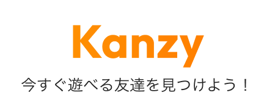
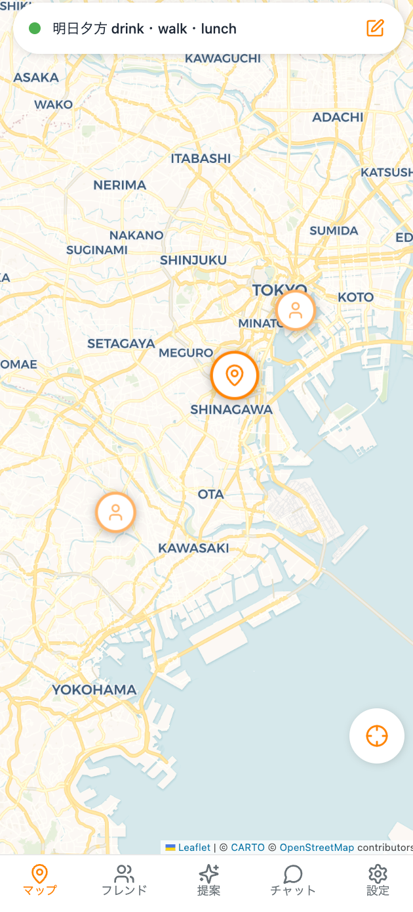
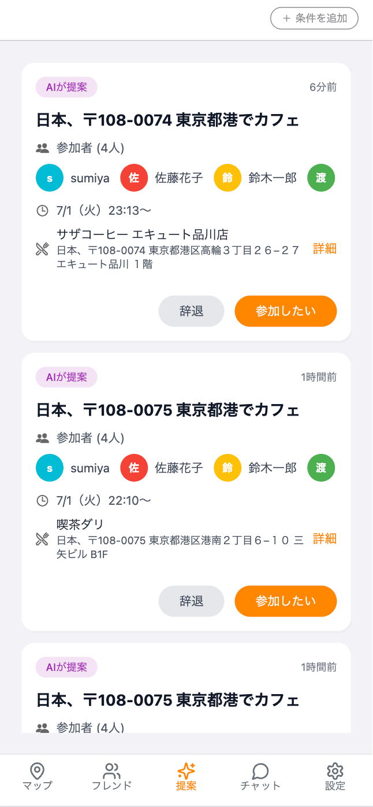
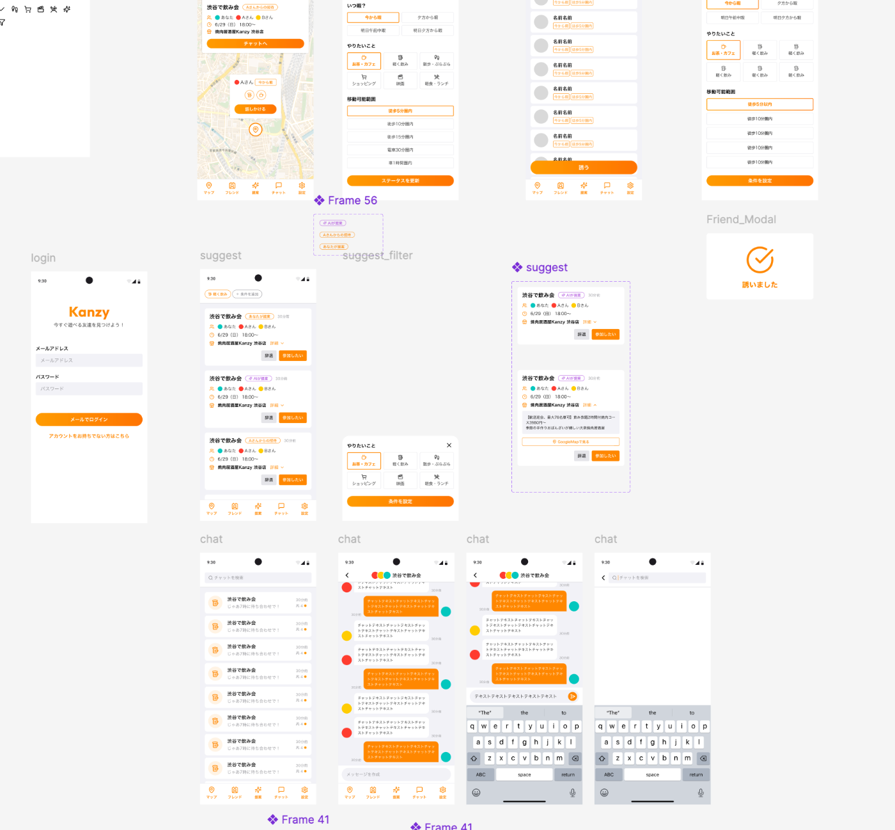

こちらは "第2回 AI Agent Hackathon with Google Cloud" ハッカソンに向けて作成したプロダクトです。

!

こちらの記事はAIによって文章校正・推敲を行っていますが、人間によって文章を作成した記事となっています。

#  コンセプト

ふと予定が空いた瞬間、  
「今ヒマな友だちは誰？」「集合場所はどこ？」「店を決めるの面倒…」  
――そんな調整の煩わしさが、遊びの機会を奪っています。

Kanzy は 位置情報 SNS に 生成AI 幹事 を掛け合わせ、  
1タップのステータス更新だけで

  1. ヒマな友人を自動マッチング
  2. 集合地点とおすすめ店舗を即提案
  3. 専用チャットを自動生成

までを一気に完了。  
面倒な「誘い・調整・店決め」はすべて AIが引き受け、  
あなたは今すぐ遊びにいくだけ。

というそれっぽいコンセプトのもと作成しましたが、  
いわゆるzen○yと言った位置情報共有アプリに、幹事を代行してくれるAI-agentが乗っかったら？？  
そんな単純な思想からアプリを目指して開発を始めました。

#  デモ画面

<https://youtube.com/shorts/XKR1OW2PkeA?feature=share>

#  ハッカソン用の説明文

##  プロジェクトが対象とするユーザー像と課題、課題へのソリューションと特徴

**ユーザー像**

  * 突然予定が空いて、今日もしくは明日「誰かと会いたいな」「誰かと飲みたいな」と考えている人
  * 調整が面倒で、ひとまず全員にLINEで「暇？」と友人にいっぱい送っている人
  * 過去、位置情報共有アプリで友人に位置を共有して、誘われたらいつでも遊びに行くフッ軽な人

**課題**

  * 誰が今暇なのか分からないので、誘いたい相手がいても声をかけにくい。
  * 誘って断られると気まずさを感じてしまい、そもそも誘う勇気が出ない。
  * 仮に誰かと会えそうになっても、集合場所や何をするかの調整が大変で、結局流れてしまうことも多い。

**課題へのソリューション**  
Kanzyは、同じタイミングで「いま暇」と思っている友人同士を自動的にマッチングし、気軽にリアルで会える仕組みを提供します。

  * リアルタイムの可視化

    * 誰がどこにいるのかが瞬時でわかるため、近場の人を誘う、家の位置情報であれば暇と判定できるので、直近で遊びに誘うことができる。
  * 位置情報の共有

    * 遊びに誘う人全員の位置がわかるので、どこで集合すると効率が良いかがぱっと見で見やすくなる

  * AIによる提案 
    * メンバーの現在地や関心で、AIが自動で集合場所や使用する飲食店、スポットを提案してくれるので、人間としての調整が不要になる。
  * マッチングの気軽さ 
    * AIが提案したものに乗る形なので、仮に断られたとしても「自分が拒絶された」と感じにくく、心理的な負担が少ない。
    * 複数人の友人がいれば集まった人単位でチャットルームが作成されるため、除け者になる感覚は人が作成したチャットルームよりは少ない。

また、同じメンバーであっても、AIが新しい場所やプランを提案してくれるため、毎回新鮮な気持ちで集まりを楽しむことができます。「またこのメンバーか」と感じることなく、常に新しい発見や体験に出会えるのもKanzyならではの魅力です。  
さらに、AIによって構成される“ゆるいつながり”の中では、SNS的な義務感も薄く、純粋に「今暇な人と会いたい」というライトなニーズに応えることが可能にしました。

##  技術スタックおよびシステムアーキテクチャ図

**技術スタック**  
フロントエンド

  * React Native
  * Expo

バックエンド

  * python
  * node.js

インフラ

  * firebase 
    * firebase authentication
    * firestore
    * firebase hosting
    * firebase functions
  * GCP 
    * gemini API
    * places API (new)
    * Cloud Run
    * Google Cloud Scheduler

その他

  * figma
  * cursor
  * claude code

**システムアーキテクチャ図**  

システムアーキテクチャ図はこのようになっています。

  * 適切な店舗を探すAIの処理について  
特筆すべき点として、AIに店を探させ、適切な店舗を探す処理についてです。  
処理のフローとしては下記のようなものです。

  1. 対象となるユーザのすべての位置情報を取得する
  2. ユーザの位置情報から中間となる緯度経度を探す
  3. 緯度経度から近くのランドマークを探す(近くの集合場所 or 駅)
  4. そのランドマークと気分に合った内容で places APIで周辺地域の店舗等を複数取得
  5. gemini AIが取得した内容をもとにスコアリング
  6. 結果おすすめの店舗をユーザーに返却  
というようなロジックで作成しております。

気分によってお勧めされるプロンプトを調整することで適切な店舗の提案を実現しています。  
また、ユーザーが特定のユーザを選択して招待した上で、自動で店を提案してくれるモードと、最初からユーザも含めて提案をしてくれる二つの機能があります。（同様のAPIを利用してどちらのモードからでも対応しています。）

本来はGemini Deep Research等を利用して、よりおすすめの店舗を推論させようと思いましたが、コストの問題などもあり断念しました。

  * cloud schedularについて  
定期的にAIから提案されるお店に関しては、cloud schedularを用いてCloud Run上のAPIを叩くことで自動配信する形でAIから定期配信でお店のおすすめが提案されるように表現しました。

  * Firebaseまわりについて  
認証周りについてはFirebase Authenticationを用いました。  
データベースについてはFirestoreを用いて管理しています。複数のコレクション単位に分け実装を進めています。  
後ほど記載しますが、AIを用いて開発すると不要なフィールドが作られがちです。また新しいチャット等に移行してしまうと過去の記憶を忘れてしまうため、database.mdを作成し、Firestoreの構成図を用意することで不要なフィールドを作らせないように対応していました。

###  アピールポイント

  * AIお店提案機能  
今までもこのようなアプリはあったかもしれませんが、ステータスをたくさん変更したりする必要があったりUIに依存していた部分があったかなと思います。  
このアプリではなるべくデザインはシンプルにし、AIが勝手に提案してくれるというコンセプトのもと作成したこともあり、AIが提案をしてくれるというところに重きを置いています。

  * オレンジを基調としたデザイン  
デザイナーさんに今回デザインを依頼し、綺麗なデザインを突貫で作ってくださりました。(協力してくださったデザイナーさんありがとうございます)figma MCPを用いることで、スピーディーな実装を実現しました。

  * （開発用）友達を作れるボタン等  
このようなアプリで重要なのは友達がいることかと思うので、友達を作れるボタンを用意しておきました。これで私のような引きこもりでもテストすることができます。

###  今後追加したい機能

今回、ハッカソンの出場を決めてから位置情報アプリを過去使用していたユーザー複数に聞き取り調査をしたり、必要なメンバーを集めるのに時間を要してしまったため、開発にかける期間が短くなってしまいました。  
そんな中でも提出することを第一優先にしたため、今後も追加で下記のような機能を拡充していこうと考えています。

  * 位置情報の秘匿化  
現在の20代の比較的社交的な方は、位置情報共有に抵抗が少ない人が多い印象があります。私個人としては位置情報を友人と共有するのはかなり抵抗のあるタイプなため、この機能は使用する上では必要になってくるかと思います。  
Instagram等にあるような、親しいフレンドなどといったユーザーをグループ分けをし、用途別に表示できるようにしたりしたいです。

  * 店舗情報の取得  
その店舗の空き情報を取得できないかと考えています。最終的な予約の部分はどうしてもユーザに頼ってしまう部分ではあるので、このデータから自動的に予約できるといった機能が作成できたら、本当に全て自動で予約までしてくれるツールにできると考えています。

###  技術的な話

  * Cursor, Claude Codeを用いた開発での工夫した点  
AI特有のハルシネーションを防ぐため、事前にknowledge-dataと呼ばれるフォルダを作成し、その中で基本的な仕様やdatabase構造などを事前に書いておきました。AIに質問する際にはそのフォルダの中身をcontextとして常に持たせることによって、不要な機能を極力追加させないように抑制して作成していきました。

特に下記のようなdatabase.mdのようにデータを持たせることで、firestore周りのデータ構造のはるしネーションを防いでいました。
    
    
    ## Firestore コレクション
    
    ### users
    

ドキュメントID: {uid}
    
    
    | フィールド | 型 | 説明 |
    |-----------|---|------|
    | uid | string | Firebase Auth UID |
    | email | string | メールアドレス |
    | displayName | string | 表示名 |
    | profileImage | string | プロフィール画像URL |
    | bio | string | 自己紹介 |
    | accountType | string | 'user' または 'store' |
    | isActive | boolean | アカウント有効性 |
    

###  さいごに

今回参加して感じたこととしては、もう少し余裕を持って開発ができればよかったなと思いました。  
実際の実装では期日が少し足りず、最低限のSNSの機能のみしか実装できていないというのが本音です。  
実際開発を始めてみると、この機能も載せられるのでは？という妄想が追加で爆発していき機能がかなり膨れ上がってしまいました。

今後もこのアプリに期待できる点が多いと私は考えているため、個別で開発を進めていき実際のリリースまでできるように頑張っていきたいと思います。

このハッカソンでは、限られた時間の中でチームメンバーと議論を行い、試行錯誤を重ね作成しました。

AIというテクノロジーの力で、コミュニケーションの障壁を取り払い、人々がもっと気軽にリアルな世界で繋がることのできる未来を創造したい。Kanzyは、そんなきっかけになればと思っています。
