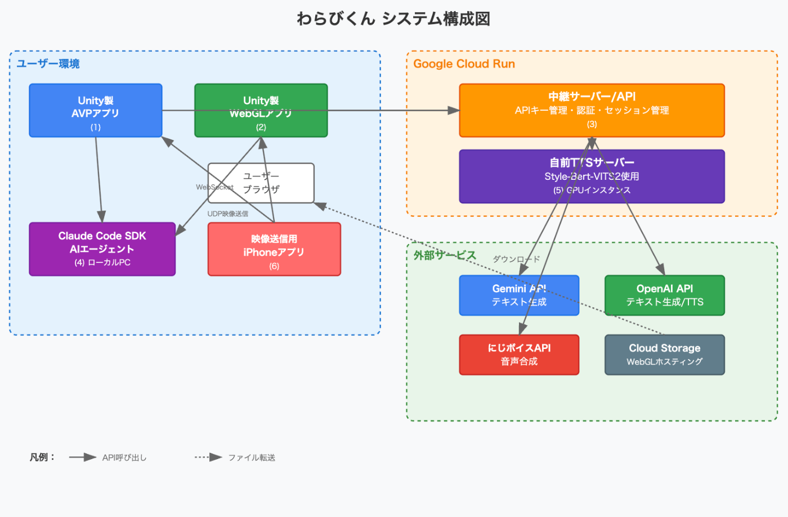
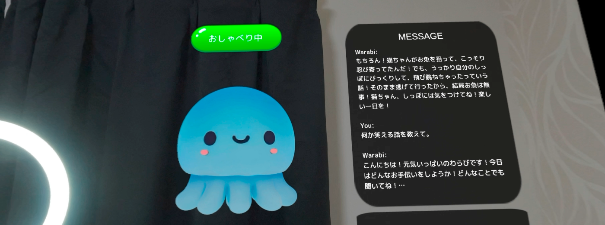
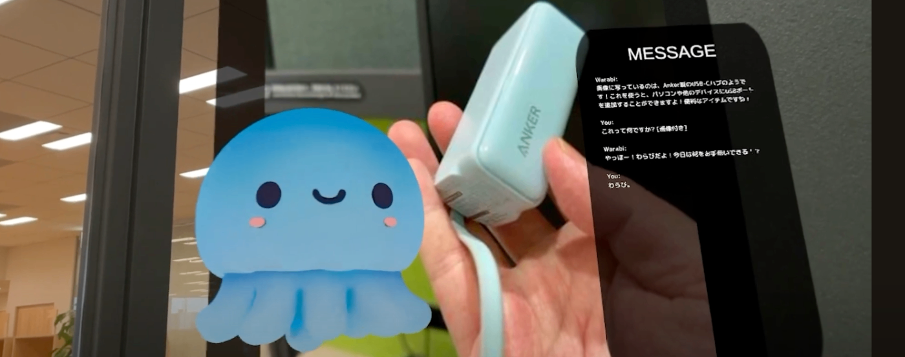
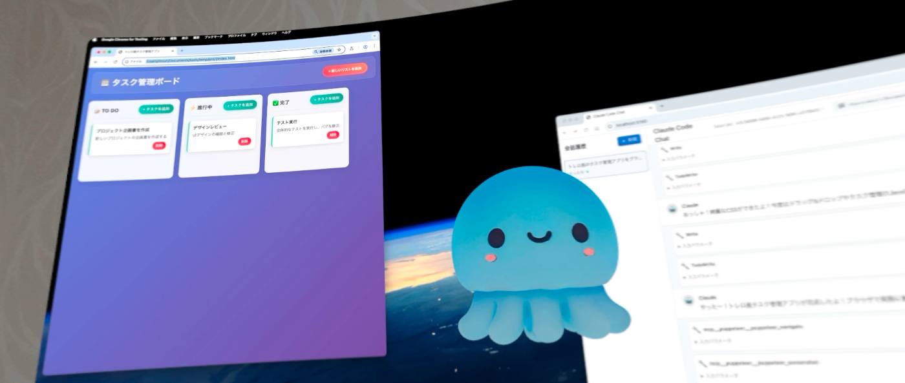

##  はじめに

本記事は、AI Agent Hackathonで開発した(AVPアプリのベース部分はVisionDevCampで開発しました)、Apple Vison Proアプリ 空間AIエージェント わらびくん の開発についての記事です。

##  概要

本プロジェクトでは、Apple Vision Pro(以下AVP)とAIを使った、空間に常駐するAIエージェントを開発しました。可愛らしいくらげのキャラクターの「わらびくん」と音声のやりとりでコミュニケーションを取ることができます。簡単な会話だけではなく、コーディングやショッピングなど、具体的なタスクを実行できるところが特徴です。また、Apple Vision Proが無くても利用できるように、ブラウザで動作するWebGL版を用意しました。

##  デモ動画

<https://youtu.be/oXkQRKytnbY>

##  背景

私はこれまでAR/空間コンピューティング分野でのアプリ開発に注力してきました（[過去の作品一覧](https://protopedia.net/prototyper/mouri45)）。グラス型ARデバイスはまだ一般に普及していませんが、将来性を強く感じる技術領域です。

AR/MR技術とAIの融合により、SF作品で描かれてきた未来が現実になりつつあります。今回の開発で特に影響を受けたのは、アニメ「PSYCHO-PASS」に登場する「キャンディ」というホロアバターです。作中では「立体ホログラム表示サポート人工知能・ホームセクレタリー・アバターユニットシステム」として、主人公の日常生活をサポートする存在として描かれています。

空間コンピューティングとAIが高度に発展した未来では、こうしたシステムが当たり前になるでしょう。その未来を先取りし、現在の技術で実現可能な形で体験できるサービスを作りたいという思いから、このプロジェクトをスタートしました。

##  技術構成

5つのサブシステムに分かれています。

  * キャラクターを投影するUnity製のAVPおよびWebGLアプリ
  * ユーザーのローカルPC上で動作する、Claude Code SDKを利用した、タスク遂行能力を持つAIエージェントWebアプリ
  * Cloud RunのGPUインスタンス上にStyle-Bert-VITS2を稼働させている、自前のText to speechサーバー/API
  * Apple Vision Proのカメラアクセス制限対応として身の回りの映像の送信を担うiPhoneアプリ
  * API Keyの管理や認証トークンの管理を行う中継サーバー/API

###  Apple Vision ProおよびWebGLアプリ

ユーザーが一番触れるアプリ部分はUnityを使用して開発しました。  
AVPアプリとして、空間をキャラクターが浮遊しさせることで、ユーザーの視野内に自然に収まるような作りになっています。また、空間コンピューティングアプリとしてより没入感をあたえるために、UIの表示非表示を行えるようになっています。アイトラッキングもAVPの特徴ですが、体験者毎にキャリブレーションが必要となる煩雑さを回避するために、UIはハンドトラッキング操作可能な範囲に配置しています。

エージェントのモードとしてConversation Mode、Vision Mode、Agent Modeがあります。  
Convesation Mode：通常の対話をするエージェント機能(タスク遂行能力を持つAIエージェントWebアプリと別)。  

Vision Mode:Convesation Modeに加えて、iPhoneから送信された映像のスナップショットを一緒に送信することで、ユーザーが見ているものを文脈に加えて、コミュニケーションを取れるエージェント機能。  

Agent Mode:タスク遂行能力を持つAIエージェントWebアプリを使ったエージェント機能。  
次のようなシーケンスと技術でキャラクターとの対話を実現しています。  

  * 音声区間検出：ユーザの発話を認識し音声データにします。自前のVoicd Activity Detectionを実装しています。
  * Speech to text：音声データをテキストに変換します。AVP版はAudio API、WebGL版はWeb Seech APIを使用しています。
  * 映像受信・画像化：Vision Modeの場合、iPhoneから送信された映像のスナップショットを撮ります。UDP通信により自作で送受信機能を実装しています。
  * テキスト生成：ユーザーの問いに対する返答を生成します。過去の一定回数のやり取りも一緒に送信することで文脈を保持するようにしています。Gemini APIとOpen APIから選ぶことができます(今回はGemini APIを設定してます)。また、TTSが英語や数字の読み上げに弱い場合があるため、返答を再度変換する処理も実行しています。Vision Modeの場合はスナップショット画像も一緒に送信します。
  * タスク実行：Agent Modeの場合、WebSocketでタスク遂行能力を持つAIエージェントWebアプリに接続し、一つの命令に対して複数のレスポンスを受けてTTSで読み上げを行なっています。
  * Text to speech：返答テキストを読み上げます。自作のTTSサーバ/API、にじボイスAPI、OpenAI APIから選ぶことができます(今回は自作のTTSサーバ/APIを設定しています)。

キャラクターはChatGPTでイラスト生成->ToripoAIで3Dモデル化したものを使用しています。

AVP向けに開発したものをWebGLでも利用できるように改修することで、ブラウザでの動作も可能にしました。スマホブラウザでも動作しますが、iPhoneは問題なく動作、Androidは私が所持している5年前のデバイスだと文字化けしていました。WebGL版は、Cloud Storageにホスティングしています。

###  Claude Code SDKを利用した、タスク遂行能力を持つAIエージェント

ユーザーと対話しながら、コーディングやショッピングといった、実際に役に立つタスクを遂行できるエージェント機能をもつWebアプリ。Claude Code SDKを使用しており、ChatUIとニジボイスAPIを使った読み上げ機能をもっているため、このアプリ単体でも使用できるようになっています。MCPにも対応しているため、非常に広範な用途に利用できる可能性を持っています。

<https://youtu.be/Vl9YHtxq_hA?si=fLcNYFILFZFGq3nM>

Claude Code SDKを使うことからセキュリティ面を鑑み、今回はサーバ上で利用できる形ではなく、ユーザ自身のPCで稼働させ、ローカルネットワーク経由でAVP/WebGLアプリからWebSocketで接続します。通常、Claude Codeは、開発以外のタスクを拒否しますが、システムプロンプトで調整することで、開発以外のタスクもこなしてくれるようになります。将来的には、Gemini CLIにも対応したいと考えています。

###  Cloud RunのGPUインスタンス、Style-Bert-VITS2のText to speechサーバ

TTSは、にじボイス/OpenAIのものと別に自作のTTSサーバも用意しています。  
Style-Bert-VITS2をラップしたWeb APIを提供するサーバで、Cloud RunのGPUインスタンス上で稼働させることで100文字程度の変換が1秒で処理することができ他のTTSのAPIと比べても遜色ないパフォーマンスだと思います。

今回はリポジトリで紹介されている音声モデル(音声提供：小春音アミ/あみたろの声素材工房（ <https://amitaro.net/> ）)を使用させていただいていますが、Style-Bert-VITS2であれば、独自の音声モデルを作成できることも利点です。

Cloud Run上での稼働を念頭にStyle-Bert-VITS2の標準のWebAPIではなく、自作しました。理由としては、モデルデータをCloud Storageからダウンロードしたり、コールドスタートの制御を行えるような機構を組み込むのにその方が都合が良かったためです。

###  Apple Vision Proへの映像送信iPhoneアプリ

AVPのカメラアクセスは「Enterprise APIというものを利用する」、「Enterprise APIは申請しないと利用できない」、「Enterprise APIを使うとAppStoreに公開できない」などの制約があります。一方で、今回のような気軽に話しかけられるようなAIエージェントの用途としてはその文脈上に身の回りの写真、映像など、エージェントの目にあたる機能が欲しくなります。

その問題の解消方法として、映像を送信するアプリを実装し、そちらから映像を送信、「これは何？」などの質問をしたタイミングでスナップショットを撮り、質問と一緒にLLMのAPIに送信することで解決しました。Unityには、こうした通信系のライブラリが豊富なのですが、使い方がよく分からず、UDPを使って自前で実装しました。結果的に、送り側受信側ともにUnityを除く他のプラットフォームでもやり取り可能なものになりました。

<https://youtu.be/YcC7wRZh8zw>

###  API Keyの管理やセッションの管理を行う中継サーバ

公開する上で、フロントアプリ側にAPI Keyを入れるわけにはいかないため、各APIを中継するためのサーバをCloud Runに用意しました。費用面のこともあるので、過度な利用を防ぐような仕組みも実装されています。

##  今後の展望

  * Gemini CLI対応
  * キャラクターとの対話をスムーズにするために、Voicd Activity Detectionの精度向上やEcho Cancellation対応を目的としてLiveKitの導入。
  * 独自のキャラクターの音声モデルの作成
  * キャラクターの3Dモデル/アニメーションの作り込み
  * フィットしそうな市場の選定

