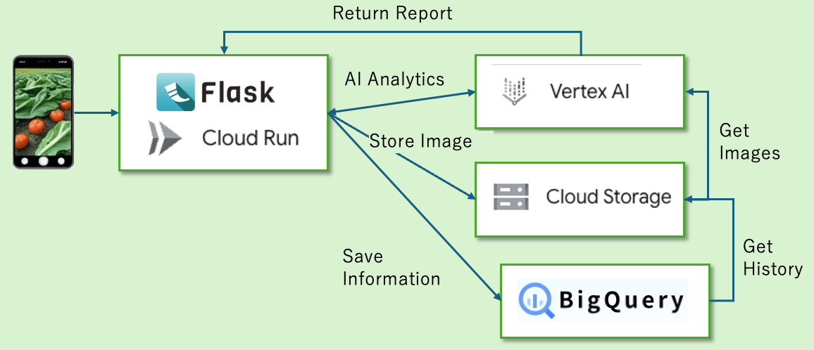

<https://www.youtube.com/watch?v=BniC54o02_w>

##  はじめに：家庭菜園の「分からない」が、楽しさを奪ってしまう現実

家庭菜園は、私たちの暮らしに豊かな彩りをもたらし、土に触れる喜びや収穫の感動を与えてくれます。しかし、一方で「どう育てたらいいか分からない」という悩みから、せっかくの楽しさが半減してしまう現実も少なくありません。私自身も、芽が出たキュウリがすぐに虫食いだらけになり、途方に暮れた経験があります。インターネットに情報があふれていても、目の前の野菜の具体的な症状に合った的確なアドバイスや、気軽に相談できる相手を見つけるのは困難です。この「分からなさ」が家庭菜園の楽しさを奪い、時には挫折に繋がる現実を解決するため、私たちは限られた時間の中で最大の価値を生み出すハッカソンという場で、 AIアプリケーション「菜園の匠」の開発を始めました。

##  現状の課題：「理想の情報」と「目の前の現実」のズレ

家庭菜園における「分からない」の背景には、いくつかの具体的な課題があります。

###  情報の「理想化」と「断片化」

一般的な育成情報は豊富ですが、日照、気温、土の状態、病害虫の初期症状など、刻々と変化する目の前の「個別の状況」に適用するのは困難です。断片的な情報では、自分の野菜にどう当てはまるのか判断に迷うことが多いのです。

###  即時性の欠如

野菜に異常が見られた際、情報を検索し、自分の状況と照らし合わせるには時間がかかり、その間に被害が進行し手遅れになることがあります。この「タイムラグ」は深刻な問題です。

###  専門知識の不足と孤独感

多くの愛好家にとって、専門知識を持つ人や経験豊富なベテランに相談できる環境は稀で、一人で悩みを抱え込みがちです。

これらの課題は、家庭菜園の「計画」と「現実」の間に大きな「ズレ」を生み出します。このズレを素早く認識し、適切なアクションを取れる仕組みこそが鍵となります。

##  目的：AIアプリ「菜園の匠」で「分からない」を解消し、「匠」になれる喜びを

「菜園の匠」は、家庭菜園における「分からない」という障壁を取り除き、誰もが自信を持って野菜を育てられるようになることを目指します。単なる問題解決だけでなく、家庭菜園をより深く、楽しく、豊かな体験へと昇華させるのが私たちの目的です。

###  即座の「気づき」と「行動」を促す

AIが野菜の異変を瞬時に診断し、最適な対処法を提案することで、情報収集時間を削減し、早期発見・早期対処を可能にします。

###  知識と経験の「見える化」と「蓄積」

AIによる診断と成長評価を通じて、過去の栽培記録から学び、次の栽培に活かすPDCAサイクルを自然に回せるようになります。

##  システムアーキテクチャ

特にハッカソンという短期間の開発において、高い開発効率とスケーラビリティが求められる中で、 Google Cloud Platform (GCP)のシンプルかつスケーラブルなシステムアーキテクチャは最適でした。GCPの各サービス（Vertex AI, Cloud Storage, BigQuery, Cloud Runなど）が提供するマネージドサービスとしての特性は、開発速度と安定稼働に大きく貢献し、本プロジェクトに最適な基盤となりました。この基盤が、『菜園の匠』の各機能をどのように支えているのか、ご紹介します。

##  機能：『菜園の匠』が提供する強力なサポート

「菜園の匠」は、家庭菜園の悩みを解決し、楽しさを深めるために、以下の核となる機能を提供します。

###  AI菜園診断：あなたの野菜の「声」を聞く

  * 機能詳細:  
スマートフォンで野菜の写真を撮るだけで、AIがその状態を即座に診断し、具体的な診断結果と最適な対処法を提案します。 病気、害虫の有無、栄養不足、水やりの過不足など、多岐にわたる生育状況を分析します。画像は直接撮影、またはアップロードで利用可能です。

さらに、診断結果や推奨された対処法について詳しく知りたい場合は、アプリ内から直接Google検索を実行できます。これにより、関連する専門記事や動画にすぐにアクセスし、知識を深めることができます。必要な資材（肥料、農薬、用具など）が見つかった場合は、Google検索の結果を通じて楽天市場などのECサイトへシームレスに遷移し、購入までサポートします。

  * 実装方針:

  * 画像認識・診断:  
Google CloudのVertex AI上にデプロイされたGemini APIをAIエンジンとして使用しました。アップロードされた野菜画像を解析し、葉の色、形、斑点、虫の痕跡などを識別することで、病害虫や栄養不足といった生育状況を診断し、具体的な次の一手（例：特定の薬剤の散布、水やりの頻度調整、肥料の種類と量など）を提案します。診断結果はBigQueryに保存されます。ハッカソンでは、既存の強力な基盤モデルであるGemini APIを活用することで、迅速かつ高精度な診断機能を実現しました。

  * 検索・EC連携:  
Google Search APIを併用し、AI診断結果に関連するキーワードを自動生成。ユーザーはワンタップで検索結果にアクセスし、楽天市場などのECサイトへ直接遷移して必要な商品を購入できます。

###  菜園アルバム：野菜の成長を記録し、AIとともに喜びを再発見

  * 機能詳細：  
期間ごとに撮影した野菜の写真を時系列で保存し、自分だけの「菜園アルバム」を作成できます。AIがアルバム内の写真から期間ごとの成長度合いを評価し、ハイライト（例：「この1ヶ月でこれだけ大きくなりました！」「病気を克服し、見事に回復しました！」）を自動生成します。全体の見た目、葉っぱの状態、花や実の成長状態、茎の太さを評価し、最初の写真と最近の写真を並べて見ることができるため、視覚的に成長を実感できます。 子供の成長記録のように、野菜の成長を振り返り、喜びを共有できる機能です。

  * ストーリーズ：  
今週や今月、あるいは過去の任意の期間におけるハイライト画像を、AIの診断結果とともに振り返ることができます。

  * 成長評価:  
Vertex AIの画像解析能力を活用し、 過去の写真と比較することで、野菜のサイズ、葉の茂り具合、茎の太さといった視覚的特徴の変化を定量的に捉え、 成長の進捗度合いや特筆すべき変化（例：花が咲いた、実がなった、病気が改善したなど）を評価し、コメントを生成します。

##  Human in the Loop：AIと育てる、共創のガーデニング

「菜園の匠」の核となるのは、人間の豊かな経験と直感、そしてAIの高度な分析能力を融合させる「Human in the Loop」という思想です。 これは単なるツールではなく、AIがあなたのパーソナルアシスタントとして機能し、共に家庭菜園の課題を乗り越え、誰もが自信を持って「匠」へと成長できる最適なパートナーとなることを意味します。

  * AIによる的確な洞察と行動支援：  
Vertex AIは瞬時に生育状況を診断し、最適なアクションプランを提示。ユーザーはAIの客観的データに基づき判断を下し、問題解決能力を培えます。

  * 実践知とAIの相乗効果：  
AIは専門知識を提供しつつ、ユーザーの個別環境や経験を尊重。一般的な栽培方法と現実のギャップを埋める指針を与え、実践を通じた知識深化を支援します。

  * 確信と安心感で広がる挑戦：  
AIが迅速かつ明確な診断と次の一手を提示することで、ユーザーは迷いを払拭し、確信を持って植物の世話に取り組めます。これにより精神的ストレスが軽減され、より積極的に家庭菜園を楽しむ環境が生まれます。

このHuman in the Loop設計により、ユーザーはAIとの継続的な協調を通じて園芸スキルを向上させ、より深い満足感を得られます。AIが情報収集と高度な分析を担当し、ユーザーが最終判断と実践を担うことで、個人の可能性を解き放ち、豊かな家庭菜園体験を創出します。

##  終わりに：家庭菜園の未来を共創する「菜園の匠」

「菜園の匠」の開発は、家庭菜園における「分からない」を解消し、誰もが気軽に、そして深く楽しめるようになる未来への第一歩です。私たちは、このアプリケーションが単なるツールに留まらず、家庭菜園を愛するすべての人にとっての「心の支え」となることを願っています。

###  ユーザーテストが示す確かな手応え

先日、実際に家庭菜園を始めたばかりの友人、Aさん（家庭菜園歴半年）に「菜園の匠」を体験してもらいました。

「これまで、葉の色がおかしいと感じても、それが病気なのか栄養不足なのか、全く分かりませんでした。ネットで検索しても情報が多すぎて、どれが正しいのか判断に迷うばかり。でも、『菜園の匠』で写真を撮ったら、瞬時に『これは初期のうどんこ病の可能性が高いです。風通しを良くし、自然由来の対策として木酢液を薄めて散布することを推奨します』と具体的かつ分かりやすいアドバイスが出たのには本当に驚きました。これで、すぐに何をすべきかが明確になり、不安が半減しました！」

「使う前は毎日水やりのついでにただ眺めるだけでしたが、AIが診断してくれるようになってからは、虫がついていないか、土が乾いていないかなど、具体的にチェックするようになりました。自分の野菜の状態を『知る』ことで、園芸がぐっと面白くなったんです。」

「また、アルバム機能で過去の写真を見返せるのもすごく良いですね。AIが『この１ヶ月で背丈や太さが成長し、病気も克服して葉も艶やかになりましたね！』と評価してくれるのを見ると、まるで自分の子供が成長しているのを見守る親の気持ちになります。正直、これで家庭菜園が何倍も楽しくなりました。もう『菜園の匠』なしでは考えられませんね。」

###  「菜園の匠」のさらなる進化に向けて

今回のハッカソンでは、核となる機能の実装に注力しましたが、「菜園の匠」にはまだまだ大きな可能性があります。

  * 栽培プランの提案：  
ユーザーの希望する野菜や栽培環境に応じて、最適な栽培スケジュールやプランをAIが提案する機能。

  * AIモデルの継続的な改善:  
ユーザーからのフィードバックや追加データに基づき、診断精度や提案の具体性を高めるためのモデルの再学習・最適化。

  * 多角的なデータ連携による高度な予測:  
土壌センサーや気象データなどIoTデバイスとの連携を強化し、生育状況だけでなく、将来的なリスク（例：病害虫の発生予測、収穫時期の最適化）を予測するAIの導入。

  * マルチモーダルAIの活用: 画像情報に加え、ユーザーの入力（土の状態、水やりの頻度など）や環境データも統合的に分析し、より包括的なアドバイスを提供するAI機能の開発。

  * 拡張性・保守性の高いシステムの実現:  
ユーザー増加を見据え、マイクロサービス化やCI/CDパイプラインのさらなる整備による開発・運用効率の向上。

私たちは、「菜園の匠」が、単に問題を解決するだけでなく、家庭菜園という趣味を通じて、人々の生活に彩りと喜びをもたらし続けることを目指します。日々の忙しさの中で、ふと家庭菜園から心が離れてしまう瞬間は誰にでもあります。しかし、「菜園の匠」があれば、あなたの家庭菜園の歩みや喜びが途切れることはありません。 野菜が日々成長し、実を結ぶかけがえのない喜びを、私たちはAIの力で、すべての家庭菜園愛好家にお届けします。
