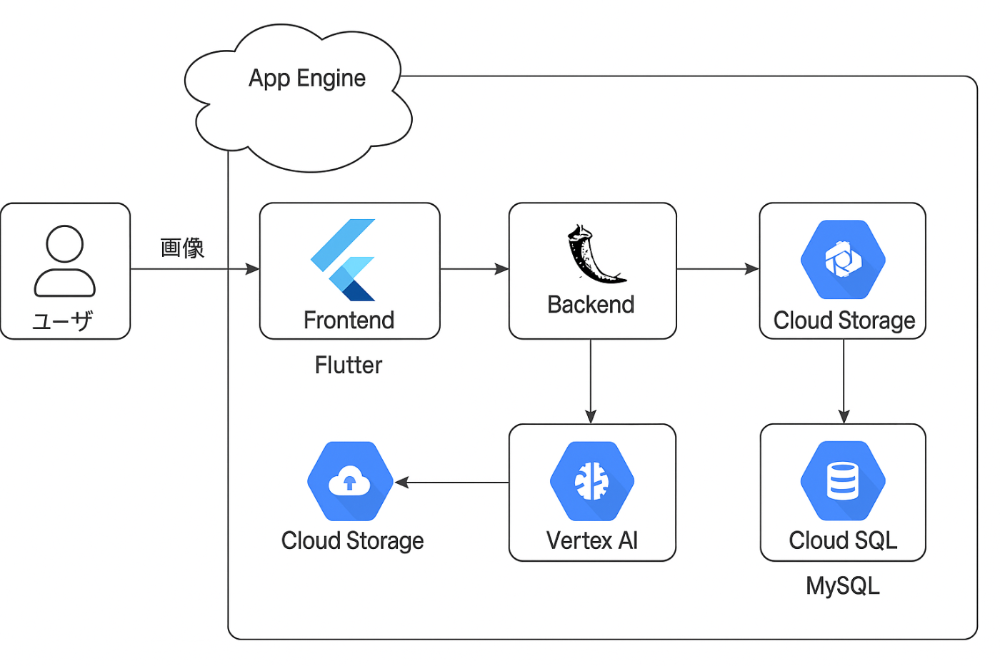

#  垢抜け支援アプリ「LoveApp」 〜Flutter × Vertex AIによる外見サポート〜

!

この記事は「第2回 AI Agent Hackathon」の提出用記事です。

##  はじめに

本記事では、ハッカソンで開発したFlutterベースの「LoveApp（ラブアップ）」という垢抜け支援アプリについて紹介します。このアプリは、ユーザーが顔画像をアップロードし、Google CloudのVertex AIを活用した顔型分類モデルにより顔の形を判定。判定結果に基づいて、ユーザーに似合う髪型を提案するシステムです。

近年、第一印象や外見に対する関心が高まる一方で、「どうすれば垢抜けられるのかわからない」「自分に似合うスタイルが分からない」といった悩みを抱える人も少なくありません。LoveAppは、そんな悩みを持つ人たちに、先端のAI技術とモダンな開発環境を用いてシンプルかつ直感的にサポートを届けることを目指しています。

* * *

##  背景と現状の課題

###  社会的背景

SNSや動画投稿サービスの普及により、個人の見た目や自己表現への関心がますます高まっています。特に若年層では、外見の良し悪しが第一印象や自己肯定感に直結するケースも多いです。しかしながら、具体的に何をどう変えれば良いか分からず、行動に移せていない男性が多く存在しています。

###  課題設定

主に10代後半から20代前半（大学新入生、就活生など）の男性を対象とし、以下の課題を抽出しました。

  * 美容に関する知識不足から適切な外見改善が難しい
  * 客観的な自己評価ができず、試行錯誤が非効率
  * 診断系アプリの多くが主観的な設問ベースで信頼性に欠ける

* * *

##  目的

LoveAppの目的は、顔画像をアップロードするだけでAIによる客観的な顔型分類を行い、それに適した髪型の提案を実現することです。これにより、ユーザーは自分に似合うスタイルを理解し、自信を持って外見改善に取り組めるようになります。

* * *

##  ソリューション概要

###  ユーザー像と課題（要件ⅰ）

**対象ユーザー**

  * 自分の顔型に合った髪型を知りたい若年層
  * 就職活動や学校生活など第一印象を向上させたい人
  * 美容にあまり詳しくないが、垢抜けたいと考えている人

**課題**

  * 客観的な顔型判定が難しい
  * 髪型の選択肢をわかりやすく得たい
  * アプリの操作をシンプルにしたい

**ソリューション**

  * Flutter Webで使いやすいUIを提供し、誰でも手軽に顔画像をアップロード可能
  * バックエンドでGoogle Cloud Vertex AIを活用し、顔型判定を実施
  * 判定結果を基に、顔型ごとに適した髪型を表示

* * *

##  機能紹介

###  画像アップロードと顔検出

フロントエンドはFlutterで開発し、ユーザーが簡単に画像をアップロードできる画面を構築しました。画像はFlaskバックエンドに送信されます。

バックエンドはPythonのFlaskを使い、検出された顔画像をVertex AIに送信する形で顔型分類の推論を実施します。

###  顔の特徴抽出と分類（Vertex AIの活用）

Vertex AIの画像分類モデルは、5種類の顔型（丸顔、面長、卵型、ホームベース型、逆三角形）に分類します。

Google CloudのVertex AIを利用することで、クラウド上でのスケーラブルかつ高速な推論を実現しています。また、モデルの改良・再学習も容易に行えるため、精度向上が期待できます。

###  🎯 分析手順を明示したプロンプト

以下のように、ただ「顔型を分類して」と曖昧に指示するのではなく、AIに明確な手順を与えたプロンプト設計としました：

  1. 顔のランドマーク検出：

     * 額中央〜顎先の長さ（`L`）
     * 両頬骨間の幅（`W_cheek`）
     * 額の幅（`W_forehead`）
     * 顎の幅（`W_jaw`）
  2. 比率の計算：

     * `R_face = W_cheek / L`
     * `R_jaw = W_jaw / W_cheek`
     * `R_forehead = W_forehead / W_cheek`
  3. 閾値に基づく分類ルール：

     * ホームベース型: `R_face ≥ 1.178 and R_jaw ≥ 0.95`
     * 逆三角形: `R_forehead ≥ 1.05 and R_jaw ≤ 0.80`
     * 面長: `1.0537 ≤ R_face < 1.111`
     * 丸顔: `1.112 ≤ R_face ≤ 1.176 and 0.85 ≤ R_jaw ≤ 0.95 and 0.95 ≤ R_forehead ≤ 1.05`
     * 卵型: `1.112 ≤ R_face ≤ 1.176 and R_jaw ≤ 0.85 and R_forehead ≤ 1.05`

このような設計により、AIに単なる画像の「見た目の印象」で判断させるのではなく、**定量的な評価をもとに構造的に分類** させることができました。

###  💡 実際のコード（抜粋）
    
    
    uploaded_file = client.files.upload(file=image_path)
    response = client.models.generate_content(
        model="gemini-2.5-pro-preview-06-05",
        contents = [
            uploaded_file,
            \"\"\"
            You are an expert in facial feature analysis.
            ...
            Answer only one Japanese label from the list, with no additional text.
            \"\"\"
        ]
    )
    

##  垢抜け提案の表示

顔型に応じて、以下のような髪型が提示されます（例）：

  * **丸顔 → ツーブロック or アップバング**

  * **面長 → マッシュ or パーマ**

###  顔型別おすすめ髪型（詳細）

LoveAppでは、AIによる顔型判定結果に応じて、以下のような髪型の提案を行います。これは顔の縦横比や輪郭に基づいて「垢抜けて見えるバランス」を考慮しています。

顔型 | おすすめ髪型1 | おすすめ髪型2 | おすすめ髪型3  
---|---|---|---  
丸顔 | ツーブロック | ソフトモヒカン |   
面長 | マッシュ | 無造作パーマ |   
ホームベース型 | ベリーショート | フェードカット | ショートレイヤー  
卵型 | ツーブロック | アップバング | ひし形ショート  
逆三角形 | アップバングミディアムショート | ウルフ | ハイレイヤーショート  
  
たとえば、**丸顔** には顔の横幅をカバーし縦のラインを強調する「ツーブロック」や「ソフトモヒカン」などのスタイルを、**面長** には縦の印象を和らげる「マッシュ」や「無造作パーマ」などのボリューム感ある髪型を提案します。

これにより、美容知識がなくても、自分の顔型に合ったスタイルの方向性を簡単に理解することができます。

* * *

##  システム構成（要件ⅱ）

###  アーキテクチャ図

###  技術スタックと構成の詳細

層 | 技術 | 詳細  
---|---|---  
フロントエンド | Flutter Web | 画像アップロード画面、結果表示UIをシングルページアプリとして開発  
バックエンド | Flask | REST APIを構築し、画像受け取り・顔検出・Vertex AI連携を担当  
AI推論 | Google Cloud Vertex AI | 画像分類モデルを利用し顔型推論をクラウドで実行  
インフラ | GCP App Engine | Flask APIのホスティングに利用  
データストレージ | Google Cloud Storage | アップロード画像の一時保存に使用  
データベース | Cloud SQL (MySQL) | 髪型情報の管理に利用  
  
* * *

##  デモ動画（要件ⅲ）

<https://www.youtube.com/watch?v=WEQO-gZaF2o>

* * *

##  技術的な苦労と工夫

###  FlutterでのUI/UX構築の難しさと学び

本プロジェクトでは、Flutterを初めて利用してフロントエンドを構築しました。マルチプラットフォーム対応や美しいUIを簡単に構築できるという利点がある一方で、初学者にとっては細かなウィジェット構成や画面遷移、HTTP通信、状態管理などで多くの試行錯誤を要しました。

###  FlutterとFlask間の画像送受信

Flutter Webはブラウザ環境で動くため、HTTP通信には制約があります。特に画像送信は細かい設定が必要で、CORS設定やヘッダー周りの調整に苦労しました。

###  AIプロンプトの工夫と顔型分類の仕組み

LoveAppでは、Google CloudのVertex AIに加え、Gemini APIを活用して顔画像を解析しています。  
このプロセスでは、**プロンプトエンジニアリング** を活用して、AIの応答に構造性と信頼性を持たせる工夫を行いました。

* * *

##  今後の展望

  * AIモデルのさらなる精度向上と多様な髪型・メイク提案の追加
  * モバイルアプリ（iOS/Android）への展開
  * ユーザーの好みやライフスタイルを取り入れたパーソナライズ機能の実装
  * リアルタイム顔認識やAR技術を使った試着機能の検討
  * 垢抜けTodoリスト自動作成機能

* * *

##  まとめ

LoveAppは、FlutterとGoogle CloudのVertex AIを組み合わせることで、顔画像から客観的な外見改善提案を実現した垢抜け支援アプリです。初めてのハッカソン開発ながら、技術面・UX面で多くの学びがあり、今後の発展が期待できるプロジェクトとなりました。

本記事が、FlutterやVertex AIを使ったAIアプリ開発に興味を持つ方の参考になれば幸いです。
