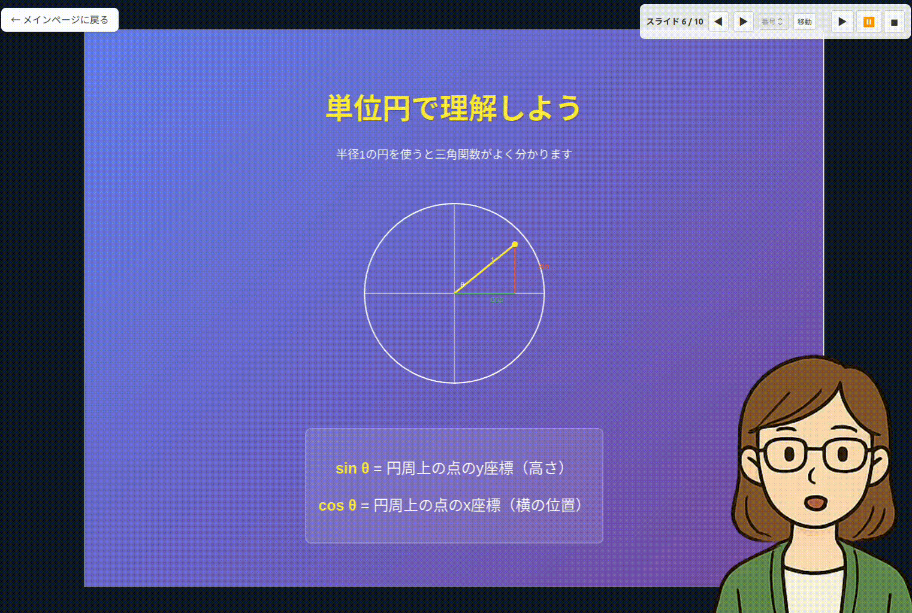
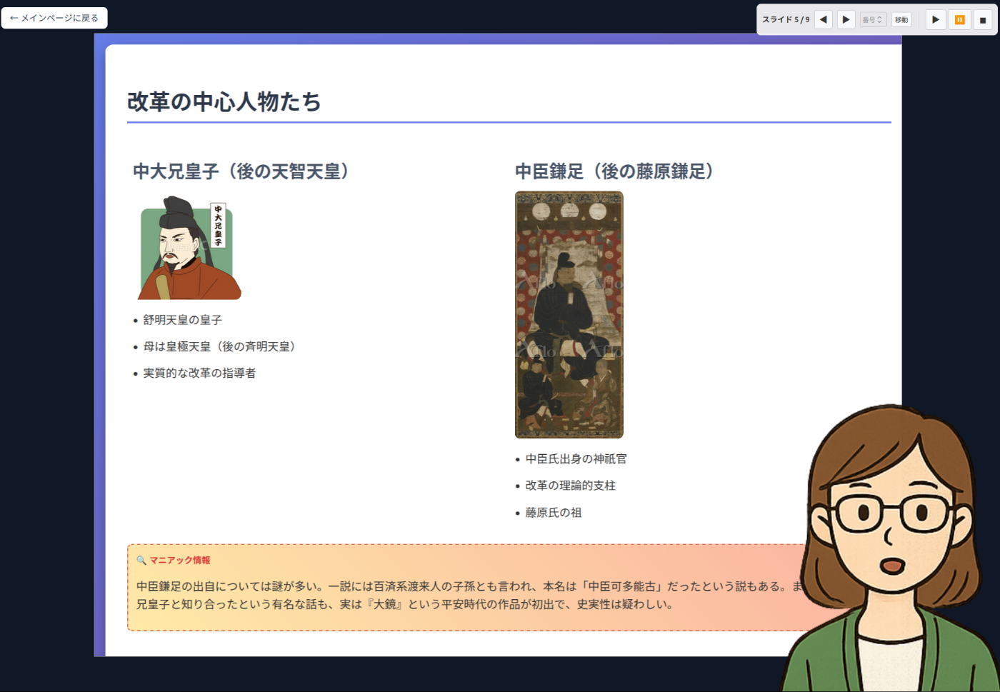
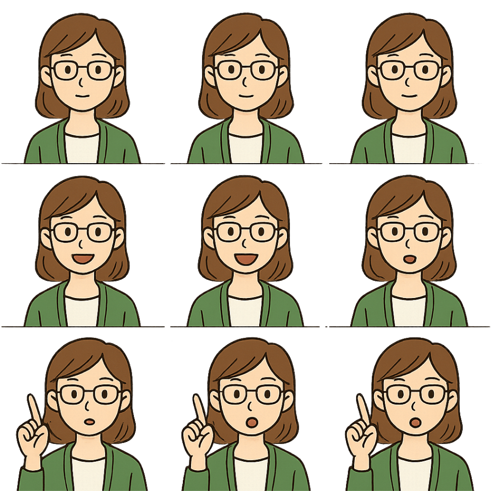
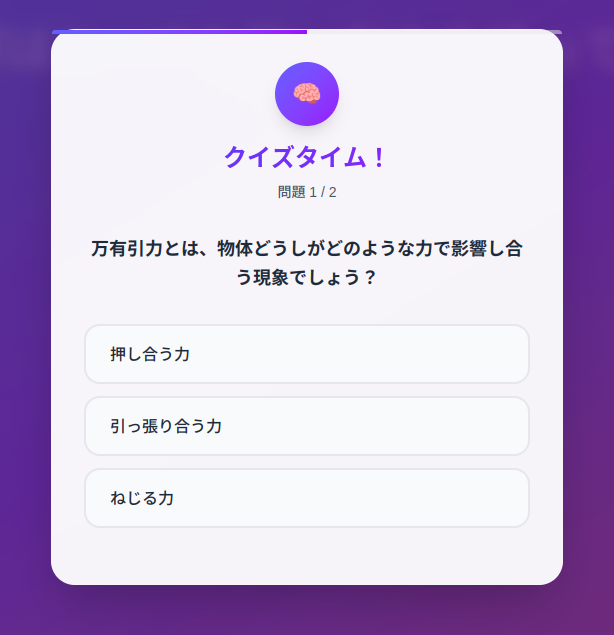
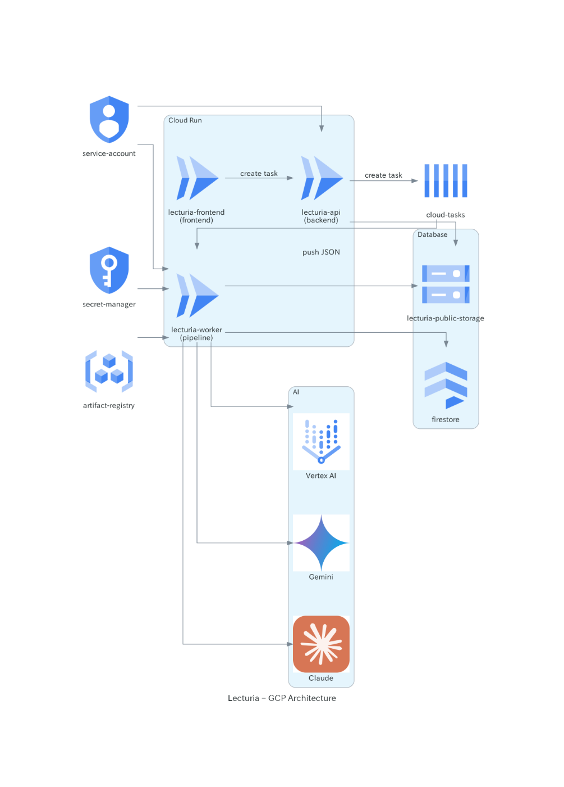
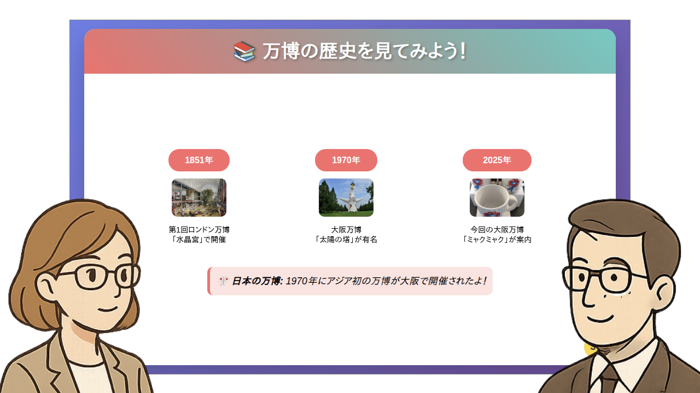

!

この記事は「[第2回 AI Agent Hackathon](https://zenn.dev/hackathons/google-cloud-japan-ai-hackathon-vol2?tab=overview)」の提出用記事です。

#  はじめに

インターネットやデジタルデバイス、AIのようなテクノロジーの進化によって、**常に新しく何かを“学ぶ”ことの大切さが増してきています。**  
学ぶと一言で言っても、人によって学びのスピードやその人に合った知識の得方は異なります。学校のように1つのことを1つのアプローチで教えるのではなく、異なる視点、異なる考え方で教えることができ、それを自分で選択できることが重要になってきています。

**"Lecturia"** はAIを使って、ユーザが指示した内容や教え方に沿った講義資料を作成し、AI講師がそれに沿って講義を行うアプリです。  
**それぞれの人が、それぞれのテーマを、それぞれの切り口から学ぶことで、自分に合った学び方を見つけることができるようになっています。** 多くの人が「自分らしく学ぶ」、「学び方から自分で決める」そんな学びのスタイルを提供するアプリです。

!

Lecturia は lecture（講義）とラテン系接尾辞 -ia を組み合わせた造語で、  
「学びの世界」や「講義が集まる場」をイメージしています。

#  プロジェクトの概要と解決する課題

##  ターゲットユーザ

  * 何か新しいことを学びたいけど、丁度いい教科書やセミナーが見つからない人
  * 何か学びたい分野の入口として、簡単な講習を手軽に受けてみたい人
  * 何か学ぶときに本を呼んだり、AIチャットに聞いても文字ばっかりでよく分からないという人

##  課題

  * **世の中の選択肢から学び方を選べない**
    * 書籍やインターネットで様々なジャンルを様々な切り口で学ぶことができる一方で、自分に合った教材を自分で見つけるのが難しくなってきています。
  * **特定の分野を手軽にきちんと学ぶのが難しい**
    * インターネットは断片的な情報が多く、網羅的・体系的に学ぶのが難しい一方で、セミナーや教科書での独学は時間的＆経済的コストが掛かり気軽に手を出せません。
  * **文字だけからの学びだと続かない**
    * AIチャットによって、自分自身に合った学習ができるコンテンツを作りやすくなりました。しかし、文字のみのコンテンツでは面白みがなく学びを継続するのが難しいです。

実際に大学生などを対象にした調査では、授業に対してより自分に合ったもの、自分が学びたいものを選びたいという傾向が見てとれます。

<https://www.mhlw.go.jp/file/06-Seisakujouhou-11800000-Shokugyounouryokukaihatsukyoku/h24text-07.pdf>

また社会人においては、リスキリングなどにかかる費用が高く、安く自分に合ったものを取り入れたいという傾向があると考えれらます。

<https://www.orangepage.co.jp/event/4865>

##  ソリューション

Lecturiaは自分で講義を作れる勉強アプリです。ユーザが学びたいことをその人に合った形で提供することができます。  
実際のアプリのデモ動画が以下になります。

###  デモ動画

<https://www.youtube.com/watch?v=TZCaRyp9o2I>

##  特徴

Lecturiaでは分かりやすい講義を行うために以下の機能を実現しました。

  * **アニメーション付きスライドによる視覚的な解説**
  * **講師キャラクターのアニメーションを用いた親近感のある講義**
  * **講義の途中でクイズを挟むことで、一方的ではないインタラクティブな講義を実現**

また、**Lecturiaの最も特徴的な部分は、講義動画を生成しているのではなく、スライドや音声を生成し、イベント駆動によって講義アニメーションを生成しているところです。**  
スライドのアニメーション実行やページ送り、講師キャラクターの発話や強調アニメーション、さらにクイズのタイミングを一元で管理するイベント列を作成し、それをフロントエンドで自動再生することでアニメーションを実現しています。実際のイベント列の一例を以下に示します。  
これにより、**動画のような一方的な講義ではなく、クイズを挟むといったインタラクティブな講義が可能になっています。**
    
    
    {
      "events": [
        {"type":"pose","time_sec":0.0,"name":"idle","target":"right"},
        {"type":"pose","time_sec":0.1,"name":"talk","target":null},
        {"type":"pose","time_sec":15.0,"name":"point","target":null},
        {"type":"slideStep","time_sec":20.5,"name":null,"target":null},
        ...
      ]
    }
    

上記のJSONにおいて、"pose"はキャラクターアニメーション用のイベント、"slideStep"はスライドアニメーションの実行イベントとなっています。

イベント列含め、講義として使用するアセットは全部で以下になります。

  * 講義スライド(HTML)
  * 講義スクリプト
  * 講義音声(mp3)
  * キャラクタースプライト(png)
  * クイズ
  * イベント列

###  講義スライド/講義スクリプト

スライドはhtmlのスライドをAIを用いて生成しています。  
なるべく図やアニメーションを入れて分かりやすくするように指示しており、スライドの中で以下のようなアニメーションが自動で入ります。

####  引力のイメージアニメーション

####  三角関数のイメージアニメーション

またスライドに挿入される画像に応じて、画像の検索やAIによる画像生成を行うようにしています。

  * 簡単な図式や図解 -> Inline SVG
  * 複雑な画像・絵画 -> Geminiを用いた生成画像
  * 実在する人物・商品などの画像 -> Brave Searchによる検索画像
  * アニメーション -> `<canvas>`, `<svg>`に描画

適切な画像が挿入されることでより分かりやすい資料が作成されます。

###  キャラクタースプライト

キャラクタースプライトは事前にいくつかの種類をプリセットとして用意しておき、それをユーザに選んでもらう形にしました。  
スプライト自体はChatGPTの画像生成機能を用いて"idle"(アイドル), "talk"(発話), "point"(強調)の3つの状態のアニメーションを用意するようしています。以下が実際に使用しているスプライトの一例になります。

###  クイズ

クイズは設問と選択肢をJSONで生成しておき、フロントエンドではスライドの途中でモーダルとして実行されるようにしています。  
以下のような形で選択肢が表示され、正解するまで次のスライドに進めないようになっています。

###  講義音声/イベント列

講義音声とイベント列に関しては、それぞれのスライド毎に分けてAIで作るようにしました。  
これはAIによるイベント生成が一気に全スライドに対して行うと精度が悪く、後半でタイミングが破綻してしまうため、その影響を少なくするためにページ毎にイベント生成を行うようにしています。  
また後述するように音声からイベントを生成しているのもあって、音声もページ毎に生成しています。

###  AIワークフロー

これらの講義用アセットの生成に関してはいくつかのAI処理をワークフロー的に行っており、以下のようなフローで最終的な講義用アセット全体が作成されます。

この中で特にイベント列生成のところでは、音声と講義スライドを入力にしてイベント列を生成するように指示しています。  
これはGeminiを用いて、音声からどこでスライドのアニメーションを実行すべきか、キャラクターのアニメーションを動かすべきかを判断してもらっていて、常にちゃんとタイミングが取れているわけではなく、特に発話に関しては別で微調整を行っていますが、概ねうまくスライドやキャラクターのアニメーションを実行することができています。

#  システムアーキテクチャ

Google Cloud上でのアーキテクチャ構成は以下のようになっています。  
講義用アセットの生成に数分かかるので、APIサーバーとは別にワーカー用のサーバーを別途用意し、Cloud Tasksで非同期にタスクを実行するようにしています。  
AIのモデルは講義スライド/講義スクリプト生成にClaude API(Vertex AIではなく本家、Web Search ON)、クイズ生成/イベント生成にGemini API in Vertex AI、音声生成にGemini APIを使用しています。

#  技術スタック

以下の技術スタックを用いました。

  * バックエンド 
    * Python
    * FastAPI
    * LangChain
  * フロントエンド 
    * TypeScript
    * NextJS
  * インフラ 
    * Google Cloud
    * Terraform
  * AI開発 
    * Cursor
    * Claude Code Action
    * Gemini/ChatGPT

Lecturiaのコードは以下に公開しています。

<https://github.com/neka-nat/lecturia>

基本的にGoogle Cloud上での動作を想定していますが、FirestoreやCloud tasksのエミュレータを使うことでローカルでも起動させることができるようにしています。

#  今後の課題

Lecturiaのフロントエンドでのイベント実行アニメーションの特徴を活かし、今後はいろんな発展が考えられるかなと思っています。  
以下に今思い浮かんでいる改善点やアイデアを色々書いてみました。

  * PDFなどの資料を読み込んでその内容に応じた講義の作成
  * よりインタラクティブなUIを挟んだ講義資料の作成 
    * 数学とかは以下のようなインタラクティブなUIだと分かりやすい

<https://x.com/EUREKAPU_com/status/1924225701227753728>

  * キャラクターアニメーションの高性能化 
    * スプライトの種類の拡充
    * [Live2D](https://www.live2d.com/)や[VRM](https://vrm.dev/)とかが扱えるとさらに面白そう
  * その場で疑問に思ったことを講師キャラクターに聞けるチャット機能の搭載
  * 対話形式の講義、一人の講師ではなく2人の講師が対話的に講義を進める(以下イメージ)  

#  まとめ

今回、個人でフルスタックなアプリケーションを作ったのは初だったのでとてもいい経験になりました。  
まだまだ実際のアプリケーションとして使っていくとなると課金やユーザ登録、セキュリティなどの機能が必要となりますが、クローズドな環境での社内向け、学校向けアプリとしては一応使うことはできるかなと思ってます。  
今後もAIエージェントを活用した、様々なアイデアを形にしていければと思います。  
最後までお読みいただきありがとうございました。
