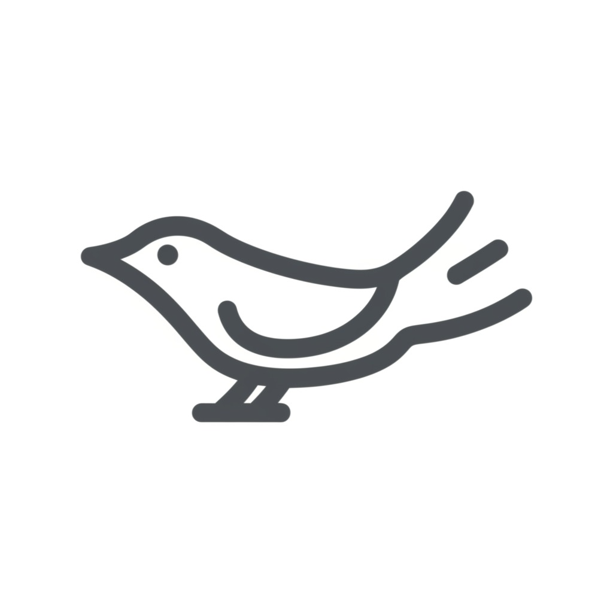
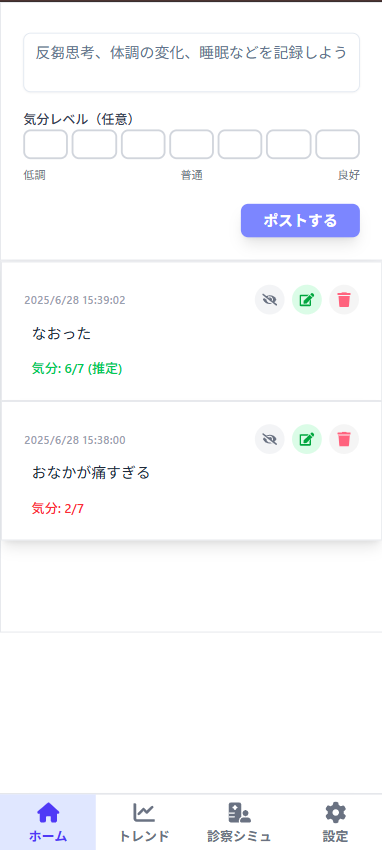
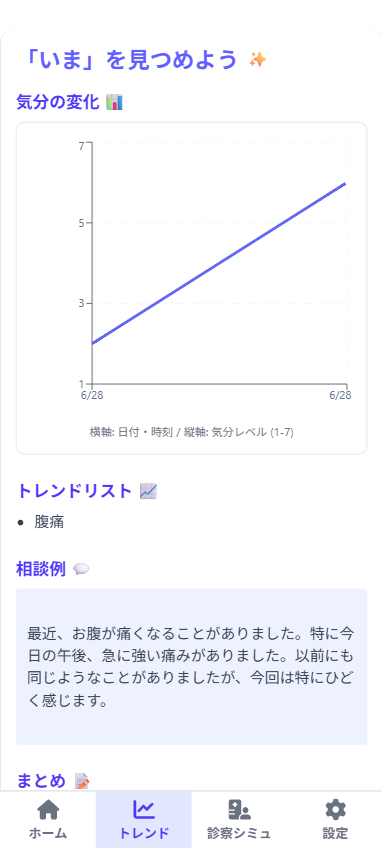
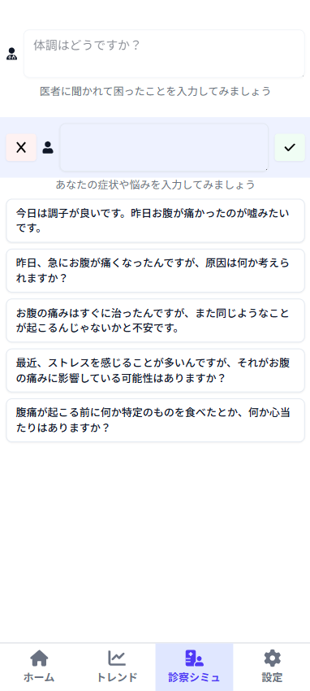
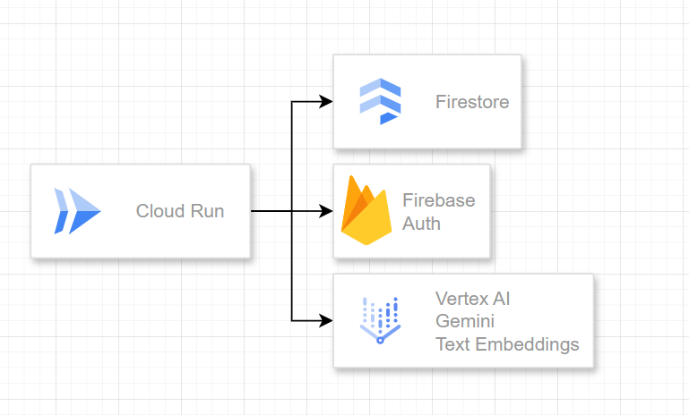

##  はじめに

うつ病は、生涯で約 15 人に 1 人が経験すると言われるほど、誰にとっても身近な病気です。新型コロナ流行後の 2020 年には 17.3%もの人がうつ状態にあるとされ、大きな問題となっています。その治療において、定期的な通院と医師とのコミュニケーションは非常に重要になります。  
(出典参考: <https://toyokeizai.net/articles/-/460203> )

しかし、多くの場合、2 回目以降の受診での診察時間は原則 5 分未満です。その短い時間の中で自身の体調の変化や心の動きを正確に、そして具体的に伝えることは容易ではありません。特に、前回の診察からの期間が空くと、日々の細かな変化や出来事を思い出し、整理して話すのは難しいものです。

この **「通院時のコミュニケーションにおける障壁」** が、効果的な治療の妨げになり得ると考えました。誰もが経験しうるうつ病だからこそ、患者さんがよりスムーズに、そして効果的に治療を受けられるようにサポートしたい。その想いから、**Solilo** を開発しました。

!

生成される内容はあくまで参考程度に、治療は医師主導で行ってください。

##  Solilo プロジェクト概要

Solilo は「独り言」を意味する Soliloquy から生まれた造語です。アプリのコンセプトは **「一人用 SNS 型体調メモ」** 。日々の体調や心の動きを、まるで SNS に投稿するように気軽に記録し、それを次の診察に活かすことを目的としたアプリです。  
アプリ名、ロゴは Gemini 考案です。

##  成果物

<https://google-genai-hackathon-2-528867788137.asia-northeast1.run.app/>

##  デモ動画

<https://youtu.be/dRCCTz6s708>

##  ユーザー像と解決したい課題

**うつ病等の精神疾患で通院している人** の **「通院効果の最大化」** を目指します。  
多くの精神科・心療内科では、診察は 2 週間に 1 度程度です。その限られた機会で病状をうまく伝えられない、という状況を改善し、患者さんが自身の状態をより正確に、そして楽に伝えられるようにすることで、通院の効果を最大限に引き出すことを目指します。

精神疾患、特にうつ病の症状は「ネガティブな考えを繰り返す」、「自責思考が抜けない」など外観ではわからず、午後には問題なく活動していることも珍しくありません。そのため、患者自身もどう苦しんでいたのか忘れてしまうことが多々あります。  
例えるならば寝ている間に見る夢のようなもので、印象的な内容でないとすぐ忘れてしまいます。

##  Solilo の主な機能

Solilo は、以下の 3 つの主要な機能で、患者の通院をサポートします。

  * メモ
  * トレンド生成
  * 診察シミュレーション

###  自然言語による手軽なメモ

  * **X（旧 Twitter）ライクな自由な記録**

> 「毎日決まったフォーマットで記録するのは負担が大きい」  
>  「体調が悪くても、X ならなんとなく見たり書いたりできる」  
>  「でも、ネガティブなことを書き込むとフォロワーに心配をかけてしまう」

既存健康管理アプリケーションでの課題を受け、日常的に使い慣れた SNS のようなインターフェースを採用しました。堅苦しい形式にとらわれず、その時の気分や体調、出来事を自由な言葉で記録できます。  
ここで記録した内容は後述する二つの機能で利用されます。

  * **必要な時だけアクセス**  
決まった時間に記録する必要はありません。体調の変化を感じた時、何か記録しておきたい出来事があった時など、必要な時にだけアクセスしてメモを残せます。これは「一人用 SNS」なので、誰かに気兼ねする必要もありません。薬を飲んだ、散歩をしたなど些細なことでも重要な情報となります。

####  投稿時の処理フロー

投稿時には、以下のような処理が行われます。

  * **Embedding 生成** : 投稿内容から意味ベクトルを生成し、Firestore に保存します。これにより、後の検索や類似投稿の抽出が容易になります。
  * **気分予測** : Gemini が投稿内容から気分（例: ポジティブ/ネガティブ/ニュートラルなど）を推定し、可視化やトレンド分析に活用します。

###  客観的なトレンド生成

  * **症状の傾向を可視化**  
メモを作成するたびに、直近の症状や気分の変動をまとめたトレンドレポートが自動で更新されます。
  * **診察前のクイックレビュー**  
通院前にこのトレンドを確認することで、最近の自分の状態を客観的に把握し、医師に伝えるべきポイントを整理できます。
  * **副作用の早期発見**  
気分の波だけでなく、体調の変化（眠気、だるさ、頭痛など）も記録していれば、薬の副作用の可能性に早期に気づくきっかけにもなり得ます。

####  医師への相談方法の提案

トレンド生成と同時に行われます。  
仕組みはほぼ同じですが、**firestore のベクトル検索機能を使用して、全文検索っぽいことをしています。**  
~~エージェント感のために必要？~~

###  診察のシミュレーション

  * **医師と患者の対話を練習**  
自由に心療内科医と患者のセリフを設定し、診察のロールプレイングができます。
  * **Gemini によるセリフ候補生成**  
面倒なテキスト入力は不要です。Gemini2.0 が、一般的な診察の流れや、記録したメモの内容に基づいた患者のセリフ候補を生成します。
  * **「聞かれて困った」経験に対応**  
過去の診察で「こんな質問をされて回答に詰まった」「うまく説明できなかった」という経験がある方にとって、事前に受け答えをシミュレーションできるこの機能は、診察への不安を和らげる助けとなるはずです。

本来であればサーバー側で会話コンテキストを持ったほうがいいですね。  
~~プロトタイプなので目をつぶります。~~

##  システムアーキテクチャ

Cloud Run を使用しています。  

##  ユーザー体験で意識した点

###  文字入力を最低限に

文章を書くことはコストの高い行為です。より正確に体調を記録したければ定期的に決まった方法でユーザーにデータ入力を求めなくてはなりませんが、継続できなければ元も子もないと考え、好きな時に自由な内容を入力できる仕組みにしました。  
診察シミュレーションは投稿がなくても機能し、文字を入力せずともセリフ候補を選択することで会話を作り出すことが可能です。  
チャット UI の雰囲気を残しながら認知負荷を下げ、自由入力も許す柔軟な設計にしました。

###  ユーザーのアクションに対するレスポンス

トレンド生成機能は初期構想には含まれていませんでした。  
追加した経緯として、「SNS 型なのに、投稿しても誰も反応してくれない」点に違和感があり、若干の虚無感を感じたことが実装のきっかけです。  
「投稿後に LLM がリプライをくれる」案もありましたが、カウンセリング等の医療行為は人間に行ってもらうべきという思想と、Google 等がが提供する本家サービスが圧倒的にチャット体験が良いこと、ロングコンテキストを管理するコスト面から実装を見送りました。  
とはいえ、アプリケーションから何もリアクションがないのは寂しいので、「直近のポストのサマリをトレンド風に表示する」に落ち着きました。

##  今後の展望

  * 検索の仕組みを整備する 
    * 全文検索などのシステムを導入する
    * ユーザー/LLM がタグをつけられるようにする
  * ハードウェア連携 
    * 睡眠記録はウェアラブル機器が強力
  * MCP連携 
    * LLM関連サービスと連携しいつでも記録

##  まとめ

Solilo は、日々の記録を手軽にし、AI との診察シミュレーション機能で事前準備をサポート、そしてトレンド機能で客観的な振り返りを可能にすることで、**うつ病患者の通院体験をよりスムーズで効果的なものに変える** ことを目指しています。  
複雑な機能を持たせてはいませんが、レスポンスは速く、患者の意思伝達コストの一部を代行するという意味ではエージェントと言えるのではないでしょうか。

精神疾患は人生において長い付き合いになります。「うまく伝えられない」という悩みを解消し、あなたと医師とのより良いコミュニケーション、そして治療効果の最大化に貢献できれば幸いです。

##  謝辞

各種 SNS でフィードバックをお寄せいただいた方々に感謝申し上げます。
