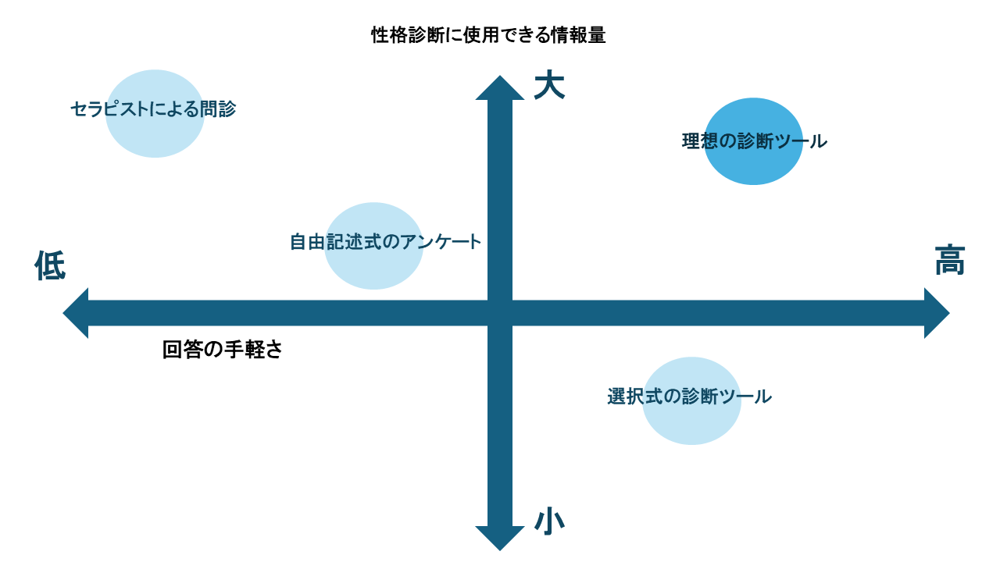
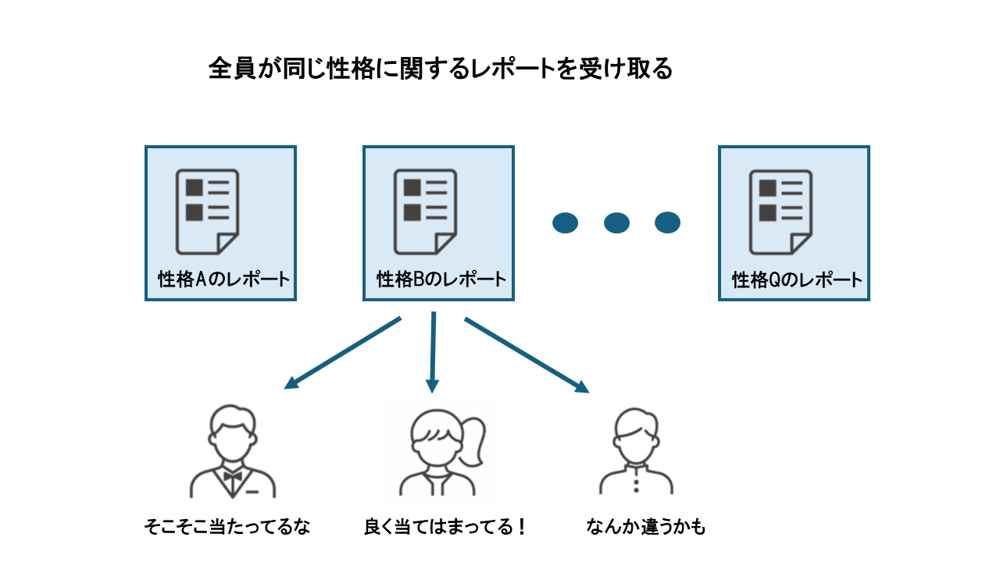
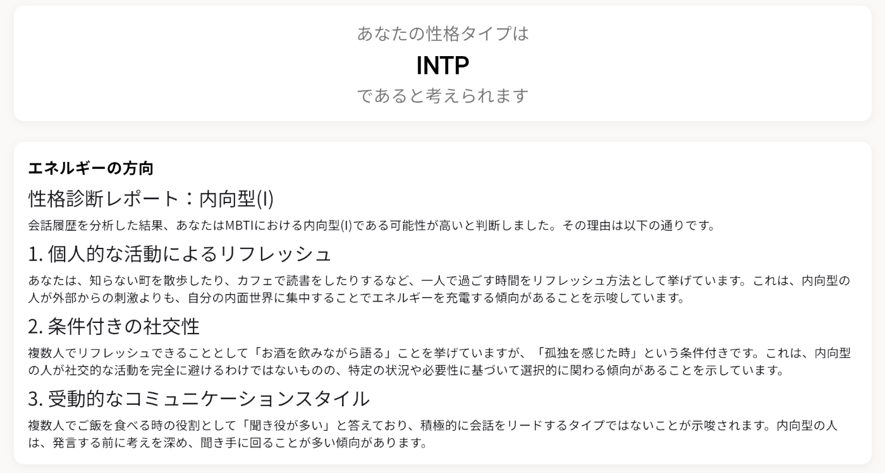
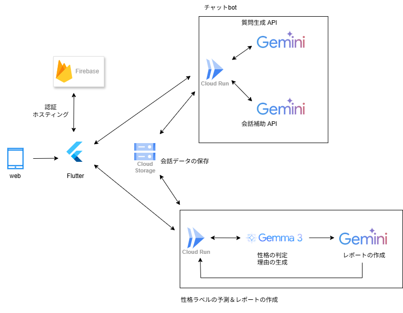

#  1\. はじめに

本アプリは、ユーザーがチャットボットとの会話を通して性格診断を行うためのものです。この記事ではZenn主催のAI Agent Hackathon with Google Cloudへの参加記録として、このアプリの狙いと詳細な実装の説明を行います。

<https://youtu.be/FwnjWZjh9Bw>

#  2\. 背景

##  2.1 世の中にあふれる性格診断ツール

昨今、様々な性格診断ツールが開発されています。例えばMBTI診断系のツール（[16personalities](https://www.16personalities.com/ja) など）は世間でも広く認知されています。これらのツールはそのほとんどが以下の2つの特徴を持っています。

  1. 質問に対してユーザーは選択形式で回答する
  2. ユーザーはいくつかの性格ラベルのいずれかに分類され、ラベルごとに用意された説明を受け取る

1つ目の特徴について、Yes-Noの中でグラデーションが用意されているものや、開発の用意した回答の候補の中から１つを選択する形式のものがよく見受けられます。選択形式の回答は自由記述のものよりも、ユーザーにとって手軽ではあるものの、各人の持っている微妙なニュアンスをうまく伝えられない点にもどかしくなるときがあります。例えば、「～と～はどちらが大事？」のような質問には、「この状況ではこっちが大事だけど、他の状況ではもう一方が大事」のように回答できると、より細やかな情報を受け取ることができます。

２つ目の特徴について、ほとんどの性格診断ツールはあらかじめ用意された性格ラベルにユーザーを割り振り、最終的に割り振られた性格ラベルについて詳細な説明が書かれたレポートを与えるものになっています。それらのレポートのほとんどが事前に用意されたものであり、ユーザーの入力によって変化することはありません。これでは同じラベルに分類されたユーザーは同じレポートを受け取ることになってしまい、やや味気ない印象を受けてしまいます。

##  2.2 対象とするユーザー

対象とするユーザーは次のような人々です。一般的な性格診断ツールがターゲットしている人にはもちろん、これまでのツールにはなかった体験を求めている人にも使っていただければと思っています。

  * 性格診断ツールを通して自分自身への理解を深めたい人
  * 話のタネに自身の性格診断の結果を知っておきたい人
  * 自分の性格を端的に伝える手段として性格診断ツールを使いたい人
  * 選択式ではもどかしく感じるおしゃべりな人
  * 自分の回答によってカスタマイズされた詳細な性格についての説明を受け取りたい人

#  3\. ソリューションとアプリの特徴

本アプリでは、前述の背景をもとに次のようなソリューションを用意しています。

##  3.1 会話データによる性格診断

本アプリではユーザーはチャットボットとの会話によってアプリ側に情報を提供します。これにより、ユーザーの考えを選択肢式のものよりも細やかに受け取ることができます。また、ユーザーの回答に対してさらに内容を深める形の質問にすることで、さらに詳細な情報が得られます。また、繰り返し遊ぶ場合でも会話の内容が前回とは変化することで新鮮な気持ちで遊ぶことができます。

チャットボットの実装には、`LangGraph`と`gemini`を使用しています。`LangGraph`によって会話の状態を記憶しておくことで1つ前の回答に戻ったり、後述の回答の候補の生成に役立てられます。会話用のllmに採用されている`gemini`は４つの要素からなるMBTIを予測するために、それぞれの項目についての質問を促すようなシステムプロンプトによって制御されています。

MBTIの各要素の予測には`gemma-3-4b-it`をファインチューニングしたモデルを活用しています。各モデルは会話データから、2値のラベル（「エネルギーの方向」ならば I or E)とそのように診断された理由を生成します。診断された理由については、後述のレポートの生成に使用されます。

学習用のデータとして、複数の知人に協力をお願いして会話データと正解ラベル（他ツールでのMBTI診断の結果）を提供していただきました。それらを使用して、`gemma`の生成の手本となる正解データ（理由＋2値のラベル）を人手によるアノテーションによって用意しています。

##  3.2 一人一人にカスタマイズされたレポート

従来の診断ツールでは、最終的な診断結果の画面は性格ラベルの数しか用意されておらず、ユーザーはどの回答がその結果につながったのかを知ることができませんでした。本アプリではllmを使うことでユーザーごとに異なったレポートを提供します。

MBTIは、「エネルギーの方向」, 「ものの見方」, 「判断の仕方」, 「外界との接し方」の4要素から構成されています。ユーザーはそれぞれの項目について、なぜ自分がこの性格ラベルに分類されたのかを知ることができます。予測に用いた`gemma`が出力した診断の理由とチャットボットとの会話を`gemini`に与え、ユーザーごとに異なったレポートの生成を実現しています。

チャットボットとの会話を終えたユーザーは次のような結果を受け取ります。この画像のように「I型（内向型）」と診断された場合、自分のどのような面がその診断結果につながっているかを知ることができ、同じラベル全員に画一的な説明が行われる従来の性格診断ツールと比較して高い納得感を得ることができます。

##  3.3 回答の選択肢の生成

自由記述式の回答は選択式のものと比較して、細やかな情報が得られるものの、ユーザーの認知的なリソースが高くなってしまうという短所も存在します。そこで、本アプリではチャットボットとの会話の中でユーザーに対して質問への回答の候補が3つ提示されます。ユーザーの考えにあうものがあればそれらを選ぶだけでよいので、自由記述式の回答の短所を軽減することができています。これらの回答の候補の生成は、ユーザーとAIとの会話を参照して動的に行われます。

#  4\. システムアーキテクチャ

  
**使用技術**

  * **フロントエンド** : Flutter
  * **バックエンド** : Firebase
  * **データベース** Google Cloud Storage
  * **llmのホスティング** : Cloud Run
  * **チャットボット &レポート生成用llm**: gemini-2.0-flash
  * **性格診断llm** : gemma3-4b (SFTして使用）
  * **オープンソースフレームワーク** LangGraph

#  5\. 開発後記

本アプリの開発にあたって様々苦労がありました。ここにはその主なものを書き記していきます。

#  5.1 終わらないアノテーション

本アプリで使用している性格診断モデルは予測結果の性格ラベルだけでなく、レポート作成のためにその診断理由も生成する必要があります。そこで、収集した会話データと性格ラベルの組を使って、「理由＋2値のラベル」からなる正解データを用意しなければなりませんでした。いただいた会話データの一つ一つに目を通して、会話のどこにその性格ラベルの特徴が表れているかをチェックし記入していく作業をする必要があり、この点が非常に苦労したポイントでした。chatGPTやgeminiなどの生成AIを使用する方法も試しましたが、納得のいく質のアノテーションは難しいと判断し、最後まで人手によるアノテーションを続けました。今後も継続的にモデルの学習を続けていく予定であるため、この点は効率化しなければならないと考えています。

#  5.2 すぐに落ちるDB

会話データによる性格診断ツールであるため、その蓄積は欠かすことのできないものです。チャットボットとユーザーの会話は比較的早いテンポでやり取りが行われるため、DBへの保存の方法については様々試行錯誤が必要でした。データ収集のために簡易版を複数のテストユーザーに使用してもらったところ、ＤＢのセッション数がすぐに上限を超えてしまう現象が起こりました。協力していただいたユーザーには大変申し訳なかったものの、これによってDBへのアクセスの仕方に誤りがあったことに気づき、本番までに修正することができました。

#  6\. 最後に

今回のハッカソンではチャットボットとの会話を通して、ユーザーの性格診断をできるツールを開発しました。llmを使用することで従来の性格診断ツールよりも、ユーザーの性格を知る上でより詳細な情報を捉えることができ、それぞれに合わせたレポートを提供することが可能となっています。シンプルなアプリですが、他の性格診断ツールにはない体験を提供できているかと思いますので、ぜひ一度遊んでみてください！

加えて、今回の開発にあたって、学習用データの収集を様々な方にお願いしました。このアプリの根幹である診断用のモデルにはそれらが欠かせないものとなっていました。この場を借りてお礼申し上げます。

#  6.1 今後の展望

ハッカソンの提出日には工数の関係で間に合わなかったものの、次のような改善の余地があると考えています。

  * 診断を受けた後にもチャットボットとの会話をできるようにする  
ユーザーが診断結果とレポートを受け取った後で、それらについての会話を楽しむことができるチャットボットを追加的に実装する予定です。ユーザーの性格についての情報を得たAIは良き相談相手になってくれることを期待します。

  * 継続的なモデルの学習  
診断用モデルの精度向上のため、引き続きデータ収集、モデルの学習を継続していく予定です。

