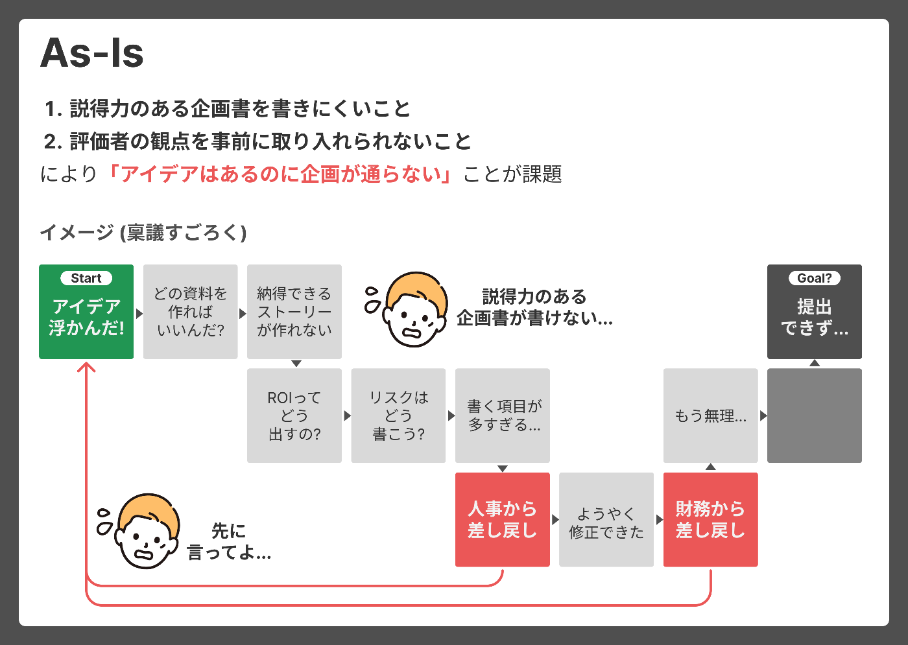
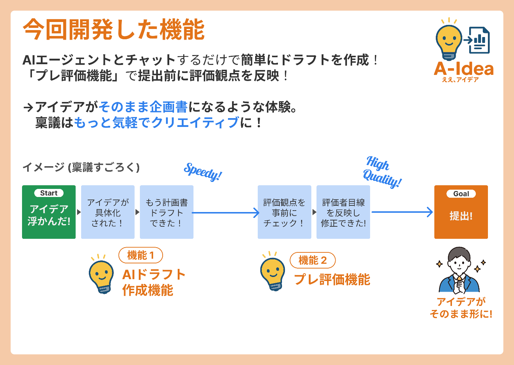
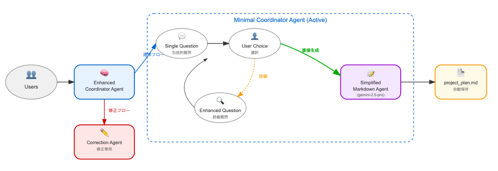
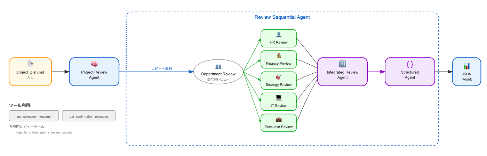
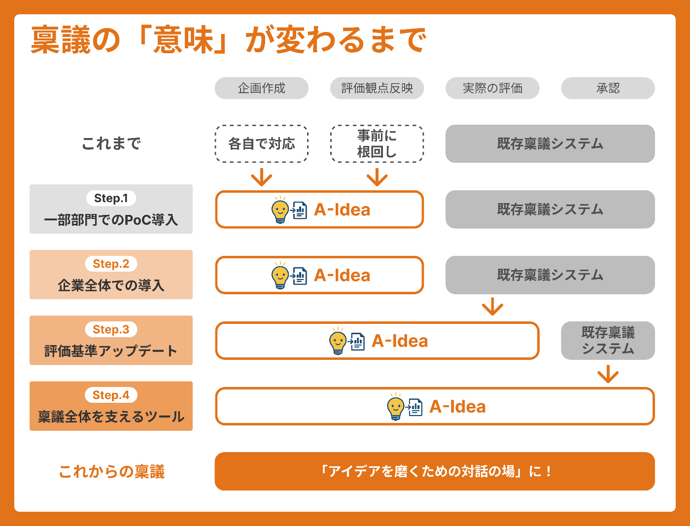

!

本プロダクトは、第2回 AI Agent Hackathon with Google Cloudにエントリーしています。

<https://zenn.dev/hackathons/google-cloud-japan-ai-hackathon-vol2?tab=overview>

↓デモ動画  
<https://youtu.be/XsDC5QBaQ84>

#  背景 ―稟議が憂鬱だともったいない!?

正直、稟議って憂鬱じゃないですか？

でもこれ、実はあなたの会社のクリエイティビティや意思決定の質を損なっているかもしれない、  
すごくもったいないことなんです。

##  いまの稟議では、企画立案に集中できない

起案する側は「上司や他部署への根回しだけで疲弊する」「書く前の調整だけで業務が止まる」といった本音を持っており、本題にたどり着く **”前に”** かなりの労力をかけている実態が浮き彫りになっています。

実際、弁護士ドットコムの2024年調査によると、稟議申請から承認までに「1日以上かかる」と回答した企業は73.5%、中でも「2～3日かかる」は52.5%にのぼっています。また、「事前の相談や根回しに時間がかかる」と答えた人は35.9%、「承認に関わる人が多すぎる」という声も41.0%に達しています。  
<https://prtimes.jp/main/html/rd/p/000000470.000044347.html>

つまり、多くの現場では、企画そのものよりも **「通すための準備」に時間とエネルギーが費やされている** のです。これでは、良いアイデアがあってもすぐに行動に移すことが難しく、組織としてのクリエイティビティが削がれてしまいます。

##  伝わらない稟議は、評価者を疲れさせる

稟議は起案する側だけでなく、承認・評価する側にとっても大きな負担になっています。特に課題となっているのが、内容のわかりにくさです。

Atledの調査では、承認されにくい理由として「ROIなどのリターン記載が不十分」と指摘されており、判断材料が揃っていない稟議が多いことが明らかになっています。

つまり、伝わらない稟議が評価者の手を止め、結果的に **意思決定のスピードと質を大きく下げてしまっている** のです。

* * *

私たちはIT投資評価・プロジェクト計画支援に関するコンサルティングを行う中で、稟議の課題とポテンシャルを同時に感じてきました。  
そこで、本来企業の生産的な活動の根幹をなす **「プロジェクトの企画・起案・評価」のプロセスをもっと気軽でクリエイティブなものにする** ため、AIエージェントを用いたプロダクト開発を開始しました。

#  稟議の課題 ― 人と人が向き合うことの限界

では、稟議における課題をさらに深掘ってみましょう。  
私たちは実際のコンサルティング経験をもとに、「起案者」「評価者」「会社全体」それぞれの目線で課題を捉えました。

##  起案者目線の課題：アイデアはあるのに、企画が通らない...

起案者目線での課題は、主に①説得力のある企画書を書きにくいこと、②評価者の観点を事前に取り入れられないこと、の2点であると考えます。

###  ①「どう書けばいいのかわからない…」説得力のある企画書を書くことの難しさ

企画書を提出するまでには、たくさんのハードルがあります。  
そもそも、プロジェクトの企画構想を経験したことがない人にとっては、企画書自体のお作法がわからなかったり、作成が難しい項目が存在します。  
例えばIT一筋のエンジニアにとっては「プロジェクトの投資対効果」を正確に書くことは難しいでしょう。(ある程度は書けても、財務や経営企画が納得するレベルで書くことは難しいケースが多いです)

また、関係する部門が多い場合、埋めるべき項目がたくさんあるため、すべて埋めるのに時間がかかってしまう事が多い点も課題です。例えばある大手エネルギー系企業の子会社では、自社向け・ホールディングス向け、ウォーターフォール開発の各ステップ…等、用意する必要がある資料が最大150近く存在しており、企画者が疲弊してしまっているという事例があります。

これでは、せっかくやりたいことや強い思いがあっても、説得力のある企画書を書ける自信がなくて諦めてしまうこともあるのではないでしょうか。

###  ②「それ、先に言ってよ...」 評価者の観点を事前に盛り込む難しさ

やっとの思いで企画書を作って提出しても、財務や経営企画などの専門的な観点や、細かいポイントでツッコミが入り差し戻されてしまうこともしばしばです。また、一度修正しても、別の部門からまた差し戻しが入ることも...。

これは、企画書を作成する際、事前に評価者の観点を十分持てておらず、企画書の中にうまく盛り込めないことが原因です。  
(もちろん、長年その企業で企画書を書いてきた経験があればなんとか取り入れることはできるのですが、あくまで属人的な暗黙知になってしまい、アクセスできる人は限定的になってしまいます)

また、その対策として評価者の観点を事前に盛り込むために根回しを行うことが一般的ですが、先ほどの通り、企画よりも「通すための準備」に終始してしまい本末転倒となってしまいます。

##  評価者目線の課題：評価基準の策定・アップデートが難しい…

プロジェクトの評価の質を高めたい――そう考えて評価基準を整備しても、それが起案時に意識されていなければ、意味を持ちません。結果として「このROIの根拠は？」「効果が見えづらい」といった指摘を毎回繰り返すことになり、評価する側も疲弊してしまいます。

本来であれば、評価観点が企画段階から自然に取り入れられていて、「ここを見れば判断できる」とわかる構成になっていてほしい。でも実際には、資料を読み解くこと自体が大変で、「どこに書いてある？」「これは何を根拠にしている？」と探しながらのレビューになってしまうことが多いのです。

結果として、評価は形式的・属人的になり、「とりあえず差し戻すか…」といった判断につながってしまうこともあります。本当はもっと前向きに、判断しやすい材料をもとに議論したい――そう感じている評価者は、少なくないはずです。

##  企業目線の課題：計画の質を高める仕組み不足

多くの企業では、進捗管理ツールやPMOの導入など、プロジェクトの「実行」を支援する仕組みがあっても、「計画」を支援する仕組みはほとんど整っていません。

現場任せの企画はどうしても属人的になりやすく、計画の粒度や説得力に差が出ます。本来であれば組織として伴走したいところですが、**専任をつけるだけの予算が確保しづらく、計画フェーズをサポートできる人材も限られている** ため、十分な支援ができていません。

このように、**計画の質を高める仕組みが不足していることが、そもそもプロジェクト全体の成功率を下げてしまう根本的な要因** になっているのです。

#  目的 ― 稟議を創造的なプロセスに変える

私たちは、こうした稟議の構造的な課題を解決しようと考えました。

でも目指したのは、単に「稟議のスピードを上げる」ことではありません。  
また、AIがすべての企画書を自動で書き、評価まで完結させてしまう未来を描いているわけでもありません。

本当に変えたかったのは、**稟議というプロセスそのものの意味** です。「ただの面倒な手続き」ではなく、 **「アイデアを磨き、創造性を引き出すための仕掛け」** に変えられないかと考えました。

そこで私たちは、**企画書づくりの不安やハードルをAIエージェントと一緒に乗り越え、アイデアがそのまま企画書になるような体験** を目指しました。

#  機能ーAIドラフト作成・プレ評価でアイデアに集中する

今回はプロトタイプとして、中核となる以下の機能を備えたプロダクトを開発しました。  

##  ①AIドラフト作成機能

私たちがまず取り組んだのは、「何を書けばいいかわからない」という起案時のハードルを下げることでした。

そこで実装したのが、AIとのチャットを通じてアイデアをそのまま企画書に落とし込める、**ドラフト自動生成機能** です。

たとえば「こんなアイデアを企画にしたい」とふんわり投げかけると、AIが「どんな課題に対する提案ですか？」と対話を通じて深掘りを始め、ユーザーの回答をもとに企画書の骨子を構築していきます。

とくに、ROIやリスクのような専門的な項目は、PMBOKなどの知見に基づいてAIが“妥当な初稿”を生成します。前提条件を伝えれば、数字や表現も補ってくれるため、**経験が少なくても説得力ある企画書が作れる** ようになります。

さらに、企業ごとの中計や社内ルールをエージェントに組み込むことで、その企業ならではのトーンや前提も反映可能です。

###  ②プレ評価機能

もうひとつの課題は、企画書に評価者の視点が反映されないまま提出されてしまうことでした。

そこで導入したのが、**AIによる事前レビューを受けられるプレ評価機能** です。財務・人事・経営企画などの部門ごとに評価エージェントを設定し、それぞれの基準をもとに、提出前の企画書をレビューします。

起案者は、どの部門に評価してもらうかを選び、AIからの指摘を参考に必要な部分を修正。これを繰り返すことで、**提出前から評価観点を取り入れた内容にブラッシュアップ** できます。

評価者にとっても、あらかじめ整った企画書が届くことでレビュー負担が軽くなり、AIの評価結果を確認しながら最終判断だけに集中できるようになります。

この機能により、起案者・評価者の双方の業務負荷が減るため、**よりスムーズで前向きな対話を生み出すきっかけ** になります。

このように、評価者と起案者の両者が、負担を減らしながらも質の高い対話を行うことが可能となります。

#  システムアーキテクチャ

  
使用技術・サービスは以下のとおりです。

  * フロントエンド: Next.js 15（React 19ベース）でユーザーインターフェースを構築
  * バックエンド処理: Firebase Cloud Functions（Python 3.13）でAPIサーバーを構築
  * データベース: Cloud Firestoreで稟議書データやコメントをリアルタイム同期
  * AIエージェント: Agent Development Kit（ADK）でマルチエージェントシステムを実装
  * AIエージェント基盤: Agent Engineでエージェントの実行環境を提供
  * AI言語モデル: Gemini 2.5 Proで高速な文書分析・生成を実現

参考：データフロー

  1. 稟議書作成フロー

  * ユーザーがWebブラウザからNext.jsアプリにアクセスし、Firebase Authでログイン
  * 稟議書の内容を入力すると、リアルタイムでFirestoreデータベースに保存

  2. AIレビューフロー

  * ユーザーがレビュー開始ボタンを押すと、Firebase FunctionsがAIエージェントを呼び出し
  * エージェントシステムが稟議書の内容を分析し、各部門（財務・法務・人事・IT）の観点でレビュー  
部門別専門エージェントが各部門の専門知識に基づいてコメントや改善提案を生成
  * 生成されたレビュー結果はFirestoreに保存され、ユーザーにリアルタイムで表示

#  特徴

##  1\. 複雑なタスクに対応するため、マルチAIエージェントをフル活用

本プロダクトの最大の特徴は、複雑なタスクに対応するための **マルチAIエージェント構成** です。  
特に、上記のAIドラフト作成・プレ評価機能は非常に複雑なタスクであるため、  
一つのエージェントで実装しようとするとプロンプトが膨大になったり、メンテナンス性が低下するという課題がありました。

そのため、AIドラフト作成・評価を担当するエージェントは、それぞれ複数のサブエージェントを持ち、役割分担を行うことで効率的に処理を行う構成としています。

AIドラフト作成エージェントの構成  

評価エージェントの構成  

参考：AIドラフト作成エージェントの処理の流れ

処理フロー:

  1. Single Question: 包括的質問で初期情報を効率的に収集
  2. User Choice: ユーザーが選択（直接生成 or 詳細質問）
  3. Enhanced Question: 詳細質問（オプション）→ User Choiceへ戻る
  4. Simplified Markdown Agent: 最終的に企画書を生成・自動保存

修正フロー:

  1. Project Review Agentからのレビュー結果を受けて
  2. Correction Agentが指摘事項に基づいて修正
  3. 修正された企画書を再度生成
  4. Enhanced Coordinator Agentが全体の流れを管理

参考：評価エージェントの処理の流れ

  1. project_review_agent がレビュープロセス全体を管理
  2. review_sequential_agent が順次実行を制御
  3. department_review_agent が選択された部門のレビューを実行
  4. integrated_review_agent でレビュー結果を統合
  5. structured_agent で最終的なJSON形式に構造化

##  2\. AIだけで判断しない、HITL (Human in the Loop)の設計

なぜAIエージェントツールなのに、「AIだけで判断しない」のか疑問に思われた方も多いと思います。

冒頭にも述べたとおり、稟議や承認は企業活動にとって根幹となるプロセスです、  
「この企画書はAIが書いたから知らない」といった**無責任な態度が蔓延** したり、  
「なんでAIに差し戻されないといけないんだ」といった**組織内のハレーション** が発生しかねません。

また、企画書を作成したり、実際に評価を行うなどの「プロセス」によって養われるスキル・得られる学びがあることも確かです。**完全にAIに任せてしまうことのリスクは大きい** と考えました。

そこで、人-人の説明責任を果たせるよう、Googleが提唱しているHITL(Human in the Loop)の考え方を尊重し、**あくまで「AIは添えるだけ」** としました。  
とはいえ、AIによって業務・精神的な負荷が減るのは先ほど述べたとおりです。  
<https://cloud.google.com/discover/human-in-the-loop?hl=en>

#  展望 ― 稟議はもっと気軽に、クリエイティブにできる

###  A-Ideaが稟議の意味を変えるまで

我々はコンサルタント2人で結成したチームですので、ただプロダクトを作るだけではなく、  
**実際にこのプロダクトを通じてどう業務プロセス・文化を変えていくか** 、という道筋を描きました。  

今回のA-Ideaでは、プロジェクト企画におけるベストプラクティスや、およそ妥当な値をもとにagentの挙動・評価基準等を設定しました。  
しかし実際、これらは企業・部門によって大きく異なります。

そこで、 **まずはagentのプロンプト・参照する評価基準・ドキュメントなどをカスタマイズしながらPoC的に導入** していきます。  
また、成功事例を作って企業内で展開しやすくするためにも、まずは一部の部門で部分的に導入し、  
効果が出たら複数の部門での利用に拡張し、徐々に企業全体のプロセスに組み込んでいくことを推奨します。  
(この段階では、A-IdeaのURLを既存の稟議システム等に貼り付けて随時参照するようなイメージです)

将来的には、**AIが評価傾向を学習し、評価基準そのものをアップデートしていくような仕組み** も想定しています。人間が追加・修正したコメントの内容をもとに、実は言語化されていなかった評価基準や観点ををAIが明らかにして、必要に応じて「こういう観点も取り入れてみませんか？」と提案してくれることで、評価者目線でもさらに使いやすくなるはずです。

最終的にはワークフロー機能を実装する等のアップデートにより、  
単なる事前評価ツールではなく、**起案から承認までを一貫して支えるツール** へと進化していきたいと考えています。

##  稟議が変われば、組織はもっとクリエイティブにできる

少し余談ですが、今回のメンバーは二人ともエンジニア出身ではありません。  
（なんなら私oidyは、今回Gitの使い方を本格的に学び始めたくらいでした…）

しかし、Geminiなどの生成AIやCursor, Claude Code(Vertex AI経由で利用)といったプログラミング支援ツールを使うことで、**ふんわりしたアイデアがそのまま形になっていく体験** ができました。すでにソフトウェア開発の世界では、アイデアさえあればたったの1~2時間で動くプロダクトを作れるようになっているのです。

企画や稟議の世界でも、同じような変化を起こせるのではないか。そう思って、私たちはこのプロダクトに取り組んできました。  
私たちはただの効率化ではなく、稟議の意味を「形式的な手続き」から、 **「アイデアを磨くための対話の場」** に変えることを目指しています。

そしてゆくゆくは、アイデアの価値が高まり、挑戦が応援される組織になっていく。  
そんな文化の第一歩として、私たちはA-Ideaを提案します！

* * *

###  A-Idea 開発メンバー

  * oidy
  * mk 
    * <https://zenn.dev/mmkkkkzz>
    * <https://github.com/mmkkkkzz>
    * mk.mikikazuma@gmail.com

