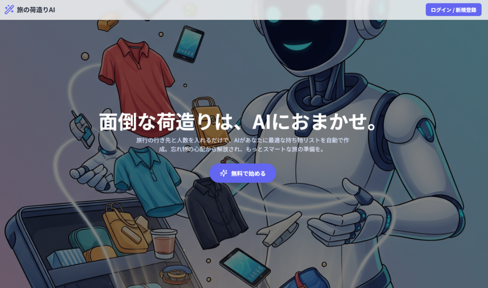
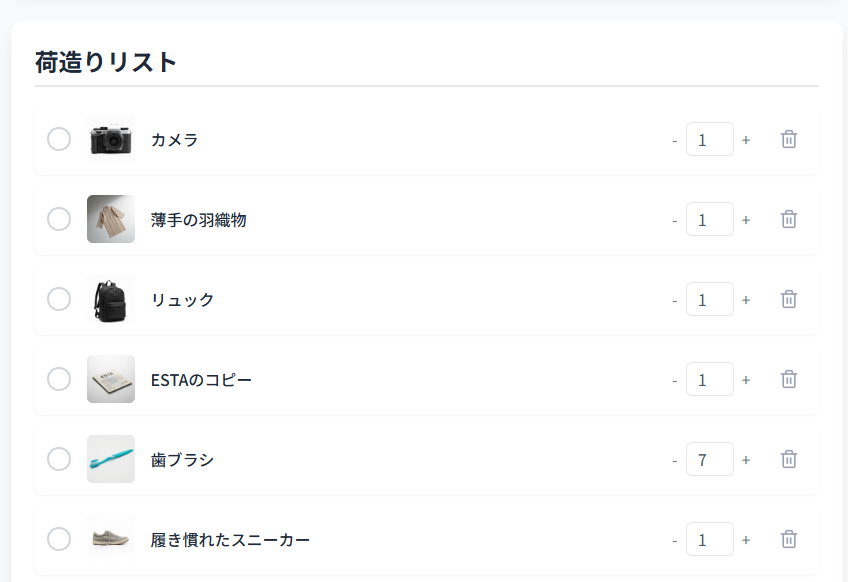
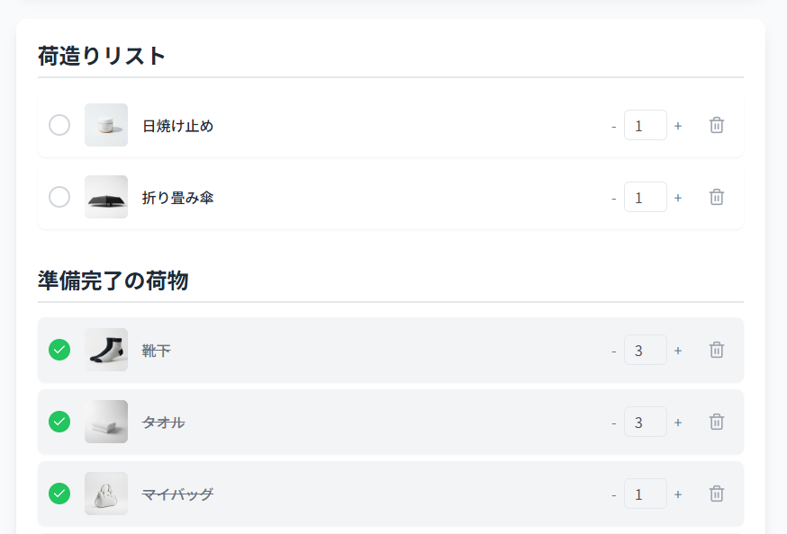
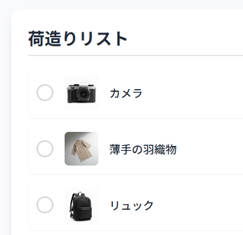
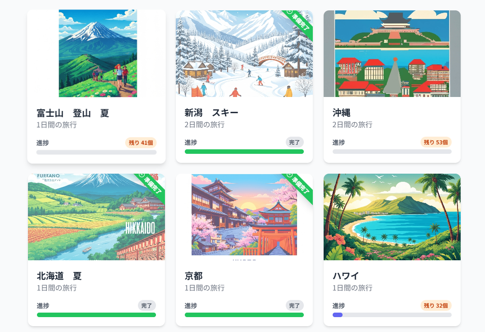
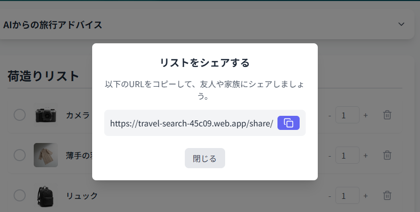
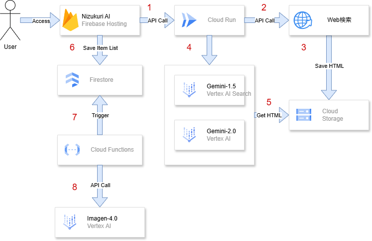

##  はじめに

「次の旅行、どこに行こう？」  
旅の計画を立てる時間は、心躍る瞬間です。しかし、そのワクワクが最高潮に達したとき、ふと現実的な課題が頭をよぎります。それは「荷造り」。

何を持っていけばいいのか、忘れ物はないか、そもそも準備が面倒くさい…。多くの人が経験するこの悩みを解決するために、私たちはAIの力を活用した新しいソリューションを開発しました。

本稿でご紹介する「**Nizukuri AI（荷造りAI）** 」は、そんな旅行前の億劫な時間を、スマートで楽しい体験へと変えることを目指すAIエージェントです。

この記事では、その機能と利用してる技術についてお話しします。

デモ動画  
<https://youtu.be/4juTtKTTOvw>

※本稿は[第2回 AI Agent Hackathon with Google Cloud](https://zenn.dev/hackathons/2024-google-cloud-japan-ai-hackathon)の成果物です。

##  要旨

本システム「Nizukuri AI（荷造りAI）」は、旅行の際の大きな負担である「荷造り」を、AIの力で自動化・最適化する革新的なソリューションです。

ユーザーが**行き先** と**日数** を入力するだけで、GCP（Google Cloud Platform）上で動作するAIエージェントがリアルタイムにWeb情報を解析し、その場所や目的に最適化された持ち物リストを自動生成します。

生成されたリストはインタラクティブなチェックリストとして提供され、準備の進捗度も可視化。面倒な荷造りを、スマートで楽しい体験へと変えることを目指します。

##  対象ユーザーと課題

###  対象ユーザー

  * 旅行の計画は好きだが、荷造りが面倒・苦手だと感じているすべての人

  * 初めての旅行先で、何を持っていくべきか見当がつかない人

  * 出張や家族旅行などで、忘れ物がないか常に不安を感じている人

  * 荷造りに時間をかけたくない、もっと効率的に準備を済ませたいと考えている人

  * 旅行に必要な荷物を家族・友達に共有したいが、時間をかけたくないと考えている人

####  課題

多くの人にとって、旅行前の荷造りは時間と手間がかかる作業です。

インターネットで「〇〇（地名） 持ち物」と検索しても、膨大な情報の中から自分に合ったものを選び出すのは一苦労です。

また、記事が古くて現地の最新状況と合っていなかったり、一般的なリストで自分の旅のスタイルに合わなかったりすることも少なくありません。

その結果、不要なものまで持って行って荷物が増えたり、逆に必要なものを忘れて現地で困ったりするという課題がありました。

さらに、準備の進捗が分かりにくく、モチベーションの維持が難しいという心理的な負担も存在します。

前日に急ぎで準備をし、準備できてない荷物が出てくるなど、誰しも一度は体験したことがあるのではないでしょうか？

##  課題に対するソリューション

本システムは、これらの課題を以下の機能によって解決します。

###  AIによる持ち物リストの自動生成

ユーザーはWeb検索するように旅行先や季節(例: 富士山 夏 登山)と入力。  
そして、日数を入力するだけ。

その後、システムが、指定された場所に関する最新のWeb記事を複数収集・解析します。Vertex AIにより、単なるキーワードのマッチングではなく、記事の文脈を理解した上で「どのようなアクティビティが想定されるか」「推奨される服装は何か」などを抽出し、パーソナライズされた持ち物リストを提案します。  

###  インタラクティブなチェックリスト機能

AIが生成したリストは、テキストだけではありません。ユーザーはスマートフォンやPCから、準備が完了したアイテムにチェックを入れることができます。チェック済みのアイテムはリストから非表示になり、残りのタスクに集中できます。不要なアイテムはワンクリックで簡単に削除することも可能です。  

###  旅行先/アイテム画像の自動生成による視覚的なサポート

生成された持ち物リストの各アイテム（例：「カメラ」「リュック」）に対して、AIが自動で参考画像を生成して表示します。これにより、ユーザーは直感的に何を準備すればよいかを把握できます。  

また、旅行先の画像も生成され、準備のモチベーションをあげてくれます。  

###  持ち物リストのシェア

生成された持ち物リストを、家族・友達にシェアできます。この機能により、必要な荷物のコミュニケーションをその都度やる必要がなくなります。  

##  システム構成

###  主要コンポーネント

####  フロントエンド

  * React (Firebase Hosting)

####  バックエンド

  * Python（Cloud Run）
  * Javascript（Firebase cloud functions）

####  DB

  * **ユーザ情報保存** : Firestore Database
  * **画像保存** : FireStorage
  * **HTML保存** : Cloud Storage

####  AIモデル

  * **ドキュメント検索** : gemini-1.5-flash-001
  * **荷物抽出** : gemini-2.0-flash-001
  * **画像生成** : imagen-4.0-fast-generate-preview-06-06

###  システム構成図

###  処理フローの解説

  1. **ユーザーからのリクエスト** : ユーザーがWebフロントエンド（Firebase Hosting）から行き先と日数を入力します。

  2. **Web情報の検索** : リクエストを受け取ったCloud Runは、Web検索API(Custom Search API)を呼び出し、行き先に関連する旅行ブログや観光情報サイトの記事を複数取得します。

  3. **HTMLの保存** : 取得した記事のHTMLデータをCloud Storageに一時保存します。

  4. **テキスト解析の依頼** : Cloud Runは、保存したHTMLの情報を基に、Vertex AIに対して記事から持ち物リストを作成するAPIコールを行います。

  5. **リストの生成と返却** : Vertex AI SearchがCloud Storage(gemini-1.5-flash-001)からHTMLを検索します。この情報を元にVertex AI(gemini-2.0-flash-001)が持ち物の概要文とアイテムリストを生成。結果をCloud Runに返します。

  6. **結果の保存と表示** : Cloud Runは、受け取ったアイテムリストをユーザーに返すと同時に、Firebase HostingからFirestoreに保存します。

  7. **画像生成のトリガー** : Firestoreに新しいアイテムリストや旅行先が書き込まれると、それをトリガーとしてCloud Functionsが起動します。

  8. **画像の自動生成** : Cloud Functionsは、リスト内の各アイテム名や旅行先を基にVertex AI（画像生成モデル）のAPIを呼び出し、それぞれのアイテムに合致する画像を生成し、Firestoreの対応するアイテム情報に紐付けます。同時に、Firestorageに保存します。

##  ソリューションの特徴

本ソリューション「Nizukuri AI」は、既存の持ち物チェックアプリとは異なる、以下の3つの特徴を持っています。

###  生成AIによる「リアルタイム性」と「パーソナライズ」の両立

最大の特徴は、Web上の最新情報をリアルタイムに取得し、最新の情報を元に最も適した持ち物リストを生成する点です。

固定のデータベースやテンプレートに依存しないため、「最近オープンしたテーマパークの情報」や「現地の特殊なイベント」といった最新の文脈も反映した、真にパーソナライズされた提案が可能です。

###  GCPをフル活用したサーバーレスアーキテクチャ

フロントエンドのFirebaseから、ビジネスロジックのCloud Run、データベースのFirestore、そして頭脳であるVertex AIまで、GCPの各サービスを疎結合に連携させています。

Firestoreへのデータ保存をトリガーにCloud Functionsが動作するなど、イベントドリブンな処理を組み込むことで、スケーラビリティとメンテナンス性に優れた効率的なシステムを実現しました。

###  直感的で楽しいUX

AIがテキスト情報（持ち物リスト）を生成するだけでなく、それに対応する画像も自動で生成することで、ユーザー体験を飛躍的に向上させています。テキストだけではイメージしにくいアイテムも、視覚情報が補うことで直感的な理解を助けます。

また、準備の進捗を可視化する要素は、ユーザーの「面倒くさい」という感情を「楽しい」に変え、旅行体験全体の価値を高めることに貢献します。

##  今後の発展

今回のハッカソンでは基本的な機能実装に留まりましたが、私たちは「Nizukuri AI」をさらに進化させるために下記の改善が考えられます。

###  購入サポート機能の追加

リストアップされたアイテムの中で、手元にないものを買い足す手間は意外と大きいものです。各アイテムにAmazonや楽天市場などのECサイトへのリンクを自動で付与し、アプリからダイレクトに購入できるようにします。これにより、準備から購入までがシームレスに完結する体験を提供します。

###  シェア機能のアップデート

現状のリスト共有機能を進化させ、共有されたユーザーも自身のチェックリストとして保存・編集できるようにします。家族や友人との旅行で、誰が何を準備したかをリアルタイムに共有・管理できるようになり、協力して荷造りを進められます。

###  ゲーミフィケーションによるUI/UX改善

準備の進捗に合わせてバッジを獲得したり、キャラクターが成長したりするなど、より没入感のあるゲーミフィケーション要素を取り入れます。荷造りを「こなすべきタスク」から「クリアしたくなるクエスト」へと昇華させ、ユーザーのモチベーションをさらに引き出します。

###  荷物の重要度算出とカテゴリ分け

AIがアイテムごとに「必須」「あると便利」「現地調達可能」といった重要度を自動で判定・タグ付けする機能を実装します。これにより、ユーザーは優先順位をつけて効率的に準備を進めたり、荷物を減らす際の判断材料にしたりすることができます。

###  より高精度な荷物抽出

Web記事の情報に加え、天気予報APIや交通情報API、さらには宿泊先のホテルの設備情報など、多様なデータソースと連携します。「旅行期間中の天気予報に合わせて服装を調整する」「ホテルのアメニティにあるものはリストから除外する」といった、より気の利いた提案を目指します。

##  さいごに

本稿では、AIエージェントハッカソンで開発した「Nizukuri AI」についてご紹介しました。私たちの目標は、AIの力で旅行の準備におけるあらゆるストレスを解消し、誰もがもっと気軽に、もっと心から旅行を楽しめる世界を実現することです。

今回の開発は、その目標に向けた大きな一歩となりました。この機会を与えてくださったZenn運営の皆様、そして最後まで記事をお読みいただいた皆様に心より感謝申し上げます。

今後の「Nizukuri AI」の進化に、ぜひご期待ください。
