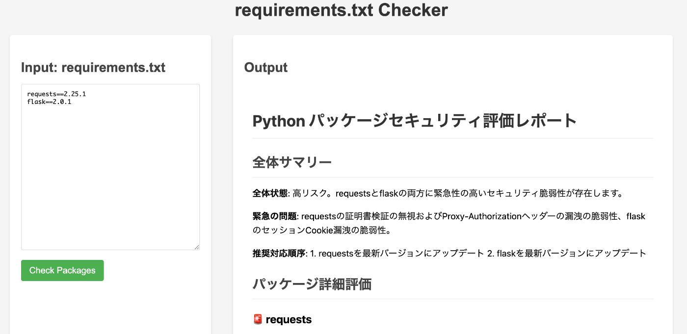
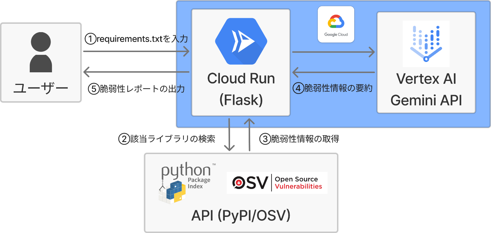
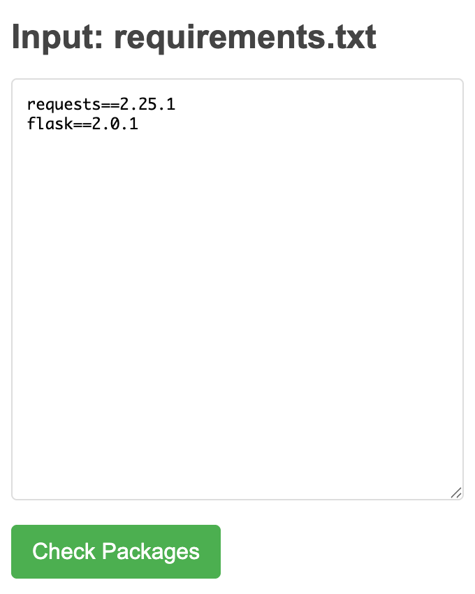

こんにちは、オーダブルと申します！  
第2回 AI Agent Hackathon with Google Cloudに参加するにあたって、初めてAI エージェントの開発を行ったので記事にしてみました！

#  はじめに

##  プロジェクト概要

Pythonプロジェクトでは、依存するライブラリとそのバージョンを requirements.txt というファイルで管理するのが一般的です。このファイルは、pip を用いた開発環境の再現性を担保する上で重要な役割を担います。  
今回は、この requirements.txt に記載されたライブラリのバージョンに**脆弱性や非推奨バージョンが含まれていないかを自動診断するAI エージェント** を開発しました。

##  動機

生成 AI でコードを書くことが当たり前となった昨今、Pythonの依存関係ファイルである **requirements.txt も AI に生成させる** ケースが増えています。ところが、AIが示すバージョンが適切かどうかの保証はなく、各ライブラリの安全性や互換性を手作業で検証するのは大きな負担となります。そこで、ライブラリごとの**バージョン妥当性を一括でチェックできるAIエージェント** を作ろうと考えました。

##  解決する課題

  * **手動調査の排除** ：requirements.txt の各ライブラリについて、脆弱性情報・互換性・メンテナンス状況を個別に調べる作業を自動化します
  * **リスクの可視化** ：問題のあるバージョンを一覧で示し、推奨バージョンを即座に提示します
  * **開発速度の向上** ：安全性確認に要する時間を “数十分 → 数秒” へ短縮し、PoC 開発を加速させます

本エージェントを利用することで、「**動作はするが脆弱性がある** 」というリスクへの対処コストを最小化でき、アイデアの実装に専念できます。

#  エージェント概要

本エージェントは、requirements.txt に記載されたライブラリの各バージョンに対して、以下の観点でリスク診断を行います。

  * **PyPIの最新バージョンとの差分**
  * **非推奨バージョン（yanked）かどうか**
  * **OSV脆弱性データベースの該当有無**

ユーザーはWebブラウザ上でrequirements.txtのテキストを入力するだけで、診断結果を取得できます。

##  処理フロー

  1. ユーザーが requirements.txt のテキストをWeb UIに入力（①）
  2. FlaskバックエンドがLangGraphを起動
  3. 各パッケージ名とバージョンを抽出
  4. PyPI APIでメタデータ（最新バージョン、Yank情報）を取得（②③）
  5. OSV APIで脆弱性（CVE ID、CVSSスコア）を検索（②③）
  6. Gemini 2.0 Flashで、リスクの要点を要約（④）
  7. すべての情報を統合して、Markdown形式でレポート生成
  8. Web UIに診断結果を表示（⑤）

##  技術スタック

レイヤ | 使用技術 / サービス | 概要  
---|---|---  
LLMモデル | Vertex AI Gemini 2.0 Flash | 脆弱性情報の要約と推奨理由生成  
診断フロー管理 | LangGraph v0.3 | ステップ定義・API呼び出しの制御  
APIインタフェース | Flask | ユーザー入力受付とLangGraph起動  
インフラ | Cloud Run | アプリホスティング  
実行環境 | Python 3.12 | アプリケーションランタイム  
外部API | PyPI JSON API / OSV API | パッケージ情報／脆弱性取得  
  
##  実際の使用例

<https://youtu.be/NxOT31yLtVY>

###  入力

requirements.txt の内容をテキスト入力します。  
  
_入力例_

###  出力

診断結果は、以下の2パートに分かれて表示されます。

####  🔹 全体サマリー

システム全体のリスク状態を俯瞰できる概要です。以下の情報が含まれます。

  * **全体状態** ：依存ライブラリ全体のセキュリティ状況
  * **緊急の問題** ：特に優先して対応すべき深刻な脆弱性
  * **推奨対応順序** ：修正すべきパッケージの優先順位

####  🔸 パッケージ詳細評価

各ライブラリごとのリスク評価と推奨アクションを表示します。以下の項目が出力されます。

  * **診断** ：そのパッケージのリスクレベル（例：危険、更新推奨、OK）
  * **理由** ：具体的な脆弱性内容について
  * **推奨アクション** ：アップデートの指示や回避方法など
  * **優先度** （★☆☆☆☆〜★★★★★）：緊急度に応じた対応の優先度

出力例

#  Python パッケージセキュリティ評価レポート

##  全体サマリー

**全体状態** : 高リスク。requestsとflaskの両方に緊急性の高いセキュリティ脆弱性が存在します。

**緊急の問題** : requestsの証明書検証の無視およびProxy-Authorizationヘッダーの漏洩の脆弱性、flaskのセッションCookie漏洩の脆弱性。

**推奨対応順序** : 1. requestsを最新バージョンにアップデート 2. flaskを最新バージョンにアップデート

##  パッケージ詳細評価

###  🚨 requests

**診断** : 危険

**理由** : requestsバージョン2.25.1には複数の脆弱性が存在します。

  1. 情報漏洩の可能性 (CVE-2024-47081): 悪意のあるURLによって、.netrc ファイルに保存された認証情報が漏洩する可能性があります。攻撃者がこの情報を入手した場合、あなたのシステムやアカウントに不正アクセスされる危険性があります。
  2. 証明書検証のバイパス (CVE-2024-35195): Sessionオブジェクトで最初のrequestをverify=Falseで実行すると、同じoriginへの以降のrequestで証明書の検証が無視されます。本来安全であるはずのHTTPS通信が、中間者攻撃（通信を傍受して改ざんする攻撃）に対して脆弱になる可能性があります。
  3. Proxy-Authorizationヘッダーの漏洩 (CVE-2023-32681): プロキシ経由でHTTPSサイトにリダイレクトする際に、Proxy-Authorizationヘッダーが漏洩する可能性があります。これにより、プロキシの認証情報が第三者に漏洩し、プロキシサーバへの不正アクセスや悪用につながる恐れがあります。  
これらの脆弱性は、悪意のある第三者による情報漏洩、中間者攻撃、不正アクセスなどの深刻なリスクをもたらす可能性があります。

**推奨アクション** : requestsを最新バージョン（2.32.4）にアップデートしてください。アップデートが難しい場合は、trust_env=Falseを設定するか、verify=Falseを使用しないようにしてください。

**優先度** : ★★★★★

###  🚨 flask

**診断** : 危険

**理由** : Flaskバージョン2.0.1には、セッションクッキーがキャッシュされる脆弱性 (CVE-2023-30861) が存在します。これは、特定の条件下（Caching Proxyの存在、session.permanent = Trueの設定、セッションへのアクセス/変更がない、SESSION_REFRESH_EACH_REQUESTが有効、Cache-Controlヘッダ未設定）で、あるクライアント向けのデータが別のクライアントに誤って送信される可能性があります。特に、セッションクッキーが漏洩した場合、攻撃者はあなたのセッションを乗っ取り、あなたのアカウントを不正に使用したり、個人情報を盗んだりする可能性があります。この問題は、Flaskのバージョン2.2.5および2.3.2で修正されています。

**推奨アクション** : Flaskをバージョン2.3.2以上にアップデートすることを強く推奨します。それが難しい場合は、条件が重ならないように設定を変更するか、Cache-Controlヘッダを設定してキャッシュを防ぐようにしてください。

**優先度** : ★★★★★

#  まとめ

本記事では、Cloud Run × Vertex AI × LangGraph を用いて、requirements.txt に記載された**ライブラリのバージョンを自動診断するAIエージェント** の開発プロセスとアーキテクチャを紹介しました。

生成AIがコードを書く時代において、依存パッケージの安全性確認はますます重要になっています。本エージェントを使えば、「動作するが脆弱性を含む」ライブラリを早期に検知し、**最小限のコストで脆弱性リスクを低減する** ことが可能になります。

今後の展望として Python の requirements.txt だけでなく、JavaScriptの package.json、Javaの pom.xml、Goの go.mod など、他言語の依存関係ファイルにも対応範囲を広げ、**クロス言語対応の依存診断エージェント** として進化させていきたいと考えています。

##### 「実用的な小規模のAIエージェント」を作ってみたい方にとって、本記事がその第一歩となれば幸いです。
