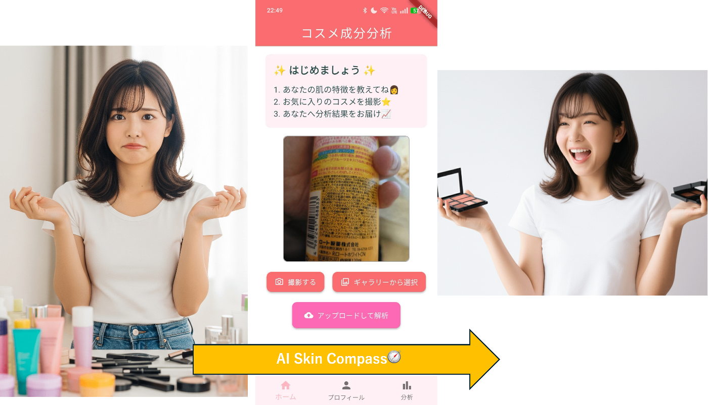
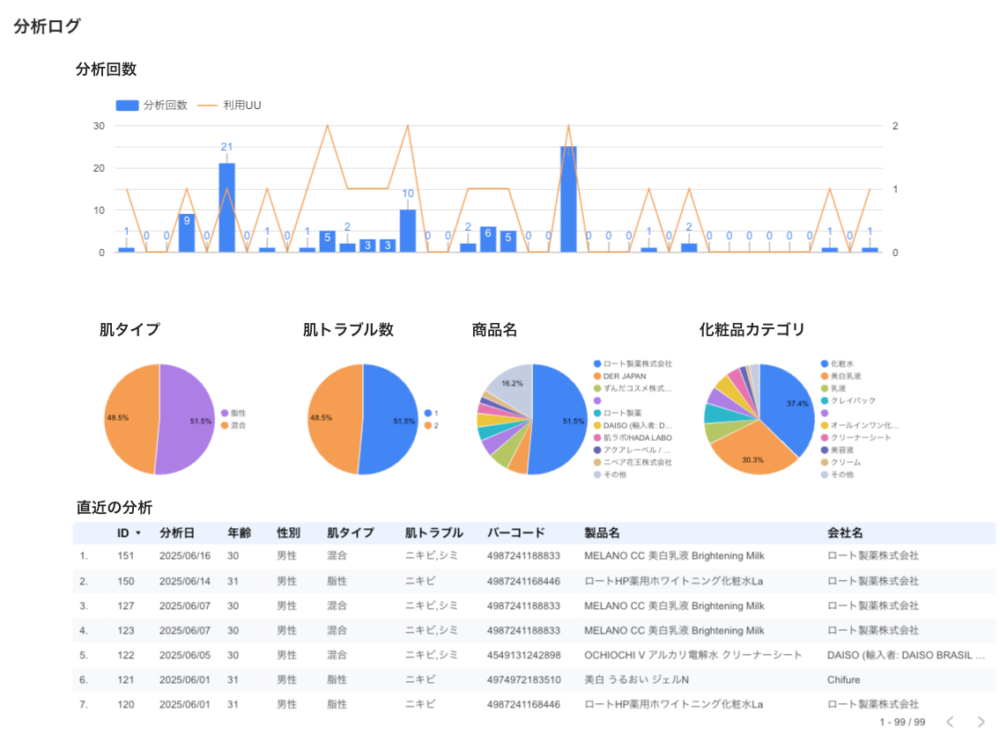
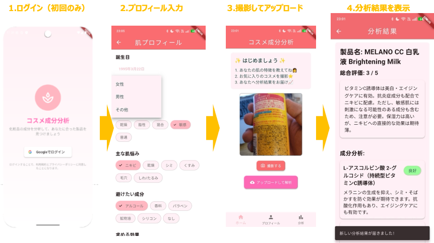
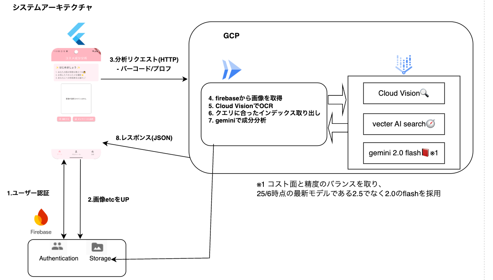

#  はじめに

「この化粧品、自分の肌に合うかな？」「どの商品を選べばいいんだろう？」—多くの人が感じる化粧品選びの悩み。[第二回AIエージェントハッカソン](https://zenn.dev/hackathons/google-cloud-japan-ai-hackathon-vol2)で、そんな悩みを解決するコスメ成分分析アプリ **AI Skin Compass（アイ スキン コンパス）** を開発しました！

現代の化粧品市場は選択肢が豊富すぎるがゆえに、消費者は「何を基準に選べばいいかわからない」という新たな課題に直面しています。特に、成分表示を見ても専門用語ばかりで理解が困難な上、個人の肌質に合うかどうかの判断は更に複雑です。

AI Skin Compassは、このような化粧品選びの複雑さを解消し、誰でも簡単に科学的根拠に基づいた商品選択ができるよう設計されたアプリケーションです。

##  デモ動画

まずはこちらの動画をご覧ください！  
<https://youtu.be/rNBtD724RkI>

#  こんな人におすすめ！

AI Skin Compassは、化粧品選びで困っているこんな方にぴったりです：

  * **化粧品初心者の方**
    * 例：最近スキンケアを始めた30代男性「この美容液、本当に自分に合ってる？」
  * **色々試しすぎて迷子になった方**
    * 例：化粧品大好き40代女性「たくさん試したけど、結局どれが一番いいのかわからない…」

#  解決したい2つの課題

##  課題1: みんなの「化粧品選びの不安」

化粧品市場はどんどん拡大中！特に男性向け化粧品は2019年から約2倍に成長しています。  
参考：<https://prtimes.jp/main/html/rd/p/000000252.000036691.html>

しかし、、、、  
気軽に買える一方で「肌に合わなくて赤くなった」「かゆみが出た」という経験、ありませんか？  
僕ら開発者もその経験者です🤔

###  解決策: バーコード＋写真で簡単分析！

AI Skin Compassなら、製品のバーコードと写真を撮影するだけで、  
あなたの肌に合うかどうかを30秒ほどで分析できます！

従来の化粧品選びでは、以下のような煩雑なプロセスが必要でした：

  1. 成分表示を一つ一つ確認
  2. インターネットで各成分の特性を調査
  3. 自分の肌質との相性を推測
  4. 口コミサイトで他の人の評価をチェック
  5. それでも実際に使ってみないとわからない...

AI Skin Compassは、これらすべてのステップを自動化し、パーソナライズされた分析結果を即座に提供します。

###  実際の使い方

**田中さん（33歳男性・乾燥肌）の場合**

  1. **プロフィール登録**

     * 年齢：33歳
     * 性別：男性
     * 肌タイプ：乾燥肌
     * 悩み：乾燥、小じわ
     * 避けたい成分：アルコール、香料
     * 過去のアレルギー歴：なし
     * 使用中の化粧品：洗顔料、化粧水のみ
  2. **化粧品をスキャン**

     * ドラッグストアで買った美容液のバーコードと写真を撮影
     * OCR技術により成分リストを自動認識
     * 製品名、メーカー、容量なども同時に取得
  3. **AIが分析してくれる**

     * ✅ セラミド、ヒアルロン酸などの保湿成分配合でGood！
     * ⚠️ 香料入りなので敏感肌の方は要注意
     * 💡 同じメーカーの敏感肌向けシリーズもおすすめ
     * 📊 乾燥肌への効果期待度：85%
     * 🎯 使用タイミング：朝・夜の化粧水後がおすすめ

**結果：科学的根拠に基づいて安心して化粧品選びができるように！**

##  課題2: 化粧品会社の「ユーザーのことをもっと知りたい」

化粧品は直接肌に触れるものだから、ユーザーに合った商品を作ることは売上だけでなく「安心・安全」の面でもとても大切。

でも現在は、SNSのレビューや「40代女性向け」といった大まかなペルソナでの商品開発が中心。「具体的にどんな人が、いつ、どの商品を使っているか」を細かく把握するのは難しい状況です。

特に従来の市場調査には以下のような限界がありました：

  * アンケート調査：回答者のバイアスや記憶の曖昧さ
  * 販売データ：購入者の属性や使用感までは把握困難
  * SNS分析：声の大きいユーザーに偏りがち

###  解決策: データで見える化！

AI Skin Compassでは、ユーザーの属性（年齢、性別、肌質など）と利用履歴（どの製品を分析したか、結果はどうだったか）をBigQueryに保存。

ダッシュボードでリアルタイムに可視化することで、以下のような内容を大まかに把握できます！

  * **ユーザー分析**

    * 年代・性別・肌質ごとにどの商品が使用されているか
    * 肌トラブル（ニキビ、乾燥など）の傾向分析
    * 地域別の化粧品利用傾向
    * 季節による使用パターンの変化
  * **商品開発への活用**

    * 特定の年代・肌質に人気の商品ランキング
    * 競合他社商品の利用状況も把握可能
    * ユーザーの実際の困りごとから新商品のヒントを発見
    * 成分組み合わせの効果検証データ
    * 価格帯とユーザー満足度の相関分析
  * **マーケティング戦略**

    * どの化粧品カテゴリが注目されているか
    * 対象ユーザーの絞り込み
    * 効果的な広告配信タイミングの最適化
    * インフルエンサーマーケティングの効果測定

#  アプリの画面イメージ

UI/UXはこんな感じです：  

画面はFlutterで作成し、GCPのCloud Runと通信して分析結果を取得しています。

#  システム構成と使用技術

アプリの仕組みはこのようになっています。  

##  1\. フロントエンド（Flutter）

  * iOS/Android両対応でユーザビリティ抜群
  * Firebase Authenticationで安全なログイン
  * 直感的なユーザー登録・分析結果表示

##  2\. データ管理（Firebase）

  * Cloud Storageで画像、バーコードやベクトルDBのドキュメントを安全に保存
  * Firestoreでユーザー情報をリアルタイム管理

##  3\. バックエンド（GCP）

  * **Cloud Run** : FlutterアプリとスムーズにHTTP通信
  * **Vision API** : 高精度OCR（光学文字認識）
  * **Vector AI Search** : 肌質と成分の関係データベースから信頼できる情報を検索
  * **Vertex AI（Gemini 2.0 flash）** : 従来比約50%のコスト削減を実現！（2025年6月現在）
  * **カスタムプロンプト** : 化粧品分析に特化した高精度AI

スマホでバーコードと写真を撮るだけで、あなた専用の分析結果がリアルタイムで届きます！

#  課題

アプリ開発において様々な課題がありますが、現在最も注力しているのは分析精度の向上です。  
現状、インターネットから収集した情報をまとめたドキュメント(ベクトルDB）から知識を取り出し、geminiとに分析結果を生成させております。

化粧品は、直接肌に触れるため、（医薬品ほどではないかもしれないですが）、その回答精度（分析結果の正しさ）は非常に重要だと考えます。

##  1\. 製品認識の正確性

バーコードと製品画像から製品情報（製品名やメーカー）を特定する際に、ハルシネーションが発生することがあります  
具体例：実際のOCR結果には記載されていない成分を、AIが「含まれている」と誤って返してしまう

##  2\. マスターデータの不足

理論的には、バーコードさえわかれば製品名や成分情報を正確に把握できるはずです  
しかし、バーコードと化粧品成分情報を紐づけた、商用利用として自由に利用できるデータベース（マスタ）が存在しません  
バーコードから製品を検索できるウェブサービスはありますが、そのAPIやデータを自由に利用できるわけではなく、プライバシーポリシー上も問題がありそうです。

##  3\. パーソナライズされた分析結果の生成

単に製品情報を表示するだけでなく、ユーザープロフィール（肌質、年齢、悩みなど）に基づいた適合性分析を行う必要があります  
この部分はAIにとって特に難しく、個人差を考慮した正確な判断が求められます  
このような課題に対して、技術的にどう対応していくかが現在の最大の焦点となっています。

#  精度向上への具体的なロードマップ

現在の課題を解決し、AIエージェントの精度を向上させるために考えられる戦略としては以下が考えられます。

#  短期的な改善案

  1. ベクトルDBの整備 
     * 「ユーザー属性×成分の良し悪し」 について正しい、かつ網羅的なドキュメントの整備
     * 類似成分や効能の検索精度を向上させ、ハルシネーション（幻覚）を低減
  2. Fine-tuning（FT）モデルの開発 
     * 化粧品成分と肌質の関係に特化したGeminiのファインチューニング

##  中長期的な戦略

  * 業界連携による知識ベースの構築
  * 化粧品メーカーと皮膚科学会との協力関係を構築する。
  * バーコードと製品情報を紐づけた独自データベースの開発 
    * 徐々に取り扱える製品数を増やしていく。
  * ユーザーフィードバックループの実装
  * 分析結果に対するユーザー評価機能の追加 
    * フィードバックを活用した継続的なモデル改善プロセスの確立
  * A/Bテストによる改善効果の定量的測定

#  最後に

この記事は、私と友人との共同開発プロジェクトの成果です！  
化粧品選びで悩んでいる方、技術に興味のある方、ぜひお気軽にお声がけください😊

* * *

##  補足

本アプリケーションは、[こちらの記事](https://zenn.dev/team_nishika/articles/6ad83b4275fd1c)でご紹介したプロジェクトの発展版です。開発メンバーも同じです。
