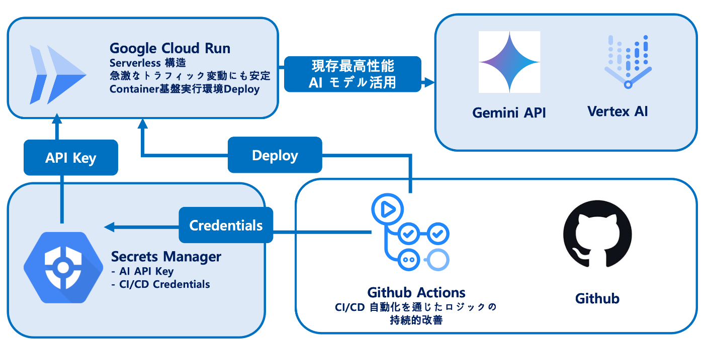
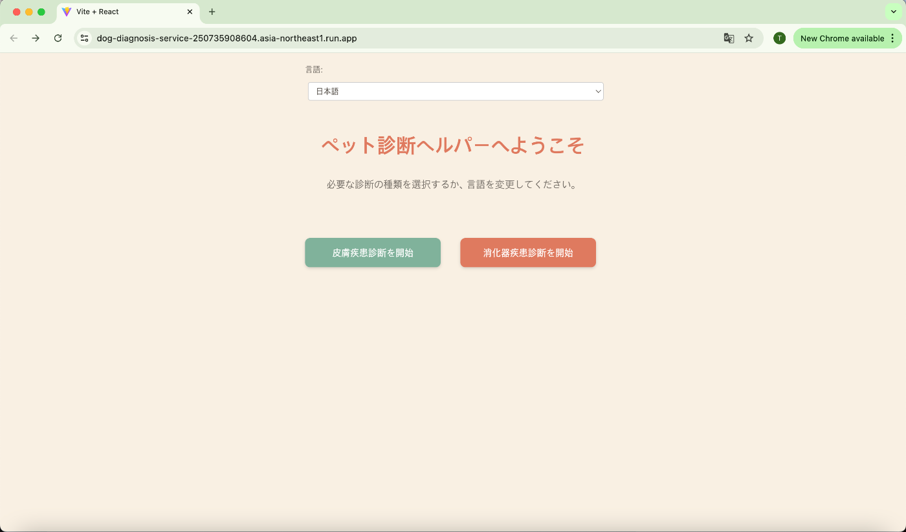
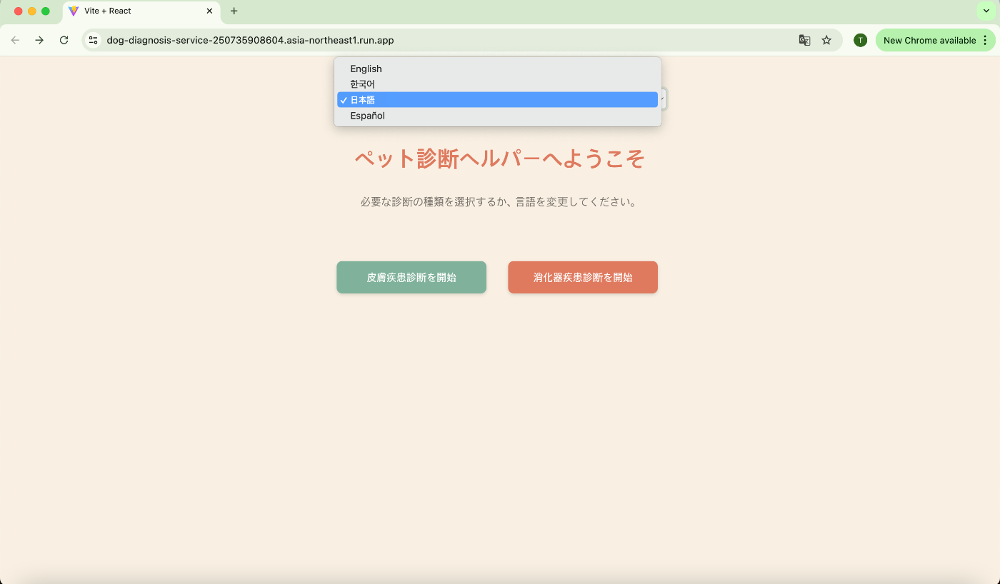
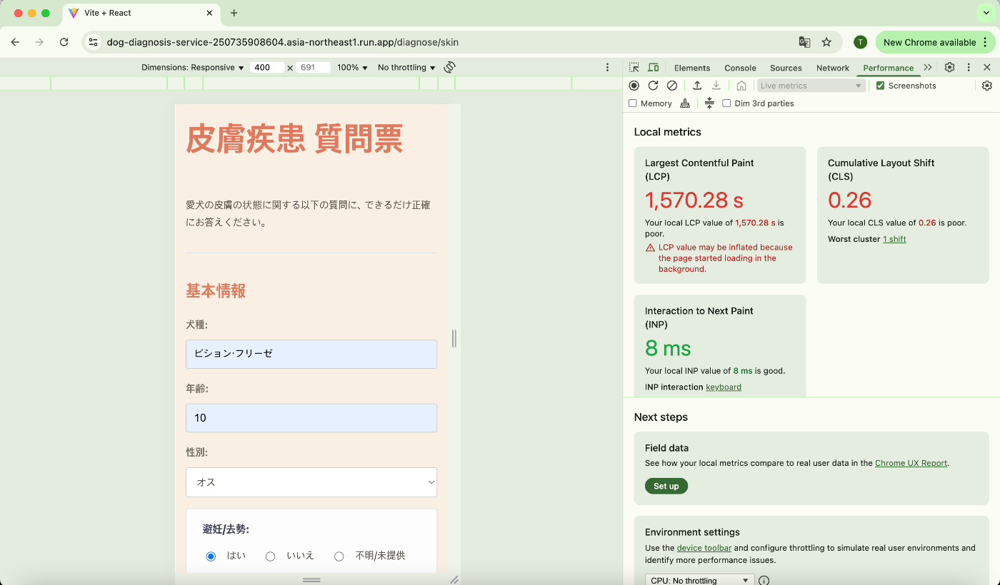
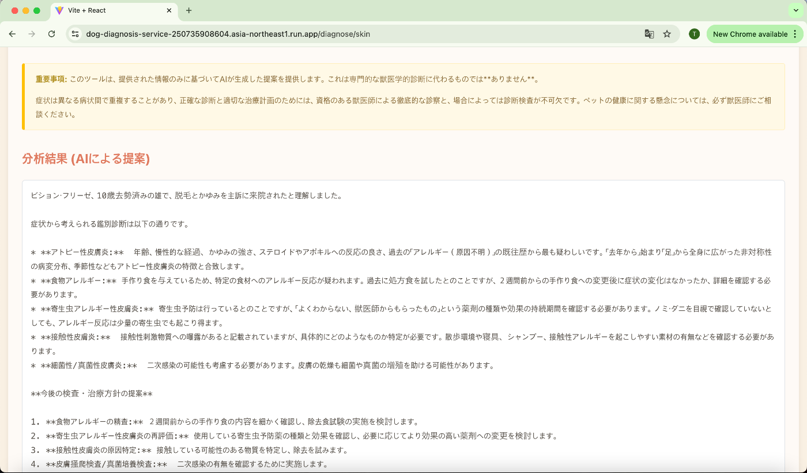
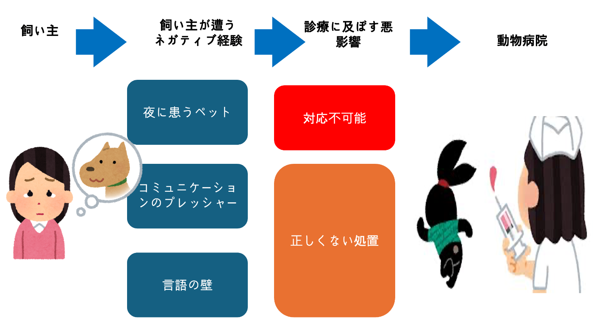
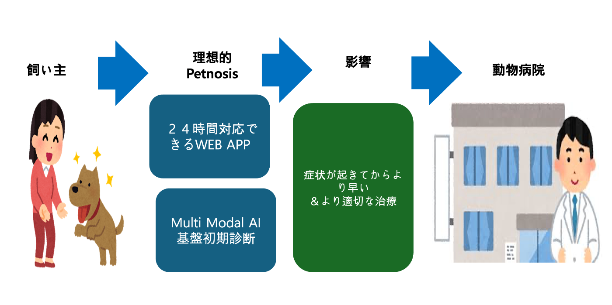
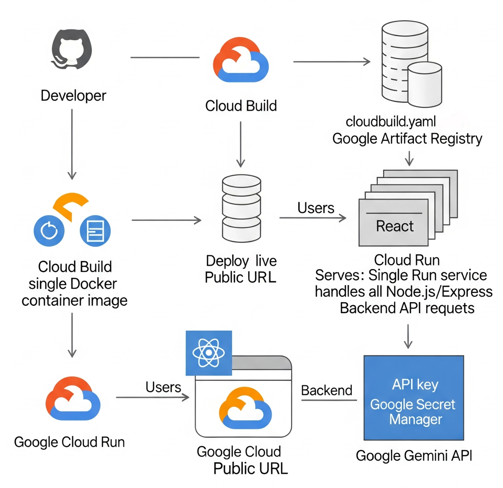

・プロジェクトの背景と開発者の想い

はじめに、このプロジェクトが生まれた背景についてお話しします。私は現在、日本で獣医学を学ぶ大学5年生です。  
日々の学びの中で、私は動物と人間の間に存在する深い絆と、その一方で現代の動物医療が抱える限界、そして獣医学がこれから目指すべき未来の姿について、深く考えるようになりました。その思索の過程で生まれたのが、この「Petnosis」プロジェクトです。

このプロジェクトは2025年5月に開発し始め、6月20日にPublic URLでの駆動を確認しました。  
  
  
  
  
  

獣医療の最前線を志す者として、私は飼い主様が抱える「情報が溢れるが故の不安」と、動物たちが言葉で伝えられない「痛みのサイン」の両方を日々感じています。「Petnosis」は、単なるITサービスではありません。それは、私が学んできた専門知識と、動物たちへの愛情、そして飼い主様の心に寄り添いたいという強い想いを形にしたものです。

テクノロジーの力、特にGoogle CloudとGemini AIの先進的な能力を借りることで、動物と人間の間にある情報の非対称性を少しでも解消し、一組でも多くの家族が健やかで安心な毎日を送れるようにすること。それが、獣医学生である私がこのプロジェクトを通じて実現したいと願う未来です。

１．プロジェクトが対象とするユーザー像

本プロジェクト「Petnosis」が対象とするユーザーは、ペットを飼っている（現在の段階では特に犬を飼っている）かつスマートフォンやインターネットを用いた情報収集や問題解決に積極的な全世界の人です。  
犬と共に暮らしていると、心配の種は尽きません。愛犬が普段と少し違う行動をするだけで不安になり、かといってすぐに動物病院へ連れて行くのは大きな負担となる場合があります。理想は、症状が見られた瞬間に獣医師へ相談することですが、現実的にはそれが困難なケースも少なくありません。

多くの動物病院は夜間や早朝、休日には閉まっています。ペットの体調不良は、飼い主の都合とは関係なく突然訪れます。特に、仕事が終わった深夜や休日にペットの様子がおかしくなった場合、飼い主はすぐに専門家のアドバイスを求めることができず、次の日の朝まで「ただ見守る」しかありません。この「何もできない時間」は、飼い主に大きな精神的ストレスと無力感を与えます。また、近くに信頼できる動物病院がない、あるいは移動手段が限られている飼い 主にとっても、病院へ行くこと自体のハードルが高くなっています。

動物病院へ連れて行っても、限られた診察時間の中でペットの症状を正確かつ網羅的に獣医師へ伝えることは容易ではありません。緊張や焦りから、重要な症状を伝え忘れてしまったり、いつからどのような変化があったのかを順序立てて説明できなかったりすることがあります。これにより、獣医師が診断を下すための重要な情報が不足し、最適な治療へ繋がらない可能性も考えられます。事前に症状を整理し、考えられる原因についてある程度の知識を持っておくことで、より質の高いコミュニケーションが可能になりますが、その準備を行うこと自体が飼い 主にとって一つの負担となっています。

あるいは、「少し様子を見れば自然に治るかもしれない」という期待から、病院へ行くのをためらってしまう飼い主もいるでしょう。

情報の氾濫と信頼性の欠如 ペットの体調に異変を感じた際、飼い主が最初に行う行動はインターネットでの検索です。しかし、検索結果には不正確な情報、古い情報、あるいは個人の主観的な体験談などが溢れており、どの情報を信じれば良いのか判断が非常に困難です。誤った情報に基づいて自己判断で対処してしまった結果、症状を悪化させてしまうリスクも存在します。特に、症状が一般的であるほど、考えられる原因が多岐にわたり、飼い主の不安をかえって増大させる結果となっています。

また、日本に住む外国人飼い主など、現地の言語に堪能でない場合、ペットのデリケートな症状を正確な医療用語で伝えることに大きな困難を伴います。これにより、動物病院へ行くこと自体を躊躇してしまったり、症状が誤って伝わってしまったりするリスクがあります。ペットの命に関わる問題であるため、言語の壁は非常に深刻な課題です。

世界的にパンデミックや少子化を経て、ペットを家族として迎える人々は増え続けています。しかし、その誰もが気軽に、いつでも動物病院へアクセスできるわけではないのが現実です。私は、そうした飼い主と、言葉を話せない動物たちのために、このプロジェクトを始動しました。

本プロジェクトの目的は、動物病院の代替となることではありません。私の目的は、飼い主の皆様に「信頼できる判断のモノサシ」を提供することです。緊急性が高い症状が見られる場合は、迷わず動物病院へ行くべきだと強く背中を押し、一方で比較的軽微な症状の場合は、考えられる応急処置や、疑われる疾患に関する一般的な情報を提供することで、飼い主が落ち着いて対応できるようサポートします。このサービスを通じて、一組でも多くの飼い主とペットの不安を和らげ、健やかな毎日を支えることを目指します。

また、犬の症状と疾患の関連性は、国による差よりも犬種や年齢による差が重要です。この事実に着目し、本サービスを英語、スペイン語、韓国語など多言語に対応させることで、国境を越え、世界中のユーザーが利用できるグローバルなプラットフォームとなることを期待しています。  
  

２．本プロジェクトの現状における限界点と今後の課題

「Petnosis」は、飼い主の不安に寄り添う革新的なソリューションを目指していますが、同時にいくつかの重要な限界点と、これから向き合うべき課題を認識しています。

①診断精度における本質的な課題

最大の課題は、問診のみに依存する診断の精度限界です。私が日本で獣医学を学ぶ中で痛感したのは、獣医学は長年の研究が蓄積されてきた人の医学とは異なり、未だ研究途上にある領域も少なくないという事実です。人の内科領域では、問診だけでも疾患を高い精度で推測できるケースが多くありますが、動物医療において同様のアプローチを取ることは非常に困難です。

その理由は、考慮すべき「変数」が圧倒的に多いことにあります。例えば、同じ犬という種であっても、犬種によって正常とされる心臓のサイズや、麻酔に用いられる薬物の適正濃度は大きく異なります。しかし、人の医学に比べて研究の歴史は浅く、市場規模も限定的であるため、犬種ごとの詳細な臨床データが十分に蓄積されているとは言えません。

これは、AIの性能がいくら向上しても、基礎となる臨床データとその解釈が不足している限り、問診のみで診断精度を飛躍的に向上させることが容易ではない、という獣医学領域全体が抱える本質的な課題を示唆しています。本プロジェクトもこの大きな課題に直面しており、現状ではあくまで「可能性の提示」に留まるという限界があります。

②対応可能な診断領域の限定

次に、診断可能な領域が限定的であるという点です。現状の「Petnosis」が対応している診断領域は、内科、その中でも特に「皮膚疾患」と「消化器疾患」に絞られています。

その理由は、これらが飼い主の視覚的な観察（「体を痒がっている」「便が緩い」など）に基づく問診だけで、ある程度の原因の絞り込みが比較的可能だと考えられる領域だからです。一方で、例えば骨や筋肉、靭帯などの運動器疾患の診断には、専門家による姿勢観察や触診、レントゲン検査が不可欠ですが、これらは専門的な手技と機材を要するため、現在の問診ベースのシステムでは診断の糸口さえ掴むことが困難です。このように、飼い主の観察のみに依存する方法ではカバーできない専門領域が、依然として多く存在するという限界があります。

③ 付加機能の制約と法規的な課題

最後に、ユーザーに提供できる情報の範囲にも制約があります。現時点での「Petnosis」の主な機能は、問診結果に基づき、疑われる疾患名を提示することに留まっています。

当初の構想では、飼い主の理解を深めるために、各疾患の簡単な解説や、各症状に対して緊急的に使用できる人間用の市販薬の案内といった機能も検討していました。しかし、これらの機能は各国の医療法、薬事法、獣医師法といった法規制に抵触する可能性が非常に高いことが判明しました。また、専門家の監督なしでの医薬品の使用は、たとえ一時的であっても大きなリスクを伴います。

そのため、私たちはサービスの安全性とコンプライアンスを最優先し、現段階ではこれらの付加機能を実装から除外するという判断をいたしました。ユーザーにとって本当に役立つ情報を提供することと、法規的・倫理的な一線を越えないことのバランスをどう取るかは、今後の重要な課題であると認識しています。

  3. 「Petnosis」の限界点と克服の方向性

①診断の正確性および診断可能分野の限界について

現状の課題： 診断の精度と対象範囲には限界があります。また、診断は飼い主様の主観的な観察に依存してしまいます。

克服の方向性：  
•データの拡充： 近年、VCA Animal Hospitals（および日本のVCAJ）、イオンペット動物医療センターのような大手動物病院グループの台頭により、獣医学の臨床データが体系的かつ急速に蓄積されています。これらのデータはEMR/PIMS（電子カルテ）提供企業などを通じて集約・分析されており、AI技術と組み合わせることで大きなシナジー効果が期待できます。データの量と質が向上することで、診断の正確性も飛躍的に高まると考えられます。

•目標の明確化と段階的アプローチ： 「Petnosis」の第一の目標は、正確な病名を特定することではなく、症状からペットの重症度を大まかに判断し、飼い主様が「すぐに病院へ行くべきか」「もう少し様子を見ても大丈夫か」を判断する手助けをすることです。この目的であれば、現在のレベルでも十分に飼い主様の助けになると考えています。

•ユーザー入力の具体化： 飼い主様の主観に頼るという点については、今後、選択式の質問をより具体的かつ多様化させることで、客観性を高め、情報の精度を向上させていくことが可能です。

②付加機能の制約および法的規制について

現状の課題： 動物倫理や法規制により、提供できる情報や機能に制約があります。  
克服の方向性：  
•ガイドラインの深化： 現在は疑わしい疾患の概要と動物病院での一般的な対処法を案内するに留まっていますが、今後は法律や倫理を遵守する範囲内で、より詳細な情報提供を目指します。例えば、自宅で安全に行える応急処置の方法などが考えられます。  
•外部サービスとの連携： 将来的には、近隣の動物病院と連携し、病院の案内やオンラインでの簡易相談といった機能を追加していくことを希望します。

４．今後の展望

第一段階：重症度判定と応急処置ガイド

飼い主がペットの異常行動を観察した際に、その緊急性・重症度を大まかに判断できるようにすること。

第二段階：診断精度向上とサプリメント推薦

AIの診断精度をさらに高め、診断された病気や症状を緩和できる可能性のあるサプリメントの推薦など、治療補助につながる機能の開発を目指します。

最終目標：獣医師を補助する統合AIへの進化

「Petnosis」の最終的な目標は、オントロジーを活用し、獣医師の診断を補助するAIへと発展することです。  
具体的には、以下のような統合システムの構築を構想しています。  
①問診の補助： 獣医師が入力した問診票をAIが分析し、必要な追加検査を提案します。  
②検査結果の統合分析： 追加された検査結果を基に、AIが考えられる病名の候補を複数提示します。  
③画像診断AIとの連携： 近年多くの企業が開発しているAI画像診断プログラムなどと連携します。

このような「獣医師補助AI」として進化することで、誤診率を低減させ、獣医学界、動物、そして飼い主の皆様に貢献できるプログラムとなることを目指します。  

  

  
<https://youtu.be/aGU3OyEexo8>
