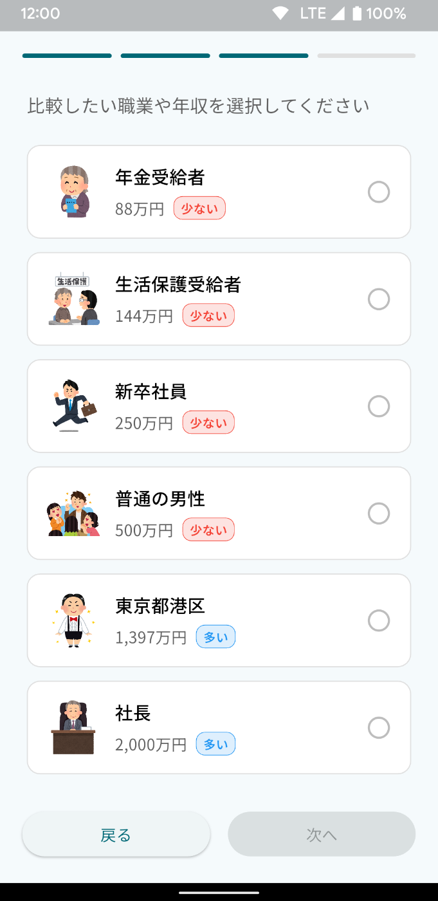
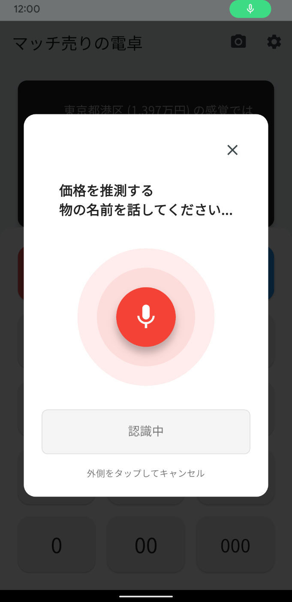
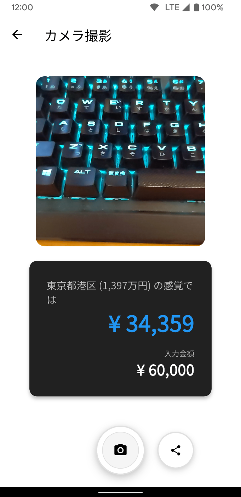
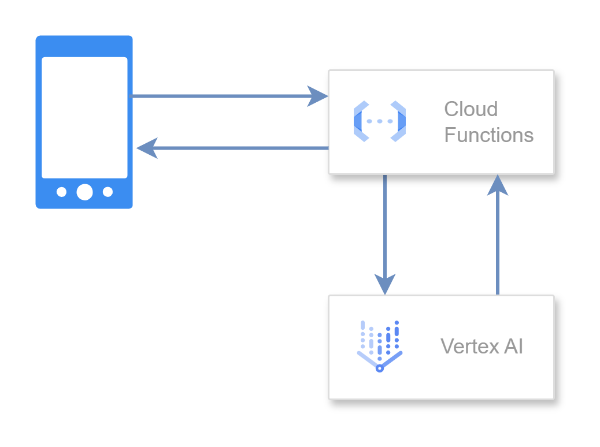
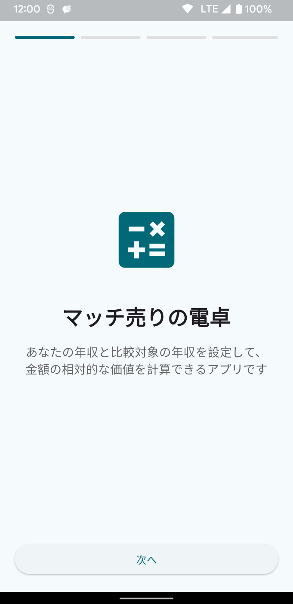
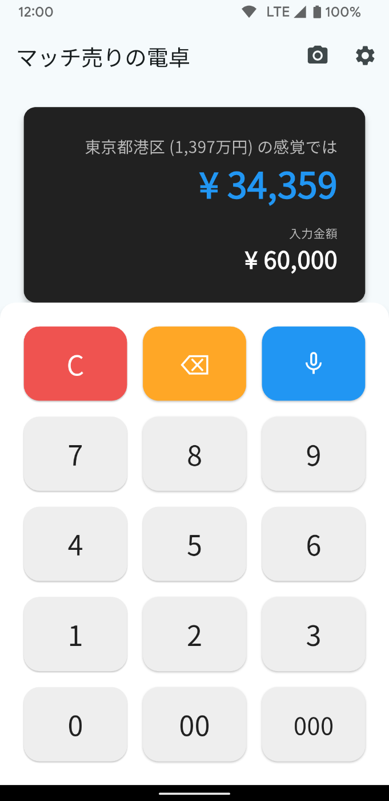

##  どんなアプリ？

「マッチ売りの電卓」は、アンデルセン童話「マッチ売りの少女」からインスピレーションを受けて開発したアプリケーションです。  
年収の違いによる同一商品に対する金銭感覚の差異を、数値化して可視化する機能を提供します。

マッチ売りの少女がマッチを擦って束の間の暖かい幻想を見たように、本アプリを使用することで「異なる経済階層における価格感覚の体験」を疑似的に行うことができます。  
経済格差への理解を深めつつ、新たな気付きを提供するアプリケーションです。

<https://youtube.com/shorts/wls3wXG59kg?feature=share>

##  どんな人に使ってもらいたい？

###  こんな人におすすめ

**価格判断に迷いを感じる方**

  * 購買時の価格判断に慎重になる方
  * SNS で見る豊かな生活と現実とのギャップを感じている方
  * 新社会人や契約社員として、金銭管理に悩んでいる方

**社会問題に関心のある方**

  * 経済格差の実態について、定量的な理解を求める学生や教育関係者
  * 経済格差問題を表面的でなく深く理解したい方
  * 発見を SNS で共有することを好む方

**購買判断を慎重に行いたい方**

  * 商品価値の判断に時間をかける慎重派の方
  * 高所得者層の価格感覚に興味を持つ方
  * 大きな買い物前に多角的な検討を行いたい方

###  ユーザーが抱える一般的な課題

**1\. 価格基準の不明確性**

現代日本においては所得格差が拡大しており、年収 300 万円の人にとって 1 万円のランチは大きな出費ですが、年収 1,500 万円の人にとっては 2,000 円程度の感覚となります。

日常生活では他者の金銭感覚は見えにくく、「適正価格」の判断に迷いが生じることがあります。  
その結果、経済状況に見合わない高額な買い物をしてしまったり、過度な節約により生活の質を下げてしまうことがあります。

**2\. 価値観の相違による意思疎通の困難**

友人との価格に関する会話において、それぞれ異なる経済的基準で話している場合があります。  
「ランチ 3,000 円は普通」と考える人と「高額すぎる」と感じる人が同じ場にいることで、購買力の違いだけでなく価値観や生活スタイルの相違も生まれています。

**3\. SNS による経済的劣等感**

Instagram や TikTok で見る豊かな生活に対して「自分だけが経済的に困窮している」という誤解を抱くことがあります。  
実際には投稿者の収入は不明であり、表示される生活が全てではありませんが、このギャップが蓄積すると自己肯定感の低下や無理な消費行動を誘発する可能性があります。

##  だから作りました、「マッチ売りの電卓」

###  解決機能

**1\. 他者の金銭感覚の数値化機能**

本アプリの主要機能は、シンプルな計算により「異なる経済階層における価格感覚」を数値で表示することです。  
計算式は以下の通りです。
    
    
    相対価値 = (入力金額 × あなたの年収) ÷ 比較対象者の年収
    

例：年収 400 万円の方が 3 万円のバッグを検討する場合  
↓「東京都港区住民（平均年収 1,397 万円）」との比較
    
    
    相対価値 = (30,000円 × 4,000,000円) ÷ 13,970,000円 = 約8,600円
    

港区住民にとって 3 万円のバッグは、当該ユーザーにとっての 8,600 円程度の感覚であることが分かります。

**2\. 多様な経済階層との比較機能**

アプリには 6 つの代表的な経済階層が設定されています。

  * **年金受給者（87 万円）** : 高齢者世代の代表
  * **生活保護受給者（144 万円）** : 社会保障受給者
  * **新卒社員（250 万円）** : 新卒就職者
  * **普通の男性（500 万円）** : 平均的サラリーマン
  * **東京都港区（1,397 万円）** : 高所得地域住民
  * **社長（2,000 万円）** : 企業経営者

これらの設定により、様々な経済階層からの価格感覚を確認することができます。

**3\. 視覚的分かりやすさを重視した表示**

計算結果は色分けによる直感的な理解を促進します。

  * **オレンジ** : 同等年収層（同程度の価格感覚）
  * **ブルー** : 高所得層（より安価に感じる）
  * **レッド** : 低所得層（より高額に感じる）

###  付加機能

**1\. AI 音声認識による価格推測機能**

商品名を音声入力するだけで、AI が市場価格を推測し、自動的に相対価値を計算する機能を搭載しています。  
例：「iPhone 15 Pro」と発話すると、約 15 万円と推測し、各経済階層での相対価値を表示します。

**2\. 写真撮影・共有機能**

計算結果と商品画像を組み合わせた写真を撮影し、SNS で共有できる機能を提供します。  
発見した価格感覚の違いを他者と共有することで、社会的な話題提供に寄与します。

##  このアプリの価値

###  金融リテラシーの向上

「格差」や「経済問題」といった抽象的な概念を、日常的な買い物を通じて具体的に理解することができます。  
特に若年層の経済教育において、実践的な学習ツールとして活用することが期待されます。

###  心理的負担の軽減

自身の収入と他者の収入を比較して感じる劣等感や、経済状況に見合わない消費行動を客観視することで、適切な消費判断を支援します。  
経済状況に応じた適度な消費に対する罪悪感の軽減も期待されます。

###  社会問題への関心喚起

マッチ売りの少女の物語が描いた貧富の差と同様に、現代の格差問題について考察するきっかけを提供します。  
重々しいアプローチではなく、自然な気付きを通じて社会問題への関心を育成します。

###  エンターテイメント性

「富裕層にとってこの商品はどの程度の価値か」という想像を実際の数値で確認できる面白さを提供します。  
友人との会話や SNS での話題提供にも寄与します。

##  技術的特徴と実装

###  システムアーキテクチャ概要

「マッチ売りの電卓」は、モダンなクラウドネイティブアーキテクチャを採用したモバイルアプリケーションです。  
Flutter によるクロスプラットフォームフロントエンド、Google Cloud Functions によるサーバーレスバックエンド、そして Vertex AI による AI 価格推測機能が連携して動作します。

###  フロントエンド技術

**Flutter 框架による高品質クロスプラットフォーム開発**

  * iOS・Android 両プラットフォームで統一されたユーザー体験
  * Material Design 3 に基づく現代的で直感的な UI

フロントエンドは Flutter Hooks パターンを採用し、リアクティブなユーザーインターフェースを実現しています。  
ユーザーが数値を入力するたびに、相対価値が自動的に再計算されて画面に反映される仕組みです。

**リアルタイム計算システム**

入力値を変更すると即座に相対価値が計算されます。  
↓ アプリの核心となる相対価値計算は、以下のシンプルな実装で実現されています。
    
    
    static double calculateRelativeValue({
      required double currentValue,
      required double myIncome,
      required double targetIncome,
    }) {
      if (myIncome == 0 || targetIncome == 0) return 0;
      return (currentValue * myIncome) / targetIncome;
    }
    

この `(入力金額 × 自分の年収) ÷ 比較対象年収` という数式により、異なる経済階層間の「金銭感覚の違い」を数値化できます。  
例えば年収 400 万円の人にとって 3 万円の商品は、年収 1,400 万円の人にとっては約 8,600 円の感覚になることがわかります。

###  データ永続化とプリファレンス管理

**SharedPreferences による設定の永続化**

年収などの機密情報は、すべてデバイス内のローカルストレージにのみ保存され、外部サーバーには一切送信されません。  
実装は以下のようになっています。
    
    
    class PreferencesService {
      static Future<void> saveSettings({
        required double myIncome,
        required double targetIncome,
        required String targetIncomeName,
      }) async {
        final prefs = await SharedPreferences.getInstance();
        await prefs.setDouble('my_income', myIncome);
        await prefs.setDouble('target_income', targetIncome);
        await prefs.setString('target_income_name', targetIncomeName);
      }
    }
    

この実装により、年収という最も機密性の高い情報もデバイス内でのみ管理され、ネットワーク通信で送信されることは一切ありません。  
プライバシーを最大限保護しながら、アプリ再起動時も設定が保持される設計になっています。

###  AI・音声技術統合

**高精度音声認識エンジン**

speech_to_text ライブラリを使用して、日本語に最適化された音声認識システムを実装しています。  
ユーザーが商品名を話すと即座にテキスト化されます。  
↓ 重要なのは認識完了時の自動連携機能です。
    
    
    await _speechToText.listen(
      onResult: (result) {
        final recognizedWords = result.recognizedWords;
        onResult(recognizedWords);
        if (result.finalResult && onComplete != null) {
          onComplete(); // 音声認識完了→価格推測APIへ自動遷移
        }
      },
      localeId: 'ja_JP',
      listenFor: const Duration(seconds: 30),
    );
    

`result.finalResult` の判定により、音声認識が完全に終了した瞬間に次の処理（価格推測 API 呼び出し）に自動遷移し、ユーザーは何も操作することなくシームレスな体験を得られます。

###  バックエンド API アーキテクチャ

**Google Cloud Functions + Vertex AI 統合**

バックエンドは Google Cloud Functions と Vertex AI の Gemini モデルを組み合わせたサーバーレス構成です。  
核心となる価格推測処理は以下のように実装されています。
    
    
    @functions_framework.http
    def estimate_price(request):
        data = request.get_json()
        item_description = data.get("description", "")
    
        # Gemini モデルを初期化
        model = GenerativeModel("gemini-1.5-flash")
    
        prompt = f"""
        以下の商品の価格を日本円で推測してください。
        商品: {item_description}
    
        回答は以下のJSON形式で返してください：
        {{"estimated_price": 価格（数値のみ）}}
        """
    
        response = model.generate_content(prompt)
        result = json.loads(response.text.strip())
    
        return jsonify({
            "success": True,
            "estimated_price": result.get("estimated_price", 0)
        })
    

重要なのは、AI に厳密な JSON 形式を指定することで、確実にパース可能な価格データを取得している点です。  
音声認識で得られた商品名を AI に送信し、日本市場での一般的な価格を推測して返します。

**外部 API 連携価格推測システム**

  * RESTful API による商品価格推測機能
  * JSON 形式でのデータ交換による高速レスポンス
  * エラーハンドリングによる安定した動作

###  セキュリティとプライバシー考慮事項

**データプライバシーの保護**

アプリは以下のプライバシー保護機能を実装しています。

  1. **ローカルデータ処理** : 年収等の機密情報はデバイス内でのみ処理
  2. **最小限のデータ送信** : 音声認識結果の商品名のみを API に送信
  3. **一時的なデータ保存** : 撮影画像は一時的にのみ保存し、自動削除

**権限管理の最適化**

写真保存とマイクロフォンの権限は、必要な機能を使用する時のみリクエストされます。  
ユーザーが必要としない機能には権限を求めず、プライバシーを最大限保護する設計です。

###  カメラ・メディア処理

**高性能カメラ統合**

  * camera plugin による高解像度撮影
  * カスタム UI overlay 表示
  * 即座のシャッターレスポンス

カメラプレビューと相対価値情報を合成した画像を生成し、SNS でシェアできる機能です。  
実装の核心部分は以下のようになっています。
    
    
    Future<void> _captureScreenshot() async {
      // UI要素も含めて画面をキャプチャ
      final image = await _screenshotController.capture();
    
      if (image != null) {
        // タイムスタンプ付きファイル名で一時保存
        final directory = await getTemporaryDirectory();
        final imagePath = '${directory.path}/poor_rich_${DateTime.now().millisecondsSinceEpoch}.png';
        final imageFile = File(imagePath);
    
        await imageFile.writeAsBytes(image);
        await Gal.putImage(imagePath); // ギャラリーに保存
        await imageFile.delete(); // 一時ファイル削除
      }
    }
    

Screenshot ライブラリによりカメラプレビューと相対価値表示を一緒にキャプチャし、一時ファイルは自動削除されるため、デバイスのストレージ容量に影響しません。

**Screenshot・共有機能**

  * アプリ内コンテンツの高品質スクリーンショット
  * システム標準の共有機能との連携
  * 一時ファイル管理による効率的メモリ使用

##  ユーザー体験の設計思想

###  オンボーディング体験

アプリ初回起動時には、段階的なオンボーディングプロセスを通じてユーザーの経済状況を設定します。  
この過程自体が、自分の経済的立場を客観視する最初の機会となります。  
4 段階のプロセス（ウェルカム → 自分の年収入力 → 比較対象選択 → 完了）により、ユーザーは無理なく設定を完了できます。

###  メイン計算画面での体験

電卓アプリとしての基本機能を保ちながら、相対価値表示に重点を置いたデザインです。  
上部の大きなディスプレイエリアでは、比較対象の情報と相対価値が印象的に表示され、ユーザーの気づきを促進します。

###  カメラ撮影体験

単なる計算結果の記録ではなく、「発見の共有」としてカメラ機能を設計しています。  
商品と相対価値情報を組み合わせた撮影により、ユーザーは自分の発見を他者と共有する楽しみを得られます。

##  社会への波及効果と将来性

このアプリは、以下のような社会への波及効果が期待されます。

###  短期的効果

  * **個人レベル** : より賢明な消費判断の促進
  * **コミュニティレベル** : 経済格差に関する建設的な対話の創出
  * **教育現場** : 実践的な経済教育ツールとしての活用

###  中長期的ビジョン

  * **政策議論への貢献** : 経済格差の可視化による政策議論の活性化
  * **企業の価格戦略** : 多層的な価格感覚を考慮した商品開発の促進
  * **社会意識の変革** : 経済格差への理解深化による、より包摂的な社会の実現

##  最後に：マッチ売りの少女から学んだこと

アンデルセンが「マッチ売りの少女」で描いた貧富の差の問題は、150 年以上経過した現在でも、形を変えて存在し続けています。  
「マッチ売りの電卓」は、この問題にテクノロジーの力で新しいアプローチを試みたアプリケーションです。

マッチを擦って温かい光に包まれた少女のように、本アプリも経済的制約のある方々に上位経済階層の感覚を疑似体験することができます。  
しかし、これは単なる現実逃避ではありません。  
客観的データを通じて自身の経済状況をより正確に把握し、より適切な判断を行えるよう支援することが目的です。

本アプリを多くの方に利用していただくことで、経済格差についての理解が深まり、より思いやりのある社会の実現に寄与できると考えています。

一見風変わりなアプリケーションかもしれませんが、日常の買い物を通じて「経済格差」という重要な社会問題に気づくきっかけを提供できれば幸いです。
