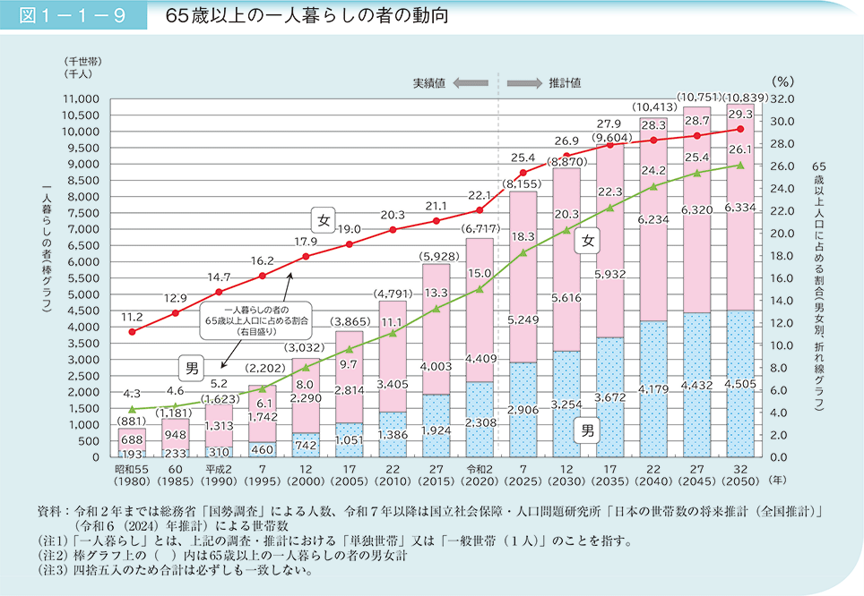
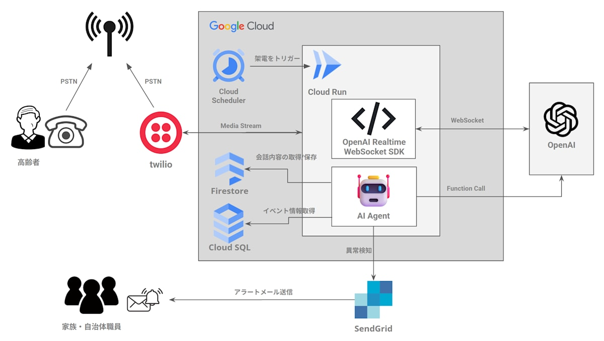
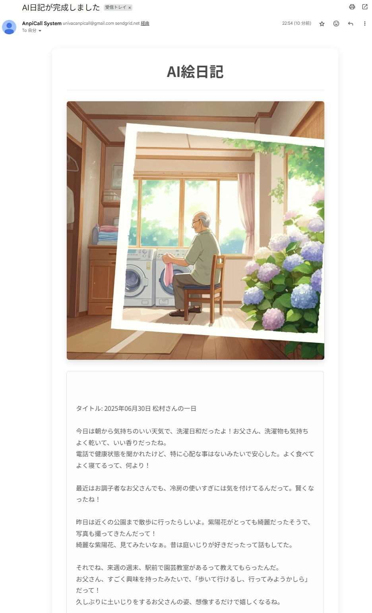
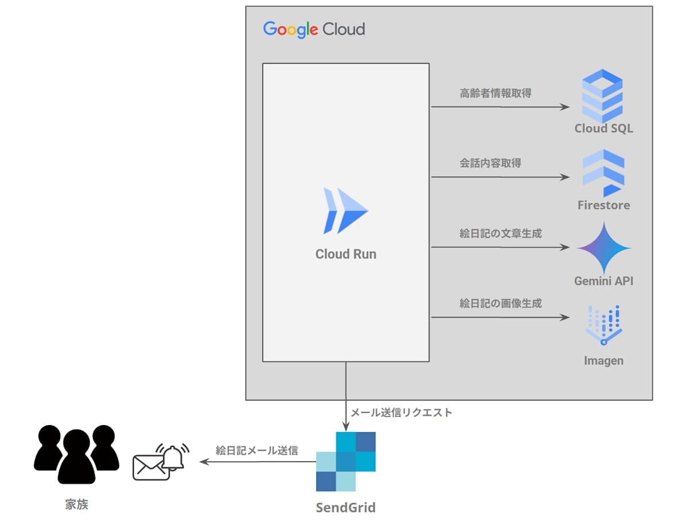

##  背景

日本では 2025 年時点で65 歳以上の人口は 3,623 万人に達し、**独居高齢者は 800 万人を突破** すると予測されています。  
また、**週に 1 回以下しか人と会話しない高齢者は 100 万人程度** いると推測されています。会話頻度が週 1 回以下になると健康リスクが顕著に高まり、**孤立死・認知機能低下** などを引き起こします。

しかし、自治体などが行っている見守り活動は、人手と予算の制約から本来見守るべき対象者を十分にカバーできていません。  
実際に複数の区役所に問い合わせしたところ、見守りサービスを提供できる高齢者には制約（年齢や健康状態など）があるため、希望者に見守りサービスの提供を断ることがあるそうです。  
高齢化社会において、**見守りが届かず孤立する高齢者は年々増えていく** と予想されます。

**高齢化の一人暮らしの割合推移（内閣府 令和6年版高齢社会白書より）**

> _出典：内閣府（2024）「令和6年版高齢化白書」_  
>  （参照：<https://www8.cao.go.jp/kourei/whitepaper/w-2024/html/zenbun/s1_1_3.html> ）

##  現状の課題

高齢者の社会的孤立には以下のような課題があります。

  1. **孤立している高齢者を見つけられない**  
週に 1 回以下しか人と会話しない高齢者は全国に100 万人程度いると推測されていますが、定期的なコミュニケーションがないため自治体も家族も孤立していることに気づくことができません。

  2. **見守りの人手が足りない**  
自治体の担当者には時間的・人数的な限界があり、すべての高齢者に対して定期的に連絡し続けるのは困難な状況です。

  3. **イベント情報が高齢者に届かない**  
イベント活動など地域コミュニティへの参加促進は、高齢者の孤立に対して重要な施策となります。しかし、魅力的な地域のイベント活動があったとしても、その情報が本人に届かなければ意味がありません。

##  プロダクト概要

これらの課題を解決するサービス、 **「つながりコール」** を開発しました。

「つながりコール」は、AIエージェントが高齢者へ定期的に電話をかける見守りサービスです。  
単なる安否確認ではなく、会話内容をもとに高齢者の関心事を把握し、その人に合った地域のイベント活動を紹介します。  
また、電話の内容をもとにAIが生成した絵日記をご家族へ共有し、新たなコミュニケーションのきっかけを作ります。

##  主要機能

###  1\. 高齢者・イベント情報の登録

本サービスの利用は、自治体の担当者や高齢者のご家族が、専用の管理画面から情報を登録することから始まります。  
この登録画面は**Google AppSheet** で構築されており、誰でも簡単に操作できます。

  * **高齢者情報の登録**  
利用対象となる高齢者の氏名、電話番号、緊急連絡先（ご家族など）を登録します。この際、会話のきっかけとなるよう、趣味（例：園芸、カラオケ、囲碁など）を入力します。

  * **イベント情報の登録**  
自治体や社会福祉協議会の職員が、地域で開催されるイベント情報を登録します。登録された情報は、AIが電話で紹介する際の情報源となります。

###  2\. AI電話機能

設定された日時に基づき、高齢者へ定期的に電話をかけます。  
AI電話機能は、**自律性を持った複数のAIエージェント** で構成されています。  
Cloud Run × Twilio × OpenAI Realtime API を連携させ、遅延の少ない自然な会話を実現しており、会話の中で高齢者の興味に応じた地域のイベント情報を紹介することもできます。  
また、会話の内容から異常を検知すると、自治体やご家族にメールで知らせます。

####  AIエージェントと役割

エージェント名 | 役割  
---|---  
[**CallAgent**](https://github.com/univac-1/google-cloud-japan-ai-hackathon-vol2/blob/master/anpi-call-twilio-outbound/app/agents/call_agent.py) | 通話全体の統括。OpenAI Realtime APIと接続し、ユーザー情報をもとに会話インストラクションを生成。音声処理、割り込み制御、ツール呼び出し、会話履歴の保存などを担う。  
[**EventAgent**](https://github.com/univac-1/google-cloud-japan-ai-hackathon-vol2/blob/master/anpi-call-twilio-outbound/app/agents/event_agent.py) | 会話の文脈とユーザー情報に基づいて、地域に該当するイベントをCloud SQLから検索し、提案候補を生成。  
[**EventSelectorAgent**](https://github.com/univac-1/google-cloud-japan-ai-hackathon-vol2/blob/master/anpi-call-twilio-outbound/app/agents/event_selector_agent.py) | EventAgentから渡された候補イベントの中から、年齢・関心・地域性などをもとに最適なイベントを選定し、選定理由を付加。  
[**CallChecker**](https://github.com/univac-1/google-cloud-japan-ai-hackathon-vol2/blob/master/anpi-call-twilio-outbound/app/analysis/check_call.py) | 高齢者との通話内容を分析し、異常や要観察の兆候がないかを自動で検出。  
  
####  電話デモ

<https://www.youtube.com/watch?v=vgT9PJ_DnHw>

####  異常検知・通知

会話内容から体調不良などの異常を検知すると、AIは緊急度を判断し、あらかじめ登録されたご家族や自治体の担当者へ、メールで通知します。孤独死や救急搬送の遅れといった事態を防ぎ、大事に至る前の早期対応を可能にします。

異常検知メール サンプル

####  アーキテクチャ図（AI電話）

###  3\. AI絵日記機能

AIエージェントが会話内容をほのぼのとした絵日記に変換して、ご家族へメールを送信します。  
AI絵日記機能は、**新たなコミュニケーションのきっかけ作り** としての役割を担っています。  
離れて暮らすご家族にとっては、「今日はお花の話をしていたんだね」など、絵日記を通じて自然な会話が生まれるきっかけになります。

絵日記メール サンプル

####  アーキテクチャ図（AI絵日記）

##  プロダクトの価値

「つながりコール」は高齢者の社会的孤立という課題に対して、以下の価値を提供します。

  * **人手に頼らずに高齢者を見守る**  
AIエージェントが電話発信・会話記録・異常通知をすべて自動で実行。自治体の担当者はメールを見るだけで、多くの高齢者をまとめてフォローできます。

  * **イベント情報を直接届ける**  
会話や登録情報で聞いた興味に合わせて、AIが電話で地域イベントを紹介。「情報を知らなかった」という状況をなくし、コミュニティ参加のきっかけを作ります。

  * **孤立を見逃さない**  
AIが定期的に電話し、応答の有無や体調などの変化をチェック。さらに、会話内容をほのぼのとした絵日記に変換して家族へ送信するため、離れていても日常の様子が伝わり、新しいコミュニケーションのきっかけが生まれます。

##  おわりに

今後は、「つながりコール」を多様な自治体・企業が活用できる **SaaS** として提供し、**高齢者の孤立ゼロ社会** を目指したいと考えています。  
もしこの記事を読んで、「自分にもできることがあるかも」と思ってくださった方がいれば、地域のボランティアにぜひ参加してみてください！

####  謝辞

本プロジェクトの企画・開発にあたり、貴重なご意見やご協力をいただいた以下の皆様に心より感謝申し上げます。

  * 各区役所の福祉担当者の皆様
  * 江東区社会福祉協議会の皆様
  * 地域サロン・イベント主催者の皆様

皆様からの現場の声が、「つながりコール」の構想と実装に大きな力を与えてくださいました。
