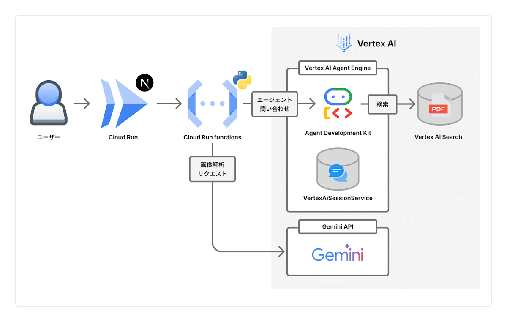
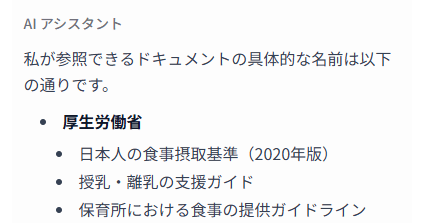
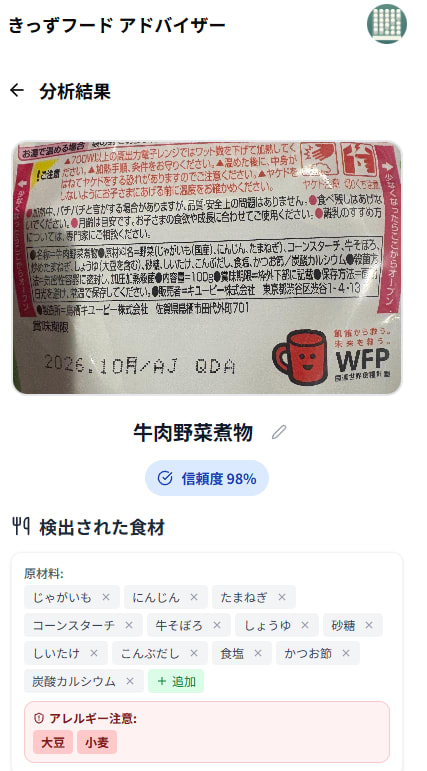

このプロジェクトは、[Google Cloud Japan AI Hackathon Vol.2](https://zenn.dev/hackathons/google-cloud-japan-ai-hackathon-vol2)提出記事です。またアイデア出しから実装まで一緒に開発してくださった[Kecy](https://zenn.dev/kecy)との共同チームでの参加です。

##  はじめに

AI 栄養士があなたの幼児食の悩みを解決してくれる AI エージェントです。

子育てしてると、幼児食ってほんと悩み多くないですか？  
離乳食の頃はレトルトもいっぱいあるし、初期・中期・後期と段階も分かれてるけど、幼児食に入った瞬間「あれ、何あげればいいの？」ってなる。

自分も 1 歳の子どもがいて、まさにそれで悩んでました。

##  デモンストレーション

実際の使用イメージをデモ動画でご紹介します：

<https://www.youtube.com/watch?v=SPhQ8SSqrkE>

このデモでは：

  1. 冷蔵庫の食材を写真で登録
  2. レトルト食品のパッケージ撮影による原材料の自動抽出
  3. AI が栄養バランスを考慮した献立を提案
  4. 不足している栄養素について追加のアドバイスを受ける

といった一連の流れを実演しています。

##  プロジェクト概要

###  対象ユーザーと課題

**ターゲットユーザー：**

  * こんな人に向けて作りました： 
    * 1〜3 歳くらいの幼児がいるパパママ
    * 幼児食の栄養バランスにちょっと不安がある人
    * 毎日の献立、考えるのがしんどい人
    * 外食や作り置きメインになってて、「これでいいのかな」って思ってる人

**解決したい課題：**

実際に子育て中の人たちから、こんなリアルな声をもらいました：

> 「週末に作り置きして、ご飯だけ毎回炊いてます！うちはほとんど毎日メニュー一緒になってきた（カワイソウだけど…）」

> 「幼児食の正解がよくわからず・・・基本的には週末つくりおきをあげてるんですけど、冷凍できるものという制約があるので、毎回汁物とか煮物になっちゃうのが悩みです」

> 「外食で困るのが、キッズメニューあってもエビフライ！とか唐揚げ！とかあげづらいものが多くて、結局レトルト離乳食のミネストローネずっとあげちゃってます」

これらの声から見えてくる課題は：

  1. **栄養バランスの不安** ：専門知識がないため、本当に栄養が足りているか分からない
  2. **献立のマンネリ化** ：同じような食材・調理法に偏ってしまう
  3. **外食での選択肢の少なさ** ：幼児に適した外食メニューが分からない
  4. **食材の有効活用** ：冷蔵庫の在庫を上手く使い切れない
  5. **時短と栄養の両立** ：忙しい中でも栄養バランスを保ちたい

###  ソリューションと特徴

既存の離乳食アプリは段階的な進行をサポートするものが多いですが、1-3 歳くらいの離乳食から一歩進んだタイミングのわからないを解決します。  
作った料理やレトルトの写真、と子どもの情報をもとに、栄養バランスを見ながら足りない栄養を教えてくれる AI アシスタントです。

**主な機能：**

  1. **食材登録と写真認識**

     * 冷蔵庫にある食材を写真で撮影するだけで自動認識・登録
     * 手動での食材入力にも対応
  2. **栄養バランス分析**

     * 厚生労働省の基準をベースにして、栄養の過不足を見える化
     * どの栄養素が足りないか、ひと目で分かるように
  3. **パーソナライズされた献立提案**

     * 登録した食材と子どもの年齢・アレルギー情報を踏まえて、献立を提案
     * 子どもの年齢・アレルギー情報を考慮した提案
  4. **栄養士チャット相談**

     * RAG による情報を元にした返信機能

##  技術構成

###  使用技術スタック

使っている技術スタックはこんな感じです。

**Google Cloud AI技術：**

  * Gemini 2.0 Flash（画像認識）
  * Vertex AI Search（RAG）
  * Vertex AI Agent Engine（会話制御）

**Google Cloudアプリケーション関連サービス：**

  * Cloud Functions / Cloud Run（API 処理）
  * Firebase（認証）
  * Cloud Storage（画像保存）
  * Cloud Logging / Trace / Build（運用系）

**その他の技術：**

  * Frontend：Next.js（フロントエンド）
  * Backend：Cloud Functions + Vertex AI Agent Engine
  * Agent Development Kit (ADK)：エージェント開発フレームワーク

###  システムアーキテクチャ

アーキテクチャの特徴：

  1. **RAG（Retrieval-Augmented Generation）の活用**

     * 厚生労働省「保育所における食事の提供ガイドライン」と子ども家庭庁の政策資料を Vertex AI Search でインデックス化
     * 複数の省庁が提供する公式基準に基づいた信頼性の高い栄養情報をリアルタイムで検索・活用
     * ユーザーの質問に対して、保育所レベルの専門知識を家庭向けにわかりやすく提供
  2. **マルチモーダル対応**

     * Gemini 2.0 Flash の画像認識機能を活用し、食材の写真から自動で食材情報を抽出
     * レトルト食品のパッケージ撮影により、原材料表示からの詳細な成分分析が可能
     * テキストと画像の両方でユーザビリティを向上
     * アレルギー情報の自動検出により、安全性も同時に確保
  3. **エージェント指向の設計**

     * Agent Development Kit（ADK）を活用したエージェント開発
     * 拡張性の高いアーキテクチャで、将来的な機能追加にも対応

##  開発における工夫と学び

###  Claudeでのゼロコーディング挑戦

今回ハッカソンに参加するにあたり、個人的なチャレンジとして「ゼロコーディング（自分でコード書かない）」を目指してみました。  
その結果、全体の 9 割以上のコードを Claude Code で実現できました。

とはいえ生成されたコードに振り回されることも多くて、「なんでこんなとこに勝手に awAIt つけるの？」「コメントアウトしたからエラー出ないでしょ？みたいな投げやりな修正を返される」など、思わず笑ってしまうやりとりも多々ありました。

それでも後半は、徐々に「こいつにこう聞けば目的の形に近づける」という勘が掴めてきて、手で書くよりも早く書けるようになっていきました。

ゼロコーディングはまだ道半ばですが、「AI に設計と方針を伝えて、ちゃんと動くものを一緒に作る」みたいな未来は、けっこう近いのかもなと感じました。

###  Agent Development Kit（ADK）を試してみて感じたこと

ADK のおかげで柔軟に試行錯誤できたし、Google Cloud のサービスとの統合もかなりスムーズでした。  
開発スピードも上がったし、無理な詰め込みをせず「今本当に必要なもの」へ集中できたのは大きかったです。

Vertex AI との連携など GCP 内での連携は協力で効果的な RAG エージェントがすぐに形になる体験は気持ち良かったです。

また印象的だったのは、マルチエージェント構成や Model Context Protocol（MCP）も検討して開発していたものの、開発中にあれこれ試してみた結果、シンプルなシングルエージェント構成がバランス良かったことです。

**ADKの利点：**

  * 様々なエージェント構成を迅速に試行錯誤できる
  * Google Cloud サービスとの統合が容易
  * 開発・デバッグツールが充実している

結果的にシングルエージェントになりましたが、ADK を利用することで処理速度の最適化や、本当に必要な機能への集中が可能になりました。  
途中、シーケンシャルエージェントや並列エージェントなど様々なエージェントの形を模索できたのも ADK の利点だと思いました。

###  RAGによる信頼性の確保

幼児向けの情報は信頼性が重要だなと感じなので厚労省の「保育所における食事の提供ガイドライン」や、子ども家庭庁の資料を Vertex AI Search にインデックス化して、RAG で回答を強化しました。

**Vertex AI Searchでの実装：**

  * 厚生労働省と子ども家庭庁の公式文書を Vertex AI Search にインデックス化
  * 複数の情報を組み合わせて、多角的かつ実践的な回答が可能に
  * ユーザーの質問に対して、最新の国の基準や政策に基づいた正確な回答を生成
  * 保育所レベルの専門知識を、一般家庭でも使いやすい形で届ける設計に

**活用している国の公式情報源：**

  1. **保育所における食事の提供ガイドライン（厚生労働省）**

     * [ドキュメントはこちら](https://www.mhlw.go.jp/file/05-Shingikai-10901000-Kenkoukyoku-Soumuka/0000042642.pdf)
     * 保育所での食事提供に関する包括的なガイドライン
     * 乳幼児期の発育・発達に応じた食事内容や栄養基準を詳細に規定
  2. **子ども家庭庁の公式資料**

     * [ドキュメントはこちら](https://www.cfa.go.jp/assets/contents/node/basic_page/field_ref_resources/e4b817c9-5282-4ccc-b0d5-ce15d7b5018c/3af60664/20231016_policies_hoiku_75.pdf)
     * 最新の子ども・子育て支援に関する政策資料
     * 現在の保育施策と食事提供基準に関する最新情報の活用が可能

上記の画面では、ユーザーが「この情報の根拠にしていますか？」と質問した際に、AI アシスタントが：

  * 厚生労働省「日本人の食事摂取基準（2025 年版）」を明示
  * 1 歳 2 ヶ月の飛依ちゃんの栄養状態評価という具体的な文脈
  * 鉄分・カルシウムの具体的な推奨量数値
  * 食物繊維についての基準状況

といった詳細な根拠を示していることが分かります。これにより、ただ「AI が答えた」のではなく、「国の基準に基づいて AI が答えた」という信頼性を担保しています。

###  ユーザビリティの向上

**写真ベースの入力がめちゃくちゃ便利だった：**  
Gemini を使った写真認識が思った以上に便利で、冷蔵庫の中を撮ったら複数の食材をいい感じに拾ってくれるし、レトルトのパッケージを撮っただけで原材料一覧が抽出されるのもびっくりするくらい精度高かったです。原材料の中に「小麦」みたいなアレルゲンが含まれていればちゃんとハイライトされるし、手入力と比べてかなり手間が省ける設計にできたなと思ってます。

上記の例では、牛肉野菜煮物のレトルト食品を撮影することで：

  * **検出された食材** ： 
    * じゃがいも、にんじん、コーンスターチ、牛そぼろ、炒めたまねぎ
    * しょうゆ、砂糖、いいだし、こんぶだし、食塩、かつお節、炭酸カルシウム
  * **アレルギー注意** ：小麦を含む
  * **信頼度** ：98%

といった詳細な情報を自動で抽出・分析し、ユーザーが手動で入力する手間を大幅に削減しています。

##  おわり

今回のハッカソンを取り組むあたり、エージェントを利用したアプリケーション開発で最も難しかったのは「何を作るか？」でした。  
当初は「位置情報を使ってなにかしてみよう！」「孤独を解決できるなにか無いかな？」とか様々な角度から考えたものの、どれもなぜエージェントなのか？  
エージェントとは何なのか？にぶつかりアイデアを出す難しさに直面しました。

そんな中、結局身近なところにある意思決定が出来ない問題を探していたところ「離乳食の買い物中に夕飯どうよう？」という一言から始まりました。

「きっずフードアドバイザー」は、子育て中の実際の悩みから生まれたプロジェクトです。  
AI 技術の進歩により、専門的な栄養知識をベースとした相談対応がある程度実現できていると感じました。

また、このハッカソンを通じて、Google Cloud の AI 技術の可能性を実感しました。  
特に Vertex AI Agent Engine は、複雑なエージェント機能を迅速に開発できる優れたツールでした。

ハッカソン後も継続的に改善を続けていけたらと思います。

また今回やりきれなかったことも多くあるのでどこかの機会で実現したいなと考えています

  * 保育園の月の献立表を取り込んで、自動で家庭メニューと栄養バランスを調整する仕組み
  * 提案した料理を保存・振り返りできる「お気に入り」や「履歴」的な機能
  * 子どもの年齢入力や月齢計算など、UI/UX をもっとわかりやすくしたかった（今回は時間的に難しかった）
  * マルチエージェント構成を使って、よりスムーズで高速な会話のラリーを試したかった

* * *

**プロジェクト情報：**

  * GitHub：<https://github.com/resqnet/ai-agent-hackathon-zenn>

