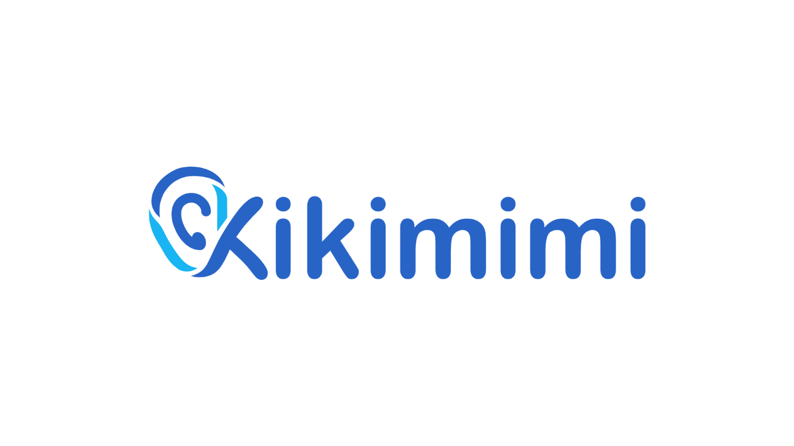
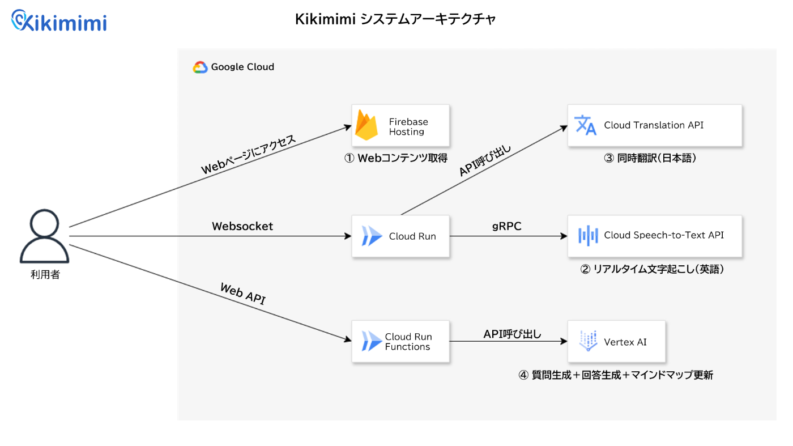

#  プロジェクト背景

Kikimimi が生まれた発端は、同僚の何気ない嘆きでした。

**「英語会議は聞き取るだけで手一杯。いざ “Any questions?” と振られても、言葉が出てこない」**

リモートワークが常態化し、世界中のメンバーとワンクリックで Web 会議が開ける時代。  
それにもかかわらず リアルタイム翻訳・返答補助・思考整理 をワンパッケージで担うツールはまだ決定打がありません。  
そこで私たちは、 Google Cloud のストリーミング API 群と Gemini 2.5 Flash の低レイテンシ生成を組み合わせ、**「聞く → 理解する → 話す」を 1 クリックで完結させる AI 会議アシスタント Kikimimi** を開発しました。

#  プロジェクトが対象とするユーザー像と課題

**英語会議地獄に悩むあなたに贈る**

  * 字幕を追うだけの幽霊参加者：超高速・専門用語まみれの発言ラッシュに置き去り、脳内バッファは即パンク。
  * "Any questions?" が恐怖の合図：マイクをオンにした瞬間、英語が蒸発。沈黙がZoom画面に刺さる。
  * 議事録難民：その場で理解できず、深夜に録画を倍速再生。「追いつくための残業」が常態化。

**聞くだけの自分を終わらせたい。でも、会議は待ってくれない。「聞き専」からの卒業を目指す何かが欲しい！**

#  ソリューション：Kikimimi

Kikimimi は以下のような機能と価値を提供します。

機能 | 内容 | 得られる価値  
---|---|---  
**リアルタイム文字起こし（英語）** | マイク越しにMTGの内容を英語で文字起こし | 聞き漏らしゼロ  
**同時翻訳（日本語）** | 英語の発言を日本語にリアルタイム翻訳 | 内容を瞬時に把握  
**質問生成** | 会話の文脈に基づいて、５種類の今聞くべき質問を異なる観点・粒度で提案 | 会議に積極参加  
**回答生成** | 会話の文脈に基づいて、Positive / Neutral / Negative の３種類のトーンで回答提案 | とっさの返答が楽  
**マインドマップ自動生成** | 議論している内容を視覚的にマインドマップ表示 | 議論構造が一目瞭然  
  
Kikimimi は翻訳ツールでも、議事録ツールでもありません。  
**「聞く・理解する・話す」 の全工程をリアルタイムに増幅し、あなたを "パッシブ参加者" から "議論のキープレイヤー" へ引き上げます。**

##  サービスデモ

<https://www.youtube.com/watch?v=2sdp7tSIxiY>

##  体験フロー

デモで示したユーザー体験をフローで表すと以下のようになります。

  1. セッション開始： 
     * 「開始」ボタンをクリックすると録音がスタートし、文字起こしと翻訳エンジンが同時に動作を開始します。
  2. リアルタイムテキスト表示 
     * 英語音声は英語タブに文字起こし、日本語タブに翻訳結果が並行して表示されます。
  3. 質問支援 
     * 会議中に質問を準備したいときは、キーワードを入力して「質問生成」をクリック。
     * 文脈に沿った質問候補が５種類提示されます。
  4. 回答支援 
     * 相手から質問を受けた場合は、キーワードを入力して「回答生成」をクリック。
     * Positive / Neutral / Negative のトーン別に回答案が提示されます。
  5. マインドマップ自動更新 
     * 発言内容は自動でマインドマップに整理・反映され、議論の構造が可視化されます。

##  アーキテクチャ

**Firebase Hosting** : Reactソースコードのホスティングに使用  
**Cloud Run** : リアルタイム文字起こしのコンテナ稼働に使用  
**Cloud Run Functions** : 質問生成・回答生成・マインドマップ更新の３種類のAPIに使用  
**Cloud Translation API** : 英⇒日の同時翻訳を実現するために使用  
**Cloud Speech-to-Text API** : 英語のリアルタイム文字起こしのために使用。Cloud Runのコンテナ内からAPI呼び出し。  
**Vertex AI (Gemini 2.5 Flash)** : ３種類のAPIのそれぞれで Gemini 2.5 Flash を使用。LLMの思考の長さを調整するための Thinking Budget を 0 に設定することでリアルタイム性を確保。

#  テストユーザーの声（利用後インタビューの要約）

20代・プロジェクトリーダー（海外スタートアップと週次で英語MTG）

◆良かった点

  * 同時翻訳がほぼリアルタイムで走るので、「聞き取れなかったワードを視覚で補完 ⇒ すぐ話に戻る」フローがスムーズ。
  * 発言と同時にマインドマップへノードが追加されるため、議論の全体像を常に把握できる。途中から参加したメンバーにも状況を一瞬で共有できた。
  * 会話ログが構造化されるおかげで、会議後のフォローアップメールを “要点コピペ＋少し手直し” だけで作成でき、生産性が上がった。

◆感動したポイント

  * マインドマップが 「修正⇒即反映」 されるスピード感。誤解や言い直しがリアルタイムで整理され、議論が迷子にならない。
  * 発言間の関連線が自動で引かれるため、論点の繋がりや分岐が直感的に見え、決定までの流れをチーム全員で共有しやすい。

◆改善点・要望

  * カジュアルな立ち上がりを支援する “アイスブレイク用フレーズ” を自動提案してほしい。ボタン操作なしで「How's your week going?」のような軽いネタを差し込めると便利。
  * 現在の質問／回答生成はややフォーマルで長文。チャット的な短い候補（例：Yes/No＋１行補足） を優先表示してほしい。
  * トピックが自然に切り替わる “話題スイッチ” があると、ディスカッション⇒雑談⇒ディスカッションの温度調整がしやすい。

* * *

40代・管理職（年に複数回海外出張に行き現地で会議等）

◆良かった点

  * 翻訳＋マインドマップの組み合わせが秀逸。英語を読み取りつつ議論の構造を俯瞰できるので、決裁ポイントを逃さずキャッチアップできた。
  * 言い間違いが即リフレッシュされるおかげで、訂正のたびに議事録を後で直す手間がゼロになるポテンシャルを感じた。
  * 質問／回答ジェネレーターが “考えるきっかけ” をくれるため、発言までのハードルが一段下がった。

◆感動したポイント

  * 発言が飛び交っても マインドマップがリアルタイムで再構成。複数の議論を同時に走らせても迷子にならない。
  * 「関連ノードの色分け」や「アイコン」が自動で付与され、会議が視覚化される感覚に驚いた。

◆改善点・要望

  * 現状は英語のみ対応なので、日本語⇄英語の双方向モードが欲しい。国内外混在チームでも使いやすくなるはず。
  * 質問・回答候補がやや長文。2〜3 行のショートサジェストに絞り、クリックで展開できるUIだと会議中でも使い切れる。
  * 生成されたフレーズを クリック⇒自動発話 してくれる機能があると、タイムラグなく発言できる。自分の声を模写した Text-to-Speech ならさらに自然。

#  今後の展望

今後は以下のような機能改善等を検討し、"誰でも自信を持って発言できる多言語会議プラットフォーム"を目指します。

  * 多言語・双方向モード 
    * 多言語のストリーム同時翻訳を実装
    * 混在会議でも各参加者が母語で発言し、相互理解できる環境を目指す
  * 発言支援の“時短＆クリック発話” 
    * ショートフレーズ生成：質問／回答候補を２〜３行に要約して提示。
  * 精度向上 
    * 文字起こし精度・翻訳精度の改善（翻訳時に直前の文脈を加える等）
    * マインドマップ生成精度の改善
  * ボタンレス雑談プロンプト & トピックスイッチ 
    * アイスブレイク用に「How's your week going?」など 軽い導入フレーズを自動提案。
    * 会議が停滞した際には文脈に合った 話題転換カードを提示してリズムを保つ。
  * Web会議ネイティブ連携 
    * Google Meet / Zoom / Teams への対応
    * アイコン１つで字幕ON/OFF・マップ表示切替が可能に。
  * マインドマップ手動編集 
    * ノードのドラッグ追加・階層変更を即議事録に反映
    * ノードのタイトルの手動編集
  * 資料自動生成 
    * 会議終了後、会話ログおよびマインドマップの内容をもとに Google Slides / Docs を即時ドラフト生成
  * セキュリティ＆ガバナンス強化 
    * SOC 2 Type II／ISO 27001＋ Vertex Private Endpoint で企業利用に耐える堅牢性
    * Model Armor 等を活用した OWASP Top 10 for LLM / NIST AI RMF への対応

#  まとめ

Kikimimi が目指すのは、言語の壁を “気づかないレベル” まで低くすることです。  
リアルタイム字幕・翻訳・発言支援・マインドマップ――これらをワンクリックで束ね、「聞く・理解する・話す」 の3ステップを同じスピードに揃えました。

  * 個人利用では、苦手意識を取り払い “聞き専” から即アクティブスピーカーへ。
  * 企業導入では、Google Cloud × Gemini 基盤により 数名のミーティングから数千人規模の国際会議までシームレスに拡張。
  * 将来は多言語化・クリック発話・自動資料化を加え、会議そのものを “データ駆動の意思決定プロセス” へ進化させます。

**言葉のハードルを下げ、議論のハードルを上げる。Kikimimi が、グローバルコラボレーションを日常の延長へと変えていきます。**

* * *

第2回 AI Agent Hackathon with Google Cloud 提出作品  
Kikimimi / Riku Yanagawa, Narumi Komaba, Michito Taga, Takeshi Nakada
