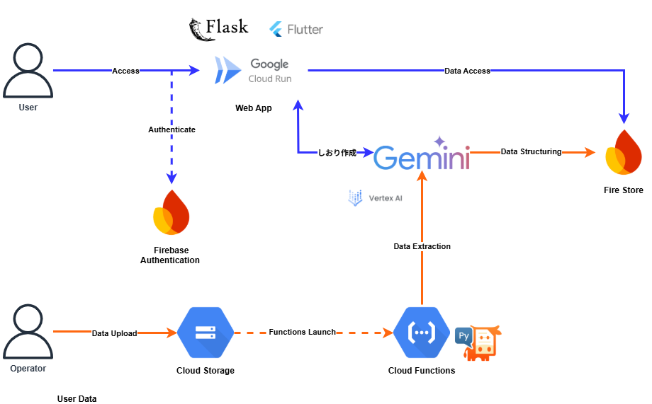

#  企業内コミュニケーション活性化アプリケーション

Me-Too! - 趣味や出身地によるPrivateなつながりを促進。

##  はじめに

現代の企業において、社員間のコミュニケーションは生産性やイノベーションの源泉となります。しかし、特に規模の大きな会社ほど、部署や入社年次が異なると、実は共通の趣味や出身地といった共通点があっても、お互いを知る機会がない、という「もったいない」状況が発生しがちです。例えば、「隣の部署に、実は大好きなアーティストのファンがいたなんて…」とか、「全社にサッカー好きがこんなにいたなら、フットサルチームが作れたのに…」といった経験はありませんか？  
今回ご紹介する「Me-Too!（ミートゥー）」は、そんな社内に埋もれた「出会いの機会」を掘り起こし、新しいつながりを生み出すための社内交流促進アプリです。仕事だけの関係に留まらず、趣味や共通の話題でつながる「ナナメの関係」を社内に増やすことを目指しています。

##  背景

弊社には「部署を越えたつながりの促進」という課題があります。業務上の接点だけでは関係構築に限界があるため、今回は「趣味」や「出身地」といった共通点をきっかけに交流を活性化させたいと考えています。弊社には社員の自己紹介を「YOU ONLINE」で共有する文化があります。この既存の仕組みを活用し、同じ趣味を持つ社員同士でサークル活動を始めたりコミュニケーションのきっかけを作ることで、全社員の交流を促し、組織全体の連携強化を目指します。

##  プロダクト概要

「Me-Too!」は、趣味や出身地を通じた「仲間」発見アプリです。その目的はシンプルで、会社の中にいる「同じ趣味」や「同じ出身地」の仲間を簡単に見つけ出し、新たな交流を生み出すことです。  
このアプリは、社員の自己紹介情報から共通点を見つけ出し、これまで接点のなかった社員同士を結びつけることで、社内コミュニケーションの活性化を図ります。

###  対象ユーザー

  * 企業に所属している社員全員（特に社員数の多い企業）
  * 趣味や出身地を通じた交流がしたい人

###  解決したい課題

  * **部署を越えたつながりの希薄化** :弊社では部署を越えたつながりを促進したいという目標があるが、いまだにつながりが薄いといった現状がある。
  * **共通点発見の困難さ** : 社員数の多い企業では、同じ趣味や出身地を持つ同僚を見つけることが困難
  * **人事データの活用不足** : 既存の社員データが有効活用されていない

###  ソリューションと特徴

Me-Too!は、以下の特徴を持つAI駆動のマッチングプラットフォームです。

####  1\. 部分一致検索機能

従来の完全一致検索とは異なり、AIによる部分一致機能を実装。「ライブ」で検索すると「ライブ観賞」「ライブハウス巡り」なども検出し、より柔軟な人材発見を可能にします。

####  2\. 地域同義語マッピング

「関西」と検索すると、大阪府、京都府、兵庫県、奈良県、滋賀県、和歌山県のユーザーも自動的に検索対象に含まれる地域同義語展開機能を実装しています。

####  3\. AIによる自動しおり生成

ユーザーが入力した趣味や出身地の情報を基に、Gemini AIが自動的にイベント用しおりを生成。手動作業を大幅に削減します。

####  4.Slackのメンション形式で出力

検索結果からユーザーが気になる人物を選択し、一括でメンションできる形でコピーが可能。ユーザーをSlack上で探す手間が省けます。

##  システムアーキテクチャ

###  技術スタック

**フロントエンド**

  * Flutter

**バックエンド**

  * Python
  * Flask Framework
  * Google Cloud Run

**データベース・ストレージ**

  * Cloud Firestore
  * Cloud Storage

**AI・機械学習**

  * Gemini AI
  * Google Vertex AI

**認証方法**

  * Firebase Authentication

##  実装詳細

###  1\. 検索アルゴリズムの工夫

最も技術的にチャレンジングだった部分は、効率的な部分一致検索の実装でした。Firestoreは完全一致検索には優れていますが、部分一致検索には制約があります。この課題を解決するため、以下の技術的工夫を行いました。

**検索処理の最適化アプローチ** ：  
まず、全てのユーザーデータをサーバー側で取得し、アプリケーション側で部分一致フィルタリングを実行する方式を採用しました。各ユーザーの趣味データに対して、検索キーワードが含まれているかを動的にチェックし、マッチした完全な単語を出力します。

**マッチング精度の向上** ：  
単純な文字列検索だけでなく、ユーザーの趣味を格納した趣味リストと趣味をカテゴリー分けした趣味キーワード配列の両方をチェックすることで、検索の網羅性を高めています。また、重複するマッチ結果を除去することで、ユーザーに分かりやすい検索結果を提供しています。

**地域同義語展開の実装** ：  
関西地方の検索をした場合、ユーザーが「関西」と入力した際に、大阪府、京都府、兵庫県、奈良県、滋賀県、和歌山県の各府県のユーザーも自動的に検索対象に含める機能を実装しました。これにより、地域名での検索が実用的になりました。

###  2\. AI自動生成パイプラインの設計

PDF形式のプロフィールデータからの自動データ抽出は、手動データ入力の負荷を大幅に削減する重要な機能です。以下のような段階的なパイプラインを構築しました。

**PDFテキスト抽出の最適化** ：  
PyMuPDFライブラリを使用して、PDFファイルから高精度でテキストデータを抽出します。レイアウト情報も保持しながら、構造化されたテキストとして取得することで、後続のAI分析の精度を向上させています。

**Gemini AIによる構造化データ生成** ：  
抽出されたテキストをGemini AIに送信し、自然言語処理により趣味、出身地、部署などの構造化データに変換します。データ構造をプロンプトで指示することにより、一貫性のあるデータフォーマットでの出力を実現しています。

**Firestoreへの自動保存** ：  
生成された構造化データは、Firestoreの適切なコレクション構造に従って自動的に保存されます。データの整合性チェックとエラーハンドリングを実装することで、信頼性の高いデータ登録プロセスを実現しています。

##  利用シナリオ

###  シナリオ1：新規の同好会・サークルを作りたい

読書が好きな新入社員が読書サークルを作りたい場合：

  1. **検索実行** ：趣味の欄に「読書」と検索
  2. **参加者選出** ：サークルに招待したい社員をチェックボックスで選択
  3. **メンション生成** ：Slackのメンション文を自動生成
  4. **しおり作成** ：参加者情報を含むイベント用しおりをAI自動生成
  5. **チャンネル作成** ：「読書サークル」チャンネルを作成し、そこでメンションとしおりを添付してチャンネルに送信！

###  シナリオ2: 地域別懇親会の開催

大阪・兵庫出身者の懇親会企画：

  1. **地域検索** ：出身地を「関西」で検索する。（自動的に関西のユーザーが検索対象に）
  2. **詳細確認** ：出身地の詳細情報（大阪府、京都府、兵庫県、奈良県、滋賀県、和歌山県）を確認
  3. **グループ形成** ：「大阪府」出身者と「兵庫県」出身者にチェックボックスを付けてメンション文を生成
  4. **企画書生成** ：AIによる懇親会企画書の自動作成
  5. **チャンネル作成** ：「大阪・兵庫懇親会」のチャンネルを作成し、そこでメンションとしおりを添付してチャンネルに送信！

##  デモ動画

<https://youtu.be/9ndITbNqwLw?si=Nrb2GTU0JyguAZ7t>

##  技術的工夫と課題解決

###  1\. レスポンス速度の最適化

初期実装では検索レスポンスが遅い課題がありました：

**課題** ：100件以上のプロフィールデータの全件検索で500ms以上  
**解決策** ：

  * データベースインデックスの最適化により、データアクセス速度を向上
  * 非同期処理の活用により、UIの応答性を維持

**結果** ：平均レスポンス時間を200ms以下に短縮

###  2\. UIハイライトの正確性向上

「東京」検索時に「東京都」全体をハイライトする必要がありました：

**技術的アプローチ** :

  * サーバーサイドでマッチした完全単語の特定と返却機能を実装
  * フロントエンドで単語境界を考慮したハイライト処理アルゴリズムを開発
  * 正規表現を活用した精密なテキスト処理により、意図しない部分へのハイライト適用を防止

###  3\. セキュリティ機能

社員データを扱うため（今回はテストデータ）のセキュリティ要件：

  * Firebase Authenticationによる多層認証システムの実装
  * HTTPS通信によるAPI通信の完全暗号化

##  パフォーマンス指標

開発完了時点での主要指標：

  * **API平均レスポンス時間** ：200ms以下
  * **データベースクエリ時間** ：100ms以下
  * **UI描画フレームレート** ：60 FPS

##  今後の展望

###  機能拡張

  * **スケジュール調整機能** ：Slack Botと連携し、イベント参加候補者のカレンダーの空き時間を自動で照会・集計。最適な開催日時を提案し、調整済みのしおりを再生成する機能
  * **イベント・サークル活動の履歴管理** ：アプリを通じて設立されたサークルや開催されたイベントの活動履歴を記録・可視化。組織全体のコミュニケーション活性度を定量的に測定するダッシュボード機能
  * **AIによるリコメンデーション機能** ：ユーザーのプロフィールや過去の活動履歴を基に、AIが「あなたと共通点の多い社員」や「興味を持ちそうなサークル」を能動的に推薦する機能
  * **多言語対応** ： グローバル企業での利用を想定し、UIとAIの自然言語処理を多言語に対応させる

###  技術的改善

  * **リアルタイム通知** ：新しい仲間が登録された際や、自分が招待されたイベントがある場合に、WebSocketを用いてリアルタイムでプッシュ通知を送信する機能
  * **オフライン対応** ： PWA化を推進し、ネットワークが不安定な環境でも基本的な操作が可能になるオフライン対応。
  * **AIモデルの継続的改善** ：ユーザーのフィードバックや利用データを基に、検索や推薦のAIモデルを定期的に再学習させ、精度を継続的に向上させるMLOpsパイプラインの構築

##  まとめ

「Me-Too!」は、社内が抱えるコミュニケーション課題に対し、AIと最新の技術を駆使して新たな解決策を提示する画期的な社内交流促進アプリです。社員一人ひとりが「同じ趣味」や「同じ出身地」の仲間を簡単に見つけ、仕事だけでなく、プライベートでのつながりを深めることで、より創造的で風通しの良い企業文化を築き、最終的には組織全体の生産性とイノベーションを大きく促進することを目指しています。  
ぜひ「Me-Too!」で、あなたの会社の「もったいない」を「新しい価値」に変えてみませんか。
