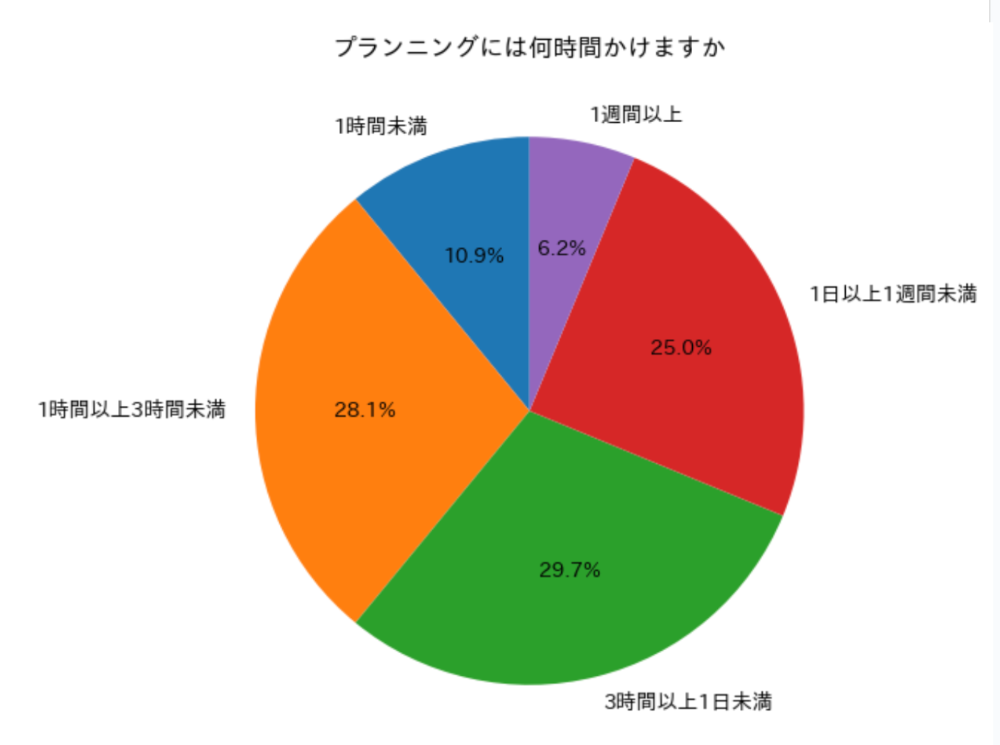
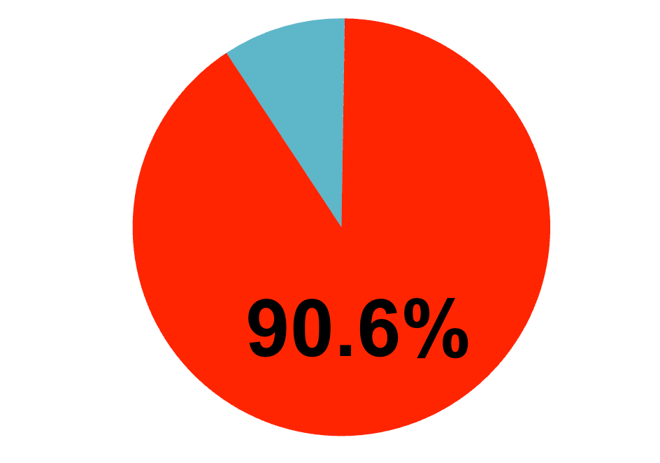
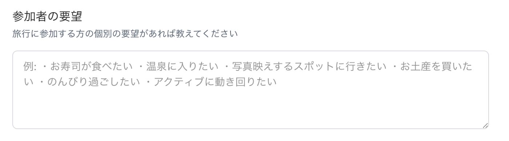
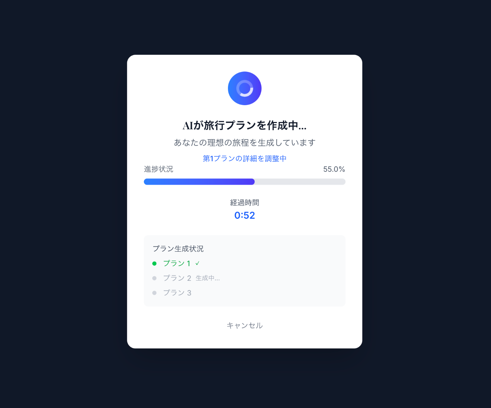
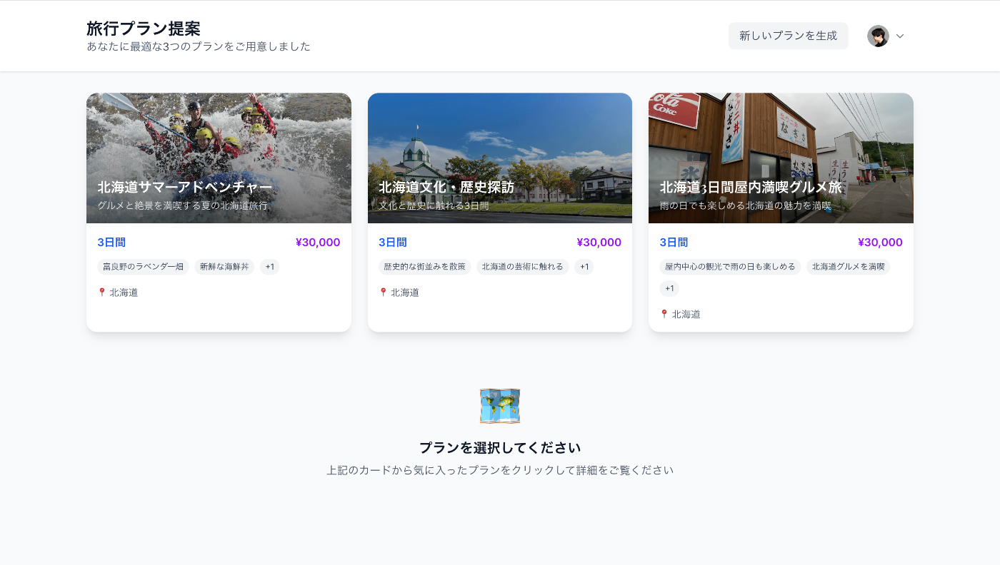
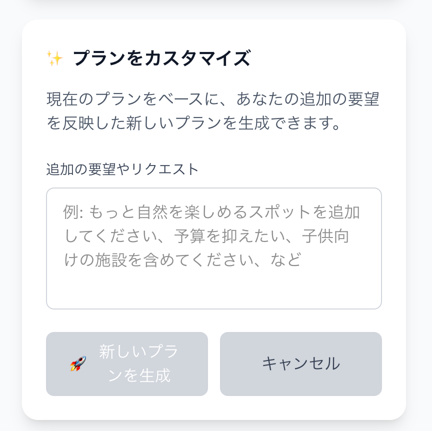
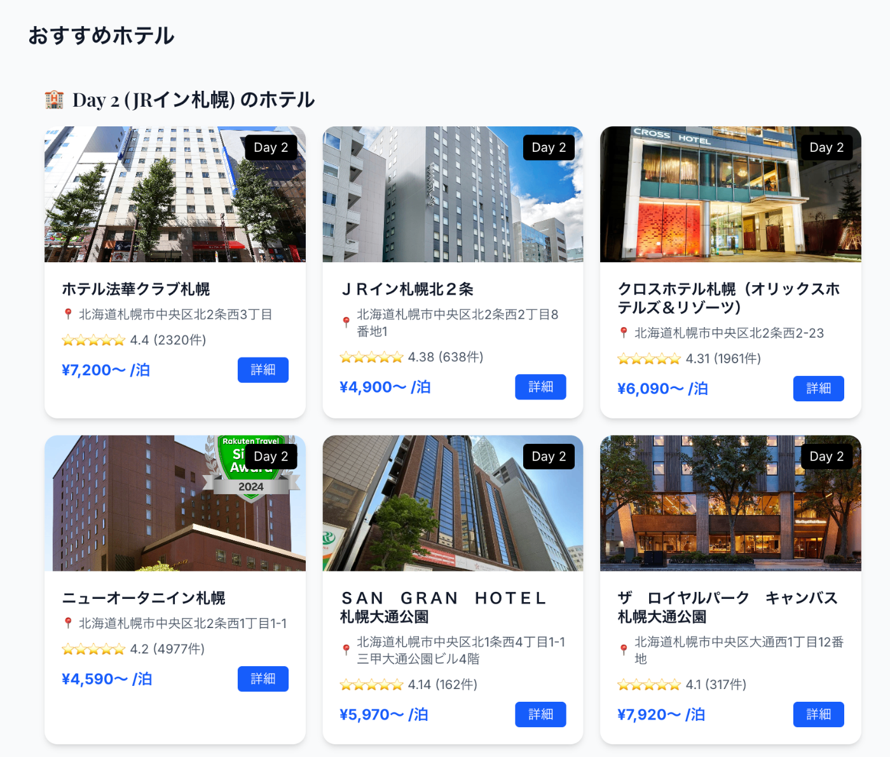
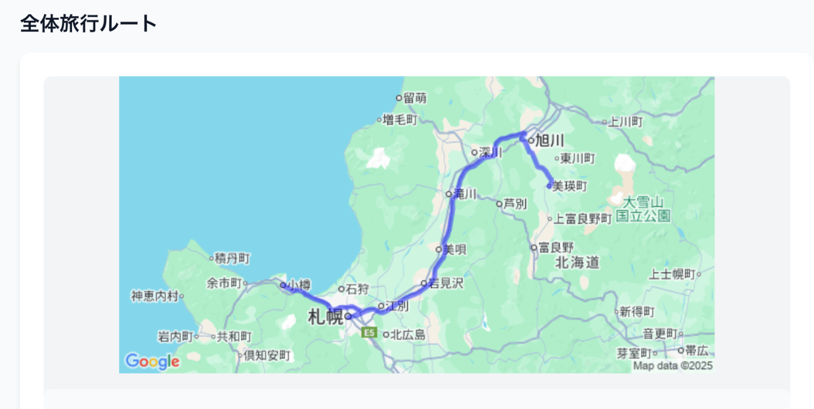
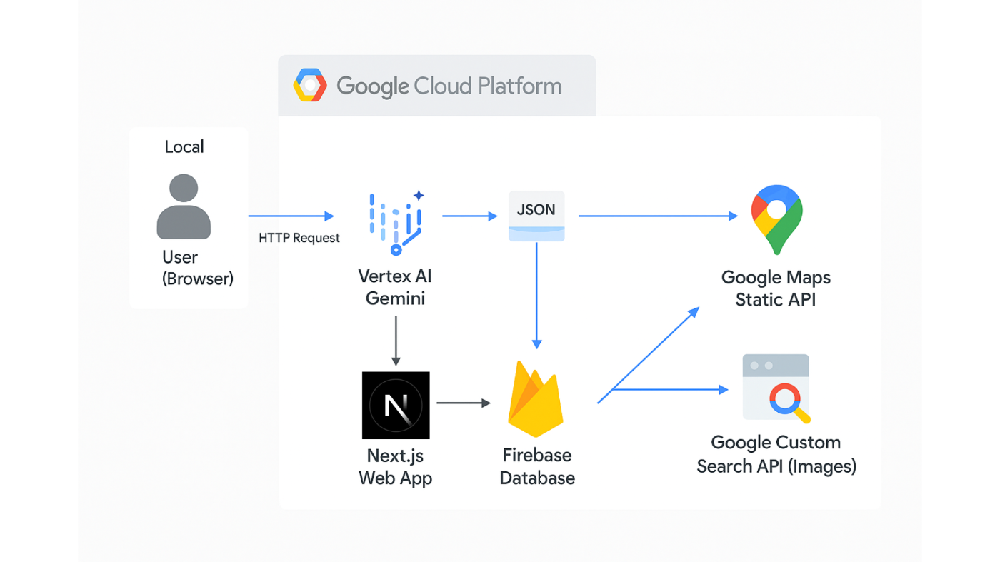

**タグ:** `Idea`, `GoogleCloud`, `VertexAI`, `Gemini`, `hackathon`, `travel`, `Next.js`, `CloudRun`

##  はじめに：誰もが直面する「旅行計画の壁」

友人や家族との旅行は最高の思い出になりますが、その準備段階である「旅行計画」に頭を悩ませた経験は誰にでもあるのではないでしょうか。

**「どこに行く？」「何をする？」「予算は？」**

特に参加者が増えるほど、全員の希望を調整するのは複雑で、膨大な時間と労力がかかります。

この課題の深刻さを明らかにするため、私たちは**64名を対象にアンケート調査を実施しました** 。その結果、衝撃的な事実が判明しました。

  * **約7割が計画に3時間以上を費やしている** 。中には1週間以上かけるという人も1割以上存在します。

  *   
_▲調査結果：プランニングには多くの時間が費やされている_

  * 旅行は**9割以上が「複数人で行きたい」と回答** しており、意見調整の難しさがうかがえます。誰かの行きたい目的地だけに偏ってはいけず、複数人で行くならみんなの行きたい箇所を汲み取っていい感じに旅行プランを組む必要があります。

  *   
_▲調査結果：旅行は複数人で行きたい人が多数_

みんなの行きたい場所ややりたいことはバラバラ。

それら全ての要望を汲み取り、全員が満足するプランを練り上げる作業は、楽しいはずの旅行準備を「面倒なタスク」に変えてしまいます。

この**計画の苦痛を解消し、誰もが旅行の楽しい部分だけを享受できる世界** を実現するために、私たちはnorunを開発しました。

* * *

##  プロダクト概要：AIエージェント『norun』があなたの旅をデザインします

『norun』は、**参加者全員のバラバラな要望をAIが統合し、最適な旅行プランを自動でデザインしてくれるAIエージェント** です。

私たちのAIエージェントの定義は**「嫌な時間を減らして、楽しい時間を増やしてくれる存在」** です。なぜ、ここであえて定義を行ったかというと、人によってAIエージェントという単語を聞いた時に持つイメージや役割が、技術が過渡期にある現在ではまだバラバラだと感じるからです。

私たちの開発した『norun』は、この哲学を旅行計画において体現します。

**独自性（差別化要因）**は、単一のプランを提示するのではなく、**テーマの異なる複数の選択肢を提案する** 点にあります。これにより、ユーザーは自分たちの潜在的なニーズに気づき、想像もしなかった旅のスタイルに出会うことができます。さらに、提案されたプランは**自然言語で対話するように、柔軟にカスタマイズ可能**です。

* * *

##  デモンストレーション：『norun』が動く様子をご覧ください

百聞は一見に如かず。まずは、norunが面倒な旅行計画を解決する様子をご覧ください。

<https://youtu.be/O5uQqbzhQH8?si=WvXmarISIk1svDeH>

* * *

##  主要機能と提供価値：カンタン操作で最高の旅へ

norunは、直感的な操作で複雑な旅行計画を完了させるための機能を備えています。

###  1\. みんなのワガママ、全部入れられます！

行き先、日程、予算といった基本情報に加え、参加者それぞれの「清水寺に行きたい！」「嵐山の竹林が見たい！」といった**個別の要望をフリーテキストでまとめて入力** できます。

  
_▲旅行の希望と参加者全員の要望を一度に入力_

###  2\. AIが最適な3つのプランを提案

入力された情報に基づき、AIが**テーマの異なる3つの旅行プランを瞬時に生成** します。歴史満喫プラン、自然とアクティビティ中心プラン、雨の日でも楽しめる屋内中心プランなど、多様な選択肢から気分に合ったものを選べます。特に、雨の日のプランは屋内でも楽しめる旅行プランになっています。

  
_▲AIがプラン生成中の画面_

_▲具体例：北海道で旅行プランを生成、複数のプランを提案_

###  3\. "やっぱりこうしたい！"も自由自在

提案されたプランは、日ごとの詳細なタイムラインや予算、移動ルートまで確認できます。もし点案されたプランを変更したくなっても問題ありません。プランの中で変更したい箇所を**チャットで伝えるだけで、AIが即座にプランを更新** します。例えば、「清水寺じゃなくて二条城が良いな」といった感じです。

  
_▲自然言語での指示で、旅程をリアルタイムに調整可能_

###  4\. 宿泊施設の検索から予約までシームレスに

旅程が固まったら、1日の最終地点から**最適な宿泊施設を検索し** 、**そのまま予約プロセスへ** 進むことができます。複数の予約サイトを渡り歩く手間を省きます。

_▲旅行プランの近くでホテルを提案_

###  5\. 全体ルートを可視化でわかりやすく

旅行プランごとに全体ルートを可視化してくれます。これによって、旅行に必要な移動経路や移動距離などわかりやすい設計にしています。

![スクリーンショット]

_▲旅行プランのルートを検索＆可視化_

* * *

##  システムアーキテクチャ：なぜこの技術を選んだのか

norunは、スケーラビリティと高速な応答性を両立させるため、Google Cloudのサービスを全面的に活用しています。

  * **フロントエンド:** Next.js (Vercel)
  * **バックエンド:** Cloud Run
  * **AIモデル:** Vertex AI (Gemini)
  * **外部API連携:** 楽天トラベルAPI等

**【技術選定の理由】**

  * **Cloud Run:** 旅行プラン生成は、リクエストごとに計算負荷が変動する非同期的な処理です。サーバーレスで完全にスケーラブルなCloud Runは、コストを最適化しつつ、安定したパフォーマンスを維持するのに最適でした。
  * **Vertex AI (Gemini):** 複数人の曖昧かつ多様な要望（「美味しいものが食べたい」「歴史を感じたい」など）を解釈し、矛盾のない具体的な旅程に落とし込むという高度なタスクには、Geminiの強力な自然言語理解能力と推論能力が不可欠でした。

* * *

##  技術的ハイライト：自然言語による「対話型プラン再構築」の実現

本プロジェクトで最も挑戦的だったのは、**一度生成したプランをユーザーの自然言語指示に基づいて動的に修正する機能** の実装です。

ユーザーからの「やっぱり清水寺じゃなくて二条城が良い」という一見単純なリクエストは、AIエージェントにとって多くの制約を伴う複雑なタスクです。

  1. **意図の正確な抽出:** ユーザーの指示が「場所の入れ替え」なのか「追加」なのかを判断する。
  2. **既存プランの理解:** 現在のプラン（訪問順、時間配分、地理的位置関係）を完全に把握する。
  3. **制約付き再生成:** 新しい目的地（二条城）の開館時間、所要時間、周辺の地理情報を考慮し、移動時間が不自然になったり、予算を大幅に超えたりしないように、タイムライン全体を矛盾なく再構築する。

この課題を解決するため、私たちはVertex AIのGeminiに対し、現在のプラン情報、ユーザーの修正指示、そして観光地データベースからの関連情報をコンテキストとして与える、高度なプロンプトエンジニアリングを設計しました。これにより、単なる目的地の置換ではなく、旅程全体の最適化を伴うインテリジェントな再計画を実現しています。

* * *

##  定量的効果：旅行計画の時間を96%削減！

norunがもたらすインパクトは、私たちの想像をはるかに超えるものでした。

タスク | 従来の方法（手作業） | norun導入後 | 削減率  
---|---|---|---  
**4人での2泊3日旅行計画** | 約5時間 (300分) ※ | **約10分** | **約96%**  
  
[cite_start]※アンケート結果に基づく平均的な所要時間 [cite: 6]

[cite_start]これまで半日仕事だった面倒なプランニングが、**わずか10分で完了** します。これは、私たちのミッションである「嫌な時間を減らし、楽しい時間を増やす」を具体的に証明する結果です。

* * *

##  今後の展望：旅の概念をアップデートする

このハッカソンは始まりに過ぎません。私たちはnorunをさらに進化させ、旅の概念そのものをアップデートすることを目指します。

  * **【短期】インタラクティブな旅行体験:** 現地での交通状況や天候に応じて、リアルタイムでプランを最適化するエージェント機能を実装します。
  * **【中期】潜在的な欲求の発見:** ユーザーの過去の旅行データや好みを分析し、本人も気づいていない「本当にしたい旅」を提案します。
  * [cite_start]**【長期】固定概念の破壊:** 「夏は避暑地へ」といった固定概念に縛られず、データに基づいてパーソナライズされた、全く新しい旅のスタイルを創造します。

* * *

##  おわりに：チーム『TOKM』の挑戦

この開発を通じて、私たちは「複数人の複雑な要求を構造化し、LLMに的確な指示を与えること」の難しさと、それが実現できた時の大きな可能性を学びました。

開発中にしんどいこともありましたが、素晴らしいメンバーと開発できたおかげでなんとか開発を終わらせることができました。

また、メンバーの中には全く旅行が好きではない・観光地をあまり知らない/興味がない・旅行プランを考えるのはもってのほかだという方もいたのですが、norunが完成してからはたまに触っては「こんな観光地があるんだ！」「意外と旅行プラン考えるの楽しいなっ」と行動や考え方も変わったそうです。

旅行好きだけではなく、旅行好きでない方も使っていただけるそんなプロダクトになったかなと考えています。

norunが、あなたの次の旅を最高のものにする一助となれば幸いです。
