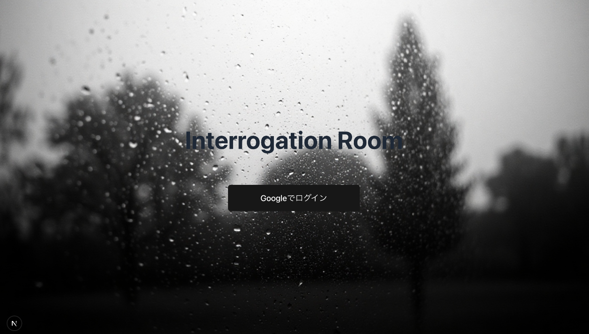
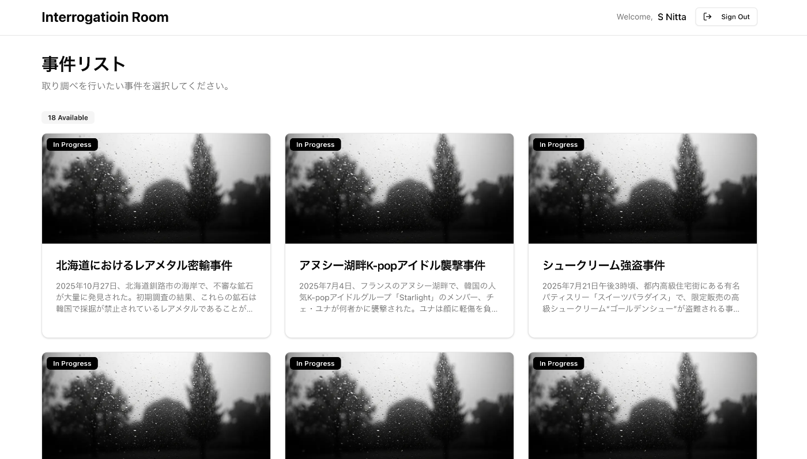
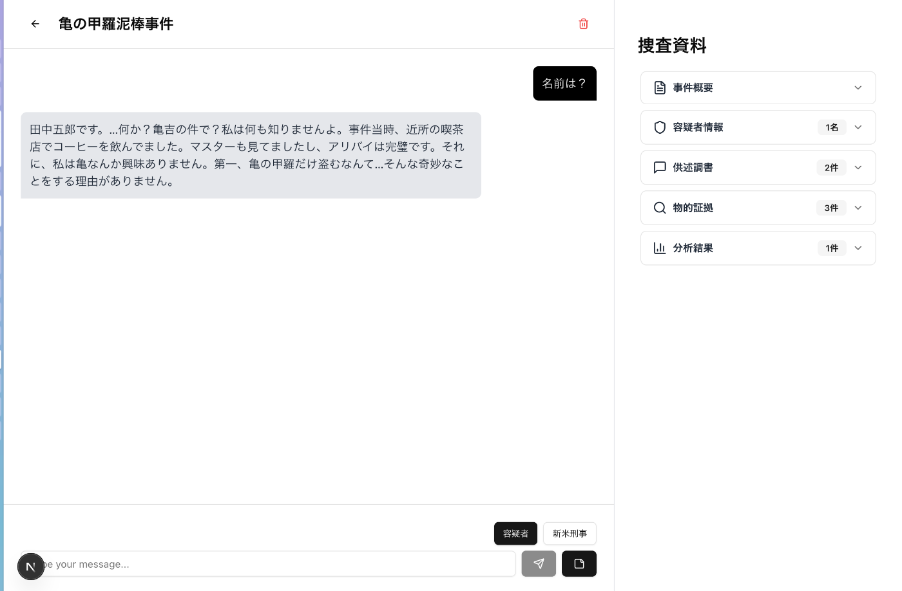
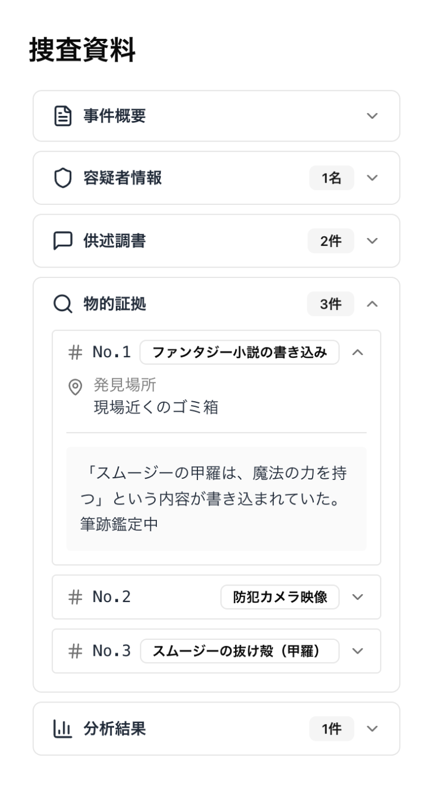
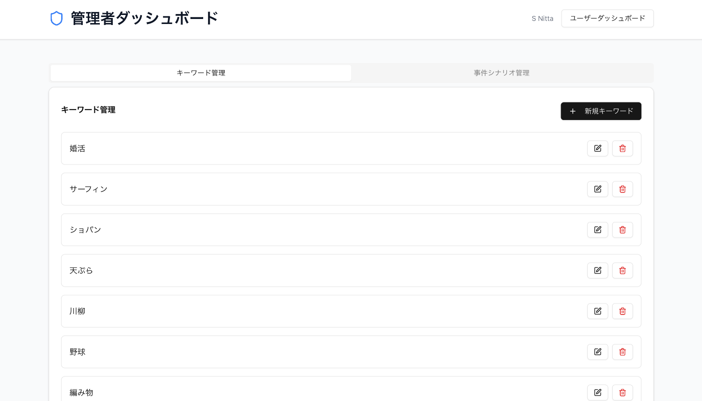
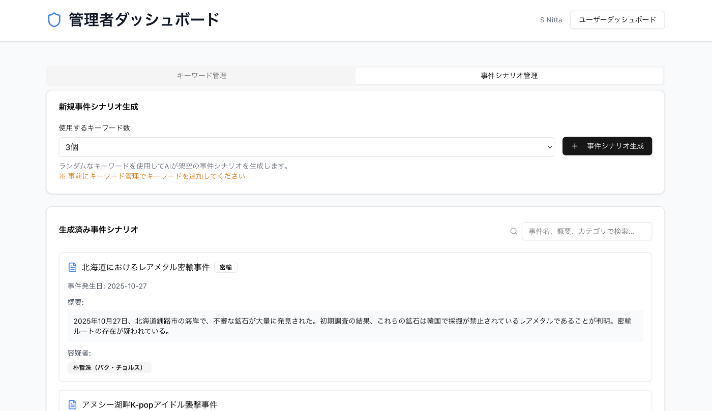
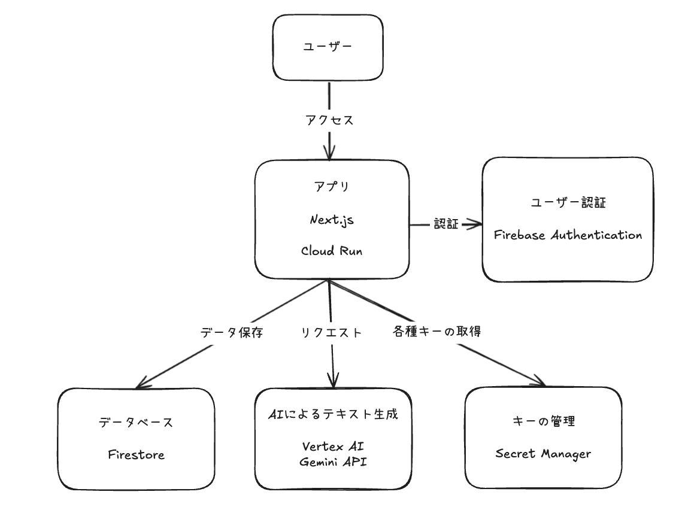

この記事は、「[第2回 AI Agent Hackathon with Google Cloud](https://zenn.dev/hackathons/google-cloud-japan-ai-hackathon-vol2)」の提出記事です。

2025/07/25 追記: 一次選考通過してびっくりしました😭 最終選考には落ちましたが、記事を読んでくださった皆さん、いいねをくださった皆さん、審査員の方々、ありがとうございました🙇

* * *

🕵️‍♂️：刑事  
😞：作者

🕵️‍♂️：「...このゲームを作ったのは、アンタだな？」  
😞：「...はい...私です...（震え声）」

🕵️‍♂️：「お前、なんでこの真面目そうなハッカソンに、『取り調べゲーム』なんか持ち込んだんだ？」  
😞：「すみません...友達が参加するっていうから...私もやりたい！ってなって...」  
🕵️‍♂️：「軽い気持ちでやって（参加して）しまった、と」  
😭：「はい...」

🕵️‍♂️：「参加するからにはちゃんと作品を仕上げてきたんだな？」  
😃：「はい！締切日が月曜なので有休取って間に合わせました！この文章も締切当日の朝の4時から書いてます！」  
🕵️‍♂️：「目がバキバキで怖い...説明してもらおうか、その作品とやらを」  
😃：「まかせてください！」

##  📁 捜査資料01：プロジェクト概要

この作品は、容疑者との取り調べをテーマにしたテキストベースのAIチャットゲーム 「**Interrogation Room** 」（取調室）です。

派手な演出はなく、登場するのはベテラン刑事（プレイヤー）、新米刑事（AI）、容疑者（AI）の3人だけです。

チャットで証言を引き出し、証拠を見返し、新米に相談しながら、「犯人」を見つけていく。

言葉の矛盾を見つけたときのひらめき。言い淀んだ返答に潜む違和感。

「この人、嘘ついてるかも？」っていう直感が、あなたの中でじわじわ確信に変わっていく──

そんなゲームを作りました！

🕵️‍♂️：「AI尋問ゲームってもうあるよね？」  
😞：「実はそうなんです。日本でも海外でも」  
🕵️‍♂️：「独創性を求められるハッカソンで二番煎じが許されると思ってるの？馬鹿なの？」  
😞：「ごめんなさい...😭 調査が甘くて途中まで存じ上げなくて。締切2週間くらい前に作りかけのゲームをドヤ顔で弟に自慢してたら、『もうあるよ？知らないの？😧』って言われて...」  
😃：「でも！路線が完全に同じというわけではないし、このゲームも**KGX** 不足を解消し、現代社会に新たな**KGX** を提供すると言う意味では価値があると思ったので提出してみました」

##  📁 捜査資料02：このプロジェクトが解決する課題

###  KGXとは

🕵️‍♂️：「KGX...?」  
😃：「**刑事エクスペリエンス** です！」  
🕵️‍♂️：「デジタルエクスペリエンスみたいに言われても」  
🕵️‍♂️：「それはいったい...」  
😃：「**刑事のようにさまざまな証拠を集め、推論を積み重ね、真実を追求する体験です！** 」

###  日常に潜む様々なKGX

🕵️‍♂️：「そんなの初めて聞いたぞ」  
😃：「それは気づいてないだけ！実はみんな日常的にKGXを体験しているんです」

  * 冷蔵庫にあったプリンがない！ゴミ箱に空の容器、あの時間帯家にいたのは...？はKGX
  * 上司が急に優しい！何かやらかした？それとも辞めちゃうの？と心配するのも、KGX
  * 推しのSNS投稿が急に止まって、体調不良？スキャンダル？と考察するのも、KGX

🕵️‍♂️：「じゃぁおかんが便座の上がってるトイレを見て『最後に使ったの誰〜？』って言うのも...」  
😃：「そう、KGX！」

###  人はなぜKGXを求めるのか

人はなぜKGXを求めるのか...

😃：「**それは、KGXは快感だからです！** 」

「**わかった気持ちよさ** 」「**見抜いた気持ちよさ** 」「**繋がった気持ちよさ** 」

そう、KGXとはいわば脳内ドーパミン製造マシーン。

だから人は、気づけばプリンの容疑者を洗い出してたり、SNSの投稿頻度から推しのスキャンダルを疑ったりしてしまう。

**人間の本能は刑事。KGXは人間の根源的な喜び。**

🕵️‍♂️：「つまり、お前は**人類総刑事説** を唱えているのか…？」  
😃：「はい。**人は、KGXで、輝けます。** 」

###  良質なKGXがもたらす未来

😃：「というわけで、人間というのは本来KGXが満たされていてやっと幸せを感じられる生き物なんですね」

もしも、誰もが日常的にKGXを満たせたら？

  * なんでも鵜呑みにせず、「それって本当？」と一歩立ち止まる冷静さ
  * 「あれ、ここ矛盾してるかも？」と違和感に気づく観察力
  * 「本当のことを知りたい」という健全な好奇心

そんな **KGフルネス（刑事的充足）** な人が増えたら──

世界はもっと“考えること”を楽しめる場所になる。

噂や陰謀に振り回されず、論理的に真実を追い、でもちょっと笑える。  
Interrogation Roomは、そんな未来の第一歩を目指しています。

🕵️‍♂️：「...アンタ、最初はふざけてると思ってたけど、意外とちゃんと考えてるんだな」  
😃：「はい！**KGXは、世界をちょっとだけマシにする。** 私はそう信じています！」

##  📁 捜査資料03：ターゲットユーザー像

😃：「というわけでターゲットは**KGフルネスを感じたい人** 、になります」

##  📁 捜査資料04：課題へのソリューション

このゲームでは、AIを活用したテキストベースのKGXを提供します。

主人公（ユーザー）はベテラン刑事。

バリエーション豊かな事件の中から、好きなものを選んで尋問開始。

容疑者AIとの対話はもちろん、  
サイドバーに表示される事件概要で、さまざまな証言や証拠品にアクセスできます。

容疑者との取り調べと同時並行でアシスタントの新米刑事に相談しながら、犯人を追い詰めることが可能です。

###  デモ動画

<https://youtu.be/ngRiJF3MhTo?feature=shared>

###  作成した画面

ログイン画面。Googleアカウントでログイン可能です  

ログインすると事件の一覧が表示されます  

容疑者（AI）とのチャット画面。  
送信ボタン上の「新米刑事」をクリックすると、アシスタントである新米刑事（AI）とのチャット画面スイッチします  

KGXを高める事件概要  

管理者アカウントでログインすると、管理用ダッシュボード（`/admin`）にアクセスできます。こちらは事件のシナリオに使用するキーワードを追加する画面  

事件のシナリオをAIで生成する画面  

###  AIを使っているポイント

####  AIによるシナリオ生成機能

これはまだまだ改良の余地がありますが...このゲームでは事件のシナリオをAIで生成しています  
ランダムなキーワードを指定することで、『クリスマスのうどん泥棒』のようにオリジナリティのあるシナリオが多数生まれました。

🕵️‍♂️：「整合性はさて置き、それっぽいアイディアを無限に出せるっていうAIの強みを活かしてるな。」

####  AI容疑者への尋問

これは先ほど述べた通りすでに既存のゲームでも実装されている機能ですが、AI容疑者への尋問ができます。

🤔：「論理的に追い詰めなくても、ゴリ押ししたら自白してしまうのをどう制御するかは、他の尋問ゲーム同様に本アプリでも克服できていない課題です」

####  AI新米刑事のアシスタント

AI容疑者とのチャットと並行して、アシスタントの新米刑事に証拠品や尋問方法について相談することができます。

🤔：「今後は証言者や目撃者も登場予定です」

###  アピールポイント

🕵️‍♂️：「なるほど、AIを使ってることはわかったが...それだけなら今までの刑事ゲームでもありそうだな」  
😃：「そう言われると思って、他のアピールポイントも用意してきました！」

####  ちょっとリアリティのある捜査資料

チャット欄の右側に表示される捜査資料は、日本の警察の事件情報の分類方法（GPT談）を参考にしました。本当の警察になったようなワクワクするKGXが実現できたと思います。

####  ちょっといい感じのUI

デザインは機能が出揃ったらまた掘り下げる予定で、まだ骨組みの段階ではあるのですが...ChatGPT、VSCode、Obsidianなどの有名アプリの配置などを参考にしつつ、ぱっと見で使い方がわかる、クリーンでシンプルなUIにこだわりました

🕵️‍♂️：「事件のサムネイルが全部同じなのもわざとか？」  
😞：「それは実装する時間がなかっただけです。ごめんなさい」

##  📁 捜査資料06：今後の捜査計画（拡張構想）

🕵️‍♂️：「で？今後はどうする気だ？」  
🤔：「やりたいことがありすぎて書ききれませんが、とりあえず**ゲーム性の向上** は絶対必要だと思っています。今は『尋問風ロールプレイングゲーム』のような状態ですが、論理的に推論を積み重ねないとクリアできないゲームが理想です。GPTと相談しながら、『これまでの尋問で容疑者を有罪と言えるかどうか』をアプリが機械的に算出できる仕組みを考え中です。」

##  📁 捜査資料07：開発アーキテクチャ

🕵️‍♂️：「技術的にはどういう裏がある？」  
🫣：「こちらがアーキテクチャ図になります」

###  使用したGoogle Cloudのサービス

  * Cloud Run: アプリのホスティング
  * Firestore: データベース
  * Firebase: 認証
  * Secret Manager: 各種キーの管理
  * Cloud Build：アプリのデプロイ
  * Vertex AI: Gemini APIによるテキスト生成

##  📁 捜査資料08：供述調書（よもやま開発話）

😞：「ここからは、ちょっとした裏話をさせてください…」

###  Cloud Run✖️2にしようとして失敗した話

当初はFastAPI（Python）でバックエンドを別Cloud Runに切り離すつもりでしたが、サービスアカウント絡みのCORS問題に直面。インフラ苦手＆AIも頼れず、締切目前にNext.jsへ全面移植という強行手段に出ました（証拠隠滅…？）。  
🕵️‍♂️：「...まさか当日の朝に移植したとか言わないよな？」  
😃：「実は...」  
🕵️‍♂️：「完全に事件だな」

###  Claudeすごい

最初はGPTとワイワイ言いながら作ってたんですが、次第にClaudeの実務能力の高さに目覚め、最後の方は完全にClaude依存でした。ClaudeのおかげでNext.jsへの移植もスムーズでした。

###  友達を巻き込めなかった話

一瞬、「友達と一緒に作ろうかな」と思ったんですが、自分の中でゴールが見えない状態で巻き込むのが申し訳なくて、今回は完全ソロ捜査体制にしました。その結果、作って壊して試して壊してまた作る…というPoC向け反復開発がめっちゃ捗ったので、これはこれで良かったです。

###  フロントはほぼV0任せ

フロントエンドはV0（AI UI生成ツール）にまるっと任せました。仕様が変わったら、該当のファイルだけまたV0に読み込ませて調整。shadcn/uiを使ってたので、コンポーネントを自作しなくて済んだので助かりました。

###  Gemini意外と安い

チャットごとにGeminiには、キャラ設定・事件概要・そのキャラとの全チャット履歴を毎回送信しています。  
正直ドキドキしてましたが、6月の請求はなんと約400円。アウトプットが高く、インプットは激安な生成AIの構造が体感できました。

🕵️‍♂️：「まぁ大変だったな。カツ丼でも食べて元気出せ」すっ  
😭：「ありがとうございます...!」  
🕵️‍♂️：「一人でハッカソン完走した後に食べるカツ丼より美味いカツ丼はないんだぜ。」  
😭：「本当だ...!う、うまい...！」  
🕵️‍♂️：「明日からまた気合いいれて仕事も個人開発も頑張れよ。」  
😭：「はい、頑張ります！」

_〜fin〜_

デモサイト: <https://interrogation-app-488803469381.asia-northeast1.run.app/chat?summaryId=HcBoPewDOskDXAsdlW6H>  
(Googleログインが必要です。ゲーム上に保存されたユーザー情報や取り調べ情報は審査期間終了後に責任を持って破棄しますのでご安心してお遊びください🙇)

GitHub：<https://github.com/SachikoNitta/InterrogationRoom>

デモ動画：<https://youtu.be/ngRiJF3MhTo?feature=shared>
