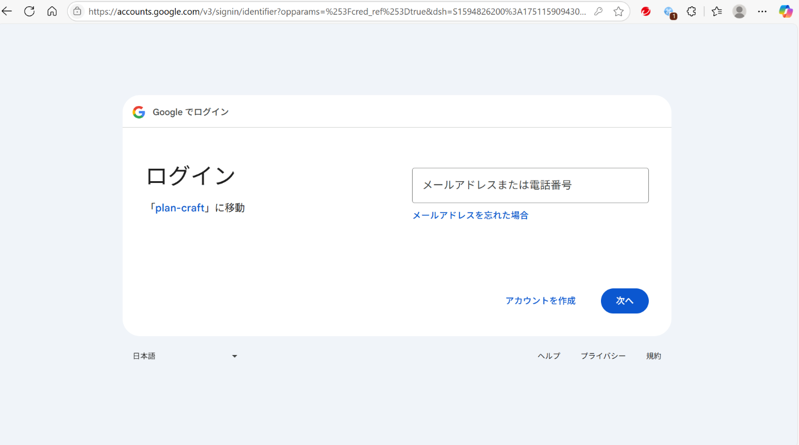
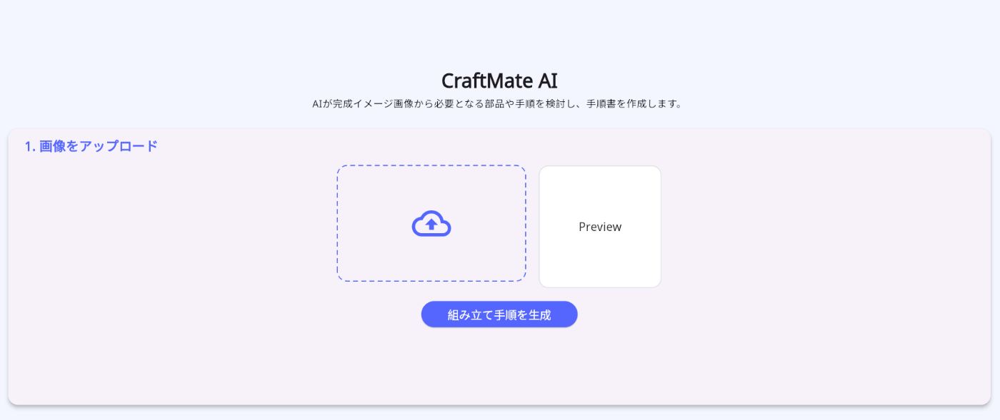
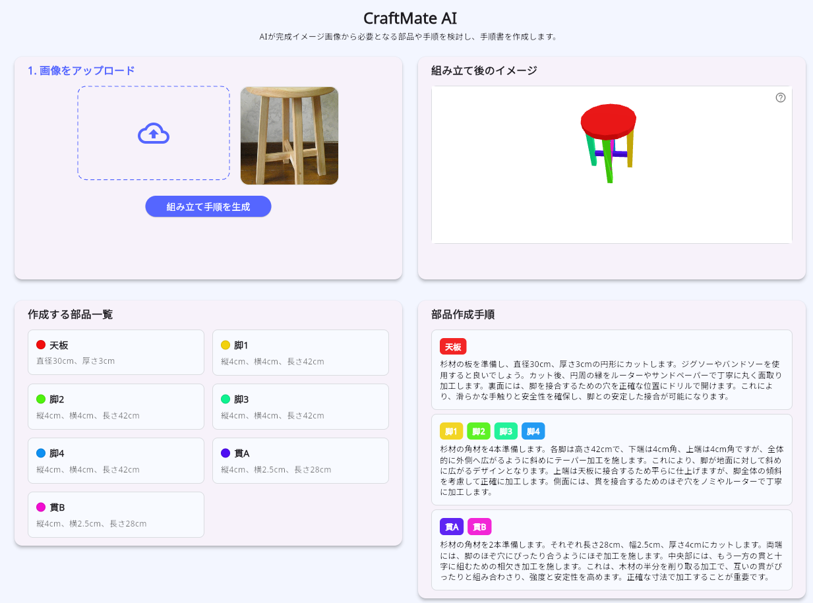
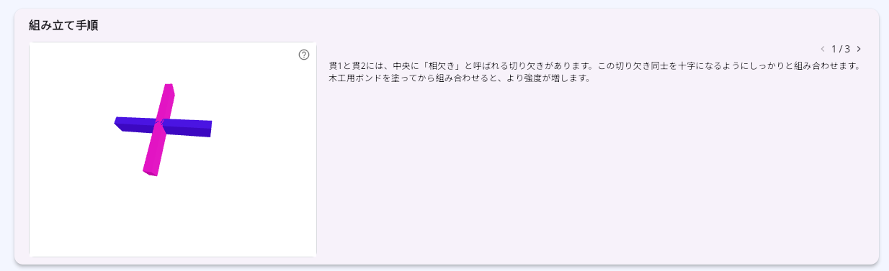
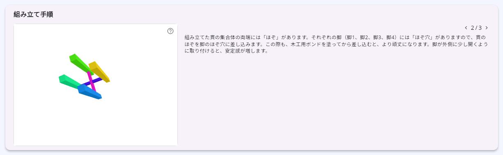
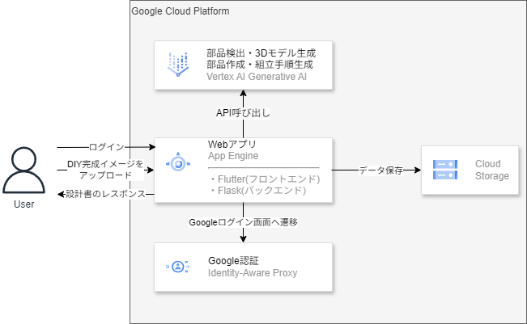
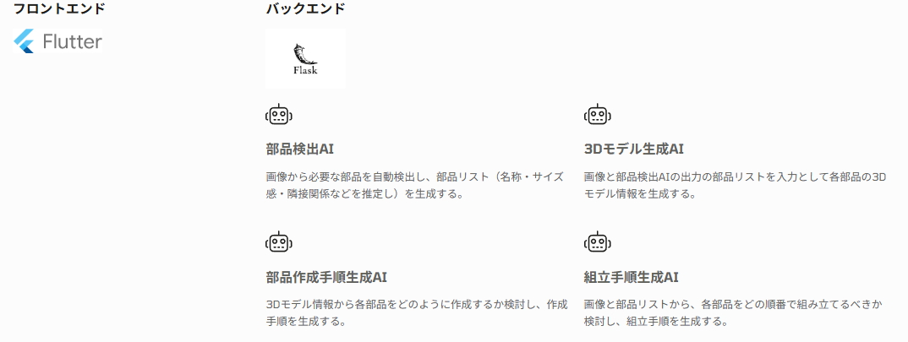

##  はじめに

!

本記事はZenn主催の[第2回 AI Agent Hackathon](https://zenn.dev/hackathons/google-cloud-japan-ai-hackathon-vol2?tab=projects)で作成したAIエージェントについて説明します。

【7/17追記】 🥉Flutter賞をいただきました！

こんにちは！みなさんDIYはされますでしょうか？  
自分のオリジナルの家具を作りたいけど、どうやって作ればいいかわからない。  
DIY初心者でも、手軽にオリジナル家具や小物を作りたい―そんな思いを叶える「CraftMate AI」というアプリを作成しました。  
このアプリでは、完成イメージ画像をアップロードするだけで、必要な部品の検出から3Dモデル生成、作成・組立手順の可視化、設計書PDFのダウンロードまでをワンストップで実現します。

##  デモ動画

<https://www.youtube.com/watch?v=wL1mT7koXMU>

##  対象ユーザー

  * DIY初心者

##  解決したい課題・ソリューション

DIYを新たに始める初心者にとっては多くの課題が立ちはだかります。  
日本DIY協会や調査会社によるアンケート調査によると、特に以下のような悩みが多く挙げられています。

###  課題

####  課題①：情報不足

  * 「どの材料を選べばいいのか」「どんな接着剤を使えば良いか」「作業手順をどこで調べればいいのか」など、DIYに取り掛かるために必要な情報に辿り着けない初心者も多いです。YouTubeやSNSにはDIYの動画や投稿がたくさんありますが、情報の質が玉石混交で、初心者が信頼できる情報を探すのは簡単ではありません。

####  課題②：精度・計画の難しさ

  * DIYでは正確な設計や寸法取りが非常に重要です。例えば棚を作る場合も、きちんとサイズを測り、計画的に材料を切り出さなければ、最終的に部品がうまくはまらなかったり、強度が不足したりします。初心者には「設計図を描く」という作業自体が非常にハードルが高いです。
  * また、企業が販売する家具などとは異なり、詳細な組立手順書などが存在しないので組立時にもどのように組立ればよいかわからないなども起こりがちです。

参考：

<https://www.diy.or.jp/i-information/association/jigyo/transition.html>

<https://www.dreamnews.jp/press/0000309364/>

###  ソリューション

上記の初心者の悩みを解決するために誕生したのが、「CraftMate AI」です。これは、画像認識＆生成AI技術を組み合わせたWebアプリケーションで、AIがDIYの設計を支援します。

「CraftMate AI」は、完成イメージ画像1枚をアップロードするだけで、必要となる部品の検出から3Dモデルの生成、具体的な作成・組立手順、設計書PDFの出力までをワンストップで提供します。

##  アプリの使い方

###  1\. Googleログイン

CraftMate AIのWEBページにアクセスののち、ログインします。  

###  2\. 画像アップロード

自分が作りたい完成イメージをドラッグ＆ドロップでアップロードし、「組立手順を生成」ボタンを押します。  

###  3\. 設計書の表示

多少時間がかかりますが、（全部の処理を合わせて5分程度）アプリ画面に必要となる部品のリスト、完成品の3Dモデル、部品の作成手順、部品の組み立て手順が順次表示されていきます。

####  必要となる部品リスト、完成品の3Dモデル、部品作成手順の表示例

  * 完成品の3Dモデルはマウス操作で拡大縮小・回転など行うことができます。
  * 必要となる部品リストの色と、完成品の3Dモデルの色は対応付けされて描画されていますので、各部品が、どこで利用されているか簡単に確認することができます。
  * また、必要となる各部品の作成手順も確認することができます。  

####  組立手順、設計書のPDF出力

  * 組立手順については「<」、「>」で前後に移動することができ、組立完了時の3Dモデルも合わせて表示することができます。
  * また、「結果をダウンロード」ボタンを押下することで、上記のすべての情報を反映した設計書PDFをダウンロードすることができます。

「次へ」ボタンを押下すると下記が表示されます。  

「ダウンロード」ボタンを押下すると画面に表示されていた情報をPDFとしてまとめ、ダウンロードすることができます。  

##  システム構成

システムのインフラ構成図は下記のようになっています。

流れとしては以下のようになります。

  1. Webアプリへログインする
  2. Googleアカウントのログイン画面へ遷移する。
  3. ユーザーがDIYの完成イメージ画像をアップロードします。
  4. バックエンドは受け取ったリクエストをもとに、以下の各AIエージェント（Vertex AI）を利用しタスクを実行する。 
     1. 部品作成AI
     2. 3Dモデル生成AI
     3. 部品作成手順生成AI
     4. 組立手順生成AI
  5. フロントエンド側はタスクの実行をポーリングで待ち受け、データを取得できた場合、順次設計書の要素となる情報を画面に表示する。

###  利用しているサービス

####  App Engine

本アプリのフロントエンド（Flutter）＆バックエンド（Flask）をApp Engine上で稼働させています。

####  Identity-Aware Proxy

アプリの認証・認可に利用しています。Googleアカウントによるログイン機能を実現し、未認証ユーザーのアクセス制限を行っています。

####  Vertex AI

画像から部品を検出したり、、部品ごとの3Dモデル生成・手順推論など、AI処理全般をVertex AIで実行しています。バックエンドでVertex AIを呼び出し、推論結果を取得しています。

####  CloudStorage

ユーザーがアップロードした画像ファイルや生成された3Dモデルデータ、PDF設計書やその他一時ファイルをCloudStorageに保存します。

###  フロントエンドの処理

  * 技術スタック：Flutter
  * 機能： 
    * ユーザーインターフェースの構築
    * 画像アップロード機能
    * 結果の表示（必要となる部品リスト、3Dモデル、部品作成手順、部品組立手順）
    * 設計書PDFのダウンロード

###  バックエンドの処理

  * 技術スタック：Flask
  * 機能： 
    * AI関連の機能
    * 設計書PDFの作成・ダウンロード機能

####  AI関連の機能

  1. 部品生成AI 
     * 入力された画像からVertex AIのAPIを利用して部品を自動検出し、部品リスト（部品の名称・素材・隣接関係・サイズ感など）を検出します。 
       * 入力 
         * 画像
       * 出力 
         * 部品情報リスト 
           * 部品名
           * 形状（直方体、円柱など）
           * 隣接している他の部品リスト
           * 素材（スチール、杉材など）
           * サイズ
           * 備考
  2. 3Dモデル生成AI 
     * 入力された画像と「1. 部品生成AI」の出力である部品リストをもとに、Vertex AIのAPIを利用して各部品の3Dモデル情報を推定します。 
       * 入力 
         * 画像
         * 部品情報リスト
       * 出力 
         * 3Dモデル情報リスト 
           * パーツ名
           * 頂点の情報
           * 面の情報
  3. 部品作成手順生成AI 
     * 「2. 3Dモデル生成AI」の出力である各部品の3Dモデル情報をもとに、Vertex AIのAPIを利用して各部品をどのように作成するか検討し、作成手順を生成します。 
       * 入力 
         * 部品情報リスト
         * 3Dモデル情報
       * 出力 
         * 部品作成手順リスト
  4. 組立手順生成AI 
     * 入力された画像と「1. 部品生成AI」の出力である部品情報リストをもとに、各部品をどの順番で組み立てるべきか検討し、組立手順を生成します。 
       * 入力 
         * 画像
         * 部品情報リスト
       * 出力 
         * 組立手順リスト

####  設計書PDFの作成・ダウンロード機能

上記の各AIのレスポンス結果をPDFに整形し、ダウンロードすることができます。

##  費用感

各AIの入出力の平均トークン数と掛け合わせ費用感をざっくり計算しました。

処理名 | モデル | 入力料金 ($) | 出力料金 ($) | 合計 ($)  
---|---|---|---|---  
部品検出AI | gemini-2.5-pro | 0.005 | 0.00375 | 0.00875  
3Dモデル生成AI | gemini-2.5-pro | 0.01625 | 0.03375 | 0.05  
部品作成手順生成AI | gemini-2.5-flash-preview-05-20 | 0.0000625 | 0.0001875 | 0.00025  
組立手順生成AI | gemini-2.5-pro | 0.0175 | 0.003 | 0.0205  
  
合計で0.0795＄で、1＄=150円とすると約12円程度のコストになります。

参考：<https://cloud.google.com/vertex-ai/generative-ai/pricing?hl=ja>

##  今後の展望

  * デザイン調整機能 
    * 具体的なサイズやデザインの調整を自然言語で行い、設計書の再生成ができる機能を追加します
  * ラフスケッチ画像の入力 
    * DIY対象物のラフスケッチからも同様に設計書を作成できるように機能を追加します
  * 材料・工具の自動提案 
    * 部品作成に必要な材料や工具を提案する機能の追加します
  * AI改善 
    * 利用者のフィードバックを反映し、AIモデルの精度向上を目指し、継続的に改善します

##  おわりに

今回は[AI Agentのハッカソン](https://zenn.dev/hackathons/google-cloud-japan-ai-hackathon-vol2?tab=rule)が開催されるということをたまたま知り、会社の同期に声をかけ、チームで開発に取り組んでみました。  
このアプリは今後改良を加えたのち一般向けに公開し、皆さんにも是非使ってもらいたいなと思います！
