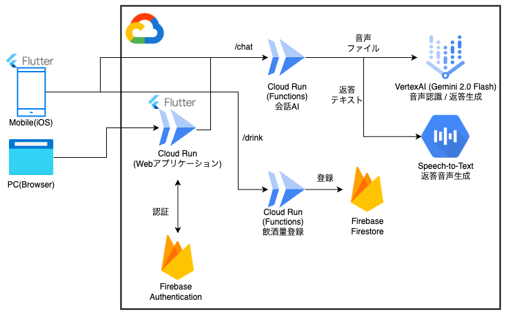

!

本記事は[第2回 AI Agent Hackathon with Google Cloud](https://zenn.dev/hackathons/google-cloud-japan-ai-hackathon-vol2)に関連して、[Cer0un0さん](https://zenn.dev/cer0un0)と共同で制作・投稿したものです。

##  はじめに：飲み過ぎは「個人の責任」だけで解決できるのか？ 🤔

「また飲み過ぎてしまった...」

楽しいお酒の席でついペースを上げてしまい、翌朝後悔した経験は誰にでもあるのではないでしょうか。WHOは「アルコールに安全な量はない」と警告しており[1]、過度な飲酒は健康へのリスクと隣り合わせです。国内でも、2024年に厚生労働省が「健康に配慮した飲酒に関するガイドライン」[2]を公表し、純アルコール量に着目した健康管理の重要性が示されるなど、社会全体の意識が変化しつつあります。

しかし、従来の対策は個人の強い意志に頼るものがほとんどでした。私たちは、この問題の解決策は、テクノロジーが人に寄り添い、「**飲んでいる最中のリアルタイムな介入** 」と「**飲酒後のパーソナライズされた振り返り** 」を組み合わせることにあると考えました。

本稿で紹介する「**AI Bartender Suite (Alco Guardian)** 」は、3体のAIエージェントが協調し、健康的で楽しい飲酒体験をサポートするモバイルアプリケーションです。Zennハッカソン「AI Agent、創造の極みへ」への、私たちの実装に基づいた誠実な回答です。

* * *

##  デモ動画 🎥

<https://youtu.be/rD8SYN4a75c>

* * *

##  プロダクト概要：3体のAIエージェント 🤖

**Alco Guardian** は、それぞれ異なる役割を持つ3体のAIエージェントで構成されています。

  1. **Bartender（バーテンダー）** : あなたの気分や好みに合わせて会話する、気さくなパートナー。音声での対話も可能です。
  2. **Guardian（守護者）** : あなたの飲酒ペースをリアルタイムで分析。純アルコール量を計算し、飲み過ぎを検知するとBartenderに「**Veto（拒否権）** 」を発動します。
  3. **Drinking Coach（飲酒コーチ）** : 現在の飲酒セッションを分析し、パーソナライズされたアドバイスを提供するトレーナー。長期的な飲酒傾向の分析機能も開発中です。

* * *

##  実装したソリューション ✨

**Alco Guardian** の核心は、役割の異なるエージェントの協調です。

  * **リアルタイム介入 (Bartender & Guardian)**: ユーザーが飲んだお酒を記録すると、**Guardian** が純アルコール量を計算。ペースが速いと判断すると、**Bartender** に**Veto** を発動。**Veto** を受け取った**Bartender** は、お酒の提案を控え、お水を勧めるといったように応答を変化させます。
  * **セッション単位の振り返り (Drinking Coach)** : **Drinking Coach** は現在の飲酒セッションのデータを分析し、「素晴らしいペースですね！」といったポジティブなフィードバックや、改善のための具体的なアドバイスをリアルタイムで提供します。

* * *

##  システムアーキテクチャ 🏗️

本システムは、**Flutter** 製モバイルアプリと、**Google Cloud Functions** 上で動作するPythonバックエンドで構成されています。エージェント間の連携には、一部**A2Aメッセージング** の概念を取り入れています。

* * *

##  技術スタックと選定理由 🛠️

レイヤ | 技術 | 選定理由  
---|---|---  
**会話/分析LLM** | **Gemini API** | 高速な応答性能と長いコンテキスト長により、**Bartender** の自然な会話と**Drinking Coach** の詳細な分析の両方を実現できました。  
**音声合成** | **Google Cloud TTS** | 人間らしい自然な音声で、**Bartender** との対話体験を向上させるために採用しました。  
**バックエンド** | **Cloud Functions (gen2)** | リアルタイム性が求められる**Bartender** /**Guardian** 機能と、**Drinking Coach** によるセッション分析機能を、Pythonで統一して開発できるサーバーレス環境として最適でした。  
**データベース** | **Firestore** | 飲酒セッションのデータを柔軟なスキーマで記録し、**Drinking Coach** が容易に分析できるデータストアとして採用しました。  
**フロントエンド** | **Flutter** | 表現力豊かなUIを迅速に構築できる点を評価しました。  
  
* * *

##  開発で工夫した点 💡

###  1\. エージェント間の連携（Veto機能）

**Guardian** が**Bartender** の提案を「拒否」する**Veto機能** は、本プロジェクトの核です。**Guardian** が**Veto** を発動すると、**Bartender** は自身の振る舞いを変え、お酒の提案を控えるようになります。このエージェント間の協調動作を実現するため、**A2A(Agent-to-Agent)メッセージング** のコンセプトを導入しました。現在はエージェントが直接互いの状態を参照する形で実装していますが、将来的には独立したメッセージブローカーを介した連携を目指しています。
    
    
    # functions/agents/bartender_agent.py
    # GuardianからのVetoメッセージを処理し、自身のコンテキストを更新する
    async def _handle_guardian_veto(self, message: Dict):
        self.context["guardian_warnings"].append({
            "timestamp": message["timestamp"],
            "message": message["payload"]["reason"],
            "severity": message["payload"]["severity"]
        })
        logging.info(f"Guardian veto received: {message['payload']['reason']}")
    

###  2\. FlutterによるチャットUI 💬

ユーザーとの対話のインターフェースとして、基本的なチャットUIを実装しました。エージェントからの返信であることが視覚的にわかるように、アイコンを表示するなどの工夫を行いました。
    
    
    // mobile/lib/screens/bartender_chat_screen.dart
    // チャットバブルを生成するWidget
    Widget _buildMessageBubble(ChatMessage message) {
      return Padding(
        padding: const EdgeInsets.symmetric(horizontal: 8.0, vertical: 4.0),
        child: Row(
          mainAxisAlignment:
              message.isUser ? MainAxisAlignment.end : MainAxisAlignment.start,
          children: [
            if (!message.isUser)
              Padding(
                padding: const EdgeInsets.only(right: 8.0),
                child: CircleAvatar(child: Icon(Icons.local_bar)),
              ),
            Flexible(
              child: Container(
                padding: const EdgeInsets.all(12.0),
                decoration: BoxDecoration(
                  color: message.isUser
                          ? Theme.of(context).primaryColor
                          : Colors.grey.shade200,
                  borderRadius: BorderRadius.circular(16.0),
                ),
                child: Text(message.text, ...),
              ),
            ),
          ],
        ),
      );
    }
    

* * *

##  今後の展望 🚀

今回のハッカソンでは、エージェント協調のコアコンセプトを実装しました。今後は、今回の実装を土台に、以下のような機能拡張を目指しています。

  * **週次レポート機能の実装** : **Drinking Coach** が1週間の飲酒データを分析し、週末にレポートを届ける機能を実装する。
  * **リアルタイムUI更新** : 現在のHTTPリクエストベースの通信から、**Firestore** のリアルタイムリスナーを用いた方式に変更し、**Guardian** からの警告などを即座にUIに反映させる。
  * **BAC（血中アルコール濃度）の推定** : より精度の高い健康アドバイスを提供するため、体重などの個人データを考慮したBACの推定機能を実装する。
  * **高度な代替案提案** : **Bartender** が、ユーザーの過去の注文履歴やその時の気分を考慮し、「こんなノンアルコールカクテルはいかがですか？」といった、より具体的で魅力的な代替案を提案する機能。
  * **ゲーミフィケーション** : 「休肝日ボーナス」や「適正ペースチャレンジ」など、ゲーム感覚で楽しく健康的な飲酒習慣が身につく機能を導入する。

* * *

##  おわりに 🙏

「AIの力で、人々をより健康に、より幸せにできないか？」という問いから始まったこのプロジェクト。限られた時間の中で、3体のエージェントが協調するシステムのプロトタイプを実装できたのは、**Google Cloud** の強力なサービス群、特に**Gemini API** のおかげです。

この記事が、私たちの挑戦の誠実な記録として、そしてAIエージェント開発の面白さの一端を示すものとなれば幸いです。

最後に、このような素晴らしい機会を提供してくださった**Zenn** と**Google Cloud** の運営チームに心から感謝申し上げます。

脚注

  1. [「アルコールに安全な量はない」とWHO（世界保健機関）が警告する理由](https://www.runnersworld.com/health-injuries/a42912699/alcohol-and-cancer/) ↩︎

  2. [健康に配慮した飲酒に関するガイドライン](https://www.mhlw.go.jp/stf/newpage_38541.html) ↩︎

