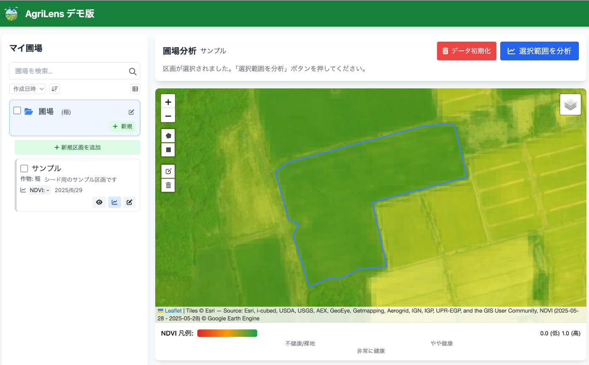
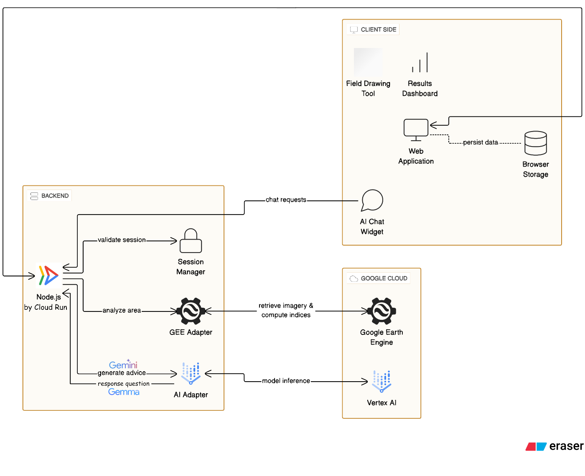

#  AgriLens - 農地AIエージェントでベテランの勘をあなたにも

Zennハッカソン応募作品です。AgriLensという農地の衛星データを参照するAIエージェントを用いて農地分析できるものを作りました。

##  はじめに

家庭菜園を始めたきっかけは日常で食について意識することが増えたからですが、その中で食料安全保障に関する本などを読んだりました。  
なんと2000年から現在まで**農業従事者の人数は240万人から120万人を切っており平均年齢は70歳を超えている** そうです。

そして家庭菜園を始めて気づいたことがあります。「今、水やりすべき？」「肥料のタイミングはいつ？」といった基本的な判断が、意外と難しいということです。

ベテランの農家さんなら経験と勘で分かることも、初心者には手探りの連続。そんな時、「もし専門家が常に隣にいて、データを見ながら的確にアドバイスしてくれたら便利だな」と思ったのがアイデアのきっかけでした。

食料不足は生きている間に十分に起こり得るかもしれませんがその一方で新規就農する人が農業で一発当てる夢を見て参入できるほどまだ十分に整備はされていないようです。

今回、たまたまZennのAI Agentハッカソンの機会があり、社会課題レベルで問題解決するならどうしようと考えた際に、「農地専門のAIエージェント」というアイデアを思いつきました。

**AgriLens** は、Google CloudのVertex AI技術とGoogle Earth Engineの衛星データを組み合わせて作った、農地専門AIエージェントを搭載した圃場分析システムです。

##  デモ動画

<https://youtu.be/XBkav1HUccA>

##  解決したかった課題

###  農業初心者が直面する判断の難しさ

新規就農を始めた時に感じる、こんな悩みを解決することを想定して作りました：

  1. **「いつ、何を、どれだけ」が分からない**

     * 水やりのタイミングがつかめない
     * 肥料をあげるべきか迷う
     * 作物の健康状態が見た目だけでは判断できない
  2. **客観的な判断基準が欲しい**

     * 「なんとなく」ではなく、データに基づいて判断したい
     * ベテランの経験や勘を、初心者でも活用できないか
     * 失敗を減らしたい
  3. **既存システムは敷居が高い**

     * 専用機材が高額で手が出ない
     * 操作が複雑で専門知識が必要
     * 小規模な畑には大袈裟すぎる

###  衛星データ活用の実績

衛星データを活用した農業支援には、すでに驚くべき成功事例があります：

  * **収穫量2倍** ：北海道十勝の玉ねぎ圃場で、衛星データに基づく水管理により実現
  * **労働時間50%削減** ：小麦の穂水分計測作業の効率化
  * **品質向上率2倍以上** ：山口県の小麦農家で品質基準達成率が25%→56%に向上

これらの成果は、衛星データの有効性を証明していますが、問題は**専門知識なしには活用できない** ことでした。

##  想定利用者

###  1\. 新規就農者

  * 農業経験が浅く、作物の状態判断に不安を抱える方
  * データに基づく客観的な判断を求める方
  * ITリテラシーがあり、テクノロジーを活用したい方

###  2\. 兼業農家

  * 限られた時間で効率的に農地管理をしたい方
  * 週末だけの農作業でも高品質な作物を育てたい方
  * 遠隔での農地モニタリングを必要とする方

###  3\. 小規模農家

  * 高額な精密農業システムを導入できない方
  * シンプルで使いやすいツールを求める方
  * 収穫量と品質の向上を目指す方

##  システムアーキテクチャ

###  技術スタック

シンプルな構成にしました。Claude Codeなどを活用する際にシンプルなほど実装がスムーズにいくかためです。

####  フロントエンド

  * **Pure JavaScript/HTML5/CSS3** ：フレームワークレスで軽量なWebアプリケーション
  * **Leaflet.js** ：オープンソースの地図ライブラリ
  * **LocalStorage** ：クライアントサイドデータ永続化

####  バックエンド（Node.js + Express.js）

  * **Express.js** ：軽量なWebアプリケーションフレームワーク

####  Google Cloud連携

  * **Vertex AI SDK** ：`@google-cloud/vertexai` v1.0.0
  * **Google Earth Engine** ：`@google/earthengine` v0.1.419

###  データ処理フロー

  1. **衛星データ取得（実際の実装）**
         
         // Google Earth Engineサーバーサイド処理
         async function fetchGEEAnalysis(aoiGeoJSON) {
             const response = await fetch('/api/analyze', {
                 method: 'POST',
                 headers: { 'Content-Type': 'application/json' },
                 body: JSON.stringify({ aoiGeoJSON: geometryData })
             });
             return await response.json();
         }
         

  2. **植生指標計算（vegetation-indices.js）**
         
         // NDVI（植生活力度）の計算
         function calculateNDVI(image) {
             return image.normalizedDifference(['B8', 'B4']).rename('NDVI');
         }
         
         // NDMI（水分ストレス）の計算
         function calculateNDMI(image) {
             return image.normalizedDifference(['B8', 'B11']).rename('NDMI');
         }
         
         // NDRE（葉緑素量）の計算
         function calculateNDRE(image) {
             return image.normalizedDifference(['B8', 'B5']).rename('NDRE');
         }
         

  3. **AI分析プロンプト生成**
         
         // gemini-api.jsからのプロンプト(例)
         const templateString = `あなたは専門の農業アドバイザーです。以下の圃場の衛星画像分析データに基づいて、農家向けの包括的なアドバイスを日本語で、必ず下記のJSON形式で提供してください。
         
         JSONスキーマ:
         {
           "重要な知見のまとめ": "分析結果の最も重要なポイント",
           "詳細な評価": {
             "NDVI": {"value": 0.61, "text": "植生活力の評価..."},
             "NDMI": {"value": 0.27, "text": "水分ストレスの評価..."},
             "NDRE": {"value": 0.41, "text": "栄養状態の評価..."}
           },
           "具体的な対策": ["推奨される具体的な行動ステップ"],
           "今後の管理ポイント": ["長期的な管理や注意点"]
         }
         
         分析データ:
         圃場名: ${fieldData.name}
         NDVI (植生活力指数): ${analysisData.ndvi}
         NDMI (水分ストレス指数): ${analysisData.ndmi}
         NDRE (葉緑素量指数): ${analysisData.ndre}`;
         

##  今後やってみたいこと

###  近いうちに（時間があるときに）

  1. **作物別のアドバイス** ：野菜の種類に応じたより具体的な提案
  2. **過去データとの比較** ：「去年の同じ時期と比べてどう？」が分かる機能
  3. **UI改善** ：使いにくい部分の修正（特にスマホ対応）

###  いつかできればいいな（余裕があれば）

  1. **詳細マップ** ：圃場の中でも場所によって違いが見える
  2. **データの保存** ：分析結果を記録として残せる機能
  3. **簡単な共有** ：家族や仲間と結果を共有できる機能

###  技術的に面白そうだけど実現は未定

  1. **ベテランさんの知識を学習** ：地域の農家さんのノウハウをAIが覚える
  2. **常に対象作物に対する最先端の情報に基づいて回答** ：農地に対して最適な研究や現場に役立つ最先端の情報を提供する
  3. **IoT連携** ：センサーと連携して自動で何かできる

##  期待している効果

農地専門AIエージェントとの協働で期待している効果は、こんな感じです：

###  1\. 農業エージェントによる専門的サポート

  * AIエージェントが自律的にデータを分析し、適切なタイミングを判断
  * 「なんとなく」ではなく、エージェントの専門知識に基づいた管理もできる
  * 失敗のリスクを減らして、エージェントと一緒に安心して農作業に取り組める

###  2\. いつでもアクセス可能なエージェント

  * 特別な機材や専門知識は不要で、ブラウザからエージェントに相談可能
  * 24時間いつでもどこでも農業エージェントにアクセスできる
  * 複雑な操作を覚える必要がなく、自然な対話でエージェントとやり取り

###  3\. エージェントとの継続的な協働

  * データが蓄積されることで、エージェントがより良い判断を提供
  * 毎年の比較をエージェントが分析し、成長をサポート
  * エージェントとの小さな改善の積み重ねで、作物の品質向上につながる

##  まとめ

AgriLensは、家庭菜園での個人的な困りごとからアイデアを発展させてみたプロジェクトです。いきなり農業なんて飛躍しすぎでは？という自問もありましたが禅寺に泊まった中で日本の食について考える機会がありました。そこから食料安全保障の観点から危機的な状況であることを知り門外漢ながら自分なりにこんなのはどうかな？と提案してみました。
