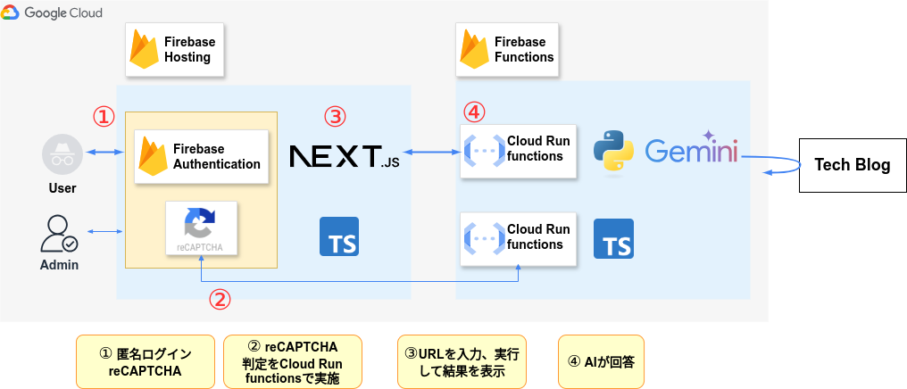

##  概要

  * 本記事はZenn主催の `第2回 AI Agent Hackathon with Google Cloud` 参加ブログです
  * Gemini AIを使って、技術ブログのタイポを教えてくれるアプリを作成しました

##  アプリのURL

<https://minaos.web.app/>

##  デモ動画

<https://youtu.be/U1dVMGJBDqY>

##  参加者

  * @shimo_s3 
    * ITエンジニアです。
    * AWS、Python、ChatGPTをよく使っています

##  課題と解決方法

  * 対象とするユーザー像：技術ブログを書く人
  * 課題：誤りがあったり、情報が古くなる
  * 解決方法：人間がやり辛いところはAIにやってもらう

みなさん技術ブログ、書いていますか？技術ブログって正しさを維持するのが大変ではないでしょうか。自分の間違いは見つけにくいし、人の間違いを指摘するのもかんたんではありません。

間違いにもいろいろありますし、間違いを指摘したい人したくない人、されたい人されたくない人など様々な状況があると思います。そのような校正作業をAIにやってもらって、連絡もAIがいい感じにやってくれれば角も立たず良いのではないかと考えます。

という大きな夢(？)はあるのですが、今回はもっとシンプルに、AIにタイポを探してもらうアプリを作ってみました。

(ちなみに、今回の対象は技術ブログだけにしていますが、理想オブ理想としては全世界のドキュメントでやれたら最高ですね。)

##  アーキテクチャ

####  補足

  * AdminはEmail/Passwordのログインを使って操作する
  * ログはCloud Loggingで取得
  * ログ解析はBigQueryが使える(やっていない)

##  使い方

シンプルです。

  * reCAPTCHAをチェックして、匿名でログインする
  * URLを入力して実行する

##  技術スタック

今回利用した技術の説明です。

項目 | 使った技術  
---|---  
認証 | reCAPTCHA、Firebase Authentication  
フロントエンド | Firebase Hosting、Next.js、TypeScript  
バックエンド | Firebase Functions、Python、Vertex AI (Gemini API)  
CI/CD | GitHub Actions  
  
###  認証

  * reCAPTCHA
  * Firebase Authentication

####  やっていること

ユーザーがアクセスすると、reCAPTCHAの認証が求められ、その上で匿名ログインします。

####  選定理由

Webアプリを作る上で、サービスのアクセス制限(EDoSなどの回避)は気になるところです。今回は、ユーザー認証としてreCAPTCHAと匿名ログインを使いました。

Firebaseの匿名ログイン機能は手軽に使えました。ユニークユーザーとして記録されますが、それが誰かは管理者も知ることができません。ユーザーから見ても、メールアドレスを登録しなくてよく、手軽に試せて良いのではないでしょうか。

###  フロントエンド

  * Firebase Hosting 14.5.0
  * Next.js v13.5.11
  * TypeScript 5.0.4
  * Tailwind CSS v4.1.8

####  やっていること

画面を表示します。特に、ログイン状態を確認してダッシュボードページできるようにしています。

####  選定理由

モダンなものを使ってみたかったということで選びました。Tailwind CSSは最新のv4を選びましたが、ChatGPTも知らないことが多かったのであまり教えてもらえず少しハマりました。

###  バックエンド

  * Firebase Functions 14.5.0
  * Python 3.13
  * TypeScript 5.0.4
  * Vertex AI (Gemini API) 2.5 Flash

####  選定理由

Firebase Functionsで関数を管理すると非常にかんたんでした。  
今回はCloud Run functionsが2つあって、Gemini呼び出しでPython、reCAPTCHA用にTypeScriptのものがあります。  
Geminiの部分は慣れているPythonを使ったのですが、Firebase FunctionsのPythonは公式情報も追いついていないようなときもありました。

####  やっていること

  * Functions その1 Python：

    * ブログURLにアクセスして内容を取ってくる
    * Vertex AI (Gemini API) で内容を判定する
  * Functions その2 TypeScript：reCAPTCHAのtokenをGoogle Cloud側と突き合わせて確認する

####  対象になっているもの

ブログというよりは、htmlの<article>タグの中を見ているので、それがあれば判定されるようにはなっています。  
AIにとっても「技術ブログとは」

###  その他

  * CI/CDはHosting側はGitHub Actionsを利用。Hostingに関してはデプロイもGitHub Actionsで実行 
    * Functions側は複雑になったので手動デプロイとしました
  * Notionで機能部分のネタをまとめて形になってきたらGitHubチケット化、GitHub Projectsでチケットを管理
  * お絵描き：drawio
  * 動画作成：Canva
  * 動画の音声作成：Google CloudのText to Speech (`ja-JP-Chirp3-HD-Umbriel`) 
    * 微調整(SSML)はできないが、かんたんに作れたので良かった

##  生成プロンプト

  * 内部でtxtで保存してあり、都度Geminiに渡しています
  * Geminiは英語で考えているので英語でプロンプトを出していますが、"英語の頭"で日本語のブログを確認させるのが難しいです。最初はいろいろ細かく条件を出していましたが、「Do not ... 」のようなdeny系の命令を沢山つけることにしました
  * 単純な誤字を探してほしいのだが、別のところを見つけてくるので困りました。(英語とカナを誤字だと言ってくるなど。fileとファイルなど)

###  Gemini 2.0と2.5

モデル | 応答の質 | 応答の速さ | 感想  
---|---|---|---  
Gemini 2.0 Flash | ★1 | ★3（数秒〜） | 早いが、今回の用途としてはあまり使えない  
Gemini 2.5 Flash | ★2 | ★2（30秒〜） | そこそこ期待通りの結果だが、時間がかかる  
  
Gemini 2.0 Flashでは正解を出せるようなプロンプトは作れませんでした。JavaScriptのような固有名詞も間違いと指摘するとか、正しく書いてあるのに間違いを捏造したりするなど、使い道としては全く合っていないな、というものでした。

Gemini 2.5 Flash は、期待通りの結果を返してくれることがしばしばありました(ただし、完全ではない)。Firebaseから実行すると時間がかかるのですが、ローカル実行だと10秒程度なのでもう少し改善の余地があるのかもしれません。

###  thinkingモデルでGeminiが考えていることを見る

thinkingモデルを使って、thoughts(内部的な検討プロセス)を出力して見ながらの調整もやってみました。しかし「同じタスクに対してもthoughtsが毎回違う」「考えと結果が必ずしも結びつかない(=考えた通りに動いているとは思えない)」ということであまり期待通りにはできませんでした。

###  タスクの最適化

今回はあまり試せませんでした。良い指示を出せるように人間がトレーニングしないといけませんね。

  * 良い指示 = AIがあまり考えなくても質の高い結果が出る 
    * 早くなる
    * 消費トークンが減る

####  Geminiに与えているタスクはこんな感じです

ここをクリック
    
    
    Task:
    - Find misspellings and return results following the Format. Answer ONLY when you are confident.
    - If the content is not focused on IT technologies return "Code 999 No Tech".
    - If there are no findings, return "Code 999 No Tenaoshi".
    - Ignore inconsistent usage of long vowel marks (ー) in the same Japanese katakana words.
    - Ignore kanji variation
    - Do not consider case sensitivity in English.
    - Do not consider the positions of punctuation marks "。" and "、" in Japanese.
    - Do not compare English words and Japanese katakana.
    - Do not check spacing between numbers/words.
    - Do not check for missing spaces.
    - Do not check the published date.
    
    Format:
    [["1st_before", "1st_after"],...]
    
    IMPORTANT:
    Never return results where the before and after values are identical.
    Each output phrase must include at most 10 surrounding characters to ensure clarity.
    

##  まとめと感想

  * アプリをゼロから全て作るのは初めてだったので、動くアプリがともかく完成できたので良かったです。あまり触ったことが無かったGoogle CloudやNext.jsを使うことができ、良い経験になりました。Firebaseは思いのほか便利なのだなと思いました。
  * もっと改良できそうな気もしています。他にも作ってみたいものが他にもいろいろとあるのでこれからも作っていきたいものです。
  * 反省点：
  * もっと早く回答だせるようなプロンプトなどがあったかもしれません。 
    * フロントエンド部分に時間がかかり、生成AI部分の作り込みに時間があまり割けなかったこと。
    * 時間があると思ったら途中で余裕がなくなったこと

##  Appendix: コスト

  * Gemini APIの無料枠を使っています(レート制限などはあり)

  * 課金した場合・・・Gemini 2.5 Flashで、1回実行で約1円

    * 表は、今回の使用が課金だった場合の[Gemini APIのコスト](https://ai.google.dev/gemini-api/docs/pricing)の試算です。Outputの料金は大部分がthoughts(内部的な検討プロセス)で使われています。

モデル | InOut | 料金($) 1M token | 今回token概算 | 1回料金 ($) | 1回料金 (円)  
---|---|---|---|---|---  
Gemini 2.5 Flash | Input | 0.3 | 1000 | 0.0003 | 0.045  
〃 | Output | 2.5 | 2500 | 0.00625 | 0.9375  
Gemini 2.0 Flash | Input | 0.1 | 1000 | 0.0001 | 0.015  
〃 | Output | 0.4 | 2500 | 0.001 | 0.15  
  
<https://ai.google.dev/gemini-api/docs>
