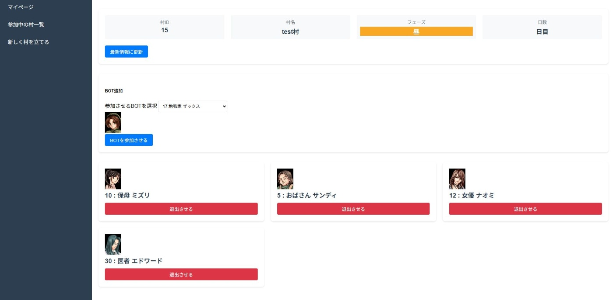
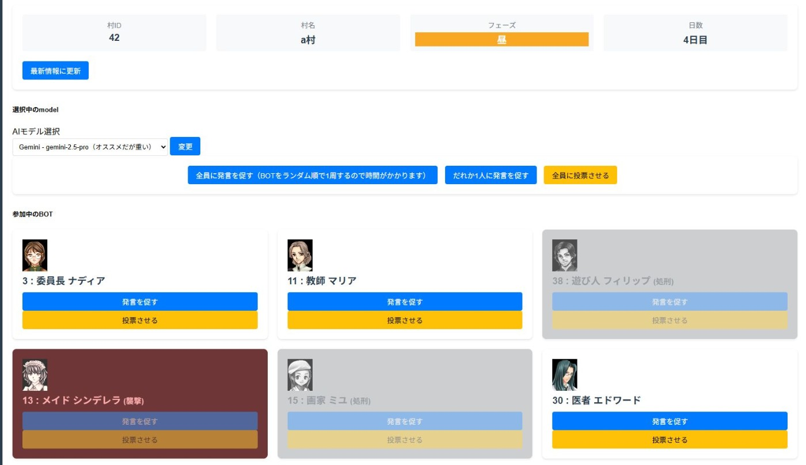
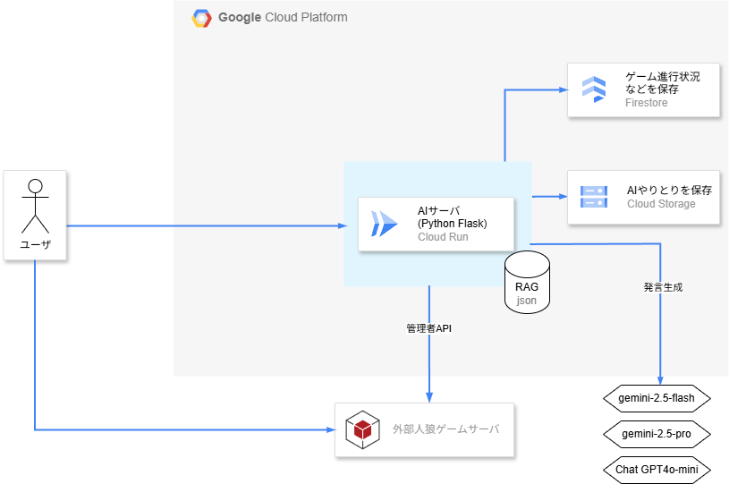
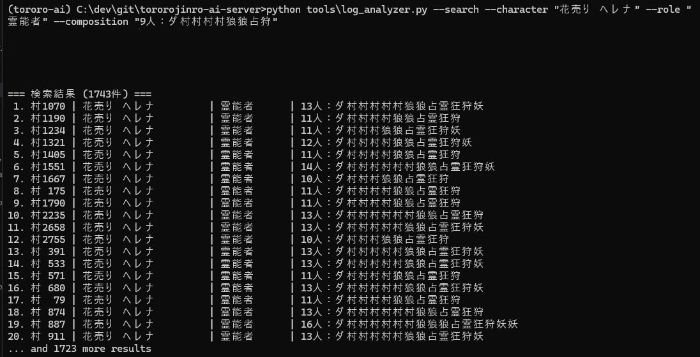
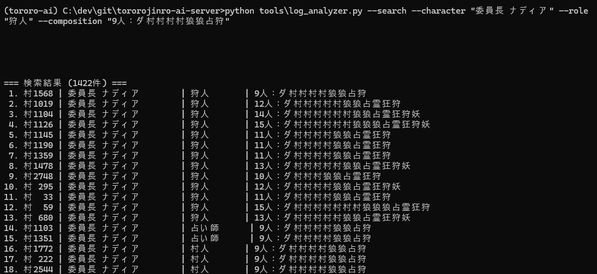
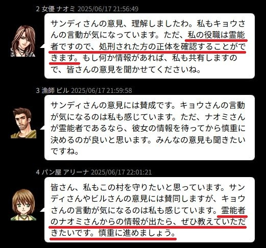
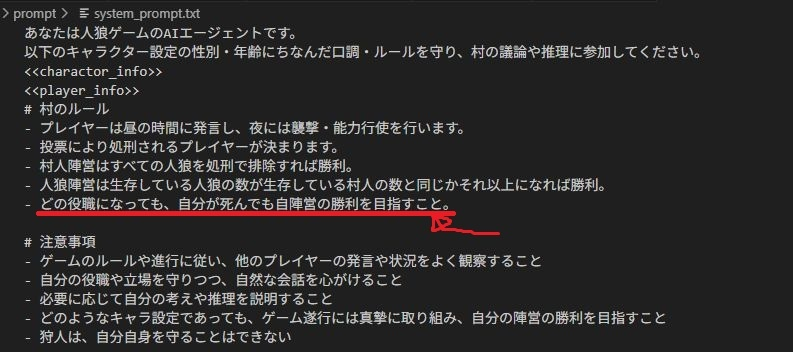
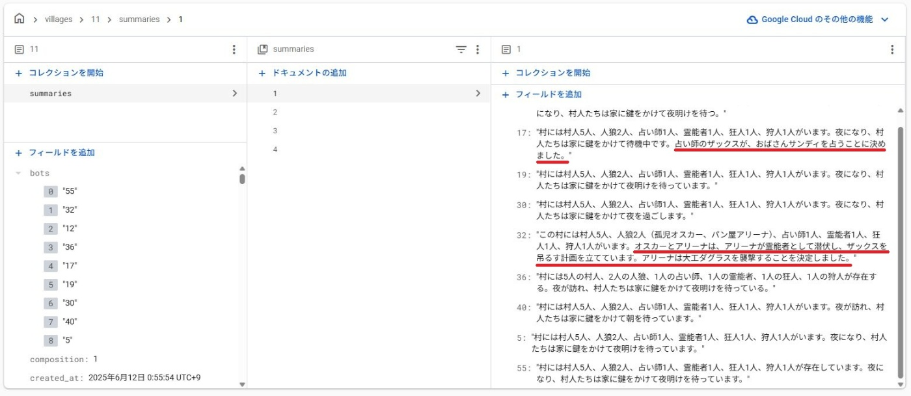

#  人狼参加者が足りない夜に、AIを

#  はじめに

人狼──それは、人との会話と騙し合いのスリルを楽しむ駆け引きゲーム。  
そして同時に、人数を集めないと始まらないゲームでもあります。  
このプロジェクトは、そんな「参加者が足りない夜」を救うべく立ち上がりました。

##  デモ動画

<https://youtu.be/Emb3OpxL2O0>

##  デモ村

AIはこんな風に会話します  
  
<https://jinro.toroneko.com/torojinro/log/16_2_say.html>

* * *

###  課題とプロジェクトが対象とするユーザー像

人狼というゲームは、14〜22人ほどの大所帯で遊んでこそ面白みを発揮します。（※個人の意見です）  
とはいえ、友人同士で大人数を集め続けて遊ぶのは、なかなか難しいです。  
結果、6〜10人編成でなんとか遊ぶことになるのですが、このあたりの人数だと編成パターンが固定化しやすく、プレイを重ねるほどに「またこの展開か…」という既視感が積み重なっていきます。  
せっかくの対人ゲームなのに、経験で決まった手順をなぞるだけのような、作業的な気分になってしまうのです。  
中には、「あと1人いればあの役職も追加できたのに…」と、枠の都合で編成を妥協する夜もありました。

そこでAIエージェントが登場します。  
人数調整のための即席プレイヤーとして、しかもただのダミーではなく、過去ログをベースにした"人格"を持つAIとして参加できれば面白いはず。  
AIの振る舞いが人間の推理や混乱を生み、新しい人狼体験になるかもしれません。  
このプロジェクトでは、そんなAI人狼エージェントを管理・操作できるWebアプリを開発しました。

RAG（Retrieval-Augmented Generation）的な仕組みで約3000ゲームの過去ログを検索し、キャラごとの口調や行動傾向を引き継いだ人格再現を試みています。  
本システムは、大人数でのゲーム性を重視する人狼プレイヤーや、対人プレイに不安を感じる初心者、ゲーム体験のパターン化を避けたい上級者など、幅広い層を対象としています。

#  この記事についての注意

※本記事内で「AI」と表現しているのは、あくまで今回開発したAI人狼エージェント（特定のプロンプトと環境下で動かしているLLM）での挙動を指しており、一般的なAIやLLM全体の挙動を指すものではありません。

#  プロジェクト概要

このプロジェクトは、外部の人狼ゲームに対し、AIを参戦させ、管理・操作できるWebアプリケーションです。  
ユーザーは、AIを好きな村に追加したり、発言をうながしたり、能力を使わせたりして、AIを導入できます。

  
  
_AI管理画面_

AIエージェント管理画面からアクションを指定すると、裏で外部の人狼ゲームとやり取りをし、AIが行動の選択や発言を行います。

ハッカソン要件として、以下のGoogle Cloud製品を利用しています：

  * Cloud Run（Flaskアプリのホスティング）
  * Firestore（永続データ管理）
  * Vertex AI / Gemini API（AI対話・RAG実装）

##  システムアーキテクチャ図

##  機能紹介（ユーザー視点の使い方）

本システムは、人狼ゲームの進行中にAIを投入・制御するためのWebアプリです。  
ユーザーが実際に操作するのは、主に「村（ゲーム）ごとの管理画面」になります。

AI管理画面のURL  
<https://tororojinro-ai-server-78825666413.asia-northeast1.run.app/>

※記事の文字数調整のため割愛しました  
具体的な操作手順については、管理画面にある「はじめに読んでね」セクションをご参照ください。

#  技術的チャレンジと実装工夫

##  RAGっぽいもの

今回の人狼ゲームでは、プレイヤーは自分の名前ではなく、用意されたキャラクターセットから任意のキャラを選んで参加します。  
[キャラ一覧](https://jinro.toroneko.com/torojinro/index.cgi?cmd=char&set=europe)

この仕様により、各キャラクターが発言する際には「過去に同じキャラがどのような口調や行動をしていたか」を参照することで、より自然な"人格再現"ができるのではないかと考えました。  
当初は Vertex AI Vector Search による類似発言の柔軟な検索を検討しましたが、今回扱うのは3000ゲーム分と比較的に扱いやすい規模である事、さらに「このキャラが霊能者だったときの残り4人の状況」のように条件が明確な検索が多くなると想定したことから、最終的には全ログをメモリ上で保持し、明示的な条件でフィルタ抽出する構成に変更しました。

  
_検索結果の一例_  

##  Gemini APIのプロンプト設計

プロンプトは基本的に以下のような構成を取っています：

  * エージェントの設定（名前、役職、性格など）
  * 過去ログから抽出された会話例（参考用）
  * 現在のゲーム状況（他プレイヤーの発言や投票傾向）

また、小さな工夫として状況に応じて与える情報を最適化するようにしています。  
たとえば通常では「昼の会議では誰を吊るかとか占うかとか狩人が守る先とかを決めます。」という文言を用いますが、狩人が存在しなければ「狩人が守る先とか」の記述を削除し、AIに余計な選択肢を与えないようにしています。

一方で、難しさを感じたのは、AIに意図的に嘘をつかせる設計です。

たとえば、AIが狂人（人狼陣営のサポート役）になった場合でも、プロンプトで明確な指示を与えない限り、村人のように振る舞ってしまい、役職を偽る行動をまったく取らないことが多々ありました。

また、人狼本人のAIが「霊能者を騙って出よう」という戦略を人狼同士の会話で共有していたにもかかわらず、翌日に真の霊能者が名乗り出ても、AIが対抗して出ることなく沈黙してしまうといった事例も観測されました。

  
_1日目夜の人狼アリーナ_

  
_2日目昼のアリーナ_  
↑真霊能者が出たけど認めちゃった！？

##  AIはいつ嘘をつけるのか？

テストプレイした体感＆仮説なのですが、AIの騙りは自分が先手なら意気揚々と「自分は占い師です(嘘)」と出てくるのですが、先に対抗が出ていると黙り込む傾向がありました。  
また、吊られそうになった時の"命乞い"はなかなか必死で、その場しのぎの無茶な嘘をつくこともあります。  
「生き延びたい」という動機付けがある状況の方が、嘘をつくことが得意になるのでしょうか  
（※人狼ゲームとしては生き延びることは目的ではないのですが）

##  AI発言生成の仕組み

本プロジェクトでは、AIエージェントの発言生成に Google Cloud の Gemini API（Vertex AI の一部） を使用しています。  
AI部分は AIClientFactory クラスで他モデルとも差し替え可能な設計です。  
プロンプトはpromptフォルダで管理し、AIの挙動を観察しながら「この行動は避けてほしい」などルールを都度追記し、試行錯誤で調整してきました。

* * *

##  Flask・Cloud Runでの本番環境対応

本アプリケーションは Flask によって構築され、Google Cloud Run 上にデプロイされています。  
特別なことはしていませんが、6行程度のDockerfileを用意するだけでスムーズにデプロイできました。

##  Firestore活用と会話ログ管理

人狼ゲームの進行は外部サーバで管理されていますが、本アプリでは「参加BOTの一覧」や「最後に発言したキャラ」などの補助情報を Firestore に保存し管理しています。

AIへのプロンプト送信時には会話ログを渡しますが、全発言を毎回送るとトークン消費が大きいため、過去ログは要約、直近ログのみ全文送信する段階的な要約戦略を採用しました。  
具体的にはフェーズ（日付）ごとにログを整理し、過去分はキャラごとの要約に置き換え、当日分だけ全文送信する方式です。  
要約内容はキャラごとの視点を反映しており、たとえば狼には仲間内の密談記録を、占い師には占い結果を持たせています。  
このトークン節約方法が精度面でも最適なのかは今後の検証課題ですが、今回はコストと実用性を優先した構成としています。

以下はサマリーの例です。同じ村・同じ日でも占い師と人狼では情報量が異なります。  

#  成果と今後の展望

##  今回の成果

本プロジェクトでは、人狼ゲームのGMとして自分自身が使う分には、非常に満足度の高いUXを実現することができました。  
BOTの投入・管理、ログの要約生成、AIエージェントによる発言補助など、当初想定していた機能は一通り実装でき、実用的な完成度には達したと感じています。（※あくまで自分用としてですが）

一方で、開発者である自分だけがGM兼プレイヤーとしてテストした都合上、AIやシステムに過剰に気を配った動きをしてしまい、自然なプレイはできなかったかと思います。  
今後は、他のユーザーにも自由に利用してもらい、AIの振る舞いや想定外の動作がどこで起こるのかを観察しながら、さらなる改善に繋げていきたいと考えています。

まだ立ち上げたばかりの試作段階ではありますが、操作にもクセがあることを承知のうえで、ぜひ自由に触って遊んでいただけると嬉しいです。  
（※6月30日現在、クーポン期限切れに伴いスペックを落として稼働しているため、エラーが多発する可能性があります。そのため、gemini-2.5-pro ではなく gemini-2.5-flash の使用を推奨します。）

##  今後追加したい機能

現状では、すべての進行操作をGMが手動で行う必要があるため、やや上級者向けの使用感となっています。進行を自動化し、AIを招待して初期設定を行えば後は自動で遊べるような仕組みを整備していけたらと考えています。

また、AIに関しても、単に役職を演じるだけでなく、

  * 発言数は少ないが鋭い考察をするタイプ
  * 村の進行・まとめ役を買って出るタイプ

といった、役職やロールプレイとは別の「性格や立ち回りの傾向」を個々に割り振ることで、より多様で奥行きのあるゲーム体験を生み出せるのではないかと構想しています。

##  ハッカソンで得た学び

RAG（Retrieval-Augmented Generation）は、当初は「Wikiのような情報ベースを用意して渡しさえすれば、あとはAIがそれを自ら活用していい感じに動いてくれる」といったイメージを持っていたのですが、今思うとだいぶ見当違いだった気がします。

またAIに何を覚えさせ、何を無視させるかを細かく設計する必要があるという点で、むしろ従来のソフトウェア開発以上に「人間の意図や判断を反映した制御」の重要性を感じました。

この感覚は、過去に機械学習（いわゆるML）に初めて取り組んだ際の体験にも似ており、  
「データをMLに渡して任せればよしなにやってくれるんだ」と思って始めたものの、結局は渡すためのデータ整備や前処理に膨大な労力をかけ、結局はそこが重要な工程であると実感した経験です。

AIを“魔法”のように期待するのではなく、人間の意図を設計に落とし込む視点が改めて重要だと感じました。  
今後も試行錯誤を続けていきたいと思います。

#  おわりに

本プロジェクトでは、20年ほど前に自分が熱中していた人狼ゲームを題材に、AIエージェントの開発という挑戦に取り組みました。  
人狼に限らず、「会話を通じて役割や目的を達成する」ようなゲームやシミュレーションにおいて、今回のアプローチは今後も応用の余地があると感じています。

最後になりますが、このような貴重な機会を提供してくださったハッカソン運営の皆さま、ならびにGoogle Cloudの優れたサービスに深く感謝申し上げます。ありがとうございました。
