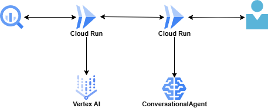

#  はじめに

今回はチーム4人で構築した”おすすめ居住エリア診断アプリ”を紹介します！

AIエージェントを用いて、都内の住む場所をAIエージェントが提案してくれるアプリを構築しました。  
このアプリは第2回 AI Agent Hackathon with Google Cloudに参加にあたって作成したものです。

[おすすめ居住エリア診断アプリはこちら](https://hello-streamlit-1011973077954.asia-northeast1.run.app/)

##  プロジェクトが対象とするユーザー像と課題

大学入学や入社に伴い、地方から東京へ移住してくる人は毎年沢山います。  
しかしながら、多くの方は東京に土地勘がないために、住む場所選びは難しいと考えています。

上京や見知らぬ土地への引っ越し経験がある方は、後から「もっとこのエリアで探せば良かった」などといった経験はないでしょうか？

現在も不動産検索サイトはありますが、家賃や住居内設備、交通の利便性を条件に”物件”で選ぶことが多く、実際の街の雰囲気や利用したい施設が充実しているのか、治安は良いのかなどは条件ごとに別途情報収集する必要があります。

見知らぬ土地への引っ越しはただでさえ精神的・肉体的な負荷が高いにもかかわらず、溢れかえった情報を収集して住む場所を選ぶことは大変な作業であり、大きな課題だと考えました。

##  課題へのソリューションと特徴

物件を売るという目線ではなく、ユーザー体験を重視してその人にあった物件をおすすめすることを重視したサービスを作ることを目標にしました。

そのため今回は物件をサジェストすることは控えました。  
まるで人が相談に乗るようにユーザーの希望をヒアリングして、住みたいと思うような街を提案することで課題解決を目指しました。

###  ユーザーへのメリット

今回ソリューションとして、23区内で条件にあうエリアを〇〇区XX丁目単位で提案してくれるサービスを作りました。

ユーザーはWebブラウザからおすすめ居住エリア診断アプリにアクセスして対話型のアンケートに答えるだけで、AIエージェントが条件にあったエリアを提案します。

今までのように物件という点ではなく、エリアという面で条件にあった場所を提案することで、提案した街はもちろん、その周辺も同様の条件だと分かるので、ユーザーは物件選びの幅が広がります。

また、AIエージェントは23区を横断的に調べるので、各地で同条件の場所を提案できるため、穴場が見つかりやすくユーザーの視野が広がります。

今までは物件検索と別で調べなければいけなかった情報、例えば子育てのことや治安のことを対話型で相談すれば、それを考慮した場所を提案してくれます。

電車での移動時間やちょっとした隙間時間で気軽に使えるサービスであれば、負担なく新生活を送ることができると思います。

###  社会課題:地域へのメリット

都内は人口が多いとはいえ、分布には大きなばらつきがあります。  
人気のエリアは何もしなくても人口が増加する一方、注目が当たりにくいエリアは少子化による過疎化が進行しています。

今回のアプリでは、人気のエリアも提案されますが、類似条件の別エリアも複数提案することで、不人気だったエリアに人が移住する可能性を高めるメリットがあります。

###  システムアーキテクチャ

技術的な話に移ります。  
今回構築したのはWebアプリです。  
システムとしてはGoogle Cloudのサービスをフル活用しています。

主なサービスは以下です。

  * フロントエンド 
    * Cloud Run: Streamlitで構築したWebアプリケーションをホスティング
    * Dialogflow (ConversationalAgent): ユーザーとの対話を通じて希望条件を構造化データに変換
  * バックエンド 
    * Cloud Run: Python(FastAPI)で構築したAPIサーバーをホスティング
    * Vertex AI(Gemini): 構造化された条件を元に、最適なエリアを推薦するロジックを実行
  * データベース 
    * BigQuery: 23区のエリアごとの家賃相場、治安、施設情報などのデータを格納

その他の技術要素は以下です。

  * Python
  * Streamlit
  * FastAPI
  * SQL
  * Container
  * Terraform
  * Gemini Code Assistant: コーディング、デバッグ、ドキュメント作成などを支援

アーキテクチャは以下の通りです。

Google Cloud上ではシンプルな構成でWebアプリを構築できたことが驚きでした。  
特にCloud RunへのWebアプリサーバのデプロイは、ネットワーク関係の設定をほとんど気にすることなく実現できました。

##  技術的な工夫点

まずはバックエンドについてです。  
バックエンドは、フロントエンドから送信された情報をインプットにして、決まった形式のレスポンスを生成する必要がありました。

本来AIエージェントとしての利用は圧倒的に自然文による会話が多く、従来のREST APIのように決まった形式のデータを出力することは苦手、あるいは高度なプロンプトエンジニアリングが必要な認識でした。

しかし今回はGoogleが出しているADKを使用することで、output_schemaを固定することが実現できました。

また、エージェントはsequentialに2つのエージェントに処理されることで、受け取った情報の整理と、レスポンスの生成を分担してシンプルな実装ができました。

次にフロントエンドについてです。  
1番はユーザー体験です。  
ただ選択肢を選ぶだけだと既存サービスでも多くあります。  
ユーザーが希望条件を容易に入力できること、それを事前に収集したデータと関連付けるためにどのようにタグやスコリングに変換するかが課題でした。

Googleが出しているDialogflowは、その課題をピンポイントで解決してくれました。  
実は、このDialogflowの採用が決まったのは6/29です。  
それなのに6/30にはサービスインできたという事実が、Dialogflowの良さをお伝えできるのではないでしょうか。

最後に開発環境についてです。

短期間でアイデアを形にするハッカソンでは、開発環境の構築やデプロイ作業をいかに効率化するかが成功の鍵を握ります。

私たちはインフラの構築にTerraformを採用し、Cloud RunやArtifact RegistryといったGCPリソースをコードで管理しました。これにより、`terraform apply` コマンド一つで誰でも同じインフラ環境を再現でき、手作業によるミスを防ぎ、チーム開発を円滑に進めることができました。

デプロイフローも各種CLIツールを採用することで効率化しました。ローカルで開発・テストしたアプリケーションをDockerイメージとしてビルドし、Artifact Registryにプッシュ、そして `gcloud run deploy` コマンドでCloud Runにデプロイする、というサイクルを素早く回すことができました。

さらに、開発環境そのものをDev Containerでコンテナ化しました。  
必要なVS Code拡張機能を定義しておくことで、リポジトリをクローンしてVS Codeで開くだけで、依存関係に気を配らなくてもみんなが同じ開発環境を構築できました。環境構築が大幅に減り、アプリの開発に多くの時間を充てることができました。

##  デモ動画

デモ動画も載せておきますので、是非ご視聴して”おすすめ居住エリア診断アプリ”を使ってみてください！

<https://www.youtube.com/watch?v=uGKonr5f57A>

##  今後の展望

今回のハッカソンでは、短期間だったこともありコアとなる機能を実装することに注力しました。  
今後機能を追加するとすれば、ユーザー体験を向上させるために、以下のような機能拡張を考えています。

  * 対象エリアの拡大 
    * 現在は東京23区に限定していますが、今後は地方都市や近隣の県にも対象エリアを広げていきたいです。
  * 提案理由の具体化 
    * なぜそのエリアがおすすめなのか、AIがより具体的な根拠として定量的なデータも示すことができるようにしたいです。
  * ユーザーフィードバック機能 
    * 提案されたエリアに対してユーザーが評価できる機能を設け、そのフィードバックをAIの推薦ロジックに反映させることで、より精度の高い提案を目指したいです。

これらの機能を追加することで、さらに多くの人のが利用できるサービスにしていきたいと考えています。

##  さいごに、感想！

* * *

まず特に良いなと思った点を書くとGoogleのADKで作成したAIエージェントは返答形式を指定できるところです。

これまでのAPIはREST APIが主流であり、アプリケーション同士のインターフェースはJSON形式で固定です。  
しかしAIエージェントとなると、情報を自然文で返してきます。  
そうなると従来のサービスとの接続は困難ですし、安定性にも不安があります。

その問題をGoogleのADKは簡単に解決できることから、現在稼働中のシステムへ統合することが容易だろうと思いました。

仕事もプライベートも忙しい中、メンバー4人で完成まで持ってこれたのは素直に嬉しいです。  
3人はGoogle Cloud自体ほぼ初心者でしたが、今回のハッカソンを通して良い勉強になりました。  
特に今回はAIがテーマだったこともあり、AI関連サービスに触れるよい機会になったと感じています。

今後は業務利用も見据えて、更に知見を広げていければと思います！

* * *

今回の開発では、初めて使うサービス(Conversational AgentやADK)も多くあり、裏ではGemini 2.5 Proに何度も助けられました。  
Conversational Agentの扱いについては、本当はユーザーの属性情報を組み合わせてスコアリングすることが理想だったのですが、診断結果の取得の仕方なども含めて、普通のpythonコードで十分だったかもしれない、Agent間連携にすべきだったかもしれない、等使いこなしきれず色々と反省が残りました。  
ただ、設定の仕方など新しいサービスを使うことができた点で非常に勉強になりました！  
また、街に関するオープンデータも最近増えており、今後も勉強を続けていきたいと思います。無理なスケジュールで一緒に取り組んでくれたメンバーにも感謝です！

* * *

是非皆さんもおすすめ居住エリア診断アプリを使ってみてください！  
<https://hello-streamlit-1011973077954.asia-northeast1.run.app/>

最後まで読んで頂きありがとうございました。
