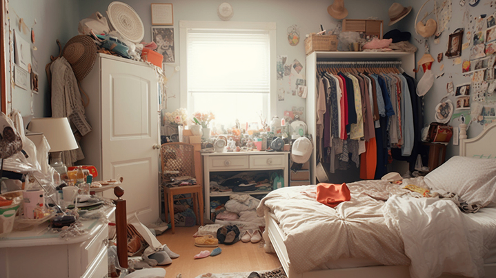
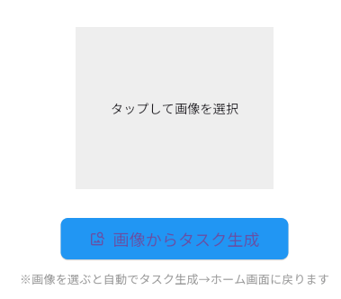
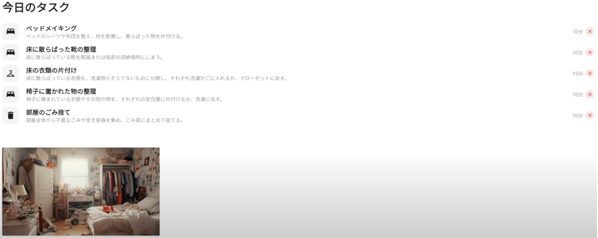
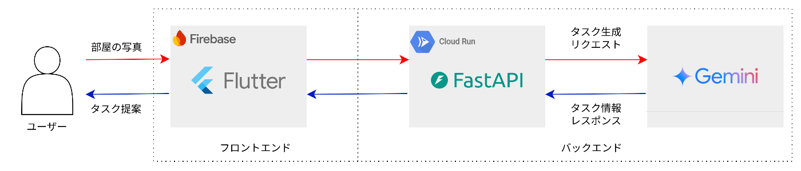

##  はじめに

本記事は、Zennが主催する第2回 AI Agent Hackathon with Google Cloudにエントリーする「お片付けパートナー」というプロダクトの紹介記事になります。

###  「汚部屋を無くし、美部屋を作ろう。」

「明日、人が家に来るので部屋の片付けを急遽しなくてはいけなくなったが、どこから手を付けたらよいか分からない。」  
そんな経験がある人は多いのではないでしょうか。「お片付けパートナー」は、家の片付け・整理整頓を支えるAIエージェントを搭載したアプリです。片付ける必要がある部屋の写真を撮ってアップロードするだけで、片付けの段取りをAIが作成してくれます。

アプリの利用は[こちら](https://house-cleaner-ai.web.app/)から可能です。  
※2025年7月中は動作環境を保持する予定です。  
※スマートフォンで操作する場合には、画面サイズを50%程度に縮小すると見やすくなります。

以下の動画で、実際の動作をご覧いただけます。

##  課題背景

###  **片付けに悩む人の割合と実態**

####  **📌 約62.7%が「片付けに苦手意識」**

[プラネットの調査](https://www.planet-van.co.jp/shiru/from_planet/vol228.html?)によると、「片付けが得意」と答えた人は8.5%、「やや得意」が28.8%である一方、「あまり得意でない」が43.0%、「苦手」が19.7%となり、**約62.7%の人が片付けに苦手意識を持っている** ことがわかります。

####  **📌 約55.1%が「自宅が片付いていない」と感じている**

同調査によると、自宅が「片付いている」と答えた人は7.7%、「大体片付いている」が37.3%であるのに対し、「あまり片付いていない」が37.8%、「片付いていない」が17.3%となり、**55.1%の人が自宅が片付いていないと感じている** ことが明らかになりました。

###  片付け課題が深刻化する背景

現代社会において「片付け」は単なる家事の一つではなく、**生活の質（QOL）や仕事の生産性にも直結する重要なテーマ** になりつつあります。特に以下のような背景が、片付けをめぐる課題をより深刻化させています。

  * **リモートワークの普及**  
コロナ禍以降、多くの企業で在宅勤務が定着し、「自宅＝職場」としての役割も担うようになりました。散らかった住環境は集中力の低下やストレスの増加を招き、**仕事の生産性にも悪影響** を与える可能性があります。

  * **一人暮らしや共働き世帯の増加**  
時間的・精神的余裕がないまま忙しい日々を過ごしているケースも多く、「**片付けたいけど手が回らない** 」という現実が、片付けられない部屋の常態化を引き起こしています。

こうした背景をふまえると、片付けの問題は「個人の怠慢」のみならず、**社会構造や生活様式の変化に起因する現代的な生活課題** であり、より体系的なアプローチと支援が必要です。

###  片付けを放置した場合のリスク

片付けを放置すると、次のようなリスクがあります。

  * **ストレス増加**  
散らかった部屋は脳への視覚ノイズとなり、ストレスや注意力低下を引き起こします。（環境心理学的知見）

  * **生産性低下**  
探し物に時間を取られ、集中力も欠け、日常生活の効率が悪化します。

  * **健康リスク**  
ホコリやカビ、害虫の温床になりやすく、特に高齢者やアレルギー体質の方にとって深刻です。

  * **社会的孤立**  
来客を呼べなくなり、孤独感や自己肯定感の低下につながる負のスパイラルを招きます。

こうしたリスクを未然に防ぐためには、自分だけでは解決しづらい片付けを、**習慣化と行動支援で後押しする仕組みが必要** です。

###  片付け課題をAIエージェントで解く価値

片付けは単純作業のように見えて、実際は「**情報処理 × 行動力** 」が求められる複雑な問題です。  
部屋を片付けるために「何をやる必要があるか」「何から始めるか」という情報の処理や判断はむずかしく、自力では迷いがちです。従来の掃除ノウハウ本やYouTube動画では、個人の部屋の状況に最適化された片付け支援は困難ですが、視覚認識AIを活用することで、部屋の状態を理解した上で片付けを支援することが可能になります。

##  ソリューションの概要

###  本アプリが提供する価値

**タスクの把握 × 分割 × 整理**  
本アプリは、**片付けタスクに関する情報の処理や判断** を支援することを目指します。視覚認識が可能なAIを活用することで、ユーザーが部屋の写真を一枚アップロードするだけで、部屋の中の状態をAIが理解し、部屋をキレイにするためのタスクを生成します。タスクは細かく分割して整理し、スケジュールの提案も行うことで、心理的ハードルを下げることや継続的な片付けに貢献します。

###  ユーザー像：片付けに悩む現代人

  * 「**片付けたいけど手が回らない** 」「**どこから手を付けたらよいか分からない** 」などといった片付けに悩みを抱える一人暮らしや共働き世帯
  * 「**効率的に家を片付けたい** 」と考えている忙しい人

##  アプリの機能

###  部屋の写真のアップロード

はじめに、AIが部屋の情報を収集できるようにユーザーの部屋の写真をアップロードします。  
ユーザーは、ホーム画面右上「新規タスク生成」を選択して以下の画面に遷移し、「画像からタスク生成」をクリックして自分の部屋の写真をアップロードすることができます。

###  タスクの生成

アップロードされた部屋の写真から、部屋をキレイにするためのタスクを生成します。デモ動画の例では、以下のようにタスクが生成されています。

タスク内容が分かるようにアップロードされた部屋の画像も表示しています。また、タスクごとに推定所要時間を設定しており、右側に表示しています。タスクが完了した際には、右端の×ボタンをクリックすることで一覧から削除することができます。

###  スケジュールの提案

生成したタスクについて、スケジュールを考えてユーザーに提案します。「今日のタスク」「明日のタスク」「今週のタスク」の三段階に分類し、画面に表示します。このように分解することで、忙しいユーザーでも段階的に家の片付けを行うことができるようになります。  
デモ動画の例では、掃除機がけなど時間がかかるタスクは、明日行う予定のタスクとして提案しています。

##  システム構成とアーキテクチャ

今回は、フロントエンドにFirebase Hosting（Flutter）,バックエンドにGemini APIとCloud Run（FastAPI）を使用しています。

###  Firebase Hosting（Flutter）

本アプリのフロントエンドはFlutterで開発し、Firebase Hostingでデプロイしています。  
ユーザーはフロントエンドを通じて画像をアップロードし、アップロードされた画像データはバックエンドに送信されます。  
また、バックエンドから生成された片付けタスクをJSON形式で受け取り、タスクの内容をアイコン付きのカードとして一覧表示する機能や、スケジュール管理画面の提供を行います。

###  Cloud Run（FastAPI）

本アプリケーションでは、バックエンド処理をFastAPIで構築し、Google CloudのCloud Runを用いてデプロイしています。FastAPIはユーザーのFlutterアプリから送信された画像データを受け取り、  
Google Gemini API を呼び出して画像解析とタスク生成を行います。生成されたタスク情報は、JSON 形式でバックエンドから受け取り、そのままフロントエンドに渡します。

###  Gemini API

アップロードされた画像の認識、タスクの生成、スケジュールの作成は、Gemini APIで行っています。具体的には、画像から生成した片付けタスクについて以下の5項目をjson形式で出力するようにプロンプトで指示しています。

  1. タスクのタイトル(窓ふき掃除、机上の整理、服の片付けなど)
  2. タスクのカテゴリ（キッチン、リビング、本棚など）
  3. タスクのサブタイトル（「洗濯物をたたんでクローゼットに収納する」などの具体的な作業内容）
  4. タスクの所要時間（10分、30分、1時間など）
  5. タスクのセクション（"Today", "Tomorrow", "This week"）

タスクのカテゴリは、フロントエンドでアイコンを表示させる際にどのアイコンを選択するか判断するために使用しております。

##  今後の展望

現状では、アップロード出来るのは1枚の画像のみとなっており、一つの部屋に対応する形ですが、複数の部屋にまたがるタスク生成を可能にすることで、ファミリー世帯や大きな家にも対応できるようにしていきたいと考えています。  
また、開発前の段階では、チーム内で実装したい機能として以下のような項目を挙げていました。  
・AIエージェントが対話を通じて片付けの目標をヒアリングする機能  
・部屋の画像を元に家にある物を一覧化して要・不要の判断を支援する機能  
・部屋の画像を元に購入したほうが良いもの(例：収納棚、ごみ箱等)を提案する機能  
・部屋の画像を元に家の綺麗さを診断する機能  
・Slackやメールと連携して片付けタスクをリマインドする機能  
もし次の機会があればこれらの機能追加にチャレンジしてみたいと思います！

##  まとめ

部屋の写真をアップロードするだけで部屋をキレイにするまでのタスクを提案してくれるAIアプリ「お片付けパートナー」について紹介しました。  
こちらのアプリは、[第2回 AI Agent Hackathon with Google Cloud](%5Bhttps://www.planet-van.co.jp/shiru/from_planet/vol228.html?%5D\(https://zenn.dev/hackathons/google-cloud-japan-ai-hackathon-vol2?tab=overview\))に向けて、3人チームで開発を進めたものです。「**一人暮らしをしていると部屋の片付けが大変** 」という共通の悩みから着想を得て、同じような課題を抱える人が多いことを知り、AIで解決できないかと考えました。そこで、部屋の写真一枚で具体的なタスクを明確にするというコンセプトに挑戦しました。  
今回の開発を通してflutterやGemini、AIエージェントについての理解が深まり、とてもよい経験になりました。今後もこれらのツールや技術を活用して、新しいアイデアの実現に活かしていきたいと思います！拙いプロダクトではありますが、もしよければ是非部屋の片付けの際にご利用ください！

##  参考資料

  * [プラネット Vol.228 家の片付けに関する意識調査](https://www.planet-van.co.jp/shiru/from_planet/vol228.html?)
  * [第2回 AI Agent Hackathon with Google Cloud](https://zenn.dev/hackathons/google-cloud-japan-ai-hackathon-vol2)

