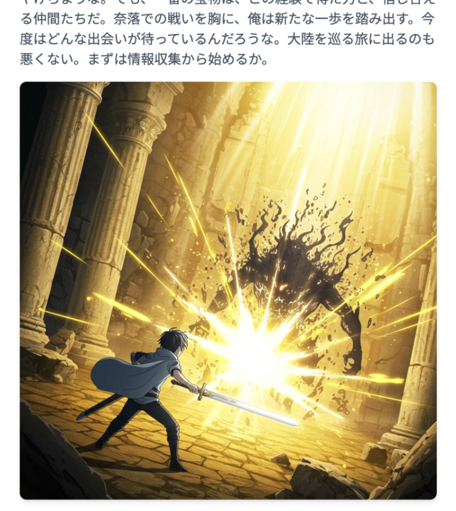
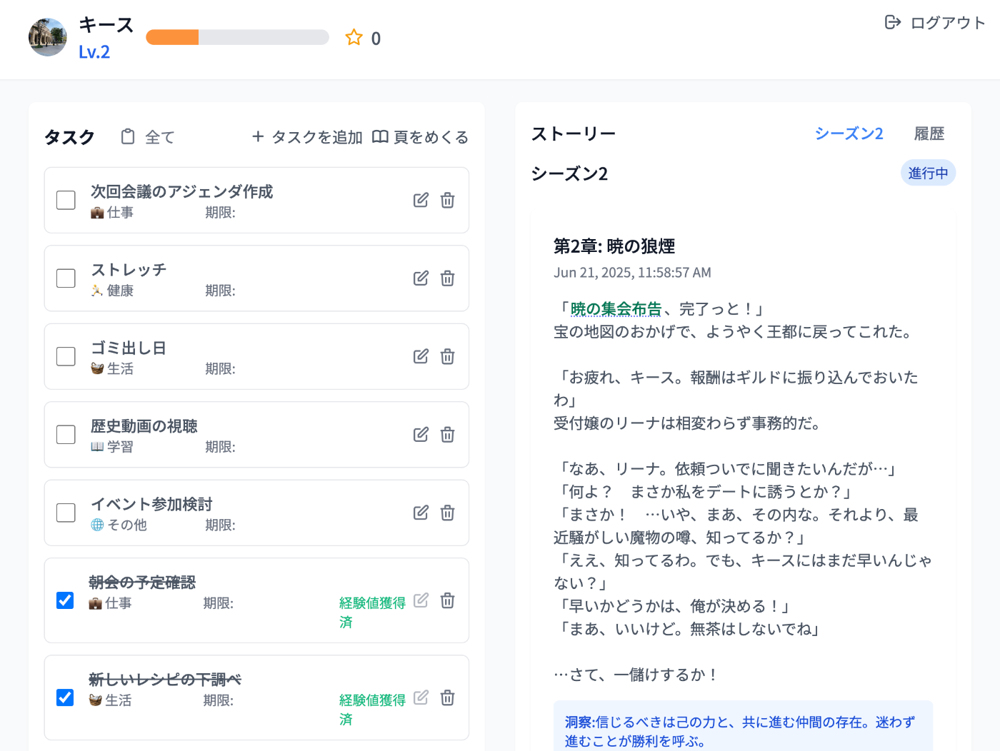
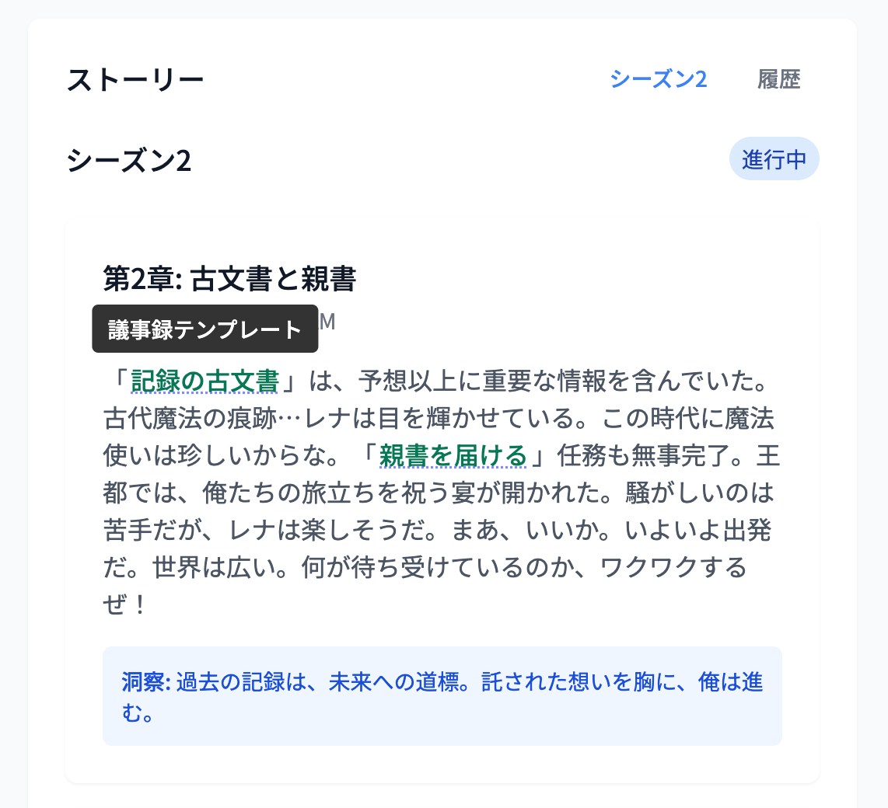
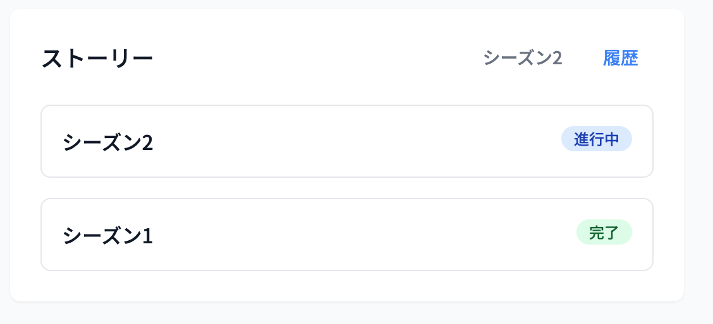
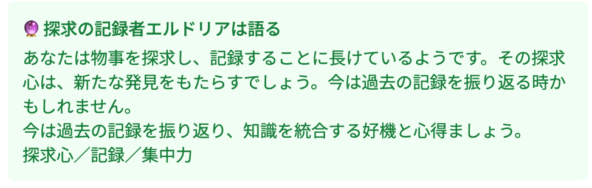
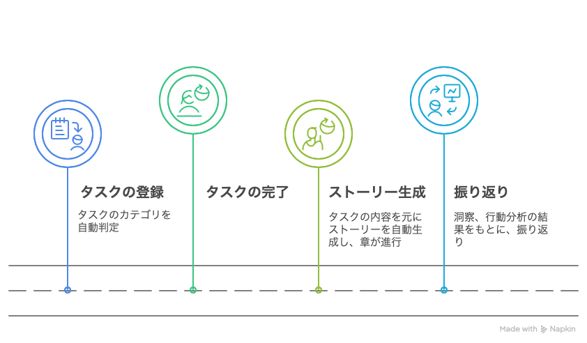
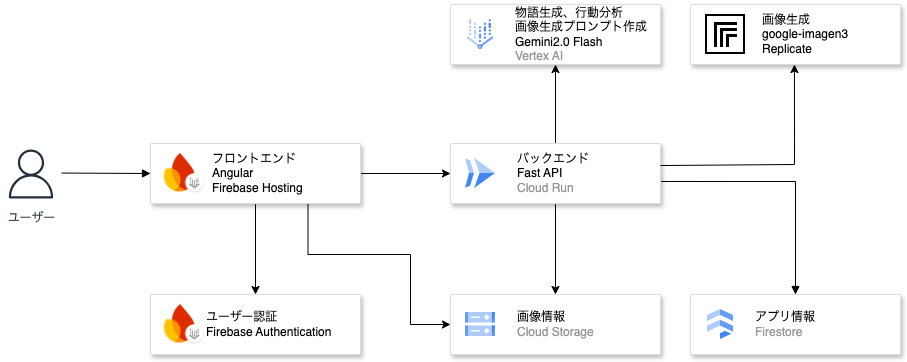
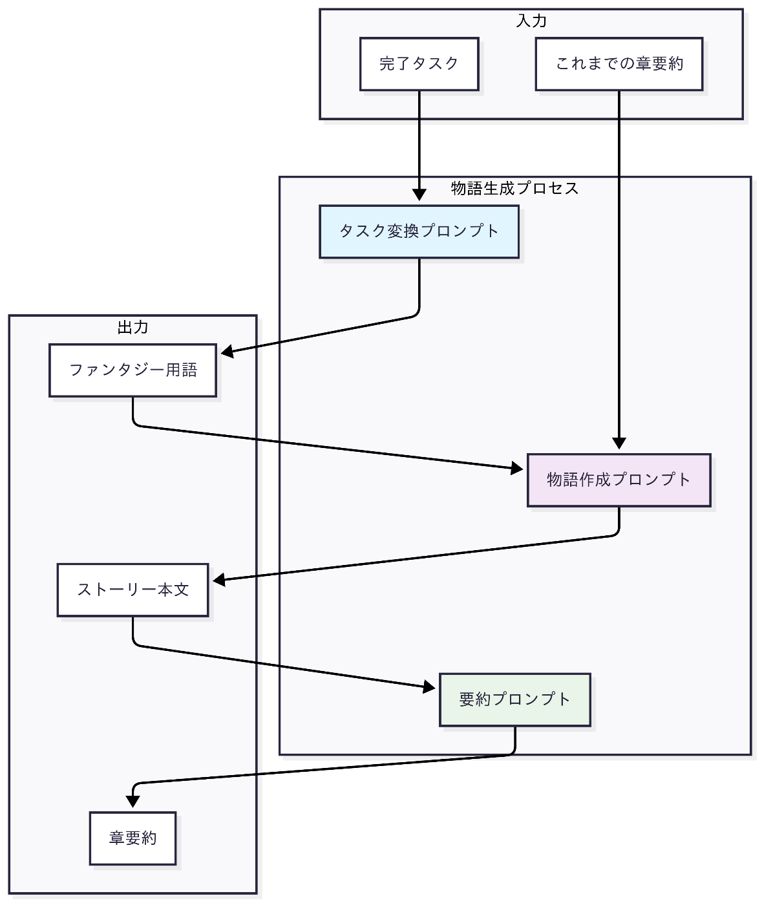
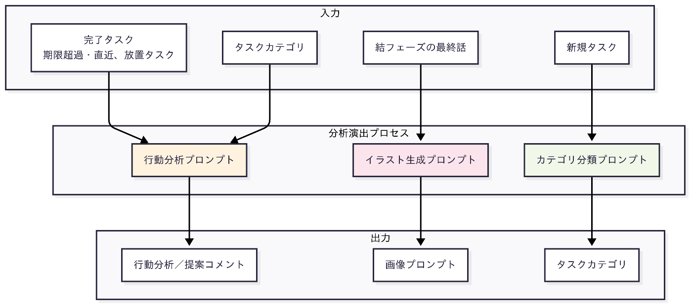

#  はじめに

「タスク管理アプリを使っても続かない...」  
「記録をつけても達成感がない...」

そんな悩みを解決するため、生成AIでタスクを異世界ファンタジーに変換する「ToDo Chronicle」を開発しました。このアプリは、ユーザーの完了タスクから自律的に物語と振り返りを生成するAIエージェントです。完了したタスクに応じて異世界ファンタジー物語を自動生成し、行動傾向の分析を行います。

#  主な機能と特徴

##  タスク完了による物語生成

ユーザーが完了したタスクをもとに、生成AIが"異世界ファンタジー物語"を自動生成します。タスクをこなすたびに物語が進み、ユーザー自身が冒険者となって世界を救うストーリーが展開されます。

  * タスク完了で物語が進行（ストーリー生成AIによる自動化）
  * ゲーム的な演出（経験値・レベルアップ・成長要素）
  * 洞察の自動生成（自己肯定感・継続性の向上）
  * 行動傾向の分析（行動の振り返り・内省を支援）

###  ストーリーの生成例

たとえば、「商談資料」や「定例ミーティング」などのタスクをこなすと、こんな物語が紡がれます。

  * タスク「商談資料」→ 「契約の巻物」

> 俺、レックスは、冒険者だ。  
>  ギルドからの依頼は「契約の巻物」の回収。  
>  これがなかなか骨のあるシロモノでね。苦労の末、なんとかゲット！
> 
> …いよいよ、冒険も大詰めってことか。ワクワクしてきたぜ！

###  ストーリーの演出

物語の没入感を高めるため、シーズンの最終章では生成AIによるイラストが表示されます。

##  機能の一覧

###  1\. タスク管理

  * タスクを一覧表示
  * "頁をめくる"ボタンで新しい章を生成

###  2\. ストーリー一覧

  * 生成された物語を一覧表示
  * 物語に反映したタスクをツールチップで表示

###  3\. 履歴機能

  * これまでに生成した物語をシーズンで一覧表示

###  4\. 行動分析機能

  * シーズン最終章でユーザーの行動を分析
  * 完了したタスクの内容をもとに、行動傾向を分析し、振り返り・内省を支援
  * 未完了タスクの内容をもとに、次の行動を提案

##  使用フロー

タスクを完了すると「頁をめくる」ボタンで物語が進行します。最終章では、AIによる行動分析が行われ、これまでの行動傾向をもとに洞察文が生成されます。

#  解決したい課題と、ソリューション

##  対象ユーザー

本アプリは、以下のような方々に特に役立つと考えています。

  * スケジュール管理を"ゲーム感覚"で楽しみたい
  * 目標ややりたいことはあるけれど、タスク管理がうまく続かない
  * 成長を"実感"したい、けれど記録は続かない

##  課題と解決策

目標達成のためには、小さなタスクの積み重ねが欠かせません。しかし現実には、その積み重ねが「見えにくく」、達成感も薄れがち。やるべきことを淡々とこなす毎日に、モチベーションを保つのは簡単ではありません。

##  具体的な課題と解決策

###  1\. 日常の小さな雑務に達成感を感じられない

**課題** ：

  * タスクを完了しても、一瞬の達成感で終わってしまう
  * 継続する理由や意義を見失いがち

**解決策** ：

  * 1日に達成したタスクをもとに、異世界ファンタジーの物語を生成することで非日常感を演出
  * タスク完了を物語の進行として可視化することで達成感を強化

###  2\. 過去の行動の振り返りが面倒

**課題** ：

  * 記録をつける習慣が続かない
  * 記録の意味が見出せない

**解決策** ：

  * 各ストーリーに登場する"元になったタスク"をツールチップで表示。過去の行動を思い出せる
  * ストーリーが章として積み上がっていくため、振り返りの体験が物語を通して楽しくなる

##  期待される効果

このアプリを通じて、ユーザーは日々の行動を記録しながら物語を楽しむことで「行動の継続性」を保つことができるようになります。

タスクが物語に反映された場面で、ユーザーがタスク完了の"ご褒美"としての面白さを感じてくれると期待しています。

#  デモ動画

#  技術スタックとシステム構成

###  アーキテクチャ概要

###  使用技術

項目 | 技術  
---|---  
認証 | Firebase Authentication (Google認証)  
フロントエンド | Angular + Firebase Hosting  
バックエンド | FastAPI + Cloud Run  
データベース | Firestore  
ストレージ | Cloud Storage  
生成AI | Vertex AI (Gemini 2.0 Flash)  
イラスト生成 | Replicate (google-imagen3)  
  
#  Gemini APIの活用

本アプリケーションでは、6つのプロンプトを連携させることで、物語の生成と行動分析を行います。各プロンプトは特定の役割を持ち、相互に連携することでコンテンツを生成します。

##  プロンプトの役割分担

  * **タスク変換プロンプト** : 日常のタスクをファンタジー世界の用語に変換
  * **物語作成プロンプト** : 変換されたタスクと前章要約からストーリーを生成
  * **要約プロンプト** : ストーリーの要約を生成。前章の要約を渡すことで、ストーリーの連続性を保持
  * **行動分析プロンプト** : シーズン最終章でユーザーの行動傾向を分析
  * **イラスト生成プロンプト** : 物語から印象的なシーンを抽出し画像生成用プロンプトを作成
  * **カテゴリ分類プロンプト** : 新規タスクを自動的にカテゴリに分類

##  物語の生成について

###  物語生成フロー

###  開発で直面した課題

開発初期は、生成されたストーリーが「展開が進まない」「文体が硬く読みづらい」という課題に直面しました。単に文章の生成を指示するだけでは、情報量が多く、テンポの悪い文章が生成されがちでした。試行錯誤の結果、以下の方針で改善しました。

  1. **文字数制限** ：160〜200字程度  
SNSのように読むのが苦痛でない文章量
  2. **文体** ：ライトノベル風  
ストーリーのテンポが格段に向上
  3. **演出** ：セリフとオノマトペを活用  
読みやすく満足感のあるシーンを演出
  4. **構成** ：シーズン制とフェーズ管理（起承転結）  
各章に起承転結といったテーマを与えることで、物語に起伏を付与

###  プロンプト設計の最適化

ひとつのプロンプトに機能をもたせすぎると精度が下がり、逆に分けすぎるとコストが上がる──このトレードオフの中で、実用性と品質のバランスを調整した結果、以下の3つのプロンプト構成を採用しました。

**1\. タスク変換プロンプト**  
タスクを、ファンタジー世界の言葉に変換

**2\. 物語作成プロンプト**  
前章の要約、ファンタジー用語に変換されたタスクから、ストーリーを生成  
タスクの内容をもとに、内省的な"洞察"メッセージを生成

**3\. 要約プロンプト**  
ストーリーの要約を生成。前章の要約を渡すことで、ストーリーの連続性を保持  
全文を渡すと"続きを生成しよう"とする挙動になり、場面転換が起きづらくなるため、要約を採用

##  分析・演出機能について

###  分析・演出機能フロー

###  開発で直面した課題

ストーリーが読みやすさを重視したため、画像生成に必要な背景の描写はほとんどありません。安定した画像の生成には苦労しました。

他の画像生成モデルも試しましたが、シーンの指定が明確でないと画像の精度が低く、文脈からシーンを補完してくれるgoogle-imagen3を選定しました。

  1. **画像生成指示用プロンプト** ：物語から印象的なシーンを抽出し、Imagen3が画像生成するためのプロンプトを作成
  2. **描写情報の補完** ：プロンプト内にイラスト生成に必要な情報を例示し、画像生成に不足する描写情報を補完させることで、安定した生成を実現

###  プロンプト設計

**1\. 行動分析プロンプト**  
完了したタスクの内容をもとにユーザーの行動傾向を分析します。世界観を壊さないよう、ファンタジー世界のキャラクターを語り手として設定しました。

  * **分析対象** ：シーズン中に完了したタスクの内容
  * **分析の特徴** ： 
    * 過去に完了したタスク、カテゴリをもとに行動傾向を分析
    * 具体的な行動パターンから抽象的な能力や特性を抽出
    * 期限切れ、期限間近、長期間放置されたタスクをもとに次の行動を提案

**2\. カテゴリ分類プロンプト**  
行動分析の精度向上のため、タスクにカテゴリ項目を追加。ユーザーの入力負荷軽減のため、自動分類機能を実装しています。

  * **分類対象** ：「仕事」「学習」「健康」「趣味」「家事」「その他」
  * **自動分類** ：新規タスクは生成AIでカテゴライズ

**3\. 画像生成プロンプト**  
生成AIによるイラストを表示することで、物語の印象を深めるための演出を実装しました。

**画像生成のタイミング**  
画像生成は結フェーズの最終章としました。この選択には3つの理由があります：

  * 結フェーズは物語のクライマックスであり、最も印象的なシーンが含まれている
  * 最終話の前章で画像を生成することで、ユーザーの待ち時間を短縮
  * シーズン最終章でのみ画像生成を行うことで、コストを抑える

#  コストについて

ユーザー100名規模の利用を想定した場合、月額約54ドルの運用コストが見込まれます。画像生成を除いた場合は約34ドルとなります。

プロンプト分割による精度向上と、シーズン最終章でのみ画像生成を行う設計により、コスト効率の良い運用を実現しています。

###  コスト試算の前提条件

本番環境を想定し、以下の条件で試算を行いました。

  * ユーザー数：100人（月間アクティブ率100%）
  * ストーリー生成：20回/ユーザー/月（変換・本文・要約）
  * タスクカテゴリ自動分類：60回/ユーザー/月
  * 行動分析：4回/ユーザー/月（シーズン最終章）
  * イラスト生成：4回/ユーザー/月（シーズン最終章）

※デモでは、進行制限を設けず、テンポよく物語を進められるようにしています。運用では、コスト最適化のため、1日あたりのストーリー進行に制限を設ける予定です。

###  月間コスト内訳

サービス | 概要 | 月額  
---|---|---  
Vertex AI | ストーリー生成（6,000回/月） | $27.00  
Vertex AI | タスクカテゴリ分類（6,000回/月） | $0.60  
Vertex AI | 行動分析（400回/月） | $0.20  
Replicate | イラスト生成（400回/月） | $20.00  
Firestore | データベース | $0.036  
Cloud Run | API実行（30,000回/月） | $6.40  
Cloud Storage | 画像保存 | $0.12  
合計 |  | $54.36  
  
#  今後の展望

###  1\. 内省支援型AIエージェントとしての役割強化

  * ユーザーの行動傾向をもとに、次に取り組むべきタスクや内省の視点を語り手AIが提案するなど、より能動的なエージェント機能を導入

###  2\. ストーリー生成の品質向上

  * キャラクターの関係性トラッキング  
過去に登場した仲間・敵キャラの再登場や関係性の進展を反映

#  まとめ

今回の開発では、アイデア出しから実装、記事・動画作成まで生成AIを活用しました。特に生成AI搭載エディタ「Cursor」のコード生成機能は開発スピードを大きく向上させました。

初めて扱う技術ばかりでしたが、短期間で実用的なアプリを構築できたのは、生成AIの支援があったからこそです。

ハッカソン参加を通じて、生成AIの進歩を実感し、貴重な経験となりました。
