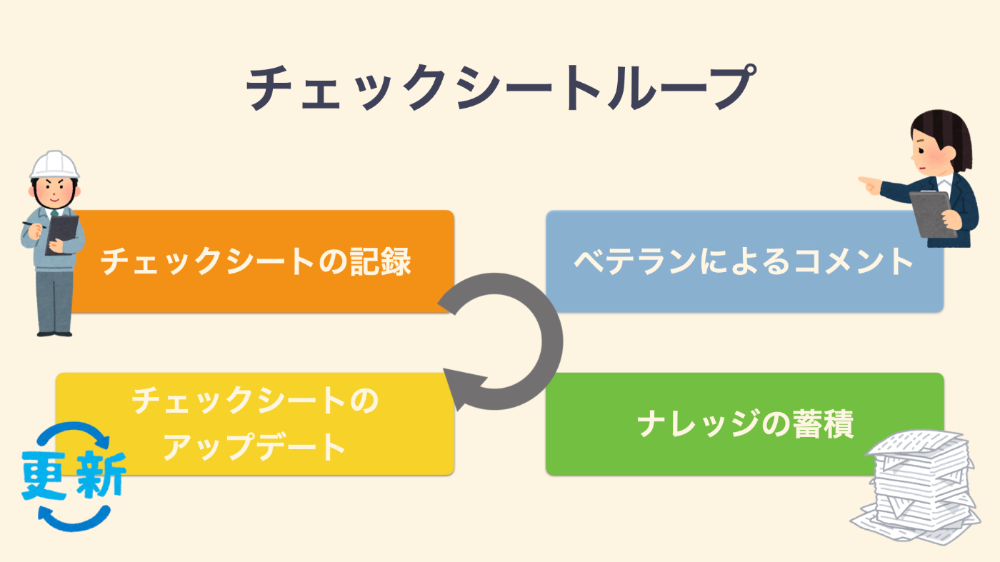
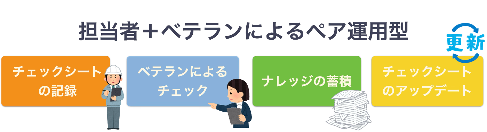
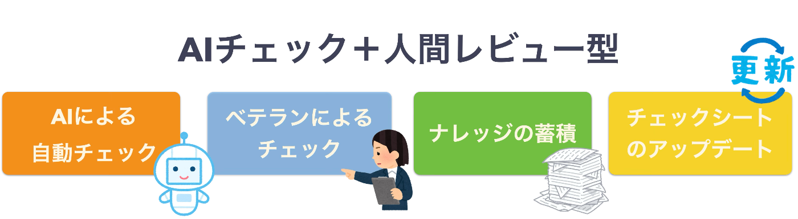
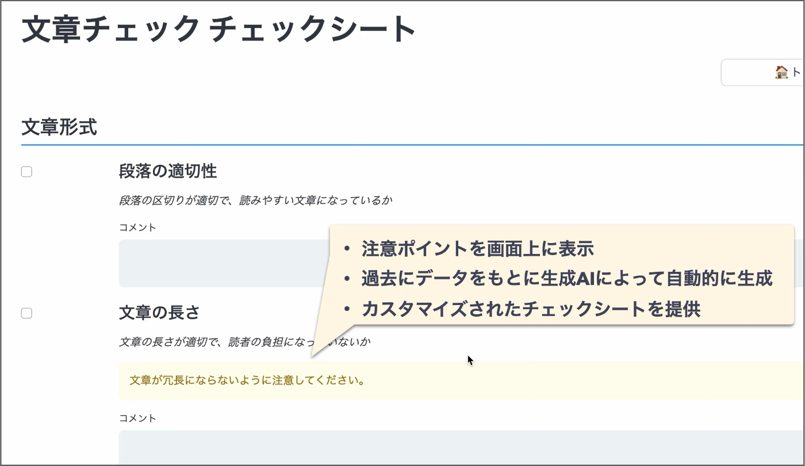
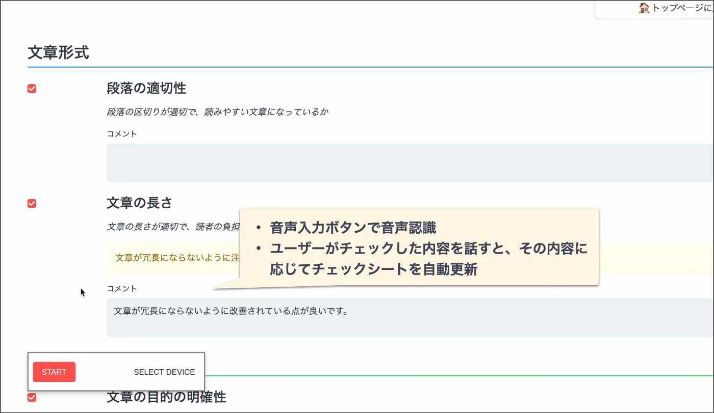
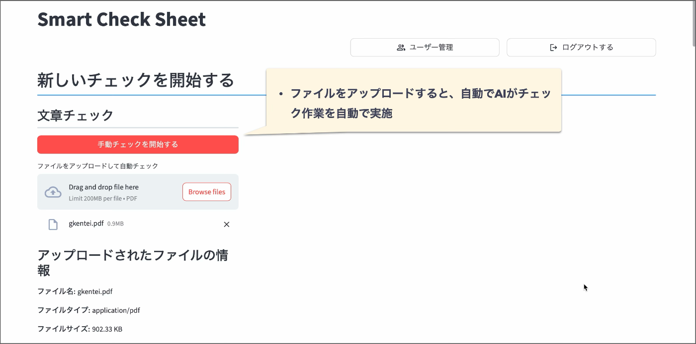
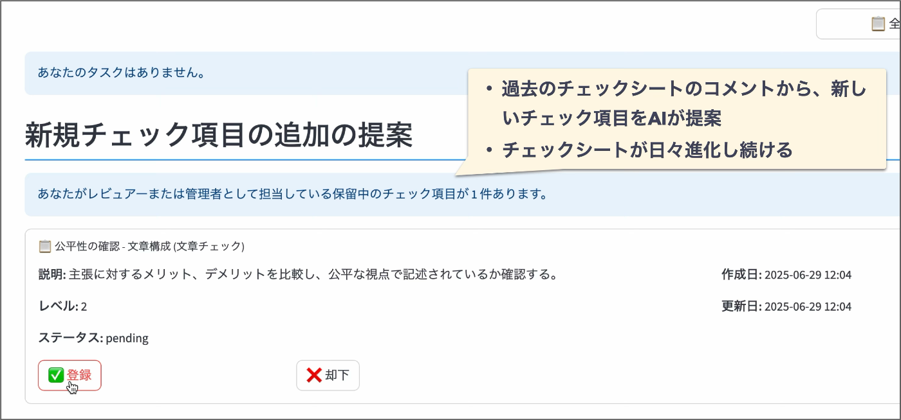
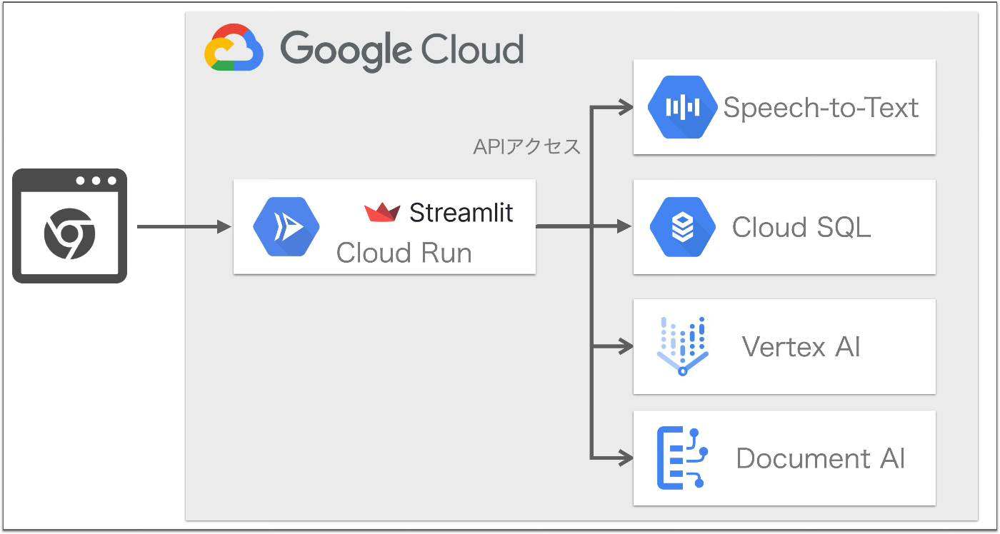

#  Smart Check Sheet -チェックシートで現場の勘をナレッジに-

<https://youtu.be/wqsyTMzRh6M>

##  はじめに

日本の製造業やサービス業など様々な現場で、人手不足や技術継承の課題が深刻化しています。現場に蓄積された「職人の勘」や「コツ」といった暗黙知が文書化されず、ベテランの退職で品質が低下する懸念があります。  
この課題の解決策としてチェックシートをデジタル化した「Smart Check Sheet」というアプリを開発しました。AIエージェントを搭載した新しいチェックシートツールです。

##  課題

現在の日本の現場では、少子高齢化の影響によって深刻な人手不足が進んでいます。ベテラン作業者の引退が加速する一方で、若手人材の確保と育成が追いついておらず、結果として現場の品質や安全性が維持できないリスクが増大しています。

特に問題となっているのは、「技術の継承」の難しさです。多くの現場で作業手順が文書化されず、OJTや口頭伝達に依存しています。そのため、長年の経験から得られた"職人の勘"や"コツ"といった暗黙知が、ベテランの退職とともに失われてしまうケースが少なくありません。

これらの課題は、品質事故や作業ミスの増加、新人の即戦力化の遅れといった経営リスクにもつながり、現場の生産性向上や持続可能な運営を阻害する重大な要因となっています。実際に人手不足による倒産件数の増加も昨今では問題となっております。  
<https://news.yahoo.co.jp/articles/81e0632e99b077607445a58e1b1f54216880a2c6>

##  目的

こうした現場の課題を踏まえ、Smart Check Sheetは以下の目的で設計されています。チェックシートによる業務の標準化や効率化だけではなく、現場のナレッジを蓄積・活用する仕組みを構築します。これにより、現場の暗黙知を可視化・共有しながら、チェック作業の効率化と技術継承を同時に実現できます。

  * 現場の暗黙知を見える化し、次世代に正確に継承
  * 誰でも同じ品質の作業を実施、作業の標準化を実現
  * チェック精度と効率を高め、作業を省力化
  * デジタル技術を活用し、属人化を防いだ持続可能な現場改善を支援

###  なぜチェックシートなのか？

チェックシートは単なる作業漏れを防ぐツールにとどまりません。作業の順番や注意点、過去のインシデントやトラブル経験が蓄積された結晶であり、ベテランのノウハウが凝縮されています。また、チェックシートの備考欄に記録するちょっとした気づきが、暗黙知の形式知化を促進します。

日々の現場作業で以下の**チェックシートループ** を回すことによって、現場知識が蓄積され、進化するナレッジとして機能します。

  1. 作業者がチェックシートを用いて日常業務を実施
  2. ベテランやレビュアがその結果に対してコメントや指摘を備考欄に記録
  3. コメントがナレッジとして蓄積・共有される
  4. ナレッジをもとにチェックシートがアップデートされ、次回以降の作業に反映  

##  対象ユーザー

Smart Check Sheetはチェックシートが有効な幅広い業種で利用することができます。柔軟な運用で技術継承と業務効率化を両立します。  
例えば、以下のユーザーが想定されます。

  * **製造業・建設業** ：作業標準の徹底、属人化の解消、業務効率の向上を目指す方
  * **保守・点検業務** ：安全点検や設備管理における作業工程の確実性を高めたい担当者
  * **サービス業の教育** ：接客品質や業務手順を効果的に新人に伝達したい指導者
  * **エンジニアリング業務の設計** ：設計書や技術資料の品質を均一化・効率化したいレビュアー
  * **社内外の契約業務** ：契約書や関連文書の作成業務を効率化したい担当者

#  ソリューション：Smart Check Sheet

Smart Check Sheetは、チェックシートをデジタル化し、音声入力やAI技術を駆使して暗黙知を蓄積・共有するためのアプリです。  
以下の特徴を持ちます。

  * 過去のチェック結果を基にした **パーソナライズ機能**
  * **音声入力** によるチェックシート入力の省力化
  * **AI** による1次チェック作業の自動化
  * レビュー指摘を基にした **進化型チェックシート機能**

##  アプリ利用フロー

Smart Check Sheetは、運用形態に応じて柔軟に利用フローを構築できます。ここでは代表的な2つの導入パターンを紹介します。

###  パターン1：担当者＋ベテランによるペア運用型

このパターンでは、担当者が現場でチェックシートを用いて一次チェックを行い、その内容に対してベテランが再チェックを行う運用方式です。

  * **特長** ：OJT形式での教育に効果的。ベテランの知見を直接次世代に伝えることができる。  

###  パターン2：AIチェック＋人間レビュー型

このパターンでは、AIが初期チェックを自動で実施し、その後に人間が内容を精査・補完します。

  * **特長** ：チェック作業の省力化と精度向上を両立し、レビュー負担を軽減する運用に適している。  

##  アプリケーションの機能詳細

Smart Check Sheetは現場の課題を解決する以下の４つの機能を持ちます。そして各機能を実現するために、それぞれAIエージェントが搭載されています。

###  1\. パーソナルチェックシート

チェックシート上にチェック時の注意ポイントを表示します。この注意ポイントは当該作業者が過去に指摘を受けた内容をもとに生成AIによって自動的に生成されます。各個人にカスタマイズされた、より実践的なチェックシートを提供します。

####  🤖パーソナライズエージェント

このAIエージェントは過去のレビュアからのコメントをもとに、チェック時に注意すべきポイントを生成します。この注意ポイントは個人ごとに作成され、パーソナライズされたチェックシートを実現します。  

###  2\. 音声入力によるチェック作業

Smart Check Sheetは音声入力機能により、声だけでチェックを入れたり、コメントを入力することが可能です。これにより、作業中でもハンズフリーでチェックシートを操作できるようになります。  
また、チェックシートのコメント欄には、作業中の気づきを記録できますが、手書きやキーボード入力では煩わしく、ついつい省略されがちです。音声入力を使うことで、そうした情報もスムーズに記録されやすくなり、現場で得た気づきやノウハウの共有が促進されます。

###  🤖チェック作業自動化エージェント

このAIエージェントは、作業者が音声で発話したチェック内容を解析し、対応するチェック項目をAIが自動で判断、入力します。  

###  3\. AIによる自動チェック

PDFなどのドキュメントをアップロードすることで、チェックシートに沿ったチェックをAIにより自動で実施できます。これにより、業務効率化や作業の標準化を図ることができます。

####  🤖自動チェックAIエージェント

このAIエージェントは対象の文章とチェックシートの項目を付き合わせ、各チェック項目が満たされているかを確認します。また、チェック判断の理由や改善点なども生成します。  

###  4\. 進化型チェックシート

チェックシートに入力した作業者やレビュアのコメントをもとに、AIエージェントが新しいチェック項目を提案します。  
実務では環境変化によってチェック項目も日々アップデートしていく必要があります。また、暗黙知となっている観点を随時形式知化していく必要もあります。チェックシートをAIが分析し、新しいチェック項目を提案。チェックシートを日々進化させていきます。

####  🤖チェックシート作成AIエージェント

チェックシートとレビュー内容のやりとりから新たな観点を抽出し、AIが新しいチェック項目の案を作成します。人がその案を精査・採用することで、チェックシートが進化し続ける仕組みを支えます。  

##  ユースケース

###  1\. ドキュメントチェック（契約書・設計書・レポート）

契約書や設計書などのレビューにも活用できます。たとえば、エンジニアリング業務においては、設計書のレビュー時に形式的な誤りや記載漏れを自動的にチェックし、音声コメントを添えてレビュー内容を記録できます。また、プレゼン資料や学術レポートといった幅広い文書にも利用でき、レビュー品質の均一化と時間短縮に貢献します。

###  2\. 製造・安全点検（工場ライン・インフラ点検）

工場の製造現場やインフラ設備の保守点検といった物理的な検査業務においても有効です。作業者が音声で検査結果を即座に記録することにより、両手がふさがる作業中でも効率的に情報を蓄積できます。さらに、過去の指摘履歴をもとに重要なチェックポイントを注意喚起し、継続的な品質向上や安全管理に寄与します。

###  3\. サービス現場の標準化と教育（接客・医療・教育）

ホテルや飲食店などの接客業務、病院の医療行為、学校の教育現場においても活用できます。ベテランスタッフの接客フローや医療手順、授業設計ノウハウをチェックシートで標準化、コメント欄で知識化することで、新人や若手スタッフの習熟を支援し、サービス品質の標準化を実現します。チェックシートに音声で記録された気づきが、次世代教育やOJTの教材として機能する点が特長です。

##  導入メリット

Smart Check Sheetの導入により、以下のような多面的な効果が期待できます。

  * **技術継承の効率化** ：ベテランの知見や勘所を日々の業務の中で自然に蓄積・共有でき、属人化を防止
  * **作業品質の安定化** ：チェック項目の明確化とパーソナライズによる注意喚起により、作業を標準化、ミスやばらつきを削減
  * **業務効率の向上** ：音声入力やAIによる自動チェックにより、作業時間やレビュー工数を大幅に削減
  * **現場ナレッジの蓄積と活用** ：備考欄の記録やレビュー内容がナレッジとして蓄積され、チェックシートが日々進化
  * **教育コストの削減と人材育成** ：新人へのOJTツールとしても機能し、標準化された教育を実現
  * **ペーパーレス化とリモート対応** ：クラウド環境でどこからでもチェック状況を確認・共有可能

##  システムアーキテクチャ

Smart Check Sheetは、Streamlitを利用したウェブアプリケーションであり、Google CloudのCloud Run上に構築されています。音声認識機能はGoogle CloudのSpeech-to-Text、生成AI機能はVertex AI (Gemini)、PDFなどのファイルの読み取りにはDocument AIを活用しています。チェックシートの情報はCloud SQL (MySQL)を利用しています。  
ユーザー認証はGoogle Auth Platformを利用しています。  

#  まとめ

日本の製造業やサービス業など様々な現場で、人手不足や技術継承の課題が深刻化しています。現場に蓄積された「職人の勘」や「コツ」といった暗黙知が文書化されず、ベテランの退職で品質が低下する懸念があります。  
この課題の解決策としてチェックシートをデジタル化した「Smart Check Sheet」というアプリを開発しました。AIエージェントを搭載した新しいチェックシートツールです。

本アプリは以下の機能を備えており、チェックシートによる業務の標準化や効率化だけではなく、現場のナレッジを蓄積・活用する仕組みを構築します。これにより、現場の暗黙知を可視化・共有しながら、チェック作業の効率化と技術継承を同時に実現できます。

  * 過去のチェック結果を基にした **パーソナライズ機能**
  * **音声入力** によるチェックシート入力の省力化
  * **AI** による1次チェック作業の自動化
  * レビュー指摘を基にした **進化型チェックシート機能**

本アプリはチェックシートが有効な幅広い業種で利用することができます。  
たとえば、ドキュメントレビューでは契約書や設計書の確認業務を効率化し、製造現場では両手がふさがる中でも音声入力により点検結果を即時記録できます。さらに、接客や医療、教育といったサービス現場では、ベテランのノウハウを形式知として蓄積・共有することで、現場の標準化と新人教育を支援します。Smart Check Sheetは、それぞれの現場に合わせた柔軟な運用が可能で、技術継承と業務効率化の両立を実現します。
